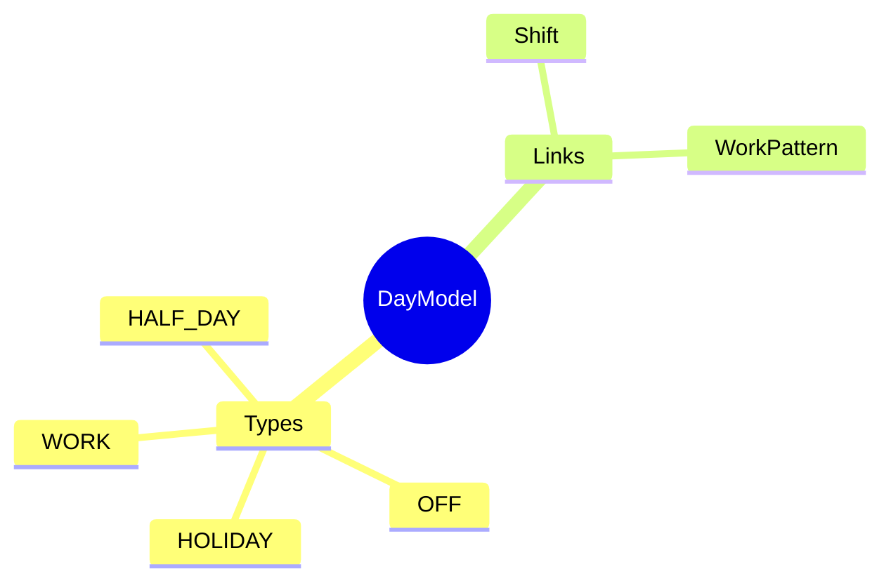
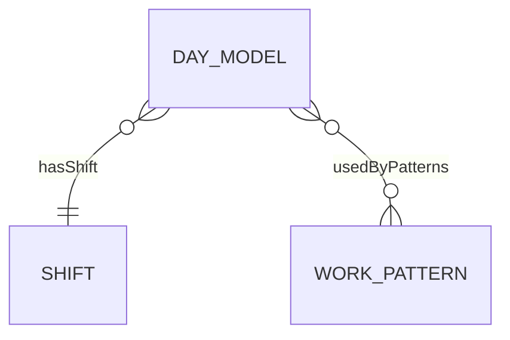

# DayModel

## Overview



**DayModel** định nghĩa mô hình cho một ngày - ngày làm việc, nghỉ, lễ. Là Level 3 trong 6-level hierarchy.

## Business Context

### Day Types

| Type | Shift Required | Mô tả |
|------|----------------|-------|
| **WORK** | Yes | Ngày làm việc bình thường |
| **OFF** | No | Ngày nghỉ theo lịch |
| **HOLIDAY** | No | Ngày lễ |
| **HALF_DAY** | Yes | Nửa ngày (morning/afternoon) |

### 6-Level Hierarchy Position
```
TimeSegment (L1) → Shift (L2) → DayModel (L3) → WorkPattern (L4) → ScheduleRule (L5)
```

## Relationships



## Examples

### Example 1: Standard Work Day
- **code**: WORK_DAY_8H
- **dayType**: WORK
- **shiftId**: DAY_SHIFT_8H

### Example 2: Weekend Off
- **code**: OFF_DAY
- **dayType**: OFF
- **shiftId**: null

### Example 3: Half Day Saturday
- **code**: SATURDAY_AM
- **dayType**: HALF_DAY
- **isHalfDay**: true
- **halfDayPeriod**: MORNING
- **shiftId**: MORNING_4H

## Related Entities

| Entity | Relationship | Description |
|--------|--------------|-------------|
| [[Shift]] | hasShift | Shift for work days |
| [[WorkPattern]] | usedByPatterns | Patterns using this |
