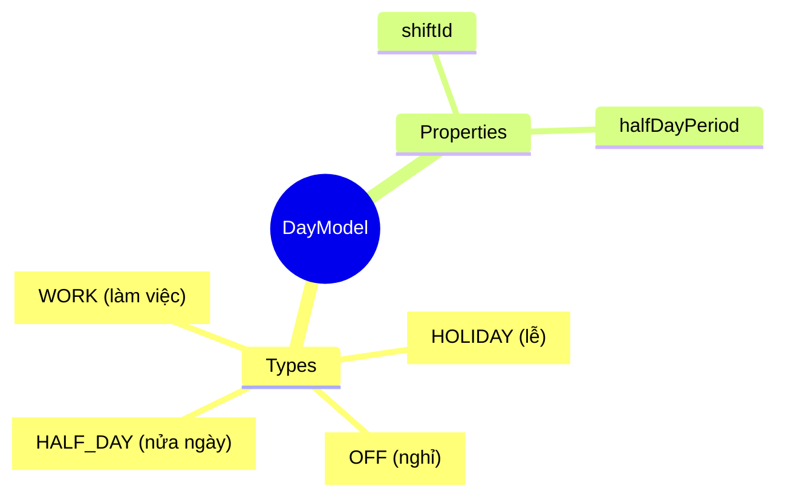
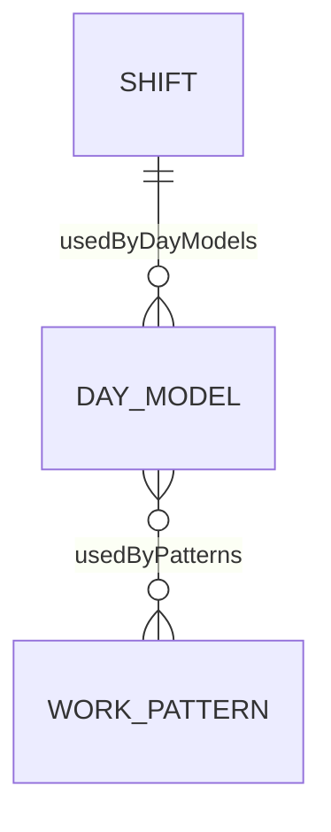
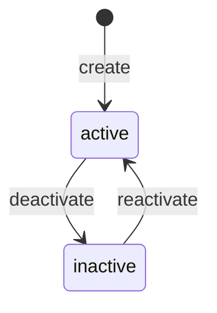

# DayModel

## Overview

**DayModel** định nghĩa mô hình cho một ngày - ngày làm việc, nghỉ, lễ. Là Level 3 trong 6-level Time Hierarchy, nằm giữa [[Shift]] (L2) và [[WorkPattern]] (L4).



## Business Context

### 6-Level Time Hierarchy

DayModel là Level 3 trong hierarchy:

```
┌─────────────────────────────────────────────────────────────────┐
│ L1: TimeSegment   │ Work period within a day (07:00-12:00)      │
├───────────────────┼─────────────────────────────────────────────┤
│ L2: Shift         │ Full shift = collection of TimeSegments     │
├───────────────────┼─────────────────────────────────────────────┤
│ L3: DayModel      │ Model for a day (WORK/OFF/HOLIDAY)   ◄──────│
├───────────────────┼─────────────────────────────────────────────┤
│ L4: WorkPattern   │ Weekly pattern = 7 DayModels                │
├───────────────────┼─────────────────────────────────────────────┤
│ L5: ScheduleRule  │ Assignment rules (rotation, eligibility)    │
├───────────────────┼─────────────────────────────────────────────┤
│ L6: WorkSchedule  │ Actual schedule assigned to employee        │
└───────────────────┴─────────────────────────────────────────────┘
```

### Day Types

| Type | Shift? | Mô tả | Example |
|------|--------|-------|---------|
| **WORK** | Yes | Ngày làm việc | Thứ 2-6 |
| **OFF** | No | Ngày nghỉ | Thứ 7, CN |
| **HOLIDAY** | No | Ngày lễ | 2/9, 1/5 |
| **HALF_DAY** | Yes | Nửa ngày | Saturday morning |

### Key Stakeholders
- **HR Policy**: Định nghĩa day models
- **Scheduling**: Sử dụng trong WorkPattern
- **Time Tracking**: Determine expected hours

### Business Value
DayModel tách riêng định nghĩa "một ngày là gì" khỏi shift details, cho phép reuse Shift trong nhiều context khác nhau.

## Attributes Guide

### Core Identity
- **code**: Mã duy nhất. Format: WORK_DAY_8H, OFF_DAY, SAT_AM_4H
- **name**: Tên hiển thị. VD: "Ngày làm việc 8h"

### Day Type Configuration
- **dayType**: Loại ngày:
  - *WORK*: Ngày làm việc, có Shift
  - *OFF*: Ngày nghỉ, không có Shift
  - *HOLIDAY*: Ngày lễ, không có Shift, có thể có variant rules
  - *HALF_DAY*: Nửa ngày, có Shift, có halfDayPeriod
- **shiftId**: FK to [[Shift]]. Required for WORK and HALF_DAY.
- **isHalfDay**: true nếu HALF_DAY
- **halfDayPeriod**: MORNING hoặc AFTERNOON

### Advanced
- **variantSelectionRuleJson**: Rules khi ngày lễ rơi vào (ví dụ: public holiday on Saturday → Friday off)

## Relationships Explained



### Shift
- **hasShift** → [[Shift]]: Shift cho ngày làm việc. Null cho OFF/HOLIDAY.

### WorkPattern
- **usedByPatterns** → [[WorkPattern]]: Patterns sử dụng DayModel này (ví dụ: Mon-Fri use WORK_DAY_8H)

## Lifecycle & Workflows



| State | Meaning |
|-------|---------|
| **active** | Đang sử dụng |
| **inactive** | Không dùng nữa |

## Actions & Operations

### create
**Who**: HR Policy / Admin  
**Required**: code, name, dayType, effectiveStartDate  
**Validation**: ShiftId required if dayType = WORK or HALF_DAY

## Business Rules

#### Unique Code (uniqueCode)
**Rule**: Day model code phải duy nhất.

#### Shift Required (shiftRequired)
**Rule**: WORK và HALF_DAY types cần shiftId.  
**Reason**: Cần biết giờ làm việc.

## Examples

### Example 1: Standard Work Day
```yaml
code: WORK_DAY_8H
name: "Ngày làm việc 8h"
dayType: WORK
shiftId: DAY_SHIFT_8H
isHalfDay: false
```

### Example 2: Weekend Off
```yaml
code: OFF_DAY
name: "Ngày nghỉ"
dayType: OFF
shiftId: null
isHalfDay: false
```

### Example 3: Half Day Saturday
```yaml
code: SAT_MORNING_4H
name: "Sáng thứ 7 (4h)"
dayType: HALF_DAY
shiftId: MORNING_4H
isHalfDay: true
halfDayPeriod: MORNING
```

### Example 4: Public Holiday
```yaml
code: PUBLIC_HOLIDAY
name: "Ngày lễ"
dayType: HOLIDAY
shiftId: null
variantSelectionRuleJson:
  fallsOnSaturday: FRIDAY_OFF
  fallsOnSunday: MONDAY_OFF
```

## Related Entities

| Entity | Relationship | Description |
|--------|--------------|-------------|
| [[Shift]] | hasShift | Shift for work days |
| [[WorkPattern]] | usedByPatterns | Patterns using this |
| [[TimeSegment]] | indirect | Via Shift |
