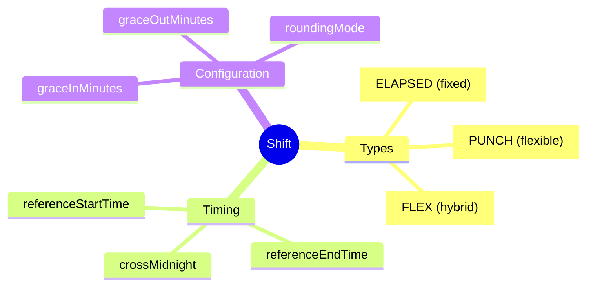
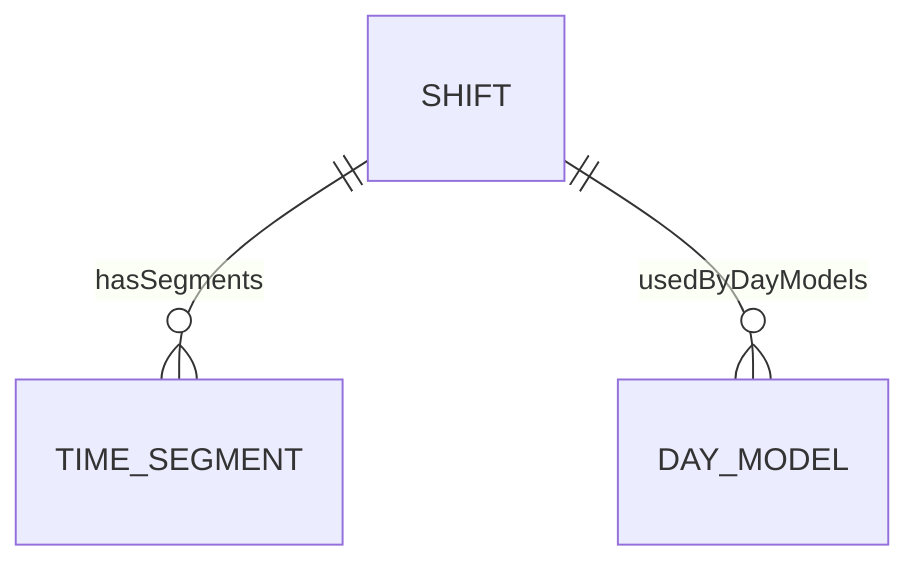

# Shift

## Overview



**Shift** là composition của các TimeSegments, định nghĩa ca làm việc. Là Level 2 trong 6-level hierarchy.

## Business Context

### Shift Types Explained

| Type | Mô tả | Use Case |
|------|-------|----------|
| **ELAPSED** | Giờ cố định, không cần punch | Office 9-5 |
| **PUNCH** | Cần clock in/out, tính theo punch | Factory workers |
| **FLEX** | Core hours + flex | Tech companies |

### 6-Level Hierarchy Position
```
TimeSegment (L1) → Shift (L2) → DayModel (L3) → WorkPattern (L4) → ScheduleRule (L5)
```

## Attributes Guide

### Grace Periods
- **graceInMinutes**: Cho phép đến trễ bao nhiêu phút không bị tính late
- **graceOutMinutes**: Cho phép về sớm bao nhiêu phút không bị tính early departure

### Rounding
- **NEAREST**: Làm tròn đến interval gần nhất
- **UP**: Làm tròn lên (có lợi cho công ty)
- **DOWN**: Làm tròn xuống (có lợi cho nhân viên)

## Relationships



## Examples

### Example 1: Day Shift (Office)
- **code**: DAY_SHIFT_8H
- **shiftType**: ELAPSED
- **referenceStartTime**: 08:00
- **referenceEndTime**: 17:00
- **totalWorkHours**: 8
- **totalBreakHours**: 1
- **totalPaidHours**: 8

### Example 2: Night Shift (Factory)
- **code**: NIGHT_SHIFT
- **shiftType**: PUNCH
- **referenceStartTime**: 22:00
- **referenceEndTime**: 06:00
- **crossMidnight**: true
- **graceInMinutes**: 15
- **roundingMode**: NEAREST

## Related Entities

| Entity | Relationship | Description |
|--------|--------------|-------------|
| [[TimeSegment]] | hasSegments | Segments in shift |
| [[DayModel]] | usedByDayModels | Day models using shift |
