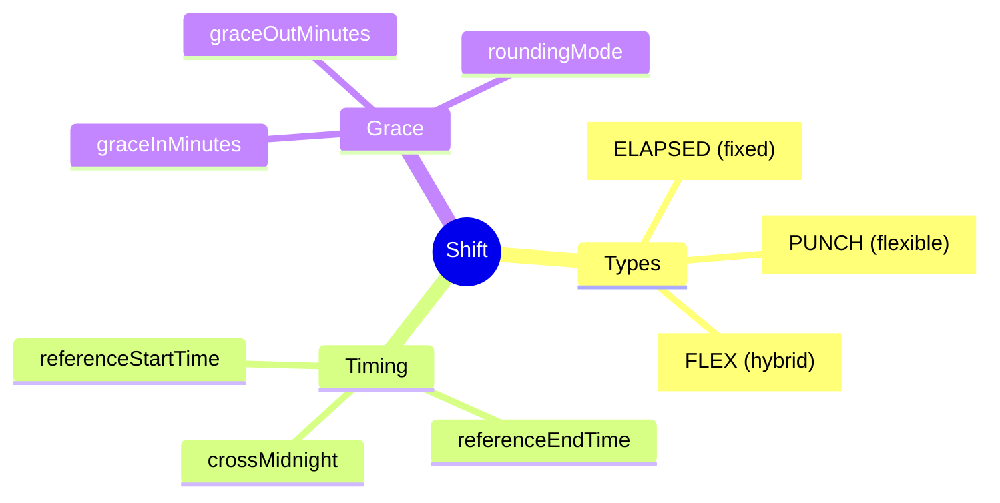
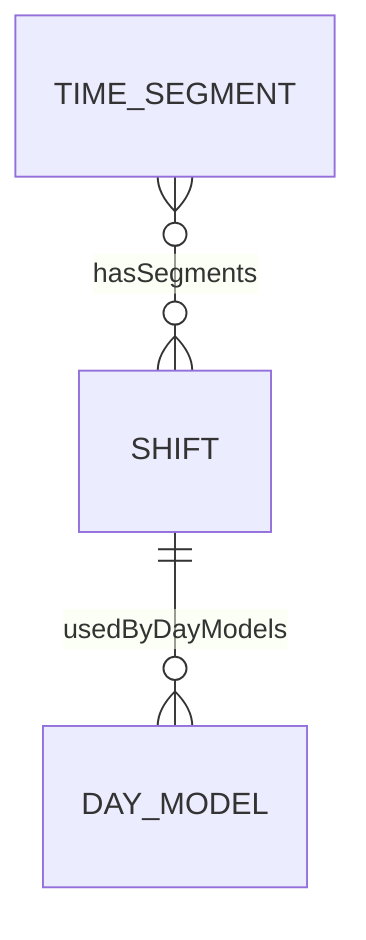
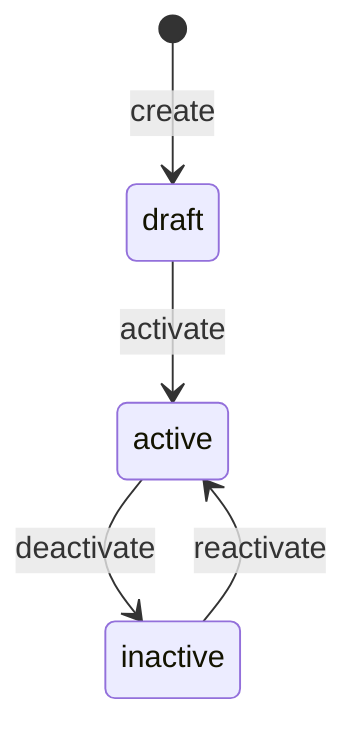

# Shift

## Overview

**Shift** là composition của các [[TimeSegment]], định nghĩa ca làm việc hoàn chỉnh. Là Level 2 trong 6-level Time Hierarchy, nằm giữa [[TimeSegment]] (L1) và [[DayModel]] (L3).



## Business Context

### 6-Level Time Hierarchy

Shift là Level 2 trong hierarchy:

```
┌─────────────────────────────────────────────────────────────────┐
│ L1: TimeSegment   │ Work period within a day (07:00-12:00)      │
├───────────────────┼─────────────────────────────────────────────┤
│ L2: Shift         │ Full shift = collection of TimeSegments ◄───│
├───────────────────┼─────────────────────────────────────────────┤
│ L3: DayModel      │ Model for a day (WORK/OFF/HOLIDAY)          │
├───────────────────┼─────────────────────────────────────────────┤
│ L4: WorkPattern   │ Weekly pattern = 7 DayModels                │
├───────────────────┼─────────────────────────────────────────────┤
│ L5: ScheduleRule  │ Assignment rules (rotation, eligibility)    │
├───────────────────┼─────────────────────────────────────────────┤
│ L6: WorkSchedule  │ Actual schedule assigned to employee        │
└───────────────────┴─────────────────────────────────────────────┘
```

### Key Stakeholders
- **TA Admin**: Define and configure shifts
- **Manager**: Assign shifts to team
- **Employee**: View assigned shift
- **Payroll**: Calculate pay based on shift hours

### Shift Types Explained

| Type | Mô tả | Calculation | Use Case |
|------|-------|-------------|----------|
| **ELAPSED** | Giờ cố định | Expected = totalWorkHours | Office 9-5 |
| **PUNCH** | Tính theo punch | Actual = clock-out - clock-in - breaks | Factory |
| **FLEX** | Core hours + flex | Core hours mandatory, flex around | Tech companies |

### Business Value
Shift tách riêng "ca làm việc là gì" khỏi TimeSegment details, cho phép compose linh hoạt và reuse.

## Attributes Guide

### Core Identity
- **code**: Mã duy nhất. Format: DAY_SHIFT_8H, NIGHT_SHIFT, MORNING_4H
- **name**: Tên hiển thị. VD: "Ca ngày 8h"
- **shiftType**: Loại shift (xem Shift Types table)

### Time Configuration
- **referenceStartTime / referenceEndTime**: Giờ tham chiếu
- **crossMidnight**: true nếu shift qua nửa đêm (22:00-06:00)
- **totalWorkHours / totalBreakHours / totalPaidHours**: Summary hours

### Grace & Rounding
- **graceInMinutes**: Cho phép đến trễ mà không bị tính late
- **graceOutMinutes**: Cho phép về sớm mà không bị tính early
- **roundingIntervalMin**: Khoảng làm tròn (thường 15 phút)
- **roundingMode**:
  - *NEAREST*: Làm tròn đến giá trị gần nhất
  - *UP*: Làm tròn lên (có lợi cho công ty)
  - *DOWN*: Làm tròn xuống (có lợi cho NV)

## Relationships Explained



### TimeSegment
- **hasSegments** → [[TimeSegment]]: Các segment trong shift. VD: Morning work (4h) + Lunch (1h) + Afternoon work (4h)

### DayModel
- **usedByDayModels** → [[DayModel]]: Day models sử dụng shift này

## Lifecycle & Workflows



| State | Meaning |
|-------|---------|
| **draft** | Đang setup, chưa sử dụng |
| **active** | Có thể assign cho employee |
| **inactive** | Không dùng nữa |

## Actions & Operations

### create
**Who**: TA Admin  
**Required**: code, name, shiftType, totalWorkHours, effectiveStartDate

### addSegment
**Who**: TA Admin  
**Required**: segmentId, sequenceOrder  
**Process**: Add TimeSegment to shift composition

### configureGrace
**Who**: TA Admin  
**Affects**: graceInMinutes, graceOutMinutes

## Business Rules

#### Unique Code (uniqueCode)
**Rule**: Shift code phải duy nhất.

#### Valid Hours (validHours)
**Rule**: totalPaidHours ≤ totalWorkHours.  
**Reason**: Paid hours có thể nhỏ hơn (ví dụ unpaid lunch) nhưng không thể lớn hơn work hours.

## Examples

### Example 1: Day Shift (Office)
```yaml
code: DAY_SHIFT_8H
name: "Ca ngày 8h"
shiftType: ELAPSED
referenceStartTime: "08:00"
referenceEndTime: "17:00"
totalWorkHours: 8
totalBreakHours: 1
totalPaidHours: 8
graceInMinutes: 15
roundingMode: NEAREST
```

### Example 2: Night Shift (Factory)
```yaml
code: NIGHT_SHIFT
name: "Ca đêm"
shiftType: PUNCH
referenceStartTime: "22:00"
referenceEndTime: "06:00"
crossMidnight: true
totalWorkHours: 8
totalPaidHours: 8
graceInMinutes: 15
roundingIntervalMin: 15
```

### Example 3: Flex Shift (Tech)
```yaml
code: FLEX_8H
name: "Ca linh hoạt"
shiftType: FLEX
referenceStartTime: "10:00"  # Core hours start
referenceEndTime: "16:00"    # Core hours end
totalWorkHours: 8
# Có thể đến/về linh hoạt miễn là đủ 8h và có mặt 10-16
```

## Related Entities

| Entity | Relationship | Description |
|--------|--------------|-------------|
| [[TimeSegment]] | hasSegments | Segments in shift |
| [[DayModel]] | usedByDayModels | Day models using shift |
