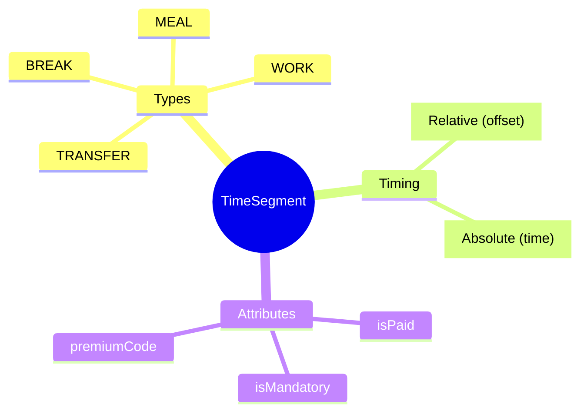

# TimeSegment

## Overview



**TimeSegment** là đơn vị thời gian nguyên tử (atomic) - building block nhỏ nhất của hệ thống Time & Attendance. Là Level 1 trong 6-level hierarchy.

## Business Context

### Key Stakeholders
- **TA Admin**: Define and configure segments
- **Payroll**: Use premium codes for calculation
- **Schedulers**: Compose shifts from segments

### 6-Level Hierarchy Position
```
TimeSegment (L1) → Shift (L2) → DayModel (L3) → WorkPattern (L4) → ScheduleRule (L5)
```

## Attributes Guide

### Timing Options
- **Relative**: Sử dụng `startOffsetMin`/`endOffsetMin` (minutes from shift start)
- **Absolute**: Sử dụng `startTime`/`endTime` (fixed time)

### Segment Types
| Type | Mô tả | isPaid |
|------|-------|--------|
| WORK | Thời gian làm việc | true |
| BREAK | Giờ nghỉ ngắn | false |
| MEAL | Giờ ăn | false |
| TRANSFER | Di chuyển | varies |

## Examples

### Example 1: Morning Work Block
- **code**: WORK_MORNING
- **segmentType**: WORK
- **startTime**: 08:00
- **endTime**: 12:00
- **durationMinutes**: 240
- **isPaid**: true

### Example 2: Lunch Break
- **code**: LUNCH_BREAK
- **segmentType**: MEAL
- **startOffsetMin**: 240 (4 hours)
- **durationMinutes**: 60
- **isPaid**: false

## Related Entities

| Entity | Relationship | Description |
|--------|--------------|-------------|
| [[Shift]] | usedInShifts | Shifts using this segment |
