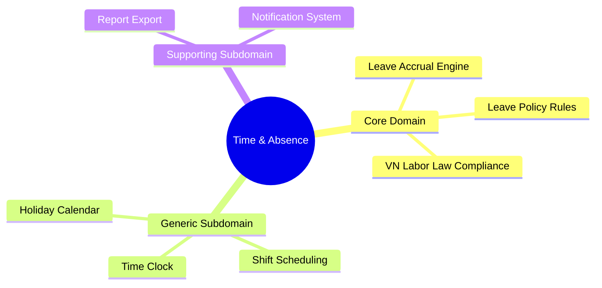
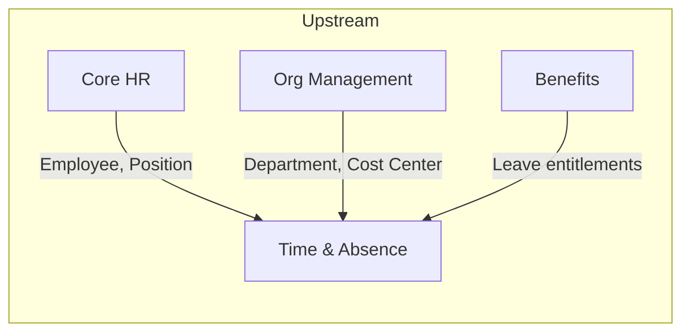
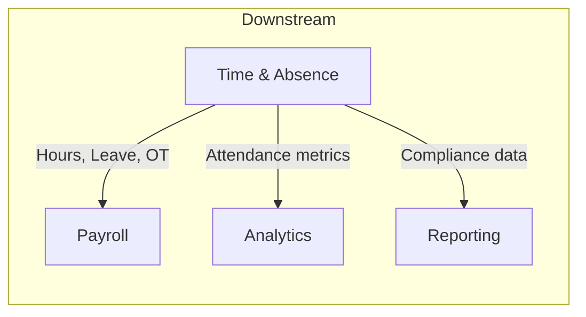

# 🔬 Research Report: Time & Absence Module

## Document Information

| Field | Value |
|-------|-------|
| **Module** | Time & Absence (TA) |
| **Domain** | Human Capital Management |
| **Research Date** | 2026-01-30 |
| **Confidence Score** | HIGH |
| **Status** | Complete |

---

## 1. Executive Summary

Module **Time & Absence** (T&A) quản lý thời gian làm việc, nghỉ phép và vắng mặt của nhân viên. Đây là module quan trọng trong hệ sinh thái HCM, kết nối chặt chẽ với Core HR (dữ liệu nhân viên) và Payroll (tính lương).

### Key Findings

1. **Market Consensus**: 4 vendor hàng đầu (Oracle, SAP, Workday, Microsoft) đều có cấu trúc tương tự với 8-10 nhóm tính năng chính
2. **Feature Count**: 65 tính năng cần thiết được xác định qua phân tích so sánh
3. **Regulatory**: Vietnam Labor Law 2019 (BLLĐ 45/2019/QH14) là nền tảng tuân thủ bắt buộc
4. **Integration**: Tích hợp chặt với Core HR, Payroll và có thể mở rộng với Benefits, Workforce Scheduling

### Confidence Assessment

| Dimension | Assessment | Score |
|-----------|------------|-------|
| Regulatory Clarity | VN Labor Law rõ ràng, ổn định từ 2021 | HIGH |
| Market Consensus | 4/4 vendor đồng thuận về core features | HIGH |
| Business Stability | T&A là domain trưởng thành | HIGH |
| Source Quality | >5 nguồn Tier 1 (official docs) | HIGH |

**Overall**: ✅ HIGH CONFIDENCE

---

## 2. Domain Classification

### Core vs Generic vs Supporting



| Type | Subdomains | Strategy | Investment |
|------|------------|----------|------------|
| **Core** | Accrual Engine, Policy Rules, VN Compliance | Build perfectly | HIGH |
| **Generic** | Time Clock, Scheduling, Holidays | Buy/Standardize | MEDIUM |
| **Supporting** | Reports, Notifications | Outsource/Simplify | LOW |

---

## 3. Competitor Analysis

### 3.1 Oracle HCM Cloud - Time and Labor & Absence Management

**Strengths**:
- Redwood Experience - UI/UX hiện đại
- Unlimited concurrent absences
- Vacation bidding feature
- AI-driven approval recommendations (25D release)
- Strong payroll integration

**Key Features**:
- Time card với absence entry tích hợp
- Automated reprocessing khi schedule thay đổi
- Compensatory time payment options
- Real-time discrepancy alerts
- Hybrid work support với geolocation

**Innovation Highlights**:
- AI Agents suggest approval actions
- Predictive absenteeism analysis
- Mobile clock with geofencing

### 3.2 SAP SuccessFactors - Time Management

**Strengths**:
- Time Off + Time Tracking tách biệt rõ ràng
- Time Accounts concept mạnh mẽ
- SAP Absence & Leave by WorkForce Software
- Strong compliance automation
- Global workforce support

**Key Features**:
- Time accounts như "bank accounts" cho leave
- Cross-midnight attendance support
- Real-time accrual automation
- Proactive overtime alerts
- Country-specific localizations

**Innovation Highlights**:
- Embedded analytics với financial impact
- Forecasting và resource planning
- Legal expertise updates tự động

### 3.3 Workday - Time Tracking & Absence Management

**Strengths**:
- Unified Absence Calendar (2025R2)
- Deep integration với HCM suite
- Strong self-service capabilities
- Policy và leave plans library

**Key Features**:
- AI-driven automated time capture
- Unified "Request Absence" task
- Manager dashboards với insights
- Mobile/web time clocks
- Project time tracking

**Innovation Highlights**:
- Single interface cho Time Off + Leave of Absence
- Insightful absence pattern analytics
- Integrated balance checks real-time

### 3.4 Microsoft Dynamics 365 Human Resources

**Strengths**:
- Teams integration native
- Flexible configuration
- Sell/borrow leave options
- Strong self-service via Teams

**Key Features**:
- Absence manager role
- Virtual time clock in employee app
- Leave type configuration với rules
- Balance adjustments
- Timesheet workflows

**Innovation Highlights**:
- Teams-based leave request/approval
- Integration với Commerce/SCM

### Vendor Comparison Matrix

| Feature Category | Oracle | SAP | Workday | Microsoft |
|-----------------|--------|-----|---------|-----------|
| Time Clock (Web/Mobile) | ✅ | ✅ | ✅ | ✅ |
| Biometric Integration | ✅ | ✅ | ✅ | ⚠️ |
| GPS/Geofencing | ✅ | ⚠️ | ✅ | ⚠️ |
| Leave Request/Approval | ✅ | ✅ | ✅ | ✅ |
| Automated Accrual | ✅ | ✅ | ✅ | ✅ |
| Vacation Bidding | ✅ | ❌ | ❌ | ❌ |
| AI Approval | ✅ | ⚠️ | ⚠️ | ❌ |
| Sell/Buy Leave | ⚠️ | ⚠️ | ⚠️ | ✅ |
| Shift Scheduling | ⚠️ | ✅ | ✅ | ⚠️ |
| Payroll Integration | ✅ | ✅ | ✅ | ✅ |
| Mobile App | ✅ | ✅ | ✅ | ✅ |
| Analytics | ✅ | ✅ | ✅ | ⚠️ |

Legend: ✅ Full | ⚠️ Partial | ❌ None

---

## 4. Vietnam Labor Law Compliance

### 4.1 Annual Leave (Nghỉ phép năm)

| Condition | Days/Year | Legal Reference |
|-----------|-----------|-----------------|
| Normal working conditions | 12 | Điều 113 BLLĐ 2019 |
| Heavy/hazardous/dangerous jobs | 14 | Điều 113 BLLĐ 2019 |
| Extremely heavy/hazardous/dangerous | 16 | Điều 113 BLLĐ 2019 |
| **Seniority bonus** | +1 per 5 years | Điều 114 BLLĐ 2019 |

**Key Rules**:
- Prorated for employees < 12 months
- Can be accumulated
- Employer must notify schedule in advance

### 4.2 Sick Leave (Nghỉ ốm đau)

Paid through Social Insurance, not employer.

| SI Contribution | Normal Jobs | Heavy/Hazardous |
|-----------------|-------------|-----------------|
| < 15 years | 30 days | 40 days |
| 15-30 years | 40 days | 50 days |
| ≥ 30 years | 60 days | 70 days |

**Key Rules**:
- Long-term illness: up to 180 days/year
- Allowance: 75% of SI salary
- Requires medical certificate

### 4.3 Maternity Leave (Nghỉ thai sản)

| Type | Duration | Notes |
|------|----------|-------|
| **Maternity** | 6 months (180 days) | Up to 2 months before due date |
| **Multiple births** | +1 month per child | From 2nd child onward |
| **Early return** | Min 4 months after birth | Requires medical clearance |
| **Paternity** | 5 working days | Paid by employer |

**Key Rules**:
- Paid via Social Insurance
- Requires 6 months SI contribution in past 12 months

### 4.4 Other Statutory Leaves

| Type | Duration | Reference |
|------|----------|-----------|
| Marriage (own) | 3 days | Điều 115 |
| Marriage (child) | 1 day | Điều 115 |
| Bereavement (parent, spouse, child) | 3 days | Điều 115 |
| Bereavement (grandparent, sibling) | 1 day | |
| Public holidays | ~11 days/year | Điều 112 |

### 4.5 Public Holidays (Vietnam)

| Holiday | Duration |
|---------|----------|
| New Year (Tết Dương lịch) | 1 day |
| Lunar New Year (Tết Nguyên đán) | 5 days |
| Hung Kings Commemoration | 1 day |
| Reunification Day (30/4) | 1 day |
| Labor Day (1/5) | 1 day |
| National Day (2/9) | 2 days |

---

## 5. Feature Summary

### By Category

| Category | Count | Priority | Description |
|----------|-------|----------|-------------|
| Time Tracking | 8 | P1 | Clock in/out, timesheets, GPS |
| Absence Management | 12 | P0 | Request, approval, workflows |
| Leave Balance & Accrual | 8 | P0 | Balances, accrual, carryover |
| Leave Policy & Compliance | 6 | P0 | Policies, VN law, eligibility |
| Scheduling | 7 | P1 | Shifts, schedules, rotation |
| Calendar & Holiday | 4 | P1 | Holidays, team calendar |
| Overtime & Compensatory | 4 | P1 | OT tracking, comp time |
| Reporting & Analytics | 6 | P2 | Dashboards, reports, analytics |
| Self-Service & UX | 5 | P2 | Portal, mobile, notifications |
| Integration | 5 | P2 | Payroll, HR, devices |
| **TOTAL** | **65** | | |

### By Differentiation

| Type | Count | Description |
|------|-------|-------------|
| **Parity** | 48 | Table stakes, must match industry |
| **Innovation** | 11 | USP, competitive advantage |
| **Compliance** | 6 | Mandatory for legal requirements |

### By Gap Type

| Gap Type | Count | Strategy |
|----------|-------|----------|
| Standard Fit | 51 | Configure, no customization |
| Config Gap | 7 | Customize configuration |
| Extension Gap | 4 | Build extension |
| **Core Gap** | 3 | **Requires ARB approval** |

---

## 6. Architectural Decision Records (ADRs)

### ADR-001: Accrual Calculation Timing

| Field | Value |
|-------|-------|
| **Status** | Accepted |
| **Context** | Khi nào tính accrual: đầu kỳ hay cuối kỳ? |
| **Decision** | Tính accrual tại **đầu kỳ** (start of period) |
| **Rationale** | - Phù hợp best practice Oracle<br>- Employee expectation: balance available từ đầu tháng<br>- Flexibility cho adjustment |
| **Consequences** | Cần xử lý prorated cho nhân viên mới/nghỉ việc |

### ADR-002: Leave Balance Storage Strategy

| Field | Value |
|-------|-------|
| **Status** | Accepted |
| **Context** | Lưu balance như snapshot hay derived từ transactions? |
| **Decision** | **Derived** - tính từ transactions mỗi lần query |
| **Rationale** | - Audit trail đầy đủ<br>- Accuracy đảm bảo<br>- Avoid sync issues |
| **Consequences** | - Cần optimize query performance<br>- Consider caching cho dashboard |
| **Alternatives** | Snapshot + Event Sourcing (rejected: phức tạp hơn) |

### ADR-003: Vietnam Social Insurance Integration

| Field | Value |
|-------|-------|
| **Status** | Proposed |
| **Context** | Làm thế nào để integrate với hệ thống BHXH VN? |
| **Decision** | Integration via **API** (khi available) hoặc **manual export/import** |
| **Rationale** | - Compliance requirement<br>- Independence từ SI system changes<br>- Maintainability |
| **Consequences** | - Cần fallback mechanism<br>- Manual process initially |

### ADR-004: Time Entry Granularity

| Field | Value |
|-------|-------|
| **Status** | Accepted |
| **Context** | Độ chi tiết tối thiểu cho time entry? |
| **Decision** | **15-minute intervals** |
| **Rationale** | - Industry standard<br>- Balance precision vs complexity<br>- Phù hợp Vietnam labor practice |
| **Consequences** | Rounding rules cần document rõ |

---

## 7. Domain Evolution Outlook

### Evolution Horizons

```mermaid
timeline
    title Time & Absence Module Evolution
    section H1: 0-1 Year
        VN Labor Law Compliance : Must-have
        Basic T&A : Core functionality
        Accrual Engine : Foundation
    section H2: 1-3 Years
        AI Approvals : Enhancement
        Predictive Analytics : Insight
        Mobile-first : UX upgrade
    section H3: 3-5 Years
        IoT Integration : Future
        Wearables : Innovation
        Smart Attendance : Automation
```

| Horizon | Focus | Strategy | Features |
|---------|-------|----------|----------|
| **H1 (0-1 yr)** | Compliance & Foundation | Hard requirements | VN Law, Basic T&A, Accrual |
| **H2 (1-3 yr)** | Enhancement & Intelligence | Build extensibility hooks | AI, Analytics, Mobile |
| **H3 (3-5 yr)** | Future-proofing | Keep core flexible | IoT, Wearables, Smart |

### Technology Trends Impact

| Trend | Impact on T&A | Readiness |
|-------|---------------|-----------|
| AI/ML | Approval recommendations, Predictive analytics | H2 |
| Mobile-first | Self-service, Time clock | H1-H2 |
| IoT | Smart attendance, Wearables | H3 |
| Cloud-native | Scalability, Integration | H1 |
| Low-code | Policy configuration | H2 |

---

## 8. Dependencies Map

### Upstream Dependencies (requires data from)



| Source | Data Required | Criticality |
|--------|---------------|-------------|
| Core HR | Employee, Position, Employment Status | Critical |
| Org Management | Department, Cost Center, Location | High |
| Benefits | Extended leave entitlements | Medium |

### Downstream Consumers (provides data to)



| Consumer | Data Provided | Frequency |
|----------|---------------|-----------|
| Payroll | Time worked, Leave taken, Overtime | Per pay period |
| Analytics | Attendance patterns, Absence trends | Real-time |
| Reporting | Compliance reports, Audit data | On-demand |

---

## 9. Explicit Non-Goals

| Non-Goal | Reason | Alternative |
|----------|--------|-------------|
| **Full Workforce Management** | Complex demand forecasting out of scope | Separate WFM module |
| **Payroll Processing** | Only provide input | Payroll module handles |
| **Project Management** | Time tracking is attendance, not projects | PM module |
| **FMLA/ADA (US)** | Focus on Vietnam first | Phase 2+ for global |
| **Manufacturing Shop Floor** | Specialized WFM needed | Partner integration |

---

## 10. Implementation Roadmap

### Phase Overview

| Phase | Duration | Focus | Priority | CoD |
|-------|----------|-------|----------|-----|
| **Phase 1: Foundation** | Month 1-4 | Core T&A, Compliance | P0 | $100k+/month |
| **Phase 2: Enhancement** | Month 5-7 | Scheduling, Mobile | P1 | $30k/month |
| **Phase 3: Advanced** | Month 8-10 | Analytics, AI | P2 | $10k/month |

### Phase 1: Foundation (Month 1-4)

**Scope**:
- Absence Management (AM-01 to AM-10)
- Leave Balance & Accrual (LA-01 to LA-06, LA-08)
- Leave Policy & Compliance (LP-01 to LP-05)
- Basic Time Tracking (TT-01, TT-02, TT-05)
- Calendar & Holiday (CH-01 to CH-03)
- Integration (IN-01, IN-02)

**Exit Criteria**:
- [ ] All P0 features functional
- [ ] Vietnam Labor Law compliance verified
- [ ] Integration with Core HR tested
- [ ] No S1 bugs open
- [ ] UAT sign-off

### Phase 2: Enhancement (Month 5-7)

**Scope**:
- Advanced Time Tracking (TT-03, TT-04, TT-06)
- Scheduling (SC-01 to SC-05)
- Overtime (OT-01 to OT-04)
- Self-Service (SS-01 to SS-04)
- Sell/Buy Leave (LA-07)

**Exit Criteria**:
- [ ] All P1 features functional
- [ ] Mobile app published
- [ ] Performance benchmarks met
- [ ] No S1/S2 bugs open

### Phase 3: Advanced (Month 8-10)

**Scope**:
- Advanced features (TT-07, TT-08, AM-11, AM-12)
- Scheduling (SC-06)
- Reporting & Analytics (RA-01 to RA-06)
- Teams Integration (SS-05)
- API Extensions (IN-04)

**Exit Criteria**:
- [ ] All P2 features functional
- [ ] AI features accuracy >85%
- [ ] API documentation complete

---

## 11. Risk Register

| ID | Risk | Impact | Probability | Mitigation |
|----|------|--------|-------------|------------|
| R1 | VN Labor Law change | HIGH | LOW | Config-driven rules engine |
| R2 | SI API unavailable | MEDIUM | MEDIUM | Fallback to manual entry |
| R3 | Biometric device variety | LOW | HIGH | Standard API adapters |
| R4 | Payroll integration complexity | HIGH | MEDIUM | Early integration testing |
| R5 | User adoption | MEDIUM | MEDIUM | Self-service training, UX focus |
| R6 | Performance at scale | MEDIUM | MEDIUM | Caching, query optimization |

---

## 12. Search Log (Audit Trail)

| Query | Source Tier | Key Insight |
|-------|-------------|-------------|
| "Oracle HCM Time and Labor Absence Management features 2024" | Tier 1 | Redwood UI, AI approvals, vacation bidding |
| "SAP SuccessFactors Time Tracking Absence Management" | Tier 1 | Time accounts, cross-midnight, global compliance |
| "Workday Time Tracking Absence Management" | Tier 1 | Unified calendar, AI time capture, dashboards |
| "Microsoft Dynamics 365 HR time absence" | Tier 1 | Teams integration, sell/buy leave, absence manager |
| "Vietnam Labor Law 2019 leave entitlements" | Tier 1 | Annual 12-16 days, sick via SI, maternity 6 months |
| "HCM Time Attendance best practices scheduling" | Tier 2 | Automation, compliance, self-service |
| "Leave of Absence FMLA ADA compliance software" | Tier 2 | Certification management, workflow automation |
| "Time Absence AI automation trends 2024 2025" | Tier 2 | Predictive analytics, 15-25% OT reduction |

---

## 13. References (Tiered)

### Tier 1 (Gold) - Official Documentation
- [Oracle HCM Cloud Release Notes](https://docs.oracle.com/en/cloud/saas/human-resources/)
- [SAP SuccessFactors Time Management](https://help.sap.com/docs/SAP_SUCCESSFACTORS_TIME_MANAGEMENT)
- [Workday Time Tracking Documentation](https://www.workday.com/en-us/products/human-capital-management/time-tracking.html)
- [Microsoft Dynamics 365 HR Documentation](https://learn.microsoft.com/en-us/dynamics365/human-resources/)
- [Vietnam Labor Code 2019 (45/2019/QH14)](https://vbpl.vn/)
- [Luật Việt Nam - Quy định nghỉ phép](https://luatvietnam.vn/)

### Tier 2 (Silver) - Industry Analysis
- Kovaion - Oracle HCM Absence Management Guide
- Gologica - SAP SuccessFactors Time Management
- CloudFoundation - Workday Absence Management
- Josh Bersin - HR Tech Trends 2024-2025

### Tier 3 (Bronze) - Community/Forums
- Reddit r/HRIS discussions
- LinkedIn HR Technology groups

---

## 14. Next Steps

1. **Review & Approval**: Submit report for stakeholder review
2. **Entity Catalog**: See `entity-catalog.md` for detailed entity specifications
3. **Feature Catalog**: See `feature-catalog.md` for complete feature list
4. **Ontology Building**: Use catalogs as input for `*.onto.md` files
5. **BRS Building**: Extract business rules for `*.brs.md` files
6. **Feature Specs**: Create `*.feat.md` for priority features

---

*Document generated by Research-Driven Workflow using domain-research, native-research-protocol, and business-blueprint-architect skills.*
