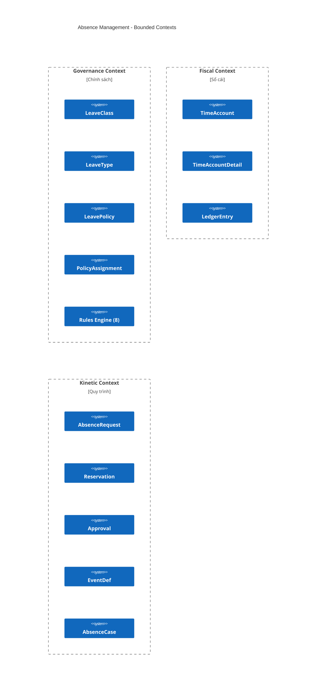
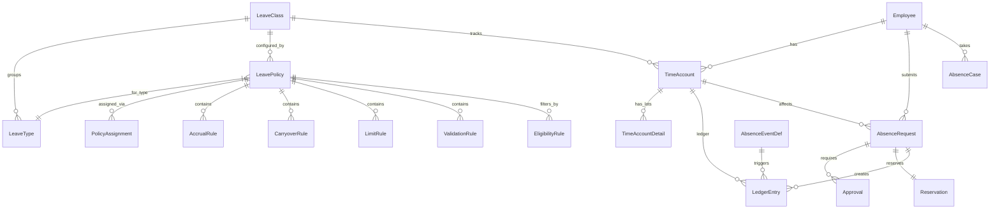

# Entity Catalog: Absence Management

## Document Information

| Field | Value |
|-------|-------|
| **Module** | Absence Management (Time & Absence sub-module) |
| **Entities** | 20 |
| **Enums** | 18 |
| **Actions** | 8 |
| **Shared Slots** | 5 groups |
| **Bounded Contexts** | 3 (Governance, Fiscal, Kinetic) |
| **Last Updated** | 2026-02-11 |
| **Status** | Draft |
| **LinkML Standard** | v1.0.0 |
| **Sources** | PRD Absence, DBML v5.1, Ontology YAML v2.0, Terminology Standards |

---

## Bounded Context Overview



> [!NOTE]
> **Tại sao chia 3 bounded contexts?** (theo PRD "Phân tích Module Quản lý Phép HCM")
> - **Governance**: Quản lý "luật chơi" — ai được nghỉ gì, tích lũy bao nhiêu, giới hạn ra sao
> - **Fiscal**: Quản lý "tiền tệ thời gian" — mọi thay đổi balance tạo immutable ledger entry
> - **Kinetic**: Quản lý "quy trình" — request → approval → booking → ledger posting
>
> Shared entities (`HolidayCalendar`, `PeriodProfile`, `WorkSchedule`) thuộc **Chronology Context** đã được định nghĩa trong entity-catalog.md (TA module).

---

## Terminology Mapping

| Khái niệm xTalent | Oracle Fusion HCM | SAP SuccessFactors | Workday |
|--------------------|-------------------|---------------------|---------|
| **LeaveClass** | Absence Category | Time Type (Group) | Time Off Type |
| **LeaveType** | Absence Type | Time Type | Time Off Type |
| **LeavePolicy** | Accrual Plan | Time Account Type | Accrual/Grant (Time Off Plan) |
| **TimeAccount** | Plan Balance | Time Account | Time Off Balance |
| **LedgerEntry** | — (via Fast Formula) | Time Account Booking | — (internal) |
| **AbsenceRequest** | Absence Entry | Employee Time | Time Off Request |
| **AbsenceCase** | Absence Case | Leave of Absence | Leave of Absence |
| **EligibilityRule** | Eligibility Profile | Eligibility Rule | Eligibility override |
| **AccrualRule** | Accrual Formula | Accrual Rule | Accrual Calculation |
| **Approval** | Approval Rules | Approval Workflow | Approval Chain |

> [!IMPORTANT]
> **Thuật ngữ chuẩn hóa** (theo "Chuẩn hóa Thuật ngữ Quản lý Nghỉ phép"):
> - **"Leave Balance"** → dùng **TimeAccount** (SAP standard) cho backend, **Time Off Balance** cho UI
> - **"Leave Instant"** → dùng **AbsenceEntry** (Oracle standard) hoặc **AbsenceRequest** (Workday standard)
> - **"Leave Movement"** → dùng **LedgerEntry** (Financial ledger pattern)
> - Thời gian được xử lý như **tiền tệ** (Time as Currency) → kiến trúc sổ cái

---

## Entity Summary (by Bounded Context)

### Governance Context

| # | Entity | Sub-category | Layer | Stability | PII | DBML Table |
|---|--------|-------------|-------|-----------|-----|------------|
| 1 | LeaveClass | Definition | configuration | HIGH | No | `absence.leave_class` |
| 2 | LeaveType | Definition | configuration | HIGH | No | `absence.leave_type` |
| 3 | LeavePolicy | Definition | configuration | MEDIUM | No | `absence.leave_policy` |
| 4 | PolicyAssignment | Definition | configuration | MEDIUM | No | `absence.policy_assignment` |
| 5 | AccrualRule | Rules Engine | rules | MEDIUM | No | Embedded JSONB |
| 6 | CarryoverRule | Rules Engine | rules | MEDIUM | No | Embedded JSONB |
| 7 | EligibilityRule | Rules Engine | rules | MEDIUM | No | `core.eligibility_profile` |
| 8 | LimitRule | Rules Engine | rules | MEDIUM | No | Embedded JSONB |
| 9 | OverdraftRule | Rules Engine | rules | MEDIUM | No | Inline columns |
| 10 | ProrationRule | Rules Engine | rules | MEDIUM | No | Embedded JSONB |
| 11 | RoundingRule | Rules Engine | rules | MEDIUM | No | Embedded JSONB |
| 12 | ValidationRule | Rules Engine | rules | MEDIUM | No | Embedded JSONB |

### Fiscal Context

| # | Entity | Sub-category | Layer | Stability | PII | DBML Table |
|---|--------|-------------|-------|-----------|-----|------------|
| 13 | TimeAccount | Balance | transaction | HIGH | No | `absence.leave_instant` |
| 14 | TimeAccountDetail | FEFO Lots | transaction | HIGH | No | `absence.leave_instant_detail` |
| 15 | LedgerEntry | Immutable Ledger | transaction | HIGH | No | `absence.leave_movement` |

### Kinetic Context

| # | Entity | Sub-category | Layer | Stability | PII | DBML Table |
|---|--------|-------------|-------|-----------|-----|------------|
| 16 | AbsenceRequest | Transaction | transaction | HIGH | No | `absence.leave_request` |
| 17 | Reservation | Transaction | transaction | HIGH | No | `absence.leave_reservation` |
| 18 | Approval | Workflow | transaction | HIGH | No | `absence.approval` |
| 19 | AbsenceEventDef | Engine | configuration | MEDIUM | No | `absence.leave_event_def` |
| 20 | AbsenceCase | Long-term LOA | transaction | HIGH | Yes | Logical entity |

---

## GOVERNANCE CONTEXT — Chính sách

### 1. LeaveClass

```yaml
# LinkML Entity Definition
classes:
  LeaveClass:
    description: "Phân loại cấp cao nhất — nhóm các LeaveType cùng đặc tính"
    annotations:
      oracle_hcm_term: "Absence Category"
      sap_term: "Time Type Group"
      workday_term: "Time Off Type"
      module: "absence_management"
      dbml_table: "absence.leave_class"
    slots: [id, type_code, code, name, status_code, scope_owner, mode_code,
            unit_code, period_profile, posting_map, eligibility_profile_id,
            emit_expire_turnover, bu_id, le_id, country_code,
            effective_start, effective_end]
    slot_usage:
      code: { required: true, identifier: true }
      mode_code: { range: LeaveClassModeEnum, required: true }
      unit_code: { range: LeaveUnitEnum, required: true }
```

| Attribute | Type | Required | Description |
|-----------|------|----------|-------------|
| id | UUID | Yes | Primary key |
| type_code | String(50) | Yes | FK → LeaveType.code |
| code | String(50) | Yes | Mã phân loại (PTO, UNPAID, STATUTORY) |
| name | String(100) | Yes | Tên hiển thị |
| status_code | String(20) | Yes | ACTIVE \| INACTIVE |
| mode_code | LeaveClassModeEnum | Yes | ACCOUNT \| LIMIT \| UNPAID |
| unit_code | LeaveUnitEnum | Yes | HOUR \| DAY |
| eligibility_profile_id | UUID | No | v5.1: FK → EligibilityProfile |
| effective_start | Date | Yes | Ngày hiệu lực |
| effective_end | Date | No | Ngày kết thúc |

---

### 2. LeaveType

```yaml
classes:
  LeaveType:
    description: "Loại nghỉ phép cụ thể. PK = code (varchar), không phải UUID"
    annotations:
      oracle_hcm_term: "Absence Type"
      sap_term: "Time Type"
      workday_term: "Time Off Type"
      module: "absence_management"
      dbml_table: "absence.leave_type"
      disambiguation: "Oracle dùng Absence Type, SAP dùng Time Type. PK là code"
    slots: [code, name, is_paid, is_quota_based, requires_approval,
            unit_code, core_min_unit, allows_half_day, holiday_handling,
            overlap_policy, eligibility_profile_id, effective_start, effective_end]
    slot_usage:
      code: { required: true, identifier: true, pattern: "^[A-Z_]{2,50}$" }
      holiday_handling: { range: HolidayHandlingEnum }
      overlap_policy: { range: OverlapPolicyEnum }
    rules:
      - description: "BRS-LT-001: code must be unique, uppercase"
      - description: "BRS-LT-002: If allows_half_day, unit_code must be DAY"
```

**Standard Leave Types (Vietnam)**:

| Code | Name | Category | Paid | Quota | Statutory Ref |
|------|------|----------|------|-------|---------------|
| ANNUAL | Nghỉ phép năm | STATUTORY | Yes | Yes | Điều 113 BLLĐ |
| SICK | Nghỉ ốm đau | STATUTORY | Yes (SI) | Yes | Điều 26 Luật BHXH |
| MATERNITY | Nghỉ thai sản | STATUTORY | Yes (SI) | Yes | Điều 34 Luật BHXH |
| PATERNITY | Nghỉ chế độ cha | STATUTORY | Yes | Yes | NĐ 146/2018 |
| MARRIAGE_SELF | Kết hôn (bản thân) | STATUTORY | Yes | No | Điều 115 BLLĐ |
| BEREAVEMENT | Nghỉ tang | STATUTORY | Yes | No | Điều 115 BLLĐ |
| COMP_TIME | Nghỉ bù | COMPANY | Yes | Yes | — |
| UNPAID | Không lương | UNPAID | No | No | — |
| WORK_INJURY | Tai nạn LĐ | STATUTORY | Yes (SI) | Yes | Điều 38 Luật ATVSLĐ |

---

### 3. LeavePolicy

```yaml
classes:
  LeavePolicy:
    description: "Container cho tất cả business rules (accrual, carry, limit...)"
    annotations:
      oracle_hcm_term: "Accrual Plan"
      sap_term: "Time Account Type"
      workday_term: "Time Off Plan"
      module: "absence_management"
      dbml_table: "absence.leave_policy"
      disambiguation: "v5.1 lưu rules dạng JSONB trong policy thay vì tách bảng"
    slots: [id, type_code, code, name, eligibility_profile_id,
            accrual_rule_json, carry_rule_json, overdraft_allowed,
            overdraft_limit_hours, check_limit_line, limit_rule_json,
            validation_json, rounding_json, proration_json,
            effective_start, effective_end]
    rules:
      - description: "BRS-LP-001: type_code must reference active LeaveType"
      - description: "BRS-LP-002: If overdraft_allowed, overdraft_limit_hours required"
```

---

### 4. PolicyAssignment

```yaml
classes:
  PolicyAssignment:
    description: "Gán chính sách cho đối tượng (Employee, BU, LE, Grade)"
    annotations:
      oracle_hcm_term: "Plan Enrollment"
      sap_term: "Time Account Rule Assignment"
      workday_term: "Eligibility override"
      module: "absence_management"
      dbml_table: "absence.policy_assignment"
```

| Attribute | Type | Required | Description |
|-----------|------|----------|-------------|
| id | UUID | Yes | Primary key |
| policy_id | UUID | Yes | FK → LeavePolicy |
| assignment_type | String(20) | Yes | EMPLOYEE \| BU \| LE \| GRADE |
| assignment_id | UUID | Yes | ID đối tượng được gán |
| effective_start | Date | Yes | Ngày bắt đầu |
| effective_end | Date | No | Ngày kết thúc |

---

### 5–12. Rules Engine Entities

> [!NOTE]
> Tất cả Rule entities chia sẻ pattern chung: có thể bind vào **LeaveType** HOẶC **LeaveClass** (không cả hai). DBML lưu dạng JSONB trong `leave_policy` (trừ EligibilityRule dùng `core.eligibility_profile`).

#### 5. AccrualRule

```yaml
classes:
  AccrualRule:
    description: "Quy tắc tích lũy phép: Front-loaded, Prorated, Hours-based"
    annotations:
      oracle_hcm_term: "Accrual Formula"
      sap_term: "Accrual Rule"
      workday_term: "Accrual Calculation"
      dbml_table: "Embedded in absence.leave_policy.accrual_rule_json"
    rules:
      - description: "BRS-AR-001: accrual_amount must be > 0"
      - description: "BRS-AR-002: If method != UPFRONT, accrual_period required"
```

| Attribute | Type | Required | Description |
|-----------|------|----------|-------------|
| accrual_method | AccrualMethodEnum | Yes | UPFRONT \| MONTHLY \| BIWEEKLY \| WEEKLY \| DAILY \| HOURLY |
| accrual_amount | Decimal | Yes | Số lượng tích lũy mỗi kỳ |
| max_accrual_balance | Decimal | No | Trần tích lũy (Ceiling) |
| accrual_start_date | AccrualStartEnum | Yes | HIRE_DATE \| YEAR_START \| CUSTOM_DATE |
| waiting_period_months | Integer | No | Thời gian chờ (Vesting) |
| is_prorated | Boolean | Yes | Prorate theo ngày bắt đầu |

**Seniority Bonus (Vietnam)**: Cứ 5 năm thâm niên → +1 ngày phép (Điều 113 BLLĐ)

#### 6. CarryoverRule

| Attribute | Type | Required | Description |
|-----------|------|----------|-------------|
| carryover_type | CarryoverTypeEnum | Yes | NONE \| UNLIMITED \| LIMITED \| EXPIRE_ALL \| PAYOUT |
| max_carryover_amount | Decimal | No | Tối đa chuyển tiếp |
| carryover_expiry_months | Integer | No | Hết hạn sau X tháng |
| payout_rate | Decimal | No | Tỷ lệ encashment |

#### 7. EligibilityRule

| Attribute | Type | Required | Description |
|-----------|------|----------|-------------|
| rule_type | EligibilityRuleTypeEnum | Yes | TENURE \| EMPLOYMENT_TYPE \| LOCATION \| DEPARTMENT \| JOB_LEVEL |
| operator | OperatorEnum | Yes | EQUALS \| NOT_EQUALS \| GREATER_THAN \| IN |
| value | String (JSON) | Yes | Giá trị điều kiện |
| min_tenure_months | Integer | No | Thâm niên tối thiểu |

#### 8. LimitRule

| Attribute | Type | Required | Description |
|-----------|------|----------|-------------|
| limit_type | LimitTypeEnum | Yes | MAX_PER_YEAR \| MAX_PER_REQUEST \| MAX_PER_MONTH \| MIN_PER_REQUEST |
| limit_amount | Decimal | Yes | Số lượng giới hạn |

#### 9. OverdraftRule

| Attribute | Type | Required | Description |
|-----------|------|----------|-------------|
| allow_overdraft | Boolean | Yes | Cho phép nghỉ âm |
| max_overdraft_amount | Decimal | No | Giới hạn âm tối đa |
| repayment_method | RepaymentMethodEnum | No | AUTO_DEDUCT \| MANUAL \| PAYROLL_DEDUCT |

#### 10. ProrationRule

| Attribute | Type | Required | Description |
|-----------|------|----------|-------------|
| proration_type | ProrationTypeEnum | Yes | START_DATE \| END_DATE \| SCHEDULE \| NONE |
| proration_method | ProrationMethodEnum | Yes | MONTHLY \| DAILY \| HOURLY |
| rounding_rule_id | UUID | No | FK → RoundingRule |

**Formula**: `Prorated = Base × (Remaining Days ÷ Total Days in Period)`

#### 11. RoundingRule

| Attribute | Type | Required | Description |
|-----------|------|----------|-------------|
| rounding_method | RoundingMethodEnum | Yes | UP \| DOWN \| NEAREST \| NEAREST_HALF \| NO_ROUNDING |
| decimal_places | Integer | Yes | 0–4 |

#### 12. ValidationRule

| Attribute | Type | Required | Description |
|-----------|------|----------|-------------|
| rule_type | ValidationRuleTypeEnum | Yes | ADVANCE_NOTICE \| MAX_CONSECUTIVE_DAYS \| BLACKOUT_PERIOD \| SANDWICH_RULE |
| advance_notice_days | Integer | No | Số ngày báo trước |
| max_consecutive_days | Integer | No | Tối đa ngày liên tiếp |
| error_message | String | Yes | Thông báo lỗi |

---

## FISCAL CONTEXT — Sổ cái

> [!IMPORTANT]
> **Nguyên tắc cốt lõi**: Thời gian = Tiền tệ. Kiến trúc sổ cái bất biến (Immutable Ledger), ghi sổ kép (Double-Entry Bookkeeping). Không bao giờ UPDATE hoặc DELETE một LedgerEntry đã ghi.

### 13. TimeAccount (leave_instant)

```yaml
classes:
  TimeAccount:
    description: "Tài khoản thời gian. Tương đương SAP Time Account / Oracle Accrual Balance"
    annotations:
      oracle_hcm_term: "Accrual Plan Balance"
      sap_term: "Time Account"
      workday_term: "Time Off Balance"
      module: "absence_management"
      dbml_table: "absence.leave_instant"
      disambiguation: |
        DBML gọi là "leave_instant" (≠ "instance"). 
        Đây là Time Account - tài khoản lưu trữ số dư phép của nhân viên.
    rules:
      - description: "BRS-TA-001: available_qty = current_qty - hold_qty"
      - description: "BRS-TA-002: Unique (employee_id, class_id, period)"
```

| Attribute | Type | Required | Description |
|-----------|------|----------|-------------|
| id | UUID | Yes | Primary key |
| employee_id | UUID | Yes | FK → Employee |
| class_id | UUID | Yes | FK → LeaveClass |
| state_code | TimeAccountStateEnum | Yes | ACTIVE \| FROZEN \| CLOSED |
| current_qty | Decimal | Yes | Số dư hiện tại |
| hold_qty | Decimal | Yes | Số đang giữ (pending) |
| available_qty | Decimal | Yes | **Computed**: current - hold |
| limit_yearly | Decimal | No | Giới hạn năm |
| used_ytd | Decimal | Yes | Đã dùng year-to-date |
| used_mtd | Decimal | Yes | Đã dùng month-to-date |

---

### 14. TimeAccountDetail (leave_instant_detail)

```yaml
classes:
  TimeAccountDetail:
    description: "FEFO lot tracking. Mỗi lot có expire date riêng, trừ lot sắp hết hạn trước"
    annotations:
      oracle_hcm_term: "Accrual Period Balance"
      sap_term: "Time Account Detail"
      dbml_table: "absence.leave_instant_detail"
    rules:
      - description: "BRS-TAD-001: FEFO — sort by priority ASC, expire_date ASC"
```

| Attribute | Type | Required | Description |
|-----------|------|----------|-------------|
| id | UUID | Yes | Primary key |
| instant_id | UUID | Yes | FK → TimeAccount |
| lot_kind | LotKindEnum | Yes | GRANT \| CARRY \| BONUS \| TRANSFER |
| eff_date | Date | Yes | Ngày hiệu lực lot |
| expire_date | Date | No | Ngày hết hạn |
| lot_qty | Decimal | Yes | Tổng cấp |
| used_qty | Decimal | Yes | Đã sử dụng |
| priority | SmallInt | Yes | FEFO priority (thấp = trừ trước) |

---

### 15. LedgerEntry (leave_movement)

```yaml
classes:
  LedgerEntry:
    description: "Bút toán bất biến. Mọi thay đổi balance tạo entry mới, không overwrite"
    annotations:
      oracle_hcm_term: "— (internal via Fast Formula)"
      sap_term: "Time Account Booking"
      module: "absence_management"
      dbml_table: "absence.leave_movement"
    rules:
      - description: "BRS-LE-001: Records are IMMUTABLE — no UPDATE, no DELETE"
      - description: "BRS-LE-002: balance_after = balance_before + qty"
      - description: "BRS-LE-003: USAGE type → qty must be negative"
```

| Attribute | Type | Required | Description |
|-----------|------|----------|-------------|
| id | UUID | Yes | Primary key |
| instant_id | UUID | Yes | FK → TimeAccount |
| class_id | UUID | Yes | FK → LeaveClass |
| event_code | MovementEventEnum | Yes | ACCRUAL \| BOOK_HOLD \| START_POST \| ADJUST \| EXPIRE \| CARRY |
| qty | Decimal | Yes | Positive=credit, Negative=debit |
| unit_code | LeaveUnitEnum | Yes | HOUR \| DAY |
| effective_date | Date | Yes | Ngày hiệu lực |
| posted_at | DateTime | Yes | Timestamp ghi nhận |
| request_id | UUID | No | FK → AbsenceRequest |
| lot_id | UUID | No | FK → TimeAccountDetail |
| idempotency_key | String(120) | No | Chống duplicate |

---

## KINETIC CONTEXT — Quy trình

### 16. AbsenceRequest (leave_request)

```yaml
classes:
  AbsenceRequest:
    description: "Đơn xin nghỉ phép. Trải qua approval workflow → tạo LedgerEntry"
    annotations:
      oracle_hcm_term: "Absence Entry"
      sap_term: "Employee Time"
      workday_term: "Time Off Request"
      module: "absence_management"
      dbml_table: "absence.leave_request"
    rules:
      - description: "BRS-REQ-001: end_dt >= start_dt"
      - description: "BRS-REQ-002: Cannot overlap with APPROVED requests"
      - description: "BRS-REQ-003: Cannot modify after APPROVED (except cancel)"
```

| Attribute | Type | Required | Description |
|-----------|------|----------|-------------|
| id | UUID | Yes | Primary key |
| employee_id | UUID | Yes | FK → Employee |
| class_id | UUID | Yes | FK → LeaveClass |
| start_dt | DateTime | Yes | Ngày giờ bắt đầu |
| end_dt | DateTime | Yes | Ngày giờ kết thúc |
| total_days | Decimal | No | Tổng ngày (calculated) |
| is_half_day | Boolean | No | Nửa ngày |
| half_day_period | HalfDayPeriodEnum | No | MORNING \| AFTERNOON |
| status_code | RequestStatusEnum | Yes | DRAFT → PENDING → APPROVED/REJECTED |
| reason | Text | No | Lý do nghỉ |
| instant_id | UUID | No | FK → TimeAccount |

**Status Flow**:
```
DRAFT → PENDING → APPROVED → (CANCELLED)
              ↘ REJECTED
              ↘ WITHDRAWN
```

---

### 17. Reservation (leave_reservation)

```yaml
classes:
  Reservation:
    description: "Soft Booking — giữ chỗ tạm trên balance, ngăn double-booking"
    annotations:
      oracle_hcm_term: "— (internal)"
      sap_term: "— (internal)"
      module: "absence_management"
      dbml_table: "absence.leave_reservation"
```

| Attribute | Type | Required | Description |
|-----------|------|----------|-------------|
| request_id | UUID | Yes (PK) | FK+PK → AbsenceRequest |
| instant_id | UUID | Yes | FK → TimeAccount |
| reserved_qty | Decimal | Yes | Số lượng giữ |
| expires_at | DateTime | No | Auto-expire |

---

### 18. Approval

```yaml
classes:
  Approval:
    description: "Multi-level approval cho absence request"
    annotations:
      oracle_hcm_term: "Approval Rule"
      sap_term: "Approval Workflow Step"
      workday_term: "Approval Chain"
      module: "absence_management"
      dbml_table: "absence.approval"
    rules:
      - description: "BRS-APR-001: Cannot approve own request"
      - description: "BRS-APR-002: Must approve in sequence (level 1 before 2)"
```

| Attribute | Type | Required | Description |
|-----------|------|----------|-------------|
| id | UUID | Yes | Primary key |
| request_id | UUID | Yes | FK → AbsenceRequest |
| approval_level | Integer | Yes | 1, 2, 3... |
| approver_id | UUID | Yes | FK → Employee |
| status_code | ApprovalStatusEnum | Yes | PENDING \| APPROVED \| REJECTED |
| decision_date | DateTime | No | Ngày quyết định |
| comments | Text | No | Ghi chú |

---

### 19. AbsenceEventDef (leave_event_def)

```yaml
classes:
  AbsenceEventDef:
    description: "Định nghĩa sự kiện tự động trong absence engine"
    annotations:
      module: "absence_management"
      dbml_table: "absence.leave_event_def"
```

| Attribute | Type | Required | Description |
|-----------|------|----------|-------------|
| id | UUID | Yes | Primary key |
| code | MovementEventEnum | Yes | ACCRUAL \| EXPIRE \| CARRY \| RESET_LIMIT |
| name | String(100) | Yes | Tên sự kiện |
| trigger_kind | EventTriggerKindEnum | Yes | SCHEDULED \| REQUEST_BASED \| MANUAL \| API |
| schedule_expr | String(100) | No | Cron expression |

---

### 20. AbsenceCase (LeaveOfAbsence)

```yaml
classes:
  AbsenceCase:
    description: "Nghỉ dài hạn (thai sản, FMLA). Chứa PII y tế"
    annotations:
      oracle_hcm_term: "Absence Case"
      sap_term: "Leave of Absence"
      workday_term: "Leave of Absence"
      module: "absence_management"
      pii_sensitivity: "HIGH (medical records)"
```

| Attribute | Type | Required | Description |
|-----------|------|----------|-------------|
| id | UUID | Yes | Primary key |
| employee_id | UUID | Yes | FK → Employee |
| leave_type_code | String(50) | Yes | FK → LeaveType |
| loa_number | String(20) | Yes | Số hồ sơ |
| start_date | Date | Yes | Ngày bắt đầu |
| expected_end_date | Date | Yes | Ngày dự kiến kết thúc |
| actual_end_date | Date | No | Ngày thực tế |
| status | LOAStatusEnum | Yes | REQUESTED → ACTIVE → COMPLETED |
| **Medical Info (PII)** |
| medical_condition | Text | No | Encrypted |
| si_claim_number | String(50) | No | Số hồ sơ BHXH |
| si_payment_status | SIPaymentStatusEnum | No | PENDING \| APPROVED \| PAID |

---

## ENUM CATALOG

> Tất cả enums theo LinkML naming convention: PascalCase + "Enum", values = UPPER_SNAKE_CASE.

```yaml
enums:
  # === Governance Enums ===
  LeaveClassModeEnum:
    description: "Chế độ hoạt động của LeaveClass"
    permissible_values:
      ACCOUNT: { description: "Tracking balance qua TimeAccount" }
      LIMIT: { description: "Giới hạn quota, không tracking chi tiết" }
      UNPAID: { description: "Nghỉ không lương, không tracking balance" }

  LeaveUnitEnum:
    description: "Đơn vị đo thời gian nghỉ"
    annotations: { sap_enum: "UNIT_CODE" }
    permissible_values:
      HOUR: { description: "Tính theo giờ" }
      DAY: { description: "Tính theo ngày" }

  HolidayHandlingEnum:
    permissible_values:
      EXCLUDE_HOLIDAYS: { description: "Loại trừ ngày lễ khỏi leave" }
      INCLUDE_HOLIDAYS: { description: "Tính cả ngày lễ" }

  OverlapPolicyEnum:
    permissible_values:
      ALLOW: { description: "Cho phép trùng request" }
      DENY: { description: "Không cho phép trùng" }

  AccrualMethodEnum:
    description: "Phương thức tích lũy phép"
    annotations: { oracle_hcm_enum: "ACCRUAL_FORMULA_TYPE" }
    permissible_values:
      UPFRONT: { description: "Cấp toàn bộ đầu kỳ (Front-loaded)" }
      MONTHLY: { description: "Tích lũy hàng tháng" }
      BIWEEKLY: { description: "Tích lũy 2 tuần/lần" }
      WEEKLY: { description: "Tích lũy hàng tuần" }
      DAILY: { description: "Tích lũy hàng ngày" }
      HOURLY: { description: "Tích lũy theo giờ làm" }
      CUSTOM: { description: "Tùy chỉnh (via Function)" }

  CarryoverTypeEnum:
    permissible_values:
      NONE: { description: "Không chuyển tiếp" }
      UNLIMITED: { description: "Chuyển tiếp không giới hạn" }
      LIMITED: { description: "Chuyển tiếp có giới hạn (max_carryover_amount)" }
      EXPIRE_ALL: { description: "Tất cả hết hạn cuối kỳ" }
      PAYOUT: { description: "Thanh toán tiền (Encashment)" }

  EligibilityRuleTypeEnum:
    permissible_values:
      TENURE: { description: "Theo thâm niên" }
      EMPLOYMENT_TYPE: { description: "Theo loại hợp đồng" }
      LOCATION: { description: "Theo địa điểm" }
      DEPARTMENT: { description: "Theo phòng ban" }
      JOB_LEVEL: { description: "Theo cấp bậc" }
      CUSTOM: { description: "Tùy chỉnh" }

  ValidationRuleTypeEnum:
    permissible_values:
      ADVANCE_NOTICE: { description: "Phải báo trước X ngày" }
      MAX_CONSECUTIVE_DAYS: { description: "Tối đa ngày liên tiếp" }
      BLACKOUT_PERIOD: { description: "Không được nghỉ trong khoảng thời gian" }
      SANDWICH_RULE: { description: "Weekend giữa 2 ngày nghỉ tính phép?" }
      OVERLAP_CHECK: { description: "Kiểm tra trùng lặp" }
      DOCUMENTATION_REQUIRED: { description: "Yêu cầu chứng từ" }

  # === Fiscal Enums ===
  TimeAccountStateEnum:
    permissible_values:
      ACTIVE: { description: "Đang hoạt động" }
      FROZEN: { description: "Đóng băng (chờ xử lý)" }
      CLOSED: { description: "Đã đóng" }

  LotKindEnum:
    description: "Loại lô phép trong FEFO engine"
    permissible_values:
      GRANT: { description: "Cấp mới đầu kỳ" }
      CARRY: { description: "Chuyển tiếp từ kỳ trước" }
      BONUS: { description: "Thưởng thêm" }
      TRANSFER: { description: "Chuyển từ source khác" }
      OTHER: { description: "Khác" }

  MovementEventEnum:
    description: "Loại bút toán trên sổ cái"
    permissible_values:
      ACCRUAL: { description: "+credit: Tích lũy định kỳ" }
      BOOK_HOLD: { description: "-debit: Giữ chỗ khi submit" }
      START_POST: { description: "-debit: Xác nhận trừ khi approved" }
      ADJUST: { description: "±: Điều chỉnh thủ công bởi HR" }
      EXPIRE: { description: "-debit: Hết hạn FEFO lot" }
      CARRY: { description: "+credit: Chuyển tiếp từ kỳ trước" }
      RESET_LIMIT: { description: "Reset limit counters" }

  # === Kinetic Enums ===
  RequestStatusEnum:
    description: "Trạng thái đơn nghỉ phép"
    annotations:
      oracle_hcm_enum: "ABSENCE_STATUS"
      sap_enum: "APPROVAL_STATUS"
    permissible_values:
      DRAFT: { description: "Bản nháp" }
      PENDING: { description: "Chờ phê duyệt" }
      APPROVED: { description: "Đã duyệt" }
      REJECTED: { description: "Từ chối" }
      WITHDRAWN: { description: "Rút lại" }
      CANCELLED: { description: "Hủy (sau khi đã duyệt)" }

  ApprovalStatusEnum:
    permissible_values:
      PENDING: { description: "Chờ" }
      APPROVED: { description: "Đồng ý" }
      REJECTED: { description: "Từ chối" }

  HalfDayPeriodEnum:
    permissible_values:
      MORNING: { description: "Sáng" }
      AFTERNOON: { description: "Chiều" }

  LOAStatusEnum:
    permissible_values:
      REQUESTED: { description: "Đã yêu cầu" }
      APPROVED: { description: "Đã duyệt" }
      ACTIVE: { description: "Đang nghỉ" }
      EXTENDED: { description: "Gia hạn" }
      COMPLETED: { description: "Hoàn tất" }
      CANCELLED: { description: "Hủy" }

  EventTriggerKindEnum:
    permissible_values:
      SCHEDULED: { description: "Chạy theo lịch (cron)" }
      REQUEST_BASED: { description: "Trigger khi có request" }
      MANUAL: { description: "HR chạy thủ công" }
      API: { description: "Gọi qua API" }

  SIPaymentStatusEnum:
    description: "Trạng thái thanh toán BHXH"
    permissible_values:
      PENDING: { description: "Chờ xử lý" }
      APPROVED: { description: "Đã duyệt" }
      PAID: { description: "Đã chi trả" }
```

---

## ACTION CATALOG

> Actions theo LinkML standard: PascalCase + "Action", có http_method và endpoint annotations.

```yaml
classes:
  # === Kinetic Actions ===
  SubmitAbsenceRequestAction:
    is_a: SystemAction
    description: "Nhân viên gửi đơn xin nghỉ phép"
    annotations:
      http_method: "POST"
      endpoint: "/api/absence/requests"
      oracle_hcm_action: "Submit Absence Entry"
    rules:
      - description: "BRS-ACT-001: Validate eligibility via Governance"
      - description: "BRS-ACT-002: Check balance via Fiscal"
      - description: "BRS-ACT-003: Create Reservation (Soft Booking)"

  ApproveAbsenceRequestAction:
    is_a: SystemAction
    description: "Quản lý phê duyệt đơn nghỉ phép"
    annotations:
      http_method: "POST"
      endpoint: "/api/absence/requests/{id}/approve"
    rules:
      - description: "BRS-ACT-004: Release Reservation → Create LedgerEntry"
      - description: "BRS-ACT-005: Transition status PENDING → APPROVED"

  RejectAbsenceRequestAction:
    is_a: SystemAction
    annotations: { http_method: "POST", endpoint: "/api/absence/requests/{id}/reject" }

  CancelAbsenceRequestAction:
    is_a: SystemAction
    description: "Hủy request đã approved → tạo offsetting LedgerEntry"
    annotations: { http_method: "POST", endpoint: "/api/absence/requests/{id}/cancel" }
    rules:
      - description: "BRS-ACT-006: Create CORRECTION entry (+), then new ADJUST entry"

  # === Fiscal Actions ===
  RunAccrualAction:
    is_a: SystemAction
    description: "Chạy tích lũy phép theo schedule hoặc manual"
    annotations:
      http_method: "POST"
      endpoint: "/api/absence/accrual/run"
    rules:
      - description: "BRS-ACT-007: Create ACCRUAL LedgerEntry for each eligible employee"

  AdjustBalanceAction:
    is_a: SystemAction
    description: "HR điều chỉnh balance thủ công"
    annotations: { http_method: "POST", endpoint: "/api/absence/accounts/{id}/adjust" }

  RunCarryoverAction:
    is_a: SystemAction
    description: "Xử lý chuyển tiếp cuối kỳ"
    annotations: { http_method: "POST", endpoint: "/api/absence/carryover/run" }

  RunExpiryAction:
    is_a: SystemAction
    description: "Xử lý hết hạn FEFO lots"
    annotations: { http_method: "POST", endpoint: "/api/absence/expiry/run" }
```

---

## SHARED SLOTS

> Các slots tái sử dụng chung, theo LinkML convention: snake_case.

```yaml
slots:
  # === Effective Dating ===
  effective_start:
    description: "Ngày bắt đầu hiệu lực"
    range: date
    required: true
  effective_end:
    description: "Ngày kết thúc hiệu lực (null = indefinite)"
    range: date
    required: false

  # === Audit Trail ===
  created_at:
    range: datetime
    required: true
  updated_at:
    range: datetime
    required: false

  # === Org Scope (multi-tenant) ===
  bu_id:
    description: "Business Unit scope"
    range: uuid
    required: false
  le_id:
    description: "Legal Entity scope"
    range: uuid
    required: false
  country_code:
    description: "Country code (ISO 3166-1 alpha-2)"
    range: string
    pattern: "^[A-Z]{2}$"
    required: false

  # === Identifiers ===
  code:
    description: "Business code (unique, uppercase)"
    range: string
    pattern: "^[A-Z0-9_]{2,50}$"
  name:
    description: "Display name"
    range: string
    required: true

  # === Soft Delete ===
  is_active:
    range: boolean
    required: true
    ifabsent: "true"
```

---

## Entity Relationship Diagram



---

## Architecture Notes

### Rule Resolution Order

```
1. EligibilityRule    → Employee đủ điều kiện?
2. LimitRule          → Trong giới hạn cho phép?
3. ValidationRule     → Request hợp lệ? (overlap, sandwich, blackout)
4. Balance Check      → Đủ balance? (bao gồm forecast)
5. OverdraftRule      → Nếu thiếu, cho phép âm?
6. ProrationRule      → Proration + RoundingRule → tính chính xác
7. AccrualRule        → Tích lũy tiếp theo
8. CarryoverRule      → Xử lý cuối kỳ
```

### Ledger Pattern

```
TimeAccount (account) ←→ LedgerEntry (immutable entries)
                       ←→ TimeAccountDetail (FEFO lots)
```
- **FEFO Engine**: First-Expire, First-Out — trừ lot sắp hết hạn trước
- **Retroactive**: Tạo offsetting entries, không sửa entry cũ
- **Snapshot**: Balance as-of-date = SUM(entries WHERE effective_date <= query_date)

### DBML Convention Summary

| Convention | Description |
|------------|-------------|
| Schema | `absence.*` cho tất cả bảng absence |
| Effective Dating | `effective_start` + `effective_end` |
| Soft Delete | `is_active` boolean |
| Audit Trail | `created_at` + `updated_at` |
| JSONB Rules | Complex rules lưu JSONB trong `leave_policy` |
| Idempotency | `idempotency_key` trên `leave_movement` |
| Org Scope | `bu_id` + `le_id` + `country_code` |

---

*Synthesized from: PRD Absence Management, Chuẩn hóa Thuật ngữ, Phân tích Module (Bounded Contexts), DBML v5.1, Ontology YAML v2.0, LinkML Ontology Guide. Generated 2026-02-11.*
