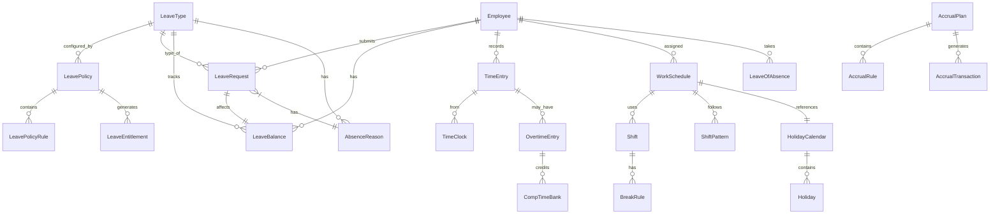

# Entity Catalog: Time & Absence Module

## Document Information

| Field | Value |
|-------|-------|
| **Module** | Time & Absence (TA) |
| **Entity Count** | 25 |
| **Last Updated** | 2026-01-30 |
| **Status** | Draft |

---

## Entity Summary

| # | Entity | Category | Stability | Frequency | PII | Priority |
|---|--------|----------|-----------|-----------|-----|----------|
| 1 | LeaveType | Leave Config | HIGH | RARE | No | P0 |
| 2 | LeavePolicy | Leave Config | MEDIUM | YEARLY | No | P0 |
| 3 | LeavePolicyRule | Leave Config | MEDIUM | YEARLY | No | P0 |
| 4 | LeaveRequest | Leave Transaction | HIGH | REALTIME | No | P0 |
| 5 | LeaveBalance | Leave Transaction | HIGH | REALTIME | No | P0 |
| 6 | LeaveEntitlement | Leave Config | MEDIUM | YEARLY | No | P0 |
| 7 | AccrualPlan | Accrual | MEDIUM | YEARLY | No | P0 |
| 8 | AccrualRule | Accrual | MEDIUM | YEARLY | No | P0 |
| 9 | AccrualTransaction | Accrual | HIGH | REALTIME | No | P0 |
| 10 | TimeEntry | Time Tracking | HIGH | REALTIME | No | P1 |
| 11 | TimeSheet | Time Tracking | HIGH | QUARTERLY | No | P1 |
| 12 | TimeClock | Time Tracking | HIGH | REALTIME | No | P1 |
| 13 | WorkSchedule | Scheduling | MEDIUM | YEARLY | No | P1 |
| 14 | Shift | Scheduling | MEDIUM | YEARLY | No | P1 |
| 15 | ShiftPattern | Scheduling | MEDIUM | YEARLY | No | P1 |
| 16 | HolidayCalendar | Calendar | MEDIUM | YEARLY | No | P1 |
| 17 | Holiday | Calendar | MEDIUM | YEARLY | No | P1 |
| 18 | AbsencePeriod | Configuration | MEDIUM | YEARLY | No | P1 |
| 19 | AbsenceReason | Configuration | HIGH | RARE | No | P0 |
| 20 | OvertimeEntry | Overtime | HIGH | REALTIME | No | P1 |
| 21 | OvertimeRule | Overtime | MEDIUM | YEARLY | No | P1 |
| 22 | CompTimeBank | Compensatory | MEDIUM | QUARTERLY | No | P2 |
| 23 | BreakRule | Configuration | MEDIUM | YEARLY | No | P1 |
| 24 | LeaveOfAbsence | Leave Transaction | HIGH | REALTIME | Yes | P0 |
| 25 | AttendanceRecord | Time Tracking | HIGH | REALTIME | No | P1 |

---

## Detailed Entity Specifications

### 1. LeaveType

```yaml
name: LeaveType
category: Leave Configuration
description: Định nghĩa các loại nghỉ phép trong hệ thống
stability: HIGH
change_frequency: RARE (<5 years)
pii_sensitivity: None
decision_ref: null
dependencies:
  upstream: []
  downstream: [LeavePolicy, LeaveRequest, LeaveBalance]
```

| Attribute | Type | Required | Description |
|-----------|------|----------|-------------|
| id | UUID | Yes | Unique identifier |
| code | String(20) | Yes | Mã loại nghỉ (e.g., ANNUAL, SICK, MATERNITY) |
| name | String(100) | Yes | Tên hiển thị |
| name_en | String(100) | No | Tên tiếng Anh |
| category | Enum | Yes | STATUTORY, COMPANY, UNPAID |
| unit_of_measure | Enum | Yes | DAYS, HOURS |
| allow_half_day | Boolean | Yes | Cho phép nửa ngày |
| allow_hourly | Boolean | Yes | Cho phép theo giờ |
| require_document | Boolean | No | Yêu cầu giấy tờ |
| min_duration | Number | No | Thời gian tối thiểu |
| max_duration | Number | No | Thời gian tối đa mỗi lần |
| color_code | String(7) | No | Màu hiển thị (hex) |
| icon | String(50) | No | Icon identifier |
| is_paid | Boolean | Yes | Nghỉ có lương |
| affects_attendance | Boolean | Yes | Ảnh hưởng chấm công |
| is_active | Boolean | Yes | Đang hoạt động |
| effective_date | Date | Yes | Ngày hiệu lực |
| end_date | Date | No | Ngày kết thúc |

**Standard Leave Types (Vietnam)**:
| Code | Name | Category | Paid | Statutory |
|------|------|----------|------|-----------|
| ANNUAL | Nghỉ phép năm | STATUTORY | Yes | Yes |
| SICK | Nghỉ ốm đau | STATUTORY | Yes (SI) | Yes |
| MATERNITY | Nghỉ thai sản | STATUTORY | Yes (SI) | Yes |
| PATERNITY | Nghỉ chế độ cha | STATUTORY | Yes | Yes |
| MARRIAGE_SELF | Nghỉ kết hôn (bản thân) | STATUTORY | Yes | Yes |
| MARRIAGE_CHILD | Nghỉ kết hôn (con) | STATUTORY | Yes | Yes |
| BEREAVEMENT | Nghỉ tang | STATUTORY | Yes | Yes |
| COMP_TIME | Nghỉ bù | COMPANY | Yes | No |
| UNPAID | Nghỉ không lương | UNPAID | No | No |
| WORK_INJURY | Nghỉ tai nạn lao động | STATUTORY | Yes (SI) | Yes |

---

### 2. LeavePolicy

```yaml
name: LeavePolicy
category: Leave Configuration
description: Chính sách nghỉ phép áp dụng cho nhóm nhân viên
stability: MEDIUM
change_frequency: YEARLY
pii_sensitivity: None
decision_ref: null
dependencies:
  upstream: [LeaveType, WorkLocation]
  downstream: [LeaveEntitlement, LeavePolicyRule]
```

| Attribute | Type | Required | Description |
|-----------|------|----------|-------------|
| id | UUID | Yes | Unique identifier |
| code | String(20) | Yes | Mã chính sách |
| name | String(100) | Yes | Tên chính sách |
| leave_type_id | UUID | Yes | FK to LeaveType |
| country_code | String(3) | No | Mã quốc gia (ISO) |
| location_id | UUID | No | FK to WorkLocation |
| employee_group | String(50) | No | Nhóm nhân viên áp dụng |
| effective_date | Date | Yes | Ngày hiệu lực |
| end_date | Date | No | Ngày kết thúc |
| is_active | Boolean | Yes | Đang hoạt động |
| description | Text | No | Mô tả chi tiết |

---

### 3. LeavePolicyRule

```yaml
name: LeavePolicyRule
category: Leave Configuration
description: Chi tiết quy tắc của một chính sách nghỉ phép
stability: MEDIUM
change_frequency: YEARLY
pii_sensitivity: None
decision_ref: ADR-001
dependencies:
  upstream: [LeavePolicy]
  downstream: [LeaveBalance, AccrualRule]
```

| Attribute | Type | Required | Description |
|-----------|------|----------|-------------|
| id | UUID | Yes | Unique identifier |
| policy_id | UUID | Yes | FK to LeavePolicy |
| rule_type | Enum | Yes | ENTITLEMENT, ACCRUAL, CARRYOVER, ELIGIBILITY |
| **Entitlement Rules** |
| base_entitlement | Decimal | No | Số ngày/giờ cơ bản |
| seniority_bonus_per_years | Integer | No | Số năm để +1 ngày (VN: 5) |
| seniority_bonus_amount | Decimal | No | Số ngày thưởng |
| max_entitlement | Decimal | No | Số ngày tối đa |
| **Accrual Rules** |
| accrual_frequency | Enum | No | MONTHLY, QUARTERLY, YEARLY, HIRE_DATE |
| accrual_timing | Enum | No | START, END, PRORATE |
| proration_method | Enum | No | CALENDAR, WORKING_DAYS |
| **Carryover Rules** |
| allow_carryover | Boolean | No | Cho phép chuyển sang năm sau |
| max_carryover_days | Decimal | No | Số ngày tối đa chuyển |
| carryover_expiry_months | Integer | No | Số tháng hết hạn |
| **Eligibility Rules** |
| waiting_period_days | Integer | No | Số ngày chờ (thử việc) |
| min_tenure_months | Integer | No | Số tháng tối thiểu |
| **Balance Rules** |
| allow_negative | Boolean | No | Cho phép âm |
| max_negative_days | Decimal | No | Số ngày âm tối đa |
| **General** |
| effective_date | Date | Yes | Ngày hiệu lực |
| end_date | Date | No | Ngày kết thúc |
| priority | Integer | No | Thứ tự ưu tiên |

---

### 4. LeaveRequest

```yaml
name: LeaveRequest
category: Leave Transaction
description: Đơn xin nghỉ phép của nhân viên
stability: HIGH
change_frequency: REALTIME
pii_sensitivity: None
decision_ref: null
dependencies:
  upstream: [Employee, LeaveType, LeaveBalance, ApprovalWorkflow]
  downstream: [LeaveBalance, Attendance, Payroll]
```

| Attribute | Type | Required | Description |
|-----------|------|----------|-------------|
| id | UUID | Yes | Unique identifier |
| request_number | String(20) | Yes | Số đơn (auto-generated) |
| employee_id | UUID | Yes | FK to Employee |
| leave_type_id | UUID | Yes | FK to LeaveType |
| start_date | Date | Yes | Ngày bắt đầu |
| end_date | Date | Yes | Ngày kết thúc |
| start_time | Time | No | Giờ bắt đầu (nếu hourly) |
| end_time | Time | No | Giờ kết thúc (nếu hourly) |
| duration_type | Enum | Yes | FULL_DAY, HALF_DAY_AM, HALF_DAY_PM, HOURS |
| total_days | Decimal | Yes | Tổng số ngày |
| total_hours | Decimal | No | Tổng số giờ |
| reason | Text | No | Lý do nghỉ |
| absence_reason_id | UUID | No | FK to AbsenceReason |
| status | Enum | Yes | DRAFT, SUBMITTED, PENDING, APPROVED, REJECTED, CANCELLED |
| submitted_date | DateTime | No | Ngày gửi |
| approved_date | DateTime | No | Ngày duyệt |
| approver_id | UUID | No | FK to Employee (approver) |
| approver_comments | Text | No | Ghi chú từ người duyệt |
| attachment_ids | Array[UUID] | No | FK to Attachments |
| balance_at_request | Decimal | No | Balance tại thời điểm gửi |
| is_emergency | Boolean | No | Đơn khẩn cấp |
| delegate_to_id | UUID | No | FK to Employee (delegate during absence) |
| created_by | UUID | Yes | Người tạo |
| created_at | DateTime | Yes | Thời gian tạo |
| updated_at | DateTime | No | Thời gian cập nhật |

**Status Flow**:
```
DRAFT → SUBMITTED → PENDING → APPROVED
                  ↘        ↗
                   REJECTED
                  
SUBMITTED/PENDING/APPROVED → CANCELLED
```

---

### 5. LeaveBalance

```yaml
name: LeaveBalance
category: Leave Transaction
description: Số dư nghỉ phép của nhân viên theo loại
stability: HIGH
change_frequency: REALTIME
pii_sensitivity: None
decision_ref: ADR-002
dependencies:
  upstream: [Employee, LeaveType, AccrualTransaction, LeaveRequest]
  downstream: [LeaveRequest, Reporting]
```

| Attribute | Type | Required | Description |
|-----------|------|----------|-------------|
| id | UUID | Yes | Unique identifier |
| employee_id | UUID | Yes | FK to Employee |
| leave_type_id | UUID | Yes | FK to LeaveType |
| period_year | Integer | Yes | Năm (e.g., 2026) |
| balance_type | Enum | Yes | CURRENT, CARRYOVER |
| **Amounts** |
| opening_balance | Decimal | Yes | Số dư đầu kỳ |
| earned | Decimal | Yes | Đã tích lũy |
| taken | Decimal | Yes | Đã sử dụng |
| pending | Decimal | Yes | Đang chờ duyệt |
| adjustment | Decimal | Yes | Điều chỉnh |
| expired | Decimal | Yes | Đã hết hạn |
| available_balance | Decimal | Yes | Số dư khả dụng (derived) |
| **Metadata** |
| last_accrual_date | Date | No | Ngày accrual gần nhất |
| next_accrual_date | Date | No | Ngày accrual tiếp theo |
| expiry_date | Date | No | Ngày hết hạn (carryover) |
| as_of_date | Date | Yes | Tính đến ngày |

**Balance Calculation**:
```
available_balance = opening_balance + earned - taken - pending + adjustment - expired
```

---

### 6. LeaveEntitlement

```yaml
name: LeaveEntitlement
category: Leave Configuration
description: Quyền nghỉ phép của nhân viên cụ thể
stability: MEDIUM
change_frequency: YEARLY
pii_sensitivity: None
decision_ref: null
dependencies:
  upstream: [Employee, LeaveType, LeavePolicy]
  downstream: [LeaveBalance, AccrualPlan]
```

| Attribute | Type | Required | Description |
|-----------|------|----------|-------------|
| id | UUID | Yes | Unique identifier |
| employee_id | UUID | Yes | FK to Employee |
| leave_type_id | UUID | Yes | FK to LeaveType |
| policy_id | UUID | No | FK to LeavePolicy |
| period_year | Integer | Yes | Năm áp dụng |
| entitlement_days | Decimal | Yes | Số ngày được quyền |
| carryover_days | Decimal | No | Số ngày chuyển từ năm trước |
| adjustment_days | Decimal | No | Số ngày điều chỉnh |
| total_entitlement | Decimal | Yes | Tổng quyền lợi |
| source | Enum | Yes | POLICY, MANUAL, IMPORT |
| effective_date | Date | Yes | Ngày hiệu lực |
| end_date | Date | No | Ngày kết thúc |
| notes | Text | No | Ghi chú |
| created_by | UUID | Yes | Người tạo |
| created_at | DateTime | Yes | Thời gian tạo |

---

### 7. AccrualPlan

```yaml
name: AccrualPlan
category: Accrual
description: Kế hoạch tích lũy nghỉ phép
stability: MEDIUM
change_frequency: YEARLY
pii_sensitivity: None
decision_ref: ADR-001
dependencies:
  upstream: [LeaveType]
  downstream: [AccrualRule, LeaveEntitlement]
```

| Attribute | Type | Required | Description |
|-----------|------|----------|-------------|
| id | UUID | Yes | Unique identifier |
| code | String(20) | Yes | Mã kế hoạch |
| name | String(100) | Yes | Tên kế hoạch |
| description | Text | No | Mô tả |
| leave_type_id | UUID | Yes | FK to LeaveType |
| accrual_type | Enum | Yes | ANNUAL, PERIODIC, HIRE_DATE |
| accrual_frequency | Enum | Yes | MONTHLY, QUARTERLY, SEMI_ANNUAL, ANNUAL |
| accrual_timing | Enum | Yes | PERIOD_START, PERIOD_END, MID_PERIOD |
| proration_method | Enum | No | CALENDAR_DAYS, WORKING_DAYS, NONE |
| is_active | Boolean | Yes | Đang hoạt động |
| effective_date | Date | Yes | Ngày hiệu lực |
| end_date | Date | No | Ngày kết thúc |

---

### 8. AccrualRule

```yaml
name: AccrualRule
category: Accrual
description: Chi tiết quy tắc tích lũy theo thâm niên
stability: MEDIUM
change_frequency: YEARLY
pii_sensitivity: None
decision_ref: null
dependencies:
  upstream: [AccrualPlan]
  downstream: [AccrualTransaction]
```

| Attribute | Type | Required | Description |
|-----------|------|----------|-------------|
| id | UUID | Yes | Unique identifier |
| accrual_plan_id | UUID | Yes | FK to AccrualPlan |
| tenure_from_months | Integer | Yes | Thâm niên từ (tháng) |
| tenure_to_months | Integer | No | Thâm niên đến (tháng) |
| annual_accrual_days | Decimal | Yes | Số ngày/năm |
| period_accrual_days | Decimal | No | Số ngày/kỳ |
| max_balance | Decimal | No | Số dư tối đa |
| priority | Integer | No | Thứ tự ưu tiên |

**Example - Vietnam Annual Leave**:
| From (months) | To (months) | Days/Year |
|--------------|-------------|-----------|
| 0 | 59 | 12 |
| 60 | 119 | 13 |
| 120 | 179 | 14 |
| 180 | 239 | 15 |
| 240 | null | 16 |

---

### 9. AccrualTransaction

```yaml
name: AccrualTransaction
category: Accrual
description: Giao dịch tích lũy nghỉ phép
stability: HIGH
change_frequency: REALTIME
pii_sensitivity: None
decision_ref: null
dependencies:
  upstream: [Employee, AccrualPlan, LeaveType]
  downstream: [LeaveBalance]
```

| Attribute | Type | Required | Description |
|-----------|------|----------|-------------|
| id | UUID | Yes | Unique identifier |
| employee_id | UUID | Yes | FK to Employee |
| leave_type_id | UUID | Yes | FK to LeaveType |
| accrual_plan_id | UUID | No | FK to AccrualPlan |
| transaction_type | Enum | Yes | ACCRUAL, ADJUSTMENT, CARRYOVER, EXPIRY, USED |
| transaction_date | Date | Yes | Ngày giao dịch |
| period_start | Date | No | Kỳ tính từ |
| period_end | Date | No | Kỳ tính đến |
| amount | Decimal | Yes | Số lượng (positive/negative) |
| balance_before | Decimal | No | Số dư trước |
| balance_after | Decimal | No | Số dư sau |
| reference_type | String(50) | No | Loại tham chiếu (LEAVE_REQUEST, MANUAL, etc.) |
| reference_id | UUID | No | ID tham chiếu |
| notes | Text | No | Ghi chú |
| created_by | UUID | Yes | Người tạo |
| created_at | DateTime | Yes | Thời gian tạo |

---

### 10. TimeEntry

```yaml
name: TimeEntry
category: Time Tracking
description: Bản ghi thời gian làm việc
stability: HIGH
change_frequency: REALTIME
pii_sensitivity: None
decision_ref: ADR-004
dependencies:
  upstream: [Employee, WorkSchedule, CostCenter, Project]
  downstream: [TimeSheet, Payroll, Attendance]
```

| Attribute | Type | Required | Description |
|-----------|------|----------|-------------|
| id | UUID | Yes | Unique identifier |
| employee_id | UUID | Yes | FK to Employee |
| entry_date | Date | Yes | Ngày làm việc |
| entry_type | Enum | Yes | REGULAR, OVERTIME, ABSENCE, HOLIDAY |
| source | Enum | Yes | CLOCK, MANUAL, IMPORT, SCHEDULE |
| **Time Data** |
| scheduled_start | Time | No | Giờ bắt đầu theo lịch |
| scheduled_end | Time | No | Giờ kết thúc theo lịch |
| actual_start | Time | No | Giờ bắt đầu thực tế |
| actual_end | Time | No | Giờ kết thúc thực tế |
| break_duration | Integer | No | Thời gian nghỉ (phút) |
| total_hours | Decimal | Yes | Tổng giờ làm |
| regular_hours | Decimal | No | Giờ thường |
| overtime_hours | Decimal | No | Giờ tăng ca |
| **Allocation** |
| cost_center_id | UUID | No | FK to CostCenter |
| project_id | UUID | No | FK to Project |
| task_id | UUID | No | FK to Task |
| **Status** |
| status | Enum | Yes | DRAFT, SUBMITTED, APPROVED, REJECTED |
| submitted_at | DateTime | No | Thời gian gửi |
| approved_by | UUID | No | Người duyệt |
| approved_at | DateTime | No | Thời gian duyệt |
| **Location** |
| clock_in_location | JSON | No | {lat, lng, address} |
| clock_out_location | JSON | No | {lat, lng, address} |
| device_id | String(100) | No | ID thiết bị chấm công |
| **Metadata** |
| notes | Text | No | Ghi chú |
| created_at | DateTime | Yes | Thời gian tạo |
| updated_at | DateTime | No | Thời gian cập nhật |

---

### 11. TimeSheet

```yaml
name: TimeSheet
category: Time Tracking
description: Bảng chấm công tổng hợp theo kỳ
stability: HIGH
change_frequency: QUARTERLY (per pay period)
pii_sensitivity: None
decision_ref: null
dependencies:
  upstream: [Employee, TimeEntry]
  downstream: [Payroll, Reporting]
```

| Attribute | Type | Required | Description |
|-----------|------|----------|-------------|
| id | UUID | Yes | Unique identifier |
| employee_id | UUID | Yes | FK to Employee |
| period_type | Enum | Yes | WEEKLY, BI_WEEKLY, MONTHLY |
| period_start | Date | Yes | Ngày bắt đầu kỳ |
| period_end | Date | Yes | Ngày kết thúc kỳ |
| **Summary** |
| total_scheduled_hours | Decimal | Yes | Tổng giờ theo lịch |
| total_worked_hours | Decimal | Yes | Tổng giờ làm thực tế |
| total_regular_hours | Decimal | Yes | Tổng giờ thường |
| total_overtime_hours | Decimal | Yes | Tổng giờ tăng ca |
| total_leave_hours | Decimal | Yes | Tổng giờ nghỉ |
| total_holiday_hours | Decimal | Yes | Tổng giờ lễ |
| **Status** |
| status | Enum | Yes | OPEN, SUBMITTED, APPROVED, LOCKED, PAID |
| submitted_at | DateTime | No | |
| approved_by | UUID | No | |
| approved_at | DateTime | No | |
| locked_at | DateTime | No | |
| **Audit** |
| version | Integer | Yes | Version number |
| created_at | DateTime | Yes | |
| updated_at | DateTime | No | |

---

### 12. TimeClock

```yaml
name: TimeClock
category: Time Tracking
description: Bản ghi chấm công (punch in/out)
stability: HIGH
change_frequency: REALTIME
pii_sensitivity: None
decision_ref: null
dependencies:
  upstream: [Employee, Shift]
  downstream: [TimeEntry, Attendance]
```

| Attribute | Type | Required | Description |
|-----------|------|----------|-------------|
| id | UUID | Yes | Unique identifier |
| employee_id | UUID | Yes | FK to Employee |
| punch_type | Enum | Yes | IN, OUT, BREAK_START, BREAK_END |
| punch_time | DateTime | Yes | Thời gian chấm |
| source | Enum | Yes | BIOMETRIC, MOBILE, WEB, KIOSK, MANUAL |
| device_id | String(100) | No | ID thiết bị |
| location | JSON | No | {lat, lng, accuracy, address} |
| is_within_geofence | Boolean | No | Trong vùng cho phép |
| photo_id | UUID | No | FK to photo (face recognition) |
| ip_address | String(45) | No | IP address (web punch) |
| is_adjusted | Boolean | No | Đã điều chỉnh |
| original_time | DateTime | No | Thời gian gốc (nếu adjusted) |
| adjustment_reason | Text | No | Lý do điều chỉnh |
| adjusted_by | UUID | No | Người điều chỉnh |
| created_at | DateTime | Yes | |

---

### 13. WorkSchedule

```yaml
name: WorkSchedule
category: Scheduling
description: Lịch làm việc của nhân viên
stability: MEDIUM
change_frequency: YEARLY (template), WEEKLY (assignment)
pii_sensitivity: None
decision_ref: null
dependencies:
  upstream: [Employee, Shift, HolidayCalendar]
  downstream: [TimeEntry, Attendance, LeaveRequest]
```

| Attribute | Type | Required | Description |
|-----------|------|----------|-------------|
| id | UUID | Yes | Unique identifier |
| employee_id | UUID | Yes | FK to Employee |
| schedule_type | Enum | Yes | FIXED, ROTATING, FLEXIBLE |
| effective_date | Date | Yes | Ngày bắt đầu áp dụng |
| end_date | Date | No | Ngày kết thúc |
| template_id | UUID | No | FK to ShiftPattern (nếu rotating) |
| holiday_calendar_id | UUID | No | FK to HolidayCalendar |
| work_days | Array[Integer] | Yes | Các ngày làm việc (0=Sun, 1=Mon...) |
| **Weekly Hours** |
| standard_hours_per_week | Decimal | Yes | Giờ chuẩn/tuần |
| min_hours_per_week | Decimal | No | Giờ tối thiểu |
| max_hours_per_week | Decimal | No | Giờ tối đa |
| is_active | Boolean | Yes | Đang áp dụng |
| created_at | DateTime | Yes | |
| updated_at | DateTime | No | |

---

### 14. Shift

```yaml
name: Shift
category: Scheduling
description: Định nghĩa ca làm việc
stability: MEDIUM
change_frequency: YEARLY
pii_sensitivity: None
decision_ref: null
dependencies:
  upstream: [WorkLocation]
  downstream: [WorkSchedule, ShiftPattern, TimeEntry]
```

| Attribute | Type | Required | Description |
|-----------|------|----------|-------------|
| id | UUID | Yes | Unique identifier |
| code | String(20) | Yes | Mã ca |
| name | String(100) | Yes | Tên ca |
| description | Text | No | Mô tả |
| location_id | UUID | No | FK to WorkLocation |
| start_time | Time | Yes | Giờ bắt đầu |
| end_time | Time | Yes | Giờ kết thúc |
| is_overnight | Boolean | No | Ca qua đêm |
| duration_hours | Decimal | Yes | Thời lượng (giờ) |
| **Breaks** |
| break_duration_minutes | Integer | No | Thời gian nghỉ (phút) |
| break_start_time | Time | No | Giờ bắt đầu nghỉ |
| break_end_time | Time | No | Giờ kết thúc nghỉ |
| is_paid_break | Boolean | No | Nghỉ có lương |
| **Tolerance** |
| early_clock_in_minutes | Integer | No | Cho phép vào sớm (phút) |
| late_clock_in_minutes | Integer | No | Cho phép vào muộn (phút) |
| early_clock_out_minutes | Integer | No | Cho phép về sớm (phút) |
| late_clock_out_minutes | Integer | No | Cho phép về muộn (phút) |
| **Status** |
| color_code | String(7) | No | Màu hiển thị |
| is_active | Boolean | Yes | Đang hoạt động |
| created_at | DateTime | Yes | |

**Standard Shifts (Vietnam)**:
| Code | Name | Start | End | Hours |
|------|------|-------|-----|-------|
| DAY | Ca ngày | 08:00 | 17:00 | 8 |
| MORNING | Ca sáng | 06:00 | 14:00 | 8 |
| AFTERNOON | Ca chiều | 14:00 | 22:00 | 8 |
| NIGHT | Ca đêm | 22:00 | 06:00 | 8 |
| HALF_AM | Nửa ngày sáng | 08:00 | 12:00 | 4 |
| HALF_PM | Nửa ngày chiều | 13:00 | 17:00 | 4 |

---

### 15. ShiftPattern

```yaml
name: ShiftPattern
category: Scheduling
description: Mẫu lịch ca luân phiên
stability: MEDIUM
change_frequency: YEARLY
pii_sensitivity: None
decision_ref: null
dependencies:
  upstream: [Shift]
  downstream: [WorkSchedule]
```

| Attribute | Type | Required | Description |
|-----------|------|----------|-------------|
| id | UUID | Yes | Unique identifier |
| code | String(20) | Yes | Mã mẫu |
| name | String(100) | Yes | Tên mẫu |
| description | Text | No | Mô tả |
| rotation_days | Integer | Yes | Số ngày chu kỳ |
| pattern | JSON | Yes | Array of {day: 1, shift_id: UUID, is_off: boolean} |
| is_active | Boolean | Yes | Đang hoạt động |
| created_at | DateTime | Yes | |

---

### 16. HolidayCalendar

```yaml
name: HolidayCalendar
category: Calendar
description: Lịch ngày lễ theo quốc gia/vùng
stability: MEDIUM
change_frequency: YEARLY
pii_sensitivity: None
decision_ref: null
dependencies:
  upstream: [Country, Region]
  downstream: [WorkSchedule, Holiday, LeaveBalance]
```

| Attribute | Type | Required | Description |
|-----------|------|----------|-------------|
| id | UUID | Yes | Unique identifier |
| code | String(20) | Yes | Mã lịch |
| name | String(100) | Yes | Tên lịch |
| year | Integer | Yes | Năm |
| country_code | String(3) | Yes | Mã quốc gia |
| region_code | String(10) | No | Mã vùng |
| is_default | Boolean | No | Lịch mặc định |
| is_active | Boolean | Yes | Đang hoạt động |
| created_at | DateTime | Yes | |

---

### 17. Holiday

```yaml
name: Holiday
category: Calendar
description: Chi tiết ngày lễ
stability: MEDIUM
change_frequency: YEARLY
pii_sensitivity: None
decision_ref: null
dependencies:
  upstream: [HolidayCalendar]
  downstream: [TimeEntry, WorkSchedule]
```

| Attribute | Type | Required | Description |
|-----------|------|----------|-------------|
| id | UUID | Yes | Unique identifier |
| calendar_id | UUID | Yes | FK to HolidayCalendar |
| date | Date | Yes | Ngày lễ |
| name | String(100) | Yes | Tên ngày lễ |
| name_en | String(100) | No | Tên tiếng Anh |
| holiday_type | Enum | Yes | STATUTORY, COMPANY, OBSERVANCE |
| is_paid | Boolean | Yes | Ngày nghỉ có lương |
| substitute_date | Date | No | Ngày nghỉ bù (nếu trùng weekend) |
| notes | Text | No | Ghi chú |

**Vietnam Holidays 2026**:
| Date | Name | Type | Days |
|------|------|------|------|
| 2026-01-01 | Tết Dương lịch | STATUTORY | 1 |
| 2026-02-15 to 02-19 | Tết Nguyên đán | STATUTORY | 5 |
| 2026-04-26 | Giỗ Tổ Hùng Vương | STATUTORY | 1 |
| 2026-04-30 | Ngày Giải phóng | STATUTORY | 1 |
| 2026-05-01 | Quốc tế Lao động | STATUTORY | 1 |
| 2026-09-02 to 09-03 | Quốc khánh | STATUTORY | 2 |

---

### 18. AbsencePeriod

```yaml
name: AbsencePeriod
category: Configuration
description: Định nghĩa kỳ tính toán nghỉ phép
stability: MEDIUM
change_frequency: YEARLY
pii_sensitivity: None
decision_ref: null
dependencies:
  upstream: []
  downstream: [LeaveBalance, AccrualTransaction]
```

| Attribute | Type | Required | Description |
|-----------|------|----------|-------------|
| id | UUID | Yes | Unique identifier |
| code | String(20) | Yes | Mã kỳ |
| name | String(100) | Yes | Tên kỳ |
| period_type | Enum | Yes | CALENDAR_YEAR, FISCAL_YEAR, HIRE_DATE |
| start_month | Integer | Yes | Tháng bắt đầu (1-12) |
| start_day | Integer | Yes | Ngày bắt đầu (1-31) |
| is_active | Boolean | Yes | Đang hoạt động |
| created_at | DateTime | Yes | |

---

### 19. AbsenceReason

```yaml
name: AbsenceReason
category: Configuration
description: Lý do vắng mặt chi tiết
stability: HIGH
change_frequency: RARE
pii_sensitivity: None
decision_ref: null
dependencies:
  upstream: [LeaveType]
  downstream: [LeaveRequest, TimeEntry]
```

| Attribute | Type | Required | Description |
|-----------|------|----------|-------------|
| id | UUID | Yes | Unique identifier |
| leave_type_id | UUID | Yes | FK to LeaveType |
| code | String(20) | Yes | Mã lý do |
| name | String(100) | Yes | Tên lý do |
| require_document | Boolean | No | Yêu cầu giấy tờ |
| document_type | String(100) | No | Loại giấy tờ cần |
| is_active | Boolean | Yes | Đang hoạt động |
| sort_order | Integer | No | Thứ tự hiển thị |
| created_at | DateTime | Yes | |

---

### 20. OvertimeEntry

```yaml
name: OvertimeEntry
category: Overtime
description: Bản ghi giờ làm thêm
stability: HIGH
change_frequency: REALTIME
pii_sensitivity: None
decision_ref: null
dependencies:
  upstream: [Employee, TimeEntry, OvertimeRule]
  downstream: [Payroll, CompTimeBank]
```

| Attribute | Type | Required | Description |
|-----------|------|----------|-------------|
| id | UUID | Yes | Unique identifier |
| employee_id | UUID | Yes | FK to Employee |
| time_entry_id | UUID | No | FK to TimeEntry |
| overtime_date | Date | Yes | Ngày làm thêm |
| overtime_type | Enum | Yes | WEEKDAY, WEEKEND, HOLIDAY, NIGHT |
| start_time | Time | Yes | Giờ bắt đầu |
| end_time | Time | Yes | Giờ kết thúc |
| duration_hours | Decimal | Yes | Số giờ |
| multiplier | Decimal | Yes | Hệ số lương (e.g., 1.5, 2.0, 3.0) |
| reason | Text | No | Lý do làm thêm |
| status | Enum | Yes | PENDING, APPROVED, REJECTED |
| approved_by | UUID | No | Người duyệt |
| approved_at | DateTime | No | Thời gian duyệt |
| payout_type | Enum | Yes | MONEY, COMP_TIME, BOTH |
| created_at | DateTime | Yes | |

**Vietnam Overtime Multipliers**:
| Type | Multiplier | Reference |
|------|------------|-----------|
| Weekday OT | 150% | Điều 98 BLLĐ |
| Weekend OT | 200% | Điều 98 BLLĐ |
| Holiday OT | 300% | Điều 98 BLLĐ |
| Night shift (22:00-06:00) | +30% | Điều 98 BLLĐ |

---

### 21. OvertimeRule

```yaml
name: OvertimeRule
category: Overtime
description: Quy tắc tính giờ làm thêm
stability: MEDIUM
change_frequency: YEARLY
pii_sensitivity: None
decision_ref: null
dependencies:
  upstream: [WorkSchedule, LeavePolicy]
  downstream: [OvertimeEntry]
```

| Attribute | Type | Required | Description |
|-----------|------|----------|-------------|
| id | UUID | Yes | Unique identifier |
| code | String(20) | Yes | Mã quy tắc |
| name | String(100) | Yes | Tên quy tắc |
| **Thresholds** |
| daily_ot_threshold_hours | Decimal | Yes | Ngưỡng OT ngày (VN: 8) |
| weekly_ot_threshold_hours | Decimal | Yes | Ngưỡng OT tuần (VN: 40) |
| max_daily_ot_hours | Decimal | No | OT tối đa/ngày (VN: 4) |
| max_monthly_ot_hours | Decimal | No | OT tối đa/tháng (VN: 40) |
| max_yearly_ot_hours | Decimal | No | OT tối đa/năm (VN: 200-300) |
| **Multipliers** |
| weekday_multiplier | Decimal | Yes | Hệ số ngày thường |
| weekend_multiplier | Decimal | Yes | Hệ số cuối tuần |
| holiday_multiplier | Decimal | Yes | Hệ số ngày lễ |
| night_shift_bonus | Decimal | No | Phụ cấp ca đêm |
| **Status** |
| is_active | Boolean | Yes | Đang hoạt động |
| effective_date | Date | Yes | Ngày hiệu lực |
| created_at | DateTime | Yes | |

---

### 22. CompTimeBank

```yaml
name: CompTimeBank
category: Compensatory
description: Ngân hàng giờ nghỉ bù
stability: MEDIUM
change_frequency: QUARTERLY
pii_sensitivity: None
decision_ref: null
dependencies:
  upstream: [Employee, OvertimeEntry]
  downstream: [LeaveBalance, Payroll]
```

| Attribute | Type | Required | Description |
|-----------|------|----------|-------------|
| id | UUID | Yes | Unique identifier |
| employee_id | UUID | Yes | FK to Employee |
| period_year | Integer | Yes | Năm |
| **Balance** |
| opening_balance | Decimal | Yes | Số dư đầu kỳ |
| earned | Decimal | Yes | Đã tích lũy từ OT |
| taken | Decimal | Yes | Đã sử dụng |
| expired | Decimal | Yes | Đã hết hạn |
| paid_out | Decimal | Yes | Đã thanh toán tiền |
| current_balance | Decimal | Yes | Số dư hiện tại |
| **Policy** |
| max_balance | Decimal | No | Số dư tối đa |
| expiry_date | Date | No | Ngày hết hạn |
| as_of_date | Date | Yes | Tính đến ngày |

---

### 23. BreakRule

```yaml
name: BreakRule
category: Configuration
description: Quy tắc nghỉ giữa ca
stability: MEDIUM
change_frequency: YEARLY
pii_sensitivity: None
decision_ref: null
dependencies:
  upstream: [Shift]
  downstream: [TimeEntry]
```

| Attribute | Type | Required | Description |
|-----------|------|----------|-------------|
| id | UUID | Yes | Unique identifier |
| shift_id | UUID | No | FK to Shift (null = all shifts) |
| work_hours_threshold | Decimal | Yes | Sau bao nhiêu giờ |
| break_duration_minutes | Integer | Yes | Thời gian nghỉ (phút) |
| is_paid | Boolean | Yes | Nghỉ có lương |
| is_mandatory | Boolean | Yes | Bắt buộc |
| allow_split | Boolean | No | Cho phép chia nhỏ |
| is_active | Boolean | Yes | Đang hoạt động |
| created_at | DateTime | Yes | |

---

### 24. LeaveOfAbsence

```yaml
name: LeaveOfAbsence
category: Leave Transaction
description: Nghỉ dài hạn (thai sản, bệnh dài ngày, etc.)
stability: HIGH
change_frequency: REALTIME
pii_sensitivity: HIGH (medical records)
decision_ref: null
dependencies:
  upstream: [Employee, LeaveType, LeaveRequest]
  downstream: [Payroll, Benefits, SocialInsurance]
```

| Attribute | Type | Required | Description |
|-----------|------|----------|-------------|
| id | UUID | Yes | Unique identifier |
| employee_id | UUID | Yes | FK to Employee |
| leave_type_id | UUID | Yes | FK to LeaveType |
| leave_request_id | UUID | No | FK to LeaveRequest |
| loa_number | String(20) | Yes | Số hồ sơ |
| **Dates** |
| start_date | Date | Yes | Ngày bắt đầu |
| expected_end_date | Date | Yes | Ngày dự kiến kết thúc |
| actual_end_date | Date | No | Ngày thực tế kết thúc |
| return_to_work_date | Date | No | Ngày quay lại làm việc |
| **Medical Info** (PII) |
| medical_condition | Text | No | Tình trạng sức khỏe |
| physician_name | String(100) | No | Tên bác sĩ |
| medical_facility | String(200) | No | Cơ sở y tế |
| certification_date | Date | No | Ngày chứng nhận |
| certification_document_id | UUID | No | FK to Document |
| **Status** |
| status | Enum | Yes | REQUESTED, APPROVED, ACTIVE, EXTENDED, COMPLETED, CANCELLED |
| approval_date | DateTime | No | |
| approved_by | UUID | No | |
| **Integration** |
| si_claim_number | String(50) | No | Số hồ sơ BHXH |
| si_payment_status | Enum | No | PENDING, APPROVED, PAID |
| **Notes** |
| notes | Text | No | Ghi chú |
| return_notes | Text | No | Ghi chú khi quay lại |
| created_at | DateTime | Yes | |
| updated_at | DateTime | No | |

---

### 25. AttendanceRecord

```yaml
name: AttendanceRecord
category: Time Tracking
description: Bản ghi chấm công tổng hợp theo ngày
stability: HIGH
change_frequency: REALTIME
pii_sensitivity: None
decision_ref: null
dependencies:
  upstream: [Employee, TimeClock, TimeEntry, WorkSchedule]
  downstream: [TimeSheet, Reporting]
```

| Attribute | Type | Required | Description |
|-----------|------|----------|-------------|
| id | UUID | Yes | Unique identifier |
| employee_id | UUID | Yes | FK to Employee |
| attendance_date | Date | Yes | Ngày |
| **Scheduled** |
| scheduled_shift_id | UUID | No | FK to Shift |
| scheduled_start | Time | No | Giờ vào theo lịch |
| scheduled_end | Time | No | Giờ ra theo lịch |
| scheduled_hours | Decimal | No | Giờ làm theo lịch |
| **Actual** |
| actual_start | Time | No | Giờ vào thực tế |
| actual_end | Time | No | Giờ ra thực tế |
| actual_hours | Decimal | No | Giờ làm thực tế |
| **Variance** |
| late_minutes | Integer | No | Số phút đi muộn |
| early_leave_minutes | Integer | No | Số phút về sớm |
| is_late | Boolean | No | Đi muộn |
| is_early_leave | Boolean | No | Về sớm |
| **Status** |
| attendance_status | Enum | Yes | PRESENT, ABSENT, LEAVE, HOLIDAY, WEEKEND, PARTIAL |
| leave_request_id | UUID | No | FK to LeaveRequest (nếu nghỉ) |
| exception_type | Enum | No | LATE, EARLY_LEAVE, MISSING_PUNCH, OVERTIME |
| exception_resolved | Boolean | No | Ngoại lệ đã xử lý |
| **Notes** |
| notes | Text | No | Ghi chú |
| created_at | DateTime | Yes | |
| updated_at | DateTime | No | |

---

## Entity Relationship Diagram



---

*Generated by domain-research skill as part of Research-Driven Workflow.*
