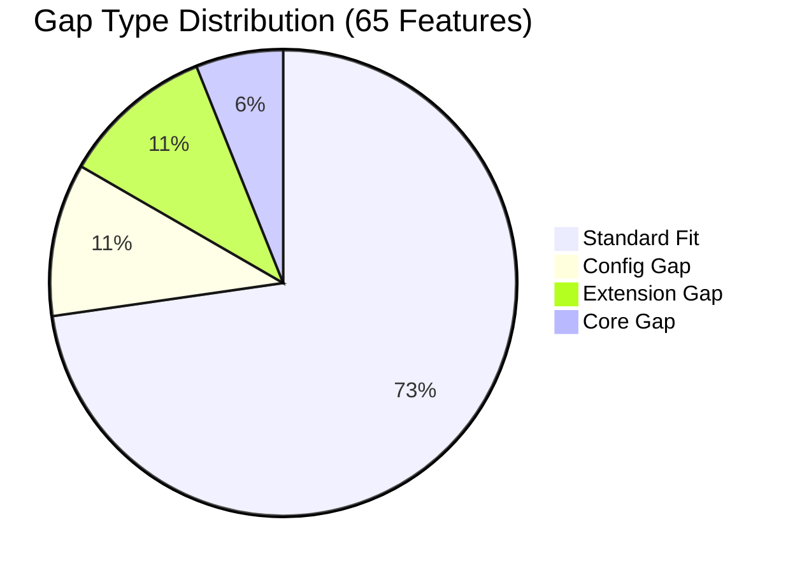
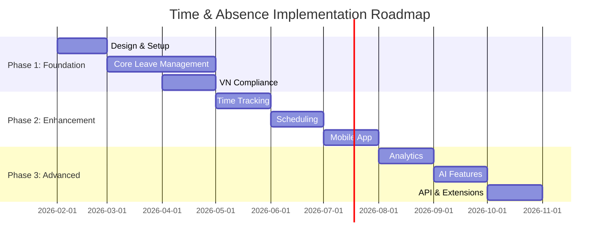

# Solution Blueprint: Time & Absence Module

## Document Information

| Field | Value |
|-------|-------|
| **Module** | Time & Absence (TA) |
| **Product** | xTalent HCM |
| **Version** | 1.0 |
| **Date** | 2026-01-30 |
| **Status** | Draft |
| **Approver** | Pending ARB Review |

---

## 1. Executive Summary

### 1.1 Objective

Xây dựng module **Time & Absence** cho xTalent HCM platform, cung cấp giải pháp quản lý thời gian làm việc và nghỉ phép toàn diện cho doanh nghiệp Việt Nam.

### 1.2 Key Constraints

| Constraint | Impact | Mitigation |
|------------|--------|------------|
| **Vietnam Labor Law 2019** | Mandatory compliance | Pre-built VN policies |
| **Social Insurance integration** | Complex external system | API + manual fallback |
| **Payroll dependency** | Critical integration | Early integration testing |
| **Timeline: 10 months** | Feature prioritization | 3-phase approach |

### 1.3 Success Criteria

| Metric | Target | Measurement |
|--------|--------|-------------|
| Feature completion | 100% of P0 | Phase 1 exit |
| VN Law compliance | 100% | Legal review |
| User satisfaction | >4.0/5.0 | Survey |
| System uptime | 99.5% | Monitoring |

---

## 2. Context Diagram

```
┌─────────────────────────────────────────────────────────────────────────────┐
│                            xTalent HCM Platform                              │
├─────────────────────────────────────────────────────────────────────────────┤
│                                                                              │
│    ┌───────────────┐      ┌─────────────────────┐      ┌───────────────┐   │
│    │   Core HR     │◄────►│   Time & Absence    │◄────►│    Payroll    │   │
│    │   Module      │      │       Module        │      │    Module     │   │
│    │               │      │                     │      │               │   │
│    │ • Employee    │      │ • Time Tracking     │      │ • Salary Calc │   │
│    │ • Org Struct  │      │ • Leave Management  │      │ • Deductions  │   │
│    │ • Position    │      │ • Scheduling        │      │ • Tax         │   │
│    └───────────────┘      │ • Compliance        │      └───────────────┘   │
│            │              │ • Reporting         │              ▲            │
│            │              └──────────┬──────────┘              │            │
│            │                         │                         │            │
│            ▼                         ▼                         │            │
│    ┌───────────────┐      ┌─────────────────────┐              │            │
│    │   Benefits    │      │   Analytics &       │              │            │
│    │   Module      │      │   Reporting         │──────────────┘            │
│    │               │      │                     │                           │
│    │ • Insurance   │      │ • Dashboards        │                           │
│    │ • Entitlements│      │ • Ad-hoc Reports    │                           │
│    └───────────────┘      └─────────────────────┘                           │
│                                                                              │
└─────────────────────────────────────────────────────────────────────────────┘
                                       │
                                       │ External Integrations
                                       ▼
┌─────────────────────────────────────────────────────────────────────────────┐
│                            External Systems                                  │
├──────────────┬──────────────┬──────────────┬──────────────┬────────────────┤
│  Biometric   │   Mobile     │   Social     │   Calendar   │   Messaging    │
│  Devices     │   Apps       │   Insurance  │   Services   │   Platforms    │
├──────────────┼──────────────┼──────────────┼──────────────┼────────────────┤
│ • ZKTeco     │ • iOS App    │ • BHXH VN    │ • Google Cal │ • Slack        │
│ • Suprema    │ • Android    │              │ • Outlook    │ • Teams        │
│ • HID        │              │              │              │ • Zalo         │
└──────────────┴──────────────┴──────────────┴──────────────┴────────────────┘
```

---

## 3. Fit-Gap Matrix

### 3.1 Summary by Category

| Category | Standard Fit | Config Gap | Extension Gap | Core Gap |
|----------|-------------|------------|---------------|----------|
| Time Tracking | 5 | 1 | 2 | 0 |
| Absence Management | 10 | 1 | 1 | 0 |
| Leave Balance & Accrual | 6 | 1 | 1 | 0 |
| Leave Policy & Compliance | 3 | 1 | 0 | **2** |
| Scheduling | 5 | 1 | 1 | 0 |
| Calendar & Holiday | 3 | 0 | 0 | **1** |
| Overtime | 4 | 0 | 0 | 0 |
| Reporting | 5 | 1 | 0 | 0 |
| Self-Service | 4 | 0 | 1 | 0 |
| Integration | 3 | 0 | 1 | **1** |
| **TOTAL** | **48** | **7** | **7** | **4** |

### 3.2 Core Gaps Detail

| ID | Gap | Issue | Resolution | Authority |
|----|-----|-------|------------|-----------|
| LP-04 | VN Labor Law Compliance | No standard solution covers VN law | Build custom rules engine | ARB |
| LP-05 | Social Insurance Integration | External system, no API standard | Build adapter pattern | ARB |
| CH-02 | Regional Holiday (VN) | Unique holiday rules (Tết lunar) | Build VN calendar | ARB |
| IN-01 | Payroll Integration | Core revenue dependency | Build robust integration | ARB |

**⚠️ Core Gap Resolution Strategy:**
- All 4 Core Gaps are MANDATORY for Vietnam market
- Cannot defer to later phases
- ARB approval is formality - must be built

### 3.3 Gap Type Distribution



---

## 4. Solution Architecture

### 4.1 High-Level Architecture

```
┌──────────────────────────────────────────────────────────────────────────┐
│                         Presentation Layer                                │
├────────────────────┬────────────────────┬────────────────────────────────┤
│   Web Application  │    Mobile App      │     Manager Portal             │
│   (Employee ESS)   │  (iOS/Android)     │   (Approval Dashboard)         │
└─────────┬──────────┴─────────┬──────────┴───────────────┬────────────────┘
          │                    │                          │
          ▼                    ▼                          ▼
┌──────────────────────────────────────────────────────────────────────────┐
│                          API Gateway Layer                                │
│              REST APIs | GraphQL | WebSockets (notifications)             │
└──────────────────────────────────────────────────────────────────────────┘
          │
          ▼
┌──────────────────────────────────────────────────────────────────────────┐
│                         Business Logic Layer                              │
├──────────────────────────────────────────────────────────────────────────┤
│                                                                           │
│  ┌─────────────┐  ┌─────────────┐  ┌─────────────┐  ┌─────────────┐     │
│  │   Leave     │  │    Time     │  │  Scheduling │  │  Compliance │     │
│  │   Engine    │  │   Engine    │  │   Engine    │  │   Engine    │     │
│  │             │  │             │  │             │  │             │     │
│  │ • Request   │  │ • Clock     │  │ • Shifts    │  │ • VN Law    │     │
│  │ • Balance   │  │ • Entry     │  │ • Patterns  │  │ • SI Rules  │     │
│  │ • Accrual   │  │ • Timesheet │  │ • Calendar  │  │ • Audit     │     │
│  └─────────────┘  └─────────────┘  └─────────────┘  └─────────────┘     │
│                                                                           │
│  ┌─────────────────────────────────────────────────────────────────┐     │
│  │                     Workflow Engine                              │     │
│  │         (Approval routing, escalation, notifications)           │     │
│  └─────────────────────────────────────────────────────────────────┘     │
│                                                                           │
│  ┌─────────────────────────────────────────────────────────────────┐     │
│  │                     Rules Engine                                 │     │
│  │         (Policy rules, eligibility, validations)                │     │
│  └─────────────────────────────────────────────────────────────────┘     │
│                                                                           │
└──────────────────────────────────────────────────────────────────────────┘
          │
          ▼
┌──────────────────────────────────────────────────────────────────────────┐
│                       Integration Layer                                   │
├──────────────┬───────────────┬───────────────┬───────────────────────────┤
│ Core HR      │ Payroll       │ Biometric     │ External                  │
│ Adapter      │ Adapter       │ Adapter       │ Services                  │
│              │               │               │                           │
│ (Internal)   │ (Internal)    │ (ZKTeco,etc)  │ (SI, Calendar, Slack)     │
└──────────────┴───────────────┴───────────────┴───────────────────────────┘
          │
          ▼
┌──────────────────────────────────────────────────────────────────────────┐
│                          Data Layer                                       │
├──────────────────────────────────────────────────────────────────────────┤
│                                                                           │
│  ┌─────────────────────────┐  ┌─────────────────────────┐               │
│  │   PostgreSQL            │  │   Redis                 │               │
│  │   (Primary Database)    │  │   (Cache & Sessions)    │               │
│  │                         │  │                         │               │
│  │   • Transactions        │  │   • Balance cache       │               │
│  │   • Configurations      │  │   • Session state       │               │
│  │   • Audit logs          │  │   • Rate limiting       │               │
│  └─────────────────────────┘  └─────────────────────────┘               │
│                                                                           │
│  ┌─────────────────────────┐  ┌─────────────────────────┐               │
│  │   Elasticsearch         │  │   S3/Object Storage     │               │
│  │   (Search & Analytics)  │  │   (Documents)           │               │
│  │                         │  │                         │               │
│  │   • Full-text search    │  │   • Attachments         │               │
│  │   • Audit log queries   │  │   • Reports             │               │
│  └─────────────────────────┘  └─────────────────────────┘               │
│                                                                           │
└──────────────────────────────────────────────────────────────────────────┘
```

### 4.2 Key Design Decisions

| Decision | Choice | Rationale |
|----------|--------|-----------|
| **Balance calculation** | Derived (not stored) | Audit trail, accuracy |
| **Accrual timing** | Period start | Oracle best practice |
| **Policy engine** | Rule-based (config-driven) | Flexibility for VN law changes |
| **Time granularity** | 15-minute intervals | Industry standard |
| **Integration pattern** | Adapter pattern | Decouple from external systems |

### 4.3 Integration Patterns

| Integration | Pattern | Rationale |
|-------------|---------|-----------|
| Core HR | Shared Database / Event | Same platform, real-time needed |
| Payroll | Event-Driven + API | Batch processing, audit |
| Biometric Devices | Anti-Corruption Layer (ACL) | Many vendors, unstable APIs |
| Social Insurance | API + Manual Fallback | External, may be unavailable |

---

## 5. Implementation Roadmap

### 5.1 Phase Overview



### 5.2 Phase 1: Foundation (Month 1-4)

**Scope**: Core Leave Management + VN Compliance

**Features** (22 total):
- Absence Management: AM-01 to AM-10
- Leave Balance: LA-01 to LA-06, LA-08
- Leave Policy: LP-01 to LP-05

**Deliverables**:
| Deliverable | Description | Owner |
|-------------|-------------|-------|
| Leave Request UI | Employee self-service | Frontend Team |
| Approval Workflow | Multi-level approval | Backend Team |
| Accrual Engine | Automated calculations | Backend Team |
| VN Policies | Pre-built Vietnam rules | Product Team |
| Core HR Integration | Employee data sync | Integration Team |

**Cost of Delay**: $100k+/month
- Cannot sell in VN market without compliance
- Payroll blocked without T&A input

**Exit Criteria**:
- [ ] All P0 features functional (22/22)
- [ ] VN Labor Law compliance verified by legal
- [ ] Core HR integration tested
- [ ] UAT sign-off from 3 pilot customers
- [ ] No Severity 1 bugs open
- [ ] Performance: <2s response for 95th percentile

### 5.3 Phase 2: Enhancement (Month 5-7)

**Scope**: Time Tracking + Scheduling + Mobile

**Features** (24 total):
- Time Tracking: TT-01 to TT-06
- Scheduling: SC-01 to SC-05, SC-07
- Calendar: CH-01 to CH-04
- Overtime: OT-01 to OT-04
- Others: LP-06, IN-01, IN-02, LA-07

**Deliverables**:
| Deliverable | Description | Owner |
|-------------|-------------|-------|
| Time Clock	| Web & mobile punch | Frontend + Mobile |
| Biometric Integration | Device adapters | Integration Team |
| Shift Management | Schedule builder | Backend Team |
| Mobile App | iOS/Android release | Mobile Team |
| Payroll Integration | Time data export | Integration Team |

**Cost of Delay**: $30k/month
- Lost productivity without time tracking
- Customer churn risk

**Exit Criteria**:
- [ ] All P1 features functional (24/24)
- [ ] Mobile app published to stores
- [ ] Biometric integration with 2+ vendors
- [ ] Performance benchmarks met
- [ ] No Severity 1/2 bugs open

### 5.4 Phase 3: Advanced (Month 8-10)

**Scope**: Analytics + AI + Extensions

**Features** (19 total):
- Advanced Time: TT-07, TT-08
- Advanced Absence: AM-11, AM-12
- Scheduling: SC-06
- Reporting: RA-01 to RA-06
- Self-Service: SS-01 to SS-05
- Integration: IN-03 to IN-05

**Deliverables**:
| Deliverable | Description | Owner |
|-------------|-------------|-------|
| Analytics Dashboard | Real-time metrics | Analytics Team |
| AI Approval | Recommendation engine | ML Team |
| Vacation Bidding | Allocation system | Backend Team |
| API Portal | Developer documentation | Platform Team |
| Messaging Integration | Slack/Teams | Integration Team |

**Cost of Delay**: $10k/month
- Nice-to-have features
- Competitive differentiation

**Exit Criteria**:
- [ ] All P2 features functional (19/19)
- [ ] AI recommendation accuracy >85%
- [ ] API documentation complete
- [ ] Zero open bugs (all severities)

---

## 6. Risk Register

### 6.1 Risk Matrix

| ID | Risk | Probability | Impact | Score | Mitigation | Owner |
|----|------|-------------|--------|-------|------------|-------|
| R1 | VN Labor Law change | LOW | HIGH | MEDIUM | Config-driven rules engine | Product |
| R2 | SI API unavailable | MEDIUM | MEDIUM | MEDIUM | Manual entry fallback | Integration |
| R3 | Biometric vendor variety | HIGH | LOW | MEDIUM | Standard adapter pattern | Integration |
| R4 | Payroll integration delay | MEDIUM | HIGH | HIGH | Early integration testing | Integration |
| R5 | User adoption resistance | MEDIUM | MEDIUM | MEDIUM | UX focus, training program | Product |
| R6 | Performance at scale | MEDIUM | MEDIUM | MEDIUM | Caching, query optimization | Platform |
| R7 | Mobile app rejection | LOW | MEDIUM | LOW | Follow app store guidelines | Mobile |
| R8 | Scope creep | HIGH | MEDIUM | HIGH | Strict change control | PM |

### 6.2 Risk Response Plan

**R4: Payroll Integration Delay** (Highest Risk)

| Aspect | Plan |
|--------|------|
| **Detection** | Weekly integration status check |
| **Trigger** | >1 week behind milestone |
| **Response** | Add integration resources, daily standups |
| **Escalation** | PM → Director after 2 weeks delay |
| **Fallback** | Manual data export as interim |

---

## 7. Resource Requirements

### 7.1 Team Structure

| Role | Phase 1 | Phase 2 | Phase 3 | Total FTE |
|------|---------|---------|---------|-----------|
| Product Manager | 1 | 1 | 1 | 1 |
| Tech Lead | 1 | 1 | 1 | 1 |
| Backend Developer | 3 | 3 | 2 | 3 |
| Frontend Developer | 2 | 2 | 2 | 2 |
| Mobile Developer | 0 | 2 | 1 | 2 |
| QA Engineer | 2 | 2 | 2 | 2 |
| DevOps | 0.5 | 0.5 | 0.5 | 0.5 |
| **Total** | **9.5** | **11.5** | **9.5** | **11.5** |

### 7.2 Infrastructure Requirements

| Resource | Phase 1 | Phase 2 | Phase 3 |
|----------|---------|---------|---------|
| Application Servers | 2 | 4 | 4 |
| Database (PostgreSQL) | 1 (HA) | 1 (HA) | 1 (HA) |
| Cache (Redis) | 1 | 2 | 2 |
| Storage (S3) | 100GB | 500GB | 1TB |
| CDN | No | Yes | Yes |

---

## 8. Success Metrics

### 8.1 Key Performance Indicators

| KPI | Target | Measurement Method | Frequency |
|-----|--------|-------------------|-----------|
| Feature completion | 100% per phase | Tracking board | Weekly |
| Bug escape rate | <5% | Production bugs / total | Monthly |
| Customer satisfaction | >4.0/5.0 | NPS survey | Quarterly |
| System uptime | 99.5% | Monitoring | Real-time |
| Average response time | <2s | APM | Real-time |
| Leave request processing | <24h | Analytics | Weekly |

### 8.2 Business Metrics

| Metric | Baseline | Target | Timeline |
|--------|----------|--------|----------|
| Manual leave processing | 100% | <10% | Phase 1 end |
| Time tracking accuracy | N/A | >95% | Phase 2 end |
| Compliance violations | N/A | 0 | Ongoing |
| HR admin time saved | 0 | 40 hours/month | Phase 2 end |

---

## 9. Governance

### 9.1 Decision Authority

| Decision Type | Authority | Escalation |
|---------------|-----------|------------|
| Feature priority change | Product Manager | Product Director |
| Technical architecture | Tech Lead | CTO |
| Core Gap approval | Architecture Review Board | CEO |
| Budget increase >10% | Product Director | CFO |
| Timeline extension | Steering Committee | CEO |

### 9.2 Change Control Process

```
Feature Request → Impact Assessment → PM Review → Tech Lead Review → ARB (if Core Gap) → Approval/Reject
```

### 9.3 Review Cadence

| Meeting | Frequency | Participants | Focus |
|---------|-----------|--------------|-------|
| Daily Standup | Daily | Dev Team | Blockers |
| Sprint Review | Bi-weekly | Team + Stakeholders | Progress |
| Phase Gate | Per phase | Steering Committee | Go/No-go |
| ARB Review | As needed | Architects | Core Gaps |

---

## 10. Appendices

### A. Vendor Comparison Reference

See `_research-report.md` Section 3 for detailed vendor analysis.

### B. Entity Catalog Reference

See `entity-catalog.md` for complete entity specifications.

### C. Feature Catalog Reference

See `feature-catalog.md` for complete feature list and specifications.

### D. ADR References

| ADR | Title | Status |
|-----|-------|--------|
| ADR-001 | Accrual Calculation Timing | Accepted |
| ADR-002 | Leave Balance Storage Strategy | Accepted |
| ADR-003 | Vietnam Social Insurance Integration | Proposed |
| ADR-004 | Time Entry Granularity | Accepted |

See `_research-report.md` Section 6 for ADR details.

---

## 11. Sign-off

| Role | Name | Signature | Date |
|------|------|-----------|------|
| Product Owner | | | |
| Tech Lead | | | |
| Architect | | | |
| Project Sponsor | | | |

---

*Document generated by business-blueprint-architect skill as part of Research-Driven Workflow.*
