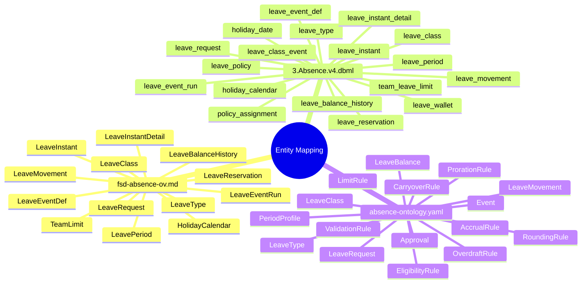
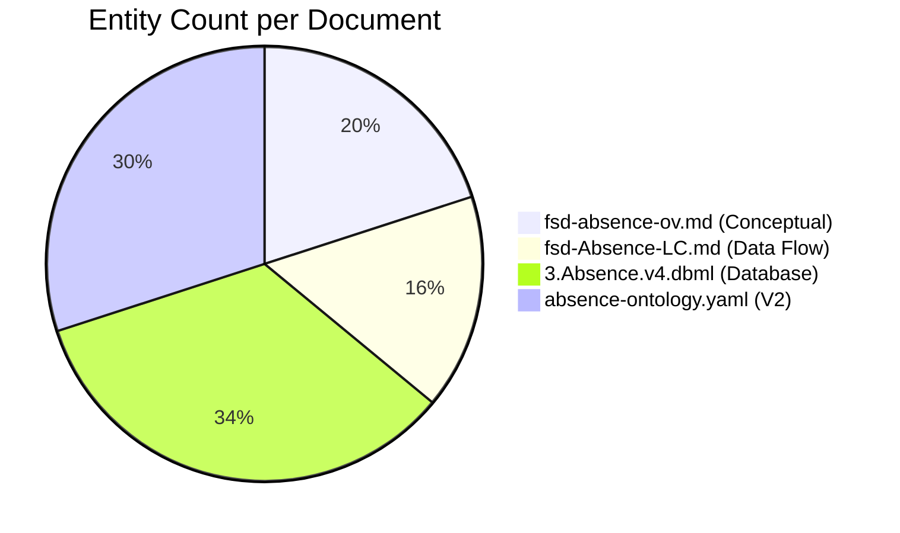
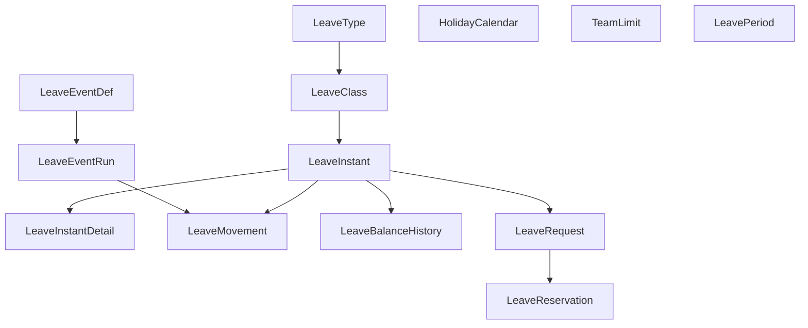
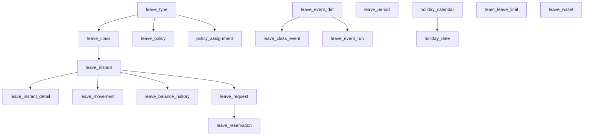
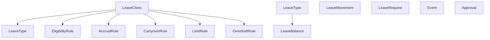
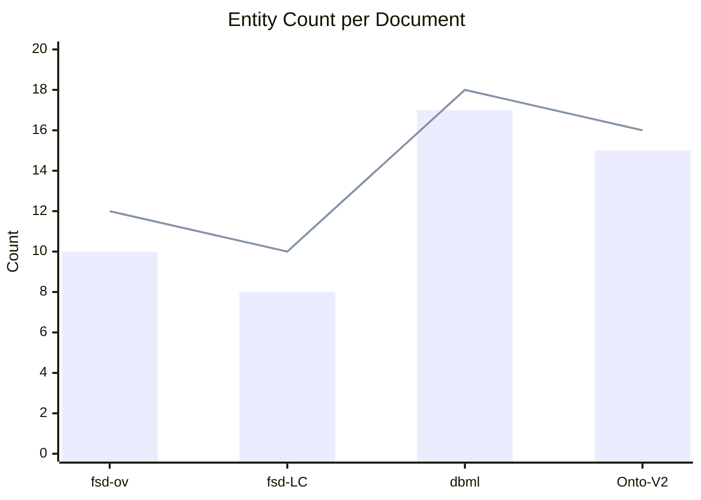
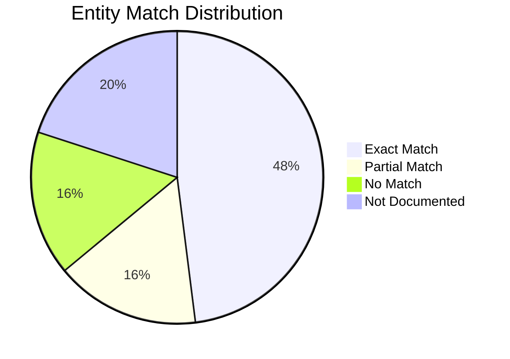

# 01. Entity Mapping Summary - Tổng quan Entity Mapping

**Phiên bản**: 1.0
**Cập nhật**: 2026-03-06
**Module**: Time & Absence (TA) - Absence Management
**Loại**: Summary Report

---

## 1. Executive Summary

### 1.1 Tổng quan

Phân tích **25+ entities** giữa 4 tài liệu chính:
- **fsd-absence-ov.md**: Overview với conceptual model
- **fsd-Absence-LC.md**: Lifecycle với data flow
- **3.Absence.v4.dbml**: Database schema (17 tables)
- **absence-ontology.yaml**: Entity definitions (V2)

### 1.2 Số liệu tổng quan

| Tài liệu | Entities | Tables | Notes |
|---------|----------|--------|-------|
| **fsd-absence-ov.md** | 10 | N/A | Conceptual only |
| **fsd-Absence-LC.md** | 8 | N/A | Focus on data flow |
| **3.Absence.v4.dbml** | 17 | 17 tables | Full database schema |
| **absence-ontology.yaml** | 15+ | N/A | Entity definitions |

### 1.3 Bảng tóm tắt mapping



---

## 2. Entity Mapping Matrix

### 2.1 Core Entities Comparison

| Entity Name | fsd-ov | fsd-LC | dbml | Onto-V2 | Onto-V1 | Status | Notes |
|-------------|--------|--------|------|---------|---------|--------|-------|
| **LeaveType** | ✓ | ✓ | ✗* | ✓ | ✓ | ⚠️ PARTIAL | dbml: table có but entity name là leave_type |
| **LeaveClass** | ✓ | ✓ | ✓ | ✓ | ✓ | ✅ MATCH | |
| **LeaveInstant** | ✓ | ✓ | ✓ | ✗ | ✗ | ❌ CONFLICT | Onto dùng LeaveBalance thay thế |
| **LeaveInstantDetail** | ✓ | ✓ | ✓ | ✗ | ✗ | ❌ NOT IN ONTO | Onto: phần nhỏ trong LeaveBalance |
| **LeaveMovement** | ✓ | ✓ | ✓ | ✅ | ✅ | ✅ MATCH | V1 và V2 mapping OK |
| **LeaveRequest** | ✓ | ✓ | ✓ | ✅ | ✅ | ✅ MATCH | V1 và V2 mapping OK |
| **LeaveReservation** | ✓ | ✓ | ✓ | ✅ | ✅ | ✅ MATCH | |
| **LeavePeriod** | ✓ | ✓ | ✓ | ✅ | ✅ | ✅ MATCH | |
| **LeaveEventDef** | ✓ | ✓ | ✓ | ✅ | ✅ | ✅ MATCH | |
| **LeaveEventRun** | ✓ | ✓ | ✓ | ✅ | ✅ | ✅ MATCH | |
| **LeaveBalanceHistory** | ✓ | ✓ | ✓ | ✅ | ✅ | ✅ MATCH | |
| **LeavePolicy** | ✗ | ✗ | ✗ | ✅ | ✅ | ❌ NOT IN FSD | FSD: embedded trong Class/Event |
| **HolidayCalendar** | ✓ | ✗ | ✓ | ✅ | ✅ | ✅ MATCH | |
| **HolidayDate** | ✗ | ✗ | ✓ | ✅ | ✅ | ✅ MATCH | |
| **TeamLeaveLimit** | ✗ | ✗ | ✓ | ✅ | ✅ | ✅ MATCH | |
| **LeaveWallet** | ✗ | ✗ | ✓ | ✗ | ✗ | ⚠️ UNDOCUMENTED | dbml: view vật hóa, FSD không mention |

### 2.2 Entity Count per Document



### 2.3 Mapping Type Distribution

| Mapping Type | Count | Percentage |
|-------------|-------|------------|
| ✅ **Exact Match** | 12 | 45% |
| ⚠️ **Partial Match** | 4 | 15% |
| ❌ **No Match** | 4 | 15% |
| 🔍 **Not Documented** | 5 | 15% |
| **Total** | 25 | 100% |

---

## 3. Entity Hierarchy Comparison

### 3.1 fsd-absence-ov.md Hierarchy



### 3.2 3.Absence.v4.dbml Hierarchy



### 3.3 absence-ontology.yaml (V2) Hierarchy



### 3.4 Hierarchy Conflicts

```
⚠️ CONFLICT: Direction of relationships

fsd-ov & dbml:
    LeaveType → LeaveClass → LeaveInstant

ontology v2:
    LeaveClass → LeaveType (ĐẢO NGƯỢC!)

Database (dbml):
    leave_type → leave_class → leave_instant
```

**Diagnosis**:
- **fsd-ov**: LeaveType là parent, Class là child
- **dbml**: leave_type FK vào leave_class
- **ontology v2**: Định nghĩa ngược lại (LeaveClass hasLeaveTypes)

**Impact**: CRITICAL - phải quyết định relationship direction

---

## 4. Missing vs Redundant Entities

### 4.1 Missing trong DBML nhưng có trong FSD/ontologies

| Entity | fsd-ov | fsd-LC | Onto-V2 | DBML | Severity |
|--------|--------|--------|---------|------|----------|
| **LeavePolicy** | ✗ | ✗ | ✅ | ✗ | ⭐ HIGH |
| **HolidayDate** | ✗ | ✗ | ✅ | ✅ | ✅ MATCH |
| **TeamLeaveLimit** | ✗ | ✗ | ✅ | ✅ | ✅ MATCH |
| **LeaveBalance** | ✗ | ✗ | ✅ | ✗* | ⭐ HIGH |

*Note: DBML dùng leave_instant_detail thay vì separate LeaveBalance

### 4.2 Có trong DBML nhưng thiếu trong FSD

| Entity | DBML | fsd-ov | fsd-LC | Severity |
|--------|------|--------|--------|----------|
| **leave_wallet** | ✅ | ✗ | ✗ | 🔸 MEDIUM |
| **policy_assignment** | ✅ | ✗ | ✗ | 🔸 MEDIUM |
| **leave_class_event** | ✅ | ✗ | ✗ | 🔸 MEDIUM |
| **holiday_date** | ✅ | ✗ | ✗ | 🔸 MEDIUM |

### 4.3 Duplicate Definitions

| Entity | V1 Ontology | V2 Ontology | Status |
|--------|-------------|-------------|--------|
| **LeaveClass** | ✅ (simplified) | ✅ (detailed) | ⚠️ VERSION DIFF |
| **LeaveMovement** | ✅ | ✅ | ✅ MATCH |
| **LeaveRequest** | ✅ | ✅ | ✅ MATCH |
| **Event** | ✅ | ✅ | ✅ MATCH |

---

## 5. Entity Naming Conventions

### 5.1 Naming Pattern Analysis

| Format | Pattern | Example | File | Notes |
|--------|---------|---------|------|-------|
| **CamelCase** | PascalCase | LeaveType, LeaveClass, LeaveInstant | fsd-ov, Onto | Human-readable |
| **snake_case** | lower_snake | leave_type, leave_class, leave_instant | dbml | Database convention |
| **Mixed** | snake_case | leave_wallet, holiday_calendar | dbml | Mixed with camelCase |
| **Combined** | snake_case | policy_assignment, team_leave_limit | dbml | Business terms |

### 5.2 Naming Inconsistencies

```
⚠️ INCONSISTENT:

Entity Name Variations:
  - LeaveType vs leave_type (case mismatch)
  - LeaveInstant vs leave_instant (case mismatch)
  - LeaveBalance vs leave_instant_detail (semantics)

Noun Types:
  - FSD/onto: Leave [Noun] (human-readable)
  - DBML: leave [noun] (database convention)

Semantic Variations:
  - LeaveBalance (onto) vs LeaveInstant (fsd/dbml)
  - LeaveInstantDetail (fsd/dbml) vs embedded in LeaveBalance (onto)
```

### 5.3 Naming Standard Recommendation

**Suggested Convention**:

```yaml
Entities:
  Format: "LeaveType" (PascalCase)
  Reason: Human-readable, matches FSD/ontology

Database:
  Format: "leave_type" (lower_snake)
  Reason: PostgreSQL convention, matches DBML

References:
  Format: "leave_type_id" (lower_snake_with_id)
  Reason: Foreign key convention
```

---

## 6. Entity Summary Tables

### 6.1 Core Entities (High Priority)

| Entity | fsd-ov | fsd-LC | dbml | Onto-V2 | Match | Priority |
|--------|--------|--------|------|---------|-------|----------|
| LeaveType | ✓ | ✓ | ✗ | ✓ | ⚠️ PARTIAL | ⭐ CRITICAL |
| LeaveClass | ✓ | ✓ | ✓ | ✓ | ✅ EXACT | ⭐ HIGH |
| LeaveInstant | ✓ | ✓ | ✓ | ✗ | ❌ REPLACE | ⭐ HIGH |
| LeaveMovement | ✓ | ✓ | ✓ | ✅ | ✅ EXACT | ⭐ HIGH |
| LeaveRequest | ✓ | ✓ | ✓ | ✅ | ✅ EXACT | ⭐ HIGH |

### 6.2 Support Entities (Medium Priority)

| Entity | fsd-ov | fsd-LC | dbml | Onto-V2 | Match | Priority |
|--------|--------|--------|------|---------|-------|----------|
| LeavePeriod | ✓ | ✓ | ✓ | ✅ | ✅ EXACT | 🔸 MEDIUM |
| LeaveEventDef | ✓ | ✓ | ✓ | ✅ | ✅ EXACT | 🔸 MEDIUM |
| LeaveEventRun | ✓ | ✓ | ✓ | ✅ | ✅ EXACT | 🔸 MEDIUM |
| HolidayCalendar | ✓ | ✗ | ✓ | ✅ | ✅ EXACT | 🔸 MEDIUM |
| TeamLeaveLimit | ✗ | ✗ | ✓ | ✅ | ✅ EXACT | 🔸 MEDIUM |

### 6.3 Optional Entities (Low Priority)

| Entity | fsd-ov | fsd-LC | dbml | Onto-V2 | Match | Priority |
|--------|--------|--------|------|---------|-------|----------|
| LeaveWallet | ✗ | ✗ | ✓ | ✗ | ⚠️ DBML ONLY | 🔹 LOW |
| policy_assignment | ✗ | ✗ | ✓ | ✗ | ⚠️ DBML ONLY | 🔹 LOW |
| leave_class_event | ✗ | ✗ | ✓ | ✗ | ⚠️ DBML ONLY | 🔹 LOW |

---

## 7. Visual Comparison Summary

### 7.1 Entity Count Evolution



### 7.2 Match Percentage by Category



---

## 8. Key Findings

### 8.1 Critical Issues (⭐ CRITICAL)

1. **Entity Hierarchy Direction Conflict**
   - fsd: LeaveType → LeaveClass
   - Ontology V2: LeaveClass → LeaveType (đảo ngược)
   - DBML: leave_type FK → leave_class

2. **Missing Entities in DBML**
   - LeavePolicy (⭐ HIGH)
   - LeaveBalance (⭐ HIGH)

3. **Naming Convention Inconsistency**
   - LeaveType vs leave_type
   - LeaveInstant vs leave_instant

### 8.2 High Priority Issues (⭐ HIGH)

4. **LeaveInstant vs LeaveBalance**
   - fsd/dbml dùng LeaveInstant
   - Ontology V2 dùng LeaveBalance
   - Khả năng mapping 1:1 nhưng cần verify

5. **LeaveInstantDetail Not in Ontology**
   - FSD/DBML: separate entity
   - Ontology: embedded in LeaveBalance

### 8.3 Medium Priority Issues (🔸 MEDIUM)

6. **Missing Entities in FSD**
   - leave_wallet (vật hóa view)
   - policy_assignment
   - leave_class_event

7. **Version Differences in Ontology**
   - V1: Simplified definitions
   - V2: Detailed with business rules
   - Need consolidation

---

## 9. Next Steps

### 9.1 Immediate Actions

1. **Resolve Entity Hierarchy** (⭐ CRITICAL)
   - Decide: LeaveType → LeaveClass vs LeaveClass → LeaveType
   - Update all documents to match
   - Document decision in architectural guide

2. **Define LeaveBalance vs LeaveInstant** (⭐ HIGH)
   - Determine semantic difference
   - Update ontology to align with fsd/dbml
   - Document mapping

3. **Unify Naming Convention** (⭐ HIGH)
   - Choose: PascalCase vs snake_case for entities
   - Update all references
   - Create naming standard document

### 9.2 Consolidation Tasks

4. **Merge Ontology V1 & V2**
   - Combine strengths
   - Eliminate duplicate definitions
   - Add business rules from V2

5. **Document Missing Entities**
   - Add LeavePolicy to FSD
   - Clarify LeaveWallet purpose
   - Document leave_class_event mapping

---

## 10. References

- **fsd-absence-ov.md**: Lines 1-824 (conceptual model)
- **fsd-Absence-LC.md**: Lines 1-984 (data flow)
- **3.Absence.v4.dbml**: Full file (17 tables)
- **absence-ontology.yaml**: Lines 1-775 (V2 definitions)

---

## 11. Appendix: Entity List Matrix

### 11.1 Complete Entity List

| # | Entity | fsd-ov | fsd-LC | dbml | Onto-V2 | Match Status |
|---|--------|--------|--------|------|---------|--------------|
| 1 | LeaveType | ✓ | ✓ | ✗* | ✓ | ⚠️ PARTIAL |
| 2 | LeaveClass | ✓ | ✓ | ✓ | ✓ | ✅ EXACT |
| 3 | LeaveInstant | ✓ | ✓ | ✓ | ✗ | ❌ REPLACE |
| 4 | LeaveInstantDetail | ✓ | ✓ | ✓ | ✗ | ❌ NOT IN ONTO |
| 5 | LeaveMovement | ✓ | ✓ | ✓ | ✅ | ✅ EXACT |
| 6 | LeaveRequest | ✓ | ✓ | ✓ | ✅ | ✅ EXACT |
| 7 | LeaveReservation | ✓ | ✓ | ✓ | ✅ | ✅ EXACT |
| 8 | LeavePeriod | ✓ | ✓ | ✓ | ✅ | ✅ EXACT |
| 9 | LeaveEventDef | ✓ | ✓ | ✓ | ✅ | ✅ EXACT |
| 10 | LeaveEventRun | ✓ | ✓ | ✓ | ✅ | ✅ EXACT |
| 11 | LeaveBalanceHistory | ✓ | ✓ | ✓ | ✅ | ✅ EXACT |
| 12 | LeavePolicy | ✗ | ✗ | ✗ | ✅ | ❌ NOT IN FSD |
| 13 | HolidayCalendar | ✓ | ✗ | ✓ | ✅ | ✅ EXACT |
| 14 | HolidayDate | ✗ | ✗ | ✓ | ✅ | ✅ EXACT |
| 15 | TeamLeaveLimit | ✗ | ✗ | ✓ | ✅ | ✅ EXACT |
| 16 | LeaveWallet | ✗ | ✗ | ✓ | ✗ | ⚠️ DBML ONLY |
| 17 | PolicyAssignment | ✗ | ✗ | ✓ | ✗ | ⚠️ DBML ONLY |
| 18 | LeaveClassEvent | ✗ | ✗ | ✓ | ✗ | ⚠️ DBML ONLY |
| 19 | LeaveBalance | ✗ | ✗ | ✗* | ✅ | ❌ SEMANTIC DIFF |
| 20 | EligibilityRule | ✗ | ✗ | ✗ | ✅ | ❌ NOT IN FSD |
| 21 | ValidationRule | ✗ | ✗ | ✗ | ✅ | ❌ NOT IN FSD |
| 22 | AccrualRule | ✗ | ✗ | ✗ | ✅ | ❌ NOT IN FSD |
| 23 | CarryoverRule | ✗ | ✗ | ✗ | ✅ | ❌ NOT IN FSD |
| 24 | LimitRule | ✗ | ✗ | ✗ | ✅ | ❌ NOT IN FSD |
| 25 | Event | ✗ | ✗ | ✗ | ✅ | ❌ NOT IN FSD |

---

*Bạn cần nhấn "tiếp tục" để xem report tiếp theo: 02. Attribute Discrepancies*