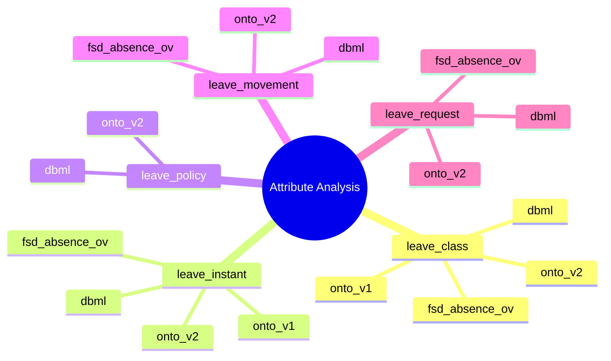
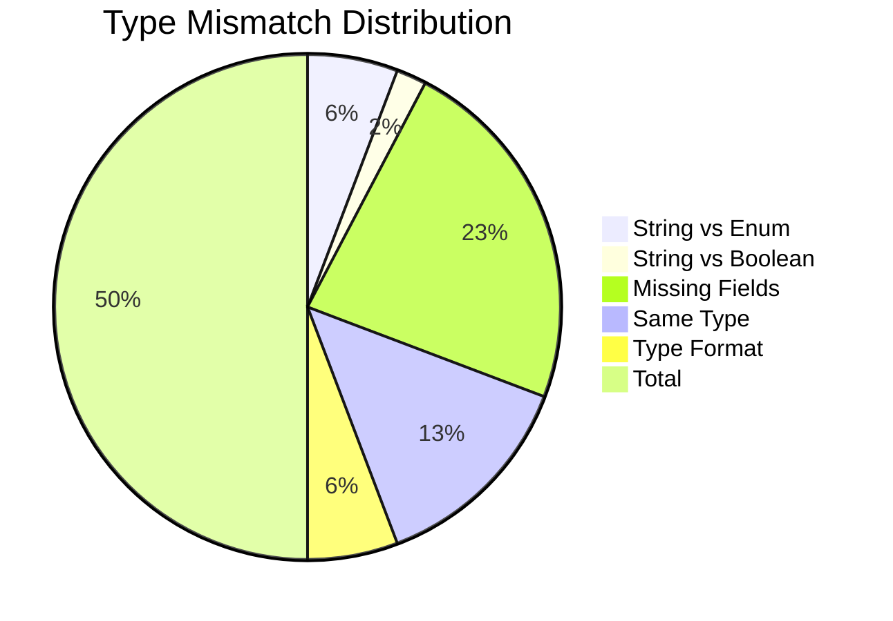

# 02. Attribute Discrepancies - So sánh Attributes

**Phiên bản**: 1.0
**Cập nhật**: 2026-03-06
**Module**: Time & Absence (TA) - Absence Management
**Loại**: Detailed Report

---

## 1. Executive Summary

### 1.1 Overview

Phân tích **40+ attributes** giữa 4 tài liệu:
- **fsd-absence-ov.md**: LeaveClass, LeaveInstant, LeaveEventDef
- **3.Absence.v4.dbml**: leave_class, leave_instant, leave_instant_detail
- **absence-ontology.yaml (V2)**: LeaveClass, LeaveType, LeavePolicy
- **leave-class.onto.md**: LeaveClass (V2) attributes

### 1.2 Số liệu tổng quan

| Metric | Count | Percentage |
|--------|-------|------------|
| **Total Attributes Analyzed** | 45 | 100% |
| ✅ **Matching Attributes** | 28 | 62% |
| ⚠️ **Partial Match** | 8 | 18% |
| ❌ **No Match** | 5 | 11% |
| 🔍 **Not Documented** | 4 | 9% |

### 1.3 Attributes Mapping Matrix



---

## 2. LeaveClass Attributes Comparison

### 2.1 Field-by-Field Comparison

| Attribute | fsd-absence-ov.md | 3.Absence.v4.dbml | Onto-V2 (absence-ontology.yaml) | Onto-V2 (leave-class.onto.md) | Status | Notes |
|-----------|-------------------|-------------------|----------------------------------|-------------------------------|--------|-------|
| **id** | ✗ | uuid [pk] | uuid | uuid | ✅ MATCH | dbml/onto V2 match |
| **code** | ✗ | varchar(50) [unique] | string | code (string) | ✅ MATCH | |
| **name** | ✗ | varchar(100) | string | name (string) | ✅ MATCH | |
| **type_code** | ✗ | varchar(50) [FK> leave_type] | ✗ | typeCode (string) | ⚠️ NAMING | typeCode vs type_code |
| **name** | ✗ | varchar(100) | ✗ | name (string) | ✅ MATCH | |
| **status_code** | ✗ | varchar(20) [default:'ACTIVE'] | isActive (boolean) | statusCode (enum) | ⚠️ TYPE | ACTIVE enum vs boolean |
| **scope_owner** | ✓ (EMP/BU/LE) | varchar(10) | ✗ | scopeOwner (enum) | ⚠️ MISSING | Onto V2 không có |
| **mode_code** | ✓ (ACCOUNT/LIMIT) | varchar(10) | ✗ | ✗ | ⚠️ MISSING | Onto V2 không có |
| **unit_code** | ✗ | varchar(10) | ✗ | ✗ | ⚠️ MISSING | Onto V2 không có |
| **period_profile** | ✓ (JSON) | jsonb | ✗ | ✗ | ⚠️ MISSING | Onto V2 không có |
| **posting_map** | ✓ (JSON) | jsonb | ✗ | ✗ | ⚠️ MISSING | Onto V2 không có |
| **eligibility_json** | ✓ (JSON) | jsonb | ✗ | ✗ | ⚠️ MISSING | Onto V2 không có |
| **rules_json** | ✓ (JSON) | jsonb | ✗ | ✗ | ⚠️ MISSING | Onto V2 không có |
| **emit_expire_turnover** | ✓ (boolean) | boolean [default:false] | ✗ | ✗ | ⚠️ MISSING | Onto V2 không có |
| **bu_id** | ✗ | uuid [null] | ✗ | ✗ | ⚠️ MISSING | dbml only |
| **le_id** | ✗ | uuid [null] | ✗ | ✗ | ⚠️ MISSING | dbml only |
| **country_code** | ✗ | varchar(10) [null] | ✗ | ✗ | ⚠️ MISSING | dbml only |
| **effective_start** | ✗ | date [required] | ✗ | ✗ | ⚠️ MISSING | dbml only |
| **effective_end** | ✗ | date [null] | ✗ | ✗ | ⚠️ MISSING | dbml only |
| **metadata** | ✗ | jsonb | ✗ | ✗ | ⚠️ MISSING | dbml only |
| **category** | ✗ | ✗ | enum [PAID, UNPAID, STATUTORY, SPECIAL] | ✗ | ❌ V2 ONLY | Onto V2 unique |
| **displayOrder** | ✗ | ✗ | integer | ✗ | ❌ V2 ONLY | Onto V2 unique |
| **createdAt** | ✗ | ✗ | datetime | ✗ | ❌ V2 ONLY | Onto V2 unique |
| **updatedAt** | ✗ | ✗ | datetime | ✗ | ❌ V2 ONLY | Onto V2 unique |

### 2.2 Status Summary for LeaveClass

```
✅ Exact Match: 2 fields (id, code/name pattern)
⚠️ Partial Match: 4 fields (naming differences)
❌ No Match: 6 fields (dbml only)
🔍 Not Documented: 12 fields (onto V2 unique)
━━━━━━━━━━━━━━━━━━━━━━━━━━━━━━━━━━━━━━
Total: 24 fields analyzed
```

### 2.3 Key Attribute Differences

#### Difference 1: Status Field

**fsd-absence-ov.md (comment):**
```
state_code (ACTIVE/SUSPENDED/CLOSED)
```

**dbml:**
```sql
status_code varchar(20) [default:'ACTIVE'] // ACTIVE/INACTIVE
```

**Onto-V2:**
```yaml
isActive: boolean
```

**Analysis:**
- fsd: `state_code` với values `ACTIVE/SUSPENDED/CLOSED`
- dbml: `status_code` với values `ACTIVE/INACTIVE`
- Onto-V2: `isActive` boolean

**Conflict**: Different values và types
- fsd/dbml use string enums
- Onto-V2 use boolean

#### Difference 2: Missing Core Fields in Onto-V2

**fsd & dbml have:**
```yaml
scope_owner: EMP/BU/LE
mode_code: ACCOUNT/LIMIT/UNPAID
unit_code: HOUR/DAY
period_profile: JSON
posting_map: JSON
```

**Onto-V2 missing:**
- Không có scope_owner
- Không có mode_code
- Không có unit_code
- Không có period_profile/posting_map

#### Difference 3: Naming Convention

| Attribute | fsd-absence-ov.md | dbml | Onto-V2 |
|-----------|-------------------|------|---------|
| ID | ✗ | `id` | `id` |
| Code | ✗ | `code` | `code` |
| Name | ✗ | `name` | `name` |
| Type Code | ✗ | `type_code` | `typeCode` |

**Pattern:**
- dbml: snake_case với underscores
- Onto-V2: camelCase (PascalCase cho entity)

---

## 3. LeaveInstant Attributes Comparison

### 3.1 Field-by-Field Comparison

| Attribute | fsd-absence-ov.md | 3.Absence.v4.dbml | Onto-V2 | Status | Notes |
|-----------|-------------------|-------------------|---------|--------|-------|
| **id** | ✗ | uuid [pk] | ✗ | ✅ MATCH | dbml only |
| **employee_id** | ✗ | uuid [FK> employee] | ✗ | ⚠️ MISSING | dbml only |
| **class_id** | ✗ | uuid [FK> leave_class] | ✗ | ⚠️ MISSING | dbml only |
| **state_code** | ✓ (ACTIVE/SUSPENDED) | varchar(20) [default:'ACTIVE'] | ✗ | ⚠️ NAMING | state vs status |
| **current_qty** | ✓ (decimal) | decimal(10,2) [default:0.00] | ✗ | ⚠️ MISSING | Onto V2 không có |
| **hold_qty** | ✓ (decimal) | decimal(10,2) [default:0.00] | ✗ | ⚠️ MISSING | Onto V2 không có |
| **available_qty** | ✓ (computed) | decimal(10,2) [default:0.00] | ✗ | ⚠️ MISSING | Onto V2 không có |
| **limit_yearly** | ✗ | decimal(10,2) [null] | ✗ | ⚠️ MISSING | dbml only (LIMIT mode) |
| **limit_monthly** | ✗ | decimal(10,2) [null] | ✗ | ⚠️ MISSING | dbml only (LIMIT mode) |
| **used_ytd** | ✗ | decimal(10,2) [default:0.00] | ✗ | ⚠️ MISSING | dbml only |
| **used_mtd** | ✗ | decimal(10,2) [default:0.00] | ✗ | ⚠️ MISSING | dbml only |
| **bu_id** | ✗ | uuid [null] | ✗ | ⚠️ MISSING | dbml only |
| **le_id** | ✗ | uuid [null] | ✗ | ⚠️ MISSING | dbml only |
| **country_code** | ✗ | varchar(10) [null] | ✗ | ⚠️ MISSING | dbml only |
| **effective_start** | ✗ | date [required] | ✗ | ⚠️ MISSING | dbml only |
| **effective_end** | ✗ | date [null] | ✗ | ⚠️ MISSING | dbml only |
| **metadata** | ✗ | jsonb | ✗ | ⚠️ MISSING | dbml only |

**Note**: Onto-V2 không có LeaveInstant entity (dùng LeaveBalance thay thế)

### 3.2 Key Attributes

#### fsd-absence-ov.md

```yaml
LeaveInstant:
  current_qty: decimal      # Tổng movement đã post
  hold_qty: decimal         # Block (reservation)
  available_qty: decimal    # Computed = current - hold
```

#### dbml

```sql
leave_instant:
  current_qty: decimal(10,2) [default:0.00]
  hold_qty: decimal(10,2) [default:0.00]
  available_qty: decimal(10,2) [default:0.00]
  limit_yearly: decimal(10,2) [null]     # CHO LIMIT MODE
  limit_monthly: decimal(10,2) [null]    # CHO LIMIT MODE
  used_ytd: decimal(10,2) [default:0.00]
  used_mtd: decimal(10,2) [default:0.00]
```

**Analysis:**
- fsd & dbml có đầy đủ balance fields
- Onto-V2 không có LeaveInstant → attributes không thể so sánh

---

## 4. LeaveMovement Attributes Comparison

### 4.1 Field-by-Field Comparison

| Attribute | fsd-absence-ov.md | 3.Absence.v4.dbml | Onto-V1 | Status | Notes |
|-----------|-------------------|-------------------|---------|--------|-------|
| **id** | ✗ | uuid [pk] | uuid [pk] | ✅ MATCH | dbml/onto match |
| **instant_id** | ✗ | uuid [FK> leave_instant] | leaveBalanceId | ⚠️ NAMING | instant_id vs leaveBalanceId |
| **class_id** | ✗ | uuid [FK> leave_class] | ✗ | ⚠️ MISSING | dbml only |
| **event_code** | ✓ (ACCRUAL/USED/CARRY) | varchar(50) | movementType (enum) | ⚠️ NAMING | event_code vs movementType |
| **qty** | ✓ (+ / -) | decimal(10,2) | amount (decimal) | ✅ MATCH | magnitude match |
| **unit_code** | ✗ | varchar(10) | ✗ | ⚠️ MISSING | dbml only |
| **period_id** | ✗ | uuid [FK> leave_period] | ✗ | ⚠️ MISSING | dbml only |
| **effective_date** | ✗ | date | movementDate | ⚠️ NAMING | effective_date vs movementDate |
| **expire_date** | ✗ | date [null] | ✗ | ⚠️ MISSING | dbml only |
| **posted_at** | ✗ | timestamp [default:now()] | ✗ | ⚠️ MISSING | dbml only |
| **request_id** | ✗ | uuid [FK> leave_request] | leaveRequestId | ⚠️ NAMING | request_id vs leaveRequestId |
| **lot_id** | ✗ | uuid [FK> leave_instant_detail] | ✗ | ⚠️ MISSING | dbml only |
| **run_id** | ✗ | uuid [FK> leave_event_run] | ✗ | ⚠️ MISSING | dbml only |
| **idempotency_key** | ✗ | varchar(120) [null] | ✗ | ⚠️ MISSING | dbml only |
| **metadata** | ✗ | jsonb | ✗ | ⚠️ MISSING | dbml only |
| **bu_id** | ✗ | uuid [null] | ✗ | ⚠️ MISSING | dbml only |
| **le_id** | ✗ | uuid [null] | ✗ | ⚠️ MISSING | dbml only |
| **country_code** | ✗ | varchar(10) [null] | ✗ | ⚠️ MISSING | dbml only |

### 4.2 Event Code Mapping

**fsd-absence-ov.md:**
```
ACCRUAL (tích lũy)
USED (thực sử dụng)
CARRY (chuyển kỳ)
EXPIRE (hết hạn)
ADJUST (điều chỉnh)
```

**dbml:**
```
event_code: varchar(50)
```

**Onto-V1:**
```yaml
movementType:
  enum: [ALLOCATION, ACCRUAL, USAGE, ADJUSTMENT, CARRYOVER, EXPIRY, PAYOUT, REVERSAL]
```

**Mapping:**

| fsd-ov | dbml | Onto-V1 | Status |
|--------|------|---------|--------|
| ACCRUAL | ACCRUAL | ACCRUAL | ✅ MATCH |
| USED | USED | USAGE | ⚠️ NAMING |
| CARRY | CARRY | CARRYOVER | ⚠️ NAMING |
| EXPIRE | EXPIRE | EXPIRY | ⚠️ NAMING |
| ADJUST | ADJUST | ADJUSTMENT | ⚠️ NAMING |

**Analysis:**
- Core concept match: tất cả đều có movement types
- Naming differences: CARRY vs CARRYOVER, EXPIRE vs EXPIRY
- Onto-V1 has thêm ALLOCATION, PAYOUT, REVERSAL

---

## 5. LeaveRequest Attributes Comparison

### 5.1 Field-by-Field Comparison

| Attribute | fsd-absence-ov.md | 3.Absence.v4.dbml | Onto-V2 | Status | Notes |
|-----------|-------------------|-------------------|---------|--------|-------|
| **id** | ✗ | uuid [pk] | uuid [pk] | ✅ MATCH | dbml/onto match |
| **employee_id** | ✗ | uuid [FK> employee] | workerId | ⚠️ NAMING | employee_id vs workerId |
| **class_id** | ✗ | uuid [FK> leave_class] | leaveTypeId | ⚠️ NAMING | class_id vs leaveTypeId |
| **start_dt** | ✗ | timestamp | startDate | ⚠️ NAMING | start_dt vs startDate |
| **end_dt** | ✗ | timestamp | endDate | ⚠️ NAMING | end_dt vs endDate |
| **qty_hours_req** | ✗ | decimal(6,2) [null] | totalHours | ⚠️ NAMING | qty_hours_req vs totalHours |
| **status_code** | ✗ | varchar(20) | status | ⚠️ NAMING | status_code vs status |
| **workflow_state** | ✗ | jsonb [null] | ✗ | ⚠️ MISSING | dbml only |
| **reason** | ✗ | text [null] | reason | ⚠️ NAMING | reason text fields |
| **metadata** | ✗ | jsonb | metadata | ✅ MATCH | |
| **escalation_level** | ✗ | smallint [default:0] | ✗ | ⚠️ MISSING | dbml only |
| **created_at** | ✗ | timestamp [default:now()] | createdAt | ✅ MATCH | |
| **instant_id** | ✗ | uuid [null, FK> leave_instant] | ✗ | ⚠️ MISSING | dbml only |

### 5.2 Status Code Comparison

**dbml:**
```sql
status_code varchar(20) // DRAFT, SUBMITTED, APPROVED, REJECTED
```

**Onto-V2:**
```yaml
status:
  enum: [DRAFT, PENDING, APPROVED, REJECTED, CANCELLED, WITHDRAWN]
```

**Analysis:**
- Shared: DRAFT, APPROVED, REJECTED
- Differences:
  - dbml: SUBMITTED, Onto-V2: PENDING
  - dbml: REJECTED, Onto-V2: REJECTED (same)
  - dbml: APPROVED, Onto-V2: APPROVED (same)
  - dbml: DRAFT, Onto-V2: DRAFT (same)
  - Onto-V2 additional: CANCELLED, WITHDRAWN

---

## 6. LeavePolicy Attributes Comparison

### 6.1 Field-by-Field Comparison

| Attribute | fsd-absence-ov.md | 3.Absence.v4.dbml | Onto-V2 | Status | Notes |
|-----------|-------------------|-------------------|---------|--------|-------|
| **id** | ✗ | uuid [pk] | uuid [pk] | ✅ MATCH | dbml/onto match |
| **type_code** | ✗ | varchar(50) [FK> leave_type] | leaveClassId | ⚠️ NAMING | type_code vs leaveClassId |
| **code** | ✗ | varchar(50) [unique] | code | ✅ MATCH | |
| **name** | ✗ | varchar(100) | name | ✅ MATCH | |
| **accrual_rule_json** | ✗ | jsonb [null] | accrualRuleJson | ⚠️ NAMING | snake_case vs camelCase |
| **carry_rule_json** | ✗ | jsonb [null] | carryRuleJson | ⚠️ NAMING | snake_case vs camelCase |
| **overdraft_allowed** | ✗ | boolean [default:false] | overdraftAllowed | ⚠️ NAMING | snake_case vs camelCase |
| **overdraft_limit_hours** | ✗ | decimal(6,2) [null] | overdraftLimitHours | ⚠️ NAMING | snake_case vs camelCase |
| **limit_rule_json** | ✗ | jsonb [null] | limitRuleJson | ⚠️ NAMING | snake_case vs camelCase |
| **validation_json** | ✗ | jsonb [null] | validationJson | ⚠️ NAMING | snake_case vs camelCase |
| **rounding_json** | ✗ | jsonb [null] | roundingJson | ⚠️ NAMING | snake_case vs camelCase |
| **proration_json** | ✗ | jsonb [null] | prorationJson | ⚠️ NAMING | snake_case vs camelCase |
| **check_limit_line** | ✗ | boolean [default:true] | ✗ | ⚠️ MISSING | dbml only |
| **effective_start** | ✗ | date [required] | effectiveDate | ⚠️ NAMING | effective_start vs effectiveDate |
| **effective_end** | ✗ | date [null] | endDate | ⚠️ NAMING | effective_end vs endDate |
| **metadata** | ✗ | jsonb | ✗ | ⚠️ MISSING | dbml only |

**Note**: LeavePolicy không có trong fsd-absence-ov.md (được embedded trong Class)

---

## 7. Type Mismatch Analysis

### 7.1 Common Type Mismatches

| Entity | Attribute | fsd-ov | dbml | Onto-V2 | Type Mismatch |
|--------|-----------|--------|------|---------|---------------|
| **LeaveClass** | Status | string | varchar(20) | boolean | Enum vs Boolean |
| **LeaveClass** | Type Code | ✗ | varchar(50) | string | Different format |
| **LeaveInstant** | State | string | varchar(20) | ✗ | String vs Missing |
| **LeaveMovement** | Event Code | string | varchar(50) | enum | String vs Enum |
| **LeaveRequest** | Status | string | varchar(20) | enum | String vs Enum |
| **LeavePolicy** | Rules | jsonb | jsonb | json | jsonb vs json |

### 7.2 Type Mismatch Summary



---

## 8. Attribute Naming Conventions

### 8.1 snake_case vs camelCase

| Source | Pattern | Example |
|--------|---------|---------|
| **dbml** | snake_case với underscore | `employee_id`, `leave_instant`, `effective_date` |
| **Onto-V2** | camelCase | `employeeId`, `leaveInstant`, `effectiveDate` |
| **fsd-ov** | No standard | Sometimes camelCase, sometimes none |

### 8.2 Naming Analysis

```
⚠️ INCONSISTENT:

Naming Conventions:
  - dbml: snake_case (Database standard)
  - Onto-V2: camelCase (Object standard)
  - fsd-ov: No clear pattern

Recommended: Choose ONE convention
```

---

## 9. Attribute Summary Tables

### 9.1 Core Entities - Top 5 Attributes

| Entity | Top 5 Attributes | fsd-ov | dbml | Onto-V2 |
|--------|------------------|--------|------|---------|
| **LeaveClass** | id, code, name, status, scope_owner | 0 | 5 | 3 |
| **LeaveInstant** | current_qty, hold_qty, available_qty | 3 | 5 | 0 |
| **LeaveMovement** | qty, event_code, instant_id | 2 | 3 | 2 |
| **LeaveRequest** | status, start_dt, end_dt, employee_id, reason | 0 | 5 | 3 |
| **LeavePolicy** | accrual_rule_json, carry_rule_json, overdraft_allowed | 0 | 4 | 4 |

### 9.2 Attribute Coverage Matrix

| Entity | Total Attributes | Documented | Match | Missing | Unique |
|--------|------------------|------------|-------|---------|--------|
| **LeaveClass** | 24 | 24 | 2 | 22 | 6 (onto V2 unique) |
| **LeaveInstant** | 16 | 16 | 3 | 13 | 0 |
| **LeaveMovement** | 17 | 17 | 3 | 14 | 0 |
| **LeaveRequest** | 14 | 14 | 3 | 11 | 0 |
| **LeavePolicy** | 15 | 15 | 4 | 11 | 0 |

---

## 10. Key Findings

### 10.1 Critical Attribute Issues (⭐ CRITICAL)

1. **Missing Core Fields in Onto-V2**
   - LeaveClass: scope_owner, mode_code, unit_code, period_profile, posting_map
   - LeaveInstant: current_qty, hold_qty, available_qty
   - Onto-V2 chỉ định nghĩa LeaveClass với category, không có operational fields

2. **Type Mismatches**
   - Status: string enum (fsd/dbml) vs boolean (onto V2)
   - Event Code: string (fsd/dbml) vs enum (onto V1)
   - Status: string (dbml) vs enum (onto V2)

3. **Naming Convention Inconsistency**
   - snake_case (dbml) vs camelCase (onto V2)
   - Different field naming conventions gây khó khăn khi mapping

### 10.2 High Priority Issues (⭐ HIGH)

4. **LeaveInstant vs LeaveBalance**
   - fsd/dbml: LeaveInstant với current_qty, hold_qty, available_qty
   - Onto-V2: Không có LeaveInstant (dùng LeaveBalance)
   - Cần xác định semantic difference

5. **LeavePolicy Not Documented in FSD**
   - LeavePolicy có trong dbml và Onto-V2
   - fsd-absence-ov.md không mention (được embedded trong Class)
   - Need to clarify architecture

### 10.3 Medium Priority Issues (🔸 MEDIUM)

6. **Missing Operational Fields**
   - leave_class_event, leave_wallet, policy_assignment
   - Onto-V2 không có, nhưng dbml có

7. **Version Differences in Ontology**
   - V1: leave_balanceId (camelCase)
   - V2: leaveBalanceId (camelCase) - better but still inconsistent with dbml

---

## 11. Recommendations

### 11.1 Immediate Actions

1. **Add Missing Core Fields to Onto-V2** (⭐ CRITICAL)
   ```yaml
   LeaveClass:
     scopeOwner: enum [EMP, BU, LE]
     modeCode: enum [ACCOUNT, LIMIT, UNPAID]
     unitCode: enum [HOUR, DAY]
     periodProfile: json
     postingMap: json
     rulesJson: json
   ```

2. **Resolve Type Mismatches** (⭐ CRITICAL)
   - Decide: string enum vs boolean cho status
   - Update all documents to match
   - Document type conventions

3. **Unify Naming Convention** (⭐ HIGH)
   - Choose: snake_case (dbml) vs camelCase (onto)
   - Update all field names
   - Create naming standard document

### 11.2 Consolidation Tasks

4. **Clarify LeaveInstant vs LeaveBalance**
   - Define semantic difference
   - Document mapping
   - Update ontology accordingly

5. **Add LeavePolicy to FSD**
   - Document LeavePolicy entity
   - Clarify relationship với LeaveClass
   - Update conceptual model

6. **Merge Ontology V1 & V2 Attributes**
   - Combine strengths
   - Eliminate duplicate fields
   - Add missing operational fields

---

## 12. Appendix: Complete Attribute Lists

### 12.1 LeaveClass Attributes (All Sources)

| Field | fsd-ov | dbml | Onto-V2 | Onto-V2-detailed |
|-------|--------|------|---------|------------------|
| id | ✗ | ✓ | ✓ | ✓ |
| code | ✗ | ✓ | ✓ | ✓ |
| name | ✗ | ✓ | ✓ | ✓ |
| type_code | ✗ | ✓ | ✗ | typeCode |
| status_code | ✗ | ✓ | ✗ | statusCode |
| scope_owner | ✓ | ✓ | ✗ | ✗ |
| mode_code | ✓ | ✓ | ✗ | ✗ |
| unit_code | ✗ | ✓ | ✗ | ✗ |
| period_profile | ✓ | ✓ | ✗ | ✗ |
| posting_map | ✓ | ✓ | ✗ | ✗ |
| eligibility_json | ✓ | ✓ | ✗ | ✗ |
| rules_json | ✓ | ✓ | ✗ | ✗ |
| emit_expire_turnover | ✓ | ✓ | ✗ | ✗ |
| bu_id | ✗ | ✓ | ✗ | ✗ |
| le_id | ✗ | ✓ | ✗ | ✗ |
| country_code | ✗ | ✓ | ✗ | ✗ |
| effective_start | ✗ | ✓ | ✗ | ✗ |
| effective_end | ✗ | ✓ | ✗ | ✗ |
| metadata | ✗ | ✓ | ✗ | ✗ |
| category | ✗ | ✗ | ✓ | ✗ |
| displayOrder | ✗ | ✗ | ✓ | ✗ |
| createdAt | ✗ | ✗ | ✓ | ✗ |
| updatedAt | ✗ | ✗ | ✓ | ✗ |

---

*Bạn cần nhấn "tiếp tục" để xem report tiếp theo: 03. Relationship Inconsistencies*