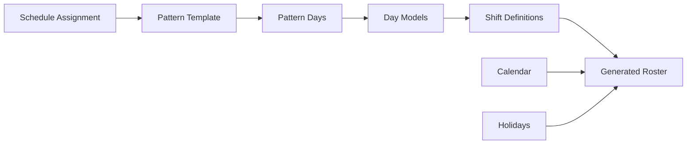

# Shift Scheduling Guide

**Version**: 1.0  
**Last Updated**: 2025-12-12  
**Audience**: HR Administrators, Workforce Planners, Managers  
**Reading Time**: 35-45 minutes

---

## 📋 Overview

This guide explains the **6-level hierarchical architecture** used for shift scheduling in the TA module. You'll learn how to build complex work schedules from atomic components, generate rosters, manage rotations, and handle schedule overrides.

### What You'll Learn

- Understanding the 6-level hierarchy (Time Segment → Shift → Day Model → Pattern → Schedule Rule → Roster)
- Building shifts from time segments
- Creating repeating patterns
- Configuring schedule assignments
- Roster generation and materialization
- Managing schedule overrides
- 24/7 rotation examples
- Best practices and troubleshooting

### Prerequisites

- Basic understanding of workforce scheduling
- Familiarity with the [Concept Overview](./01-concept-overview.md)
- Understanding of [Conceptual Guide](./02-conceptual-guide.md)

---

## 🏗️ Architecture Overview

The TA module uses a **6-level hierarchical architecture** that allows you to build complex schedules from simple, reusable components.

### The 6 Levels

```
Level 1: TimeSegment (Atomic Unit)
    ↓ Composed into
Level 2: ShiftDefinition (Composition of Segments)
    ↓ Used in
Level 3: DayModel (Daily Work Schedule)
    ↓ Arranged into
Level 4: PatternTemplate (Repeating Cycle)
    ↓ Assigned via
Level 5: ScheduleAssignment (Pattern + Calendar + Rotation)
    ↓ Generates
Level 6: GeneratedRoster (Materialized Schedule)
```

### Why This Architecture?

**Flexibility**:
- Build complex schedules from simple components
- Reuse components across different schedules
- Easy to modify and maintain

**Scalability**:
- Support any shift pattern (5x8, 4on-4off, 24/7 rotation, etc.)
- Handle multiple crews and rotations
- Manage thousands of employees

**Auditability**:
- Track lineage from roster back to pattern
- Understand why employee has specific shift
- Compliance reporting

---

## 📦 Level 1: Time Segment

### What is a Time Segment?

A **Time Segment** is the atomic building block of work time. It represents the smallest unit that can be scheduled: work period, break, meal, or transfer between locations.

### Segment Types

| Type | Description | Typically Paid? | Example |
|------|-------------|-----------------|---------|
| `WORK` | Productive work time | Yes | 8:00-12:00 work |
| `BREAK` | Short rest period | No | 15-minute coffee break |
| `MEAL` | Meal period | No | 1-hour lunch |
| `TRANSFER` | Travel between locations | Yes | 30-minute commute |

### Timing Methods

#### Relative Timing (Offset-Based)

**Use when**: Shift start time varies, but segment structure is fixed

**Example**: "Break starts 2 hours after shift begins"

```yaml
TimeSegment:
  code: "BREAK_15M"
  name: "15-Minute Break"
  segmentType: BREAK
  startOffsetMinutes: 120  # 2 hours from shift start
  endOffsetMinutes: 135    # 2h 15m from shift start
  durationMinutes: 15
  isPaid: false
  isMandatory: true
```

**Behavior**: If shift starts at 8:00, break is 10:00-10:15. If shift starts at 9:00, break is 11:00-11:15.

---

#### Absolute Timing (Clock-Based)

**Use when**: Segment must occur at specific clock time

**Example**: "Lunch is always 12:00-13:00"

```yaml
TimeSegment:
  code: "LUNCH_1H"
  name: "1-Hour Lunch"
  segmentType: MEAL
  startTime: "12:00"
  endTime: "13:00"
  durationMinutes: 60
  isPaid: false
  isMandatory: true
```

**Behavior**: Lunch is always 12:00-13:00, regardless of shift start time.

---

### Creating Time Segments

**Example 1: Work Segment**

```yaml
TimeSegment:
  code: "WORK_4H"
  name: "4-Hour Work Block"
  segmentType: WORK
  durationMinutes: 240
  isPaid: true
  isMandatory: true
  costCenterCode: "CC_PROD"
  jobCode: "JOB_ASSEMBLY"
```

**Example 2: Paid Break**

```yaml
TimeSegment:
  code: "BREAK_10M_PAID"
  name: "10-Minute Paid Break"
  segmentType: BREAK
  durationMinutes: 10
  isPaid: true
  isMandatory: true
```

**Example 3: Transfer Segment**

```yaml
TimeSegment:
  code: "TRANSFER_30M"
  name: "30-Minute Site Transfer"
  segmentType: TRANSFER
  durationMinutes: 30
  isPaid: true
  isMandatory: true
  costCenterCode: "CC_TRANSPORT"
```

---

## 🔧 Level 2: Shift Definition

### What is a Shift Definition?

A **Shift Definition** is a composition of time segments forming a complete shift. It defines the work pattern but not the assignment.

### Shift Types

#### ELAPSED (Fixed Schedule)

**Use when**: Employees work fixed hours

**Characteristics**:
- Segments define exact timing
- No clock in/out required
- Predictable schedule

**Example**: Office workers (9:00-17:00)

```yaml
ShiftDefinition:
  code: "DAY_SHIFT"
  name: "Day Shift (9:00-17:00)"
  shiftType: ELAPSED
  referenceStartTime: "09:00"
  referenceEndTime: "17:00"
  totalWorkHours: 7.0
  totalBreakHours: 1.0
  totalPaidHours: 7.0
  crossMidnight: false
  color: "#4CAF50"
```

**Segments**:
```yaml
# Segment 1: Morning work
ShiftSegment:
  shiftId: "DAY_SHIFT_ID"
  segmentId: "WORK_4H_ID"
  sequenceOrder: 1

# Segment 2: Lunch
ShiftSegment:
  shiftId: "DAY_SHIFT_ID"
  segmentId: "LUNCH_1H_ID"
  sequenceOrder: 2

# Segment 3: Afternoon work
ShiftSegment:
  shiftId: "DAY_SHIFT_ID"
  segmentId: "WORK_4H_ID"
  sequenceOrder: 3
```

---

#### PUNCH (Flexible Clock-Based)

**Use when**: Employees clock in/out, flexible hours

**Characteristics**:
- Actual hours tracked via clock in/out
- Grace periods for late arrival
- Rounding rules apply

**Example**: Retail workers

```yaml
ShiftDefinition:
  code: "RETAIL_SHIFT"
  name: "Retail Shift (Flexible)"
  shiftType: PUNCH
  referenceStartTime: "10:00"
  referenceEndTime: "18:00"
  totalWorkHours: 8.0
  graceInMinutes: 15      # Can clock in up to 15 min late
  graceOutMinutes: 15     # Can clock out up to 15 min early
  roundingIntervalMinutes: 15
  roundingMode: NEAREST
  color: "#2196F3"
```

---

#### FLEX (Hybrid)

**Use when**: Core hours required, flexible start/end

**Characteristics**:
- Core hours mandatory
- Flexible start/end times
- Total hours requirement

**Example**: Tech company (core hours 10:00-15:00, 8 hours total)

```yaml
ShiftDefinition:
  code: "FLEX_SHIFT"
  name: "Flexible Shift (Core 10-15)"
  shiftType: FLEX
  totalWorkHours: 8.0
  # Core hours defined in segments
  color: "#FF9800"
```

---

### Shift Composition Example

**Scenario**: 8-hour day shift with 2 breaks and lunch

```yaml
# Shift Definition
ShiftDefinition:
  code: "STANDARD_8H"
  name: "Standard 8-Hour Shift"
  shiftType: ELAPSED
  referenceStartTime: "08:00"
  referenceEndTime: "17:00"
  totalWorkHours: 8.0
  totalBreakHours: 1.0
  totalPaidHours: 8.0

# Segments
# 1. Morning work (08:00-10:00)
ShiftSegment:
  sequenceOrder: 1
  segmentId: "WORK_2H"

# 2. Morning break (10:00-10:15)
ShiftSegment:
  sequenceOrder: 2
  segmentId: "BREAK_15M"

# 3. Mid-morning work (10:15-12:00)
ShiftSegment:
  sequenceOrder: 3
  segmentId: "WORK_1H45M"

# 4. Lunch (12:00-13:00)
ShiftSegment:
  sequenceOrder: 4
  segmentId: "LUNCH_1H"

# 5. Afternoon work (13:00-15:00)
ShiftSegment:
  sequenceOrder: 5
  segmentId: "WORK_2H"

# 6. Afternoon break (15:00-15:15)
ShiftSegment:
  sequenceOrder: 6
  segmentId: "BREAK_15M"

# 7. Late afternoon work (15:15-17:00)
ShiftSegment:
  sequenceOrder: 7
  segmentId: "WORK_1H45M"
```

---

## 📅 Level 3: Day Model

### What is a Day Model?

A **Day Model** represents one day in a work schedule. It links to a shift definition for work days, or marks the day as OFF/HOLIDAY.

### Day Types

| Type | Description | Has Shift? | Example |
|------|-------------|------------|---------|
| `WORK` | Regular work day | Yes | Monday-Friday |
| `OFF` | Rest day | No | Weekend |
| `HOLIDAY` | Public holiday | No | New Year's Day |
| `HALF_DAY` | Partial work day | Yes | Half-day Friday |

### Creating Day Models

**Example 1: Work Day**

```yaml
DayModel:
  code: "WORK_DAY"
  name: "Regular Work Day"
  dayType: WORK
  shiftId: "DAY_SHIFT_ID"
```

**Example 2: Off Day**

```yaml
DayModel:
  code: "OFF_DAY"
  name: "Rest Day"
  dayType: OFF
  shiftId: null
```

**Example 3: Holiday**

```yaml
DayModel:
  code: "HOLIDAY"
  name: "Public Holiday"
  dayType: HOLIDAY
  shiftId: null
```

**Example 4: Half Day**

```yaml
DayModel:
  code: "HALF_DAY_AM"
  name: "Half Day (Morning)"
  dayType: HALF_DAY
  shiftId: "MORNING_SHIFT_ID"
  isHalfDay: true
  halfDayPeriod: MORNING
```

---

### Variant Selection (Holiday Classes)

**Problem**: Different shifts for different holiday classes

**Example**: 
- Class A holidays: Full day off
- Class B holidays: Half day
- Class C holidays: Regular work day

**Solution**: Variant selection rules

```yaml
DayModel:
  code: "HOLIDAY_VARIANT"
  name: "Holiday (Variant)"
  dayType: HOLIDAY
  variantSelectionRule:
    CLASS_A: null           # Full day off
    CLASS_B: "MORNING_SHIFT_ID"  # Half day
    CLASS_C: "DAY_SHIFT_ID"      # Regular work
```

---

## 🔄 Level 4: Pattern Template

### What is a Pattern Template?

A **Pattern Template** defines a repeating cycle of day models. It represents work patterns like 5x8 (5 days work, 8 hours), 4on-4off, 14/14 rotation, etc.

### Pattern Structure

```yaml
PatternTemplate:
  code: "5X8"
  name: "5 Days On, 2 Days Off (8 Hours)"
  description: "Monday-Friday work, weekend off"
  patternLengthDays: 7
  totalWorkDaysInCycle: 5
  totalOffDaysInCycle: 2
  isActive: true
```

### Pattern Days

```yaml
# Day 1: Monday (Work)
PatternDay:
  patternId: "5X8_ID"
  dayNumber: 1
  dayModelId: "WORK_DAY_ID"

# Day 2: Tuesday (Work)
PatternDay:
  patternId: "5X8_ID"
  dayNumber: 2
  dayModelId: "WORK_DAY_ID"

# ... Days 3-5: Work

# Day 6: Saturday (Off)
PatternDay:
  patternId: "5X8_ID"
  dayNumber: 6
  dayModelId: "OFF_DAY_ID"

# Day 7: Sunday (Off)
PatternDay:
  patternId: "5X8_ID"
  dayNumber: 7
  dayModelId: "OFF_DAY_ID"
```

---

### Common Pattern Examples

#### Pattern 1: 5x8 (Standard Week)

**Pattern**: Mon-Fri work, Sat-Sun off

```yaml
PatternTemplate:
  code: "5X8"
  name: "5 Days On, 2 Days Off"
  patternLengthDays: 7
  totalWorkDaysInCycle: 5

# Days 1-5: Work
# Days 6-7: Off
```

---

#### Pattern 2: 4on-4off

**Pattern**: 4 days on, 4 days off

```yaml
PatternTemplate:
  code: "4ON4OFF"
  name: "4 Days On, 4 Days Off"
  patternLengthDays: 8
  totalWorkDaysInCycle: 4

# Days 1-4: Work (12-hour shifts)
# Days 5-8: Off
```

---

#### Pattern 3: 14/14 Rotation

**Pattern**: 14 days on, 14 days off (offshore/remote work)

```yaml
PatternTemplate:
  code: "14_14"
  name: "14 Days On, 14 Days Off"
  patternLengthDays: 28
  totalWorkDaysInCycle: 14

# Days 1-14: Work
# Days 15-28: Off
```

---

#### Pattern 4: 2-2-3 (Pitman Schedule)

**Pattern**: 2 on, 2 off, 3 on, 2 off, 2 on, 3 off (14-day cycle)

```yaml
PatternTemplate:
  code: "PITMAN"
  name: "2-2-3 Pitman Schedule"
  patternLengthDays: 14
  totalWorkDaysInCycle: 7

# Week 1: 2 on, 2 off, 3 on
# Week 2: 2 off, 2 on, 3 off
```

---

#### Pattern 5: 24/7 Three-Shift Rotation

**Pattern**: Day → Night → Off (rotating shifts)

```yaml
PatternTemplate:
  code: "3SHIFT_ROTATION"
  name: "3-Shift Rotation (24/7)"
  patternLengthDays: 21
  totalWorkDaysInCycle: 14

# Days 1-7: Day shift
# Days 8-14: Night shift
# Days 15-21: Off
```

---

## 📋 Level 5: Schedule Assignment

### What is a Schedule Assignment?

A **Schedule Assignment** (also called Work Schedule Rule) combines a pattern template with a calendar and rotation to assign schedules to employees.

### Components

```yaml
ScheduleAssignment:
  code: "PROD_TEAM_A"
  name: "Production Team A Schedule"
  patternTemplateId: "4ON4OFF_ID"
  scheduleId: "FACTORY_CALENDAR_ID"
  effectiveStartDate: "2025-01-01"
  effectiveEndDate: null
  
  # Rotation
  rotationEnabled: true
  rotationGroupId: "CREW_A_ID"
  rotationSequence: 1
  
  # Assignment
  assignmentType: INDIVIDUAL | GROUP | POSITION
```

### Assignment Types

#### Individual Assignment

**Use when**: Assigning to specific employee

```yaml
ScheduleAssignment:
  assignmentType: INDIVIDUAL
  workerId: "EMP_001"
  patternTemplateId: "5X8_ID"
```

---

#### Group Assignment

**Use when**: Assigning to team/department

```yaml
ScheduleAssignment:
  assignmentType: GROUP
  businessUnitId: "DEPT_SALES"
  patternTemplateId: "5X8_ID"
```

---

#### Position Assignment

**Use when**: Schedule tied to position

```yaml
ScheduleAssignment:
  assignmentType: POSITION
  positionId: "POS_SECURITY_GUARD"
  patternTemplateId: "3SHIFT_ROTATION_ID"
```

---

### Rotation Configuration

**Scenario**: 4 crews rotating through 4on-4off pattern

```yaml
# Crew A: Starts on Day 1
ScheduleAssignment:
  code: "CREW_A"
  rotationGroupId: "ROTATION_GROUP_1"
  rotationSequence: 1
  patternStartDate: "2025-01-01"

# Crew B: Starts on Day 5 (offset by 4 days)
ScheduleAssignment:
  code: "CREW_B"
  rotationGroupId: "ROTATION_GROUP_1"
  rotationSequence: 2
  patternStartDate: "2025-01-05"

# Crew C: Starts on Day 9
ScheduleAssignment:
  code: "CREW_C"
  rotationGroupId: "ROTATION_GROUP_1"
  rotationSequence: 3
  patternStartDate: "2025-01-09"

# Crew D: Starts on Day 13
ScheduleAssignment:
  code: "CREW_D"
  rotationGroupId: "ROTATION_GROUP_1"
  rotationSequence: 4
  patternStartDate: "2025-01-13"
```

**Result**: Continuous coverage, each crew works 4 days then off 4 days

---

## 📊 Level 6: Generated Roster

### What is a Generated Roster?

A **Generated Roster** is the materialized, day-by-day schedule for an employee. It's generated from the schedule assignment and pattern.

### Structure

```yaml
GeneratedRoster:
  id: UUID
  workerId: UUID
  scheduleAssignmentId: UUID
  rosterDate: "2025-01-15"
  
  # Shift Information
  shiftDefinitionId: UUID
  dayModelId: UUID
  patternDayNumber: 3
  
  # Timing
  plannedStartTime: "08:00"
  plannedEndTime: "17:00"
  plannedWorkHours: 8.0
  
  # Status
  status: PLANNED | CONFIRMED | COMPLETED | CANCELLED
  
  # Lineage (traceability)
  patternTemplateId: UUID
  generatedAt: datetime
  generatedBy: SYSTEM
```

### Roster Generation Process



**Steps**:
1. System reads schedule assignment
2. Retrieves pattern template
3. Calculates pattern day for target date
4. Looks up day model for that pattern day
5. Retrieves shift definition from day model
6. Checks calendar for holidays/overrides
7. Creates roster entry

---

### Generation Example

**Setup**:
- Employee: John Doe
- Pattern: 5x8 (Mon-Fri work)
- Start date: 2025-01-01 (Wednesday)

**Generated Roster**:

```yaml
# 2025-01-01 (Wed) - Pattern Day 3
GeneratedRoster:
  workerId: "JOHN_DOE_ID"
  rosterDate: "2025-01-01"
  patternDayNumber: 3
  dayModelId: "WORK_DAY_ID"
  shiftDefinitionId: "DAY_SHIFT_ID"
  plannedStartTime: "09:00"
  plannedEndTime: "17:00"
  status: PLANNED

# 2025-01-02 (Thu) - Pattern Day 4
GeneratedRoster:
  rosterDate: "2025-01-02"
  patternDayNumber: 4
  dayModelId: "WORK_DAY_ID"
  status: PLANNED

# 2025-01-03 (Fri) - Pattern Day 5
GeneratedRoster:
  rosterDate: "2025-01-03"
  patternDayNumber: 5
  dayModelId: "WORK_DAY_ID"
  status: PLANNED

# 2025-01-04 (Sat) - Pattern Day 6
GeneratedRoster:
  rosterDate: "2025-01-04"
  patternDayNumber: 6
  dayModelId: "OFF_DAY_ID"
  shiftDefinitionId: null
  status: PLANNED

# 2025-01-05 (Sun) - Pattern Day 7
GeneratedRoster:
  rosterDate: "2025-01-05"
  patternDayNumber: 7
  dayModelId: "OFF_DAY_ID"
  status: PLANNED

# 2025-01-06 (Mon) - Pattern Day 1 (cycle repeats)
GeneratedRoster:
  rosterDate: "2025-01-06"
  patternDayNumber: 1
  dayModelId: "WORK_DAY_ID"
  status: PLANNED
```

---

## 🔀 Schedule Overrides

### What is a Schedule Override?

A **Schedule Override** allows you to modify the generated roster for specific dates without changing the underlying pattern.

### Override Types

#### Shift Swap

**Use when**: Two employees exchange shifts

```yaml
ScheduleOverride:
  overrideType: SHIFT_SWAP
  originalWorkerId: "EMP_001"
  replacementWorkerId: "EMP_002"
  overrideDate: "2025-01-15"
  originalShiftId: "DAY_SHIFT_ID"
  replacementShiftId: "DAY_SHIFT_ID"
  reason: "Employee requested swap"
  approvedBy: "MANAGER_ID"
```

---

#### Shift Change

**Use when**: Employee's shift changes for specific date

```yaml
ScheduleOverride:
  overrideType: SHIFT_CHANGE
  workerId: "EMP_001"
  overrideDate: "2025-01-15"
  originalShiftId: "DAY_SHIFT_ID"
  replacementShiftId: "NIGHT_SHIFT_ID"
  reason: "Covering for absent colleague"
  approvedBy: "MANAGER_ID"
```

---

#### Day Off

**Use when**: Employee takes unscheduled day off

```yaml
ScheduleOverride:
  overrideType: DAY_OFF
  workerId: "EMP_001"
  overrideDate: "2025-01-15"
  originalShiftId: "DAY_SHIFT_ID"
  replacementShiftId: null
  reason: "Sick leave"
  approvedBy: "MANAGER_ID"
```

---

#### Extra Shift

**Use when**: Employee works on scheduled off day

```yaml
ScheduleOverride:
  overrideType: EXTRA_SHIFT
  workerId: "EMP_001"
  overrideDate: "2025-01-18"  # Scheduled off day
  originalShiftId: null
  replacementShiftId: "DAY_SHIFT_ID"
  reason: "Overtime - high demand"
  approvedBy: "MANAGER_ID"
```

---

## 🎯 Complete Example: 24/7 Manufacturing Plant

### Scenario

**Requirements**:
- 24/7 operation (3 shifts: Day, Evening, Night)
- 4 crews rotating through shifts
- 4on-4off pattern (4 days work, 4 days off)
- 12-hour shifts
- Continuous coverage

---

### Step 1: Create Time Segments

```yaml
# Work segment (12 hours)
TimeSegment:
  code: "WORK_12H"
  name: "12-Hour Work Block"
  segmentType: WORK
  durationMinutes: 720
  isPaid: true

# Meal break (30 min, paid)
TimeSegment:
  code: "MEAL_30M"
  name: "30-Minute Meal Break"
  segmentType: MEAL
  durationMinutes: 30
  isPaid: true

# Short break (15 min, paid)
TimeSegment:
  code: "BREAK_15M"
  name: "15-Minute Break"
  segmentType: BREAK
  durationMinutes: 15
  isPaid: true
```

---

### Step 2: Create Shift Definitions

```yaml
# Day Shift (06:00-18:00)
ShiftDefinition:
  code: "DAY_12H"
  name: "Day Shift (06:00-18:00)"
  shiftType: ELAPSED
  referenceStartTime: "06:00"
  referenceEndTime: "18:00"
  totalWorkHours: 12.0
  totalPaidHours: 12.0
  color: "#FFD700"

# Segments: 6h work, 30m meal, 5h 30m work, 15m break
# (Simplified - actual would have more segments)

# Evening Shift (14:00-02:00)
ShiftDefinition:
  code: "EVENING_12H"
  name: "Evening Shift (14:00-02:00)"
  shiftType: ELAPSED
  referenceStartTime: "14:00"
  referenceEndTime: "02:00"
  totalWorkHours: 12.0
  crossMidnight: true
  color: "#FFA500"

# Night Shift (22:00-10:00)
ShiftDefinition:
  code: "NIGHT_12H"
  name: "Night Shift (22:00-10:00)"
  shiftType: ELAPSED
  referenceStartTime: "22:00"
  referenceEndTime: "10:00"
  totalWorkHours: 12.0
  crossMidnight: true
  color: "#4169E1"
```

---

### Step 3: Create Day Models

```yaml
# Day shift work day
DayModel:
  code: "DAY_WORK"
  name: "Day Shift Work Day"
  dayType: WORK
  shiftId: "DAY_12H_ID"

# Evening shift work day
DayModel:
  code: "EVENING_WORK"
  name: "Evening Shift Work Day"
  dayType: WORK
  shiftId: "EVENING_12H_ID"

# Night shift work day
DayModel:
  code: "NIGHT_WORK"
  name: "Night Shift Work Day"
  dayType: WORK
  shiftId: "NIGHT_12H_ID"

# Off day
DayModel:
  code: "OFF"
  name: "Rest Day"
  dayType: OFF
```

---

### Step 4: Create Pattern Template (4on-4off)

```yaml
PatternTemplate:
  code: "4ON4OFF_DAY"
  name: "4 On 4 Off - Day Shift"
  patternLengthDays: 8
  totalWorkDaysInCycle: 4

# Pattern Days
PatternDay:
  dayNumber: 1
  dayModelId: "DAY_WORK_ID"

PatternDay:
  dayNumber: 2
  dayModelId: "DAY_WORK_ID"

PatternDay:
  dayNumber: 3
  dayModelId: "DAY_WORK_ID"

PatternDay:
  dayNumber: 4
  dayModelId: "DAY_WORK_ID"

PatternDay:
  dayNumber: 5
  dayModelId: "OFF_ID"

PatternDay:
  dayNumber: 6
  dayModelId: "OFF_ID"

PatternDay:
  dayNumber: 7
  dayModelId: "OFF_ID"

PatternDay:
  dayNumber: 8
  dayModelId: "OFF_ID"
```

**Repeat for Evening and Night patterns**

---

### Step 5: Create Schedule Assignments (4 Crews)

```yaml
# Crew A: Day Shift
ScheduleAssignment:
  code: "CREW_A_DAY"
  name: "Crew A - Day Shift"
  patternTemplateId: "4ON4OFF_DAY_ID"
  rotationGroupId: "ROTATION_24_7"
  rotationSequence: 1
  patternStartDate: "2025-01-01"

# Crew B: Evening Shift
ScheduleAssignment:
  code: "CREW_B_EVENING"
  name: "Crew B - Evening Shift"
  patternTemplateId: "4ON4OFF_EVENING_ID"
  rotationGroupId: "ROTATION_24_7"
  rotationSequence: 2
  patternStartDate: "2025-01-01"

# Crew C: Night Shift
ScheduleAssignment:
  code: "CREW_C_NIGHT"
  name: "Crew C - Night Shift"
  patternTemplateId: "4ON4OFF_NIGHT_ID"
  rotationGroupId: "ROTATION_24_7"
  rotationSequence: 3
  patternStartDate: "2025-01-01"

# Crew D: Off (will rotate)
ScheduleAssignment:
  code: "CREW_D_OFF"
  name: "Crew D - Off Rotation"
  patternTemplateId: "4ON4OFF_OFF_ID"
  rotationGroupId: "ROTATION_24_7"
  rotationSequence: 4
  patternStartDate: "2025-01-01"
```

---

### Step 6: Roster Generation Result

**Week 1 (Jan 1-7)**:

| Date | Crew A | Crew B | Crew C | Crew D |
|------|--------|--------|--------|--------|
| Jan 1 | Day | Evening | Night | OFF |
| Jan 2 | Day | Evening | Night | OFF |
| Jan 3 | Day | Evening | Night | OFF |
| Jan 4 | Day | Evening | Night | OFF |
| Jan 5 | OFF | Day | Evening | Night |
| Jan 6 | OFF | Day | Evening | Night |
| Jan 7 | OFF | Day | Evening | Night |

**Week 2 (Jan 8-14)**:

| Date | Crew A | Crew B | Crew C | Crew D |
|------|--------|--------|--------|--------|
| Jan 8 | OFF | Day | Evening | Night |
| Jan 9 | Night | OFF | Day | Evening |
| Jan 10 | Night | OFF | Day | Evening |
| Jan 11 | Night | OFF | Day | Evening |
| Jan 12 | Night | OFF | Day | Evening |

**Result**: Continuous 24/7 coverage with 4 crews rotating

---

## ✅ Best Practices

### 1. Component Reusability

✅ **DO**:
- Create generic time segments (WORK_4H, BREAK_15M)
- Reuse shifts across patterns
- Build library of common patterns

❌ **DON'T**:
- Create duplicate segments for each shift
- Hardcode values that could be parameterized

---

### 2. Pattern Design

✅ **DO**:
- Test pattern with sample dates
- Verify cycle length is correct
- Document pattern purpose and use case

❌ **DON'T**:
- Create overly complex patterns
- Use patterns longer than necessary

---

### 3. Rotation Planning

✅ **DO**:
- Plan rotation sequences carefully
- Ensure continuous coverage
- Consider employee preferences

❌ **DON'T**:
- Create gaps in coverage
- Rotate too frequently (employee fatigue)

---

### 4. Override Management

✅ **DO**:
- Require manager approval for overrides
- Document reason for override
- Track override frequency

❌ **DON'T**:
- Allow unlimited overrides
- Skip approval process

---

## ⚠️ Common Pitfalls

### Pitfall 1: Incorrect Pattern Length

❌ **Wrong**:
```yaml
PatternTemplate:
  code: "5X8"
  patternLengthDays: 5  # WRONG: Should be 7 (full week)
```

✅ **Correct**:
```yaml
PatternTemplate:
  code: "5X8"
  patternLengthDays: 7  # CORRECT: 7-day cycle
```

**Why**: Pattern must include ALL days in cycle (work + off)

---

### Pitfall 2: Missing Sequence Order

❌ **Wrong**:
```yaml
ShiftSegment:
  shiftId: "SHIFT_ID"
  segmentId: "WORK_4H"
  # WRONG: No sequenceOrder
```

✅ **Correct**:
```yaml
ShiftSegment:
  shiftId: "SHIFT_ID"
  segmentId: "WORK_4H"
  sequenceOrder: 1  # CORRECT: Explicit order
```

**Why**: System needs to know segment order within shift

---

### Pitfall 3: Rotation Gaps

❌ **Wrong**:
```yaml
# Crew A: Sequence 1
# Crew B: Sequence 3  # WRONG: Gap in sequence
# Crew C: Sequence 4
```

✅ **Correct**:
```yaml
# Crew A: Sequence 1
# Crew B: Sequence 2  # CORRECT: No gaps
# Crew C: Sequence 3
```

**Why**: Gaps cause coverage issues

---

## 🎓 Quick Reference

### Configuration Checklist

- [ ] Create time segments (WORK, BREAK, MEAL)
- [ ] Define shift definitions (compose segments)
- [ ] Create day models (link to shifts)
- [ ] Build pattern templates (arrange day models)
- [ ] Configure schedule assignments (assign patterns)
- [ ] Generate rosters (materialize schedules)
- [ ] Test with sample employees
- [ ] Verify coverage (24/7 if needed)
- [ ] Set up override approval workflow

### Common Patterns Quick Reference

| Pattern | Cycle Length | Work Days | Use Case |
|---------|--------------|-----------|----------|
| 5x8 | 7 days | 5 | Standard office |
| 4on-4off | 8 days | 4 | 24/7 operations |
| 14/14 | 28 days | 14 | Offshore/remote |
| 2-2-3 (Pitman) | 14 days | 7 | 24/7 with weekends |
| 3-shift rotation | 21 days | 14 | Manufacturing |

---

## 📚 Related Guides

- [Concept Overview](./01-concept-overview.md) - Module overview
- [Conceptual Guide](./02-conceptual-guide.md) - How the system works
- [Time & Attendance Ontology](../00-ontology/time-attendance-ontology.yaml) - Data model

---

**Document Version**: 1.0  
**Created**: 2025-12-12  
**Last Review**: 2025-12-12  
**Author**: xTalent Documentation Team
