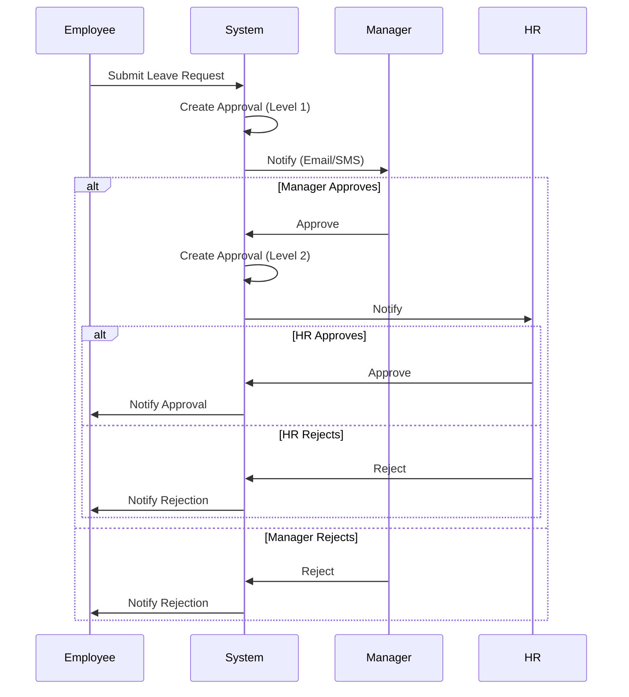

# Approval Workflows Guide

**Version**: 1.0  
**Last Updated**: 2025-12-12  
**Audience**: HR Administrators, Managers, System Configurators  
**Reading Time**: 20-25 minutes

---

## 📋 Overview

This guide explains how to configure and manage multi-level approval workflows in the TA module. You'll learn about approval chains, event-driven notifications, trigger automation, and workflow customization.

### What You'll Learn

- Approval entity structure and levels
- Configuring approval chains
- Event system and types
- Trigger automation (event-based, schedule-based, condition-based)
- Notification configuration
- Custom approval rules
- Common workflows and troubleshooting

### Prerequisites

- Basic understanding of approval processes
- Familiarity with [Concept Overview](./01-concept-overview.md)
- Understanding of [Leave Policy Configuration](./03-leave-policy-configuration-guide.md)

---

## 🔄 Approval Architecture

### Overview

The TA module uses a flexible approval system that supports:
- Multi-level approval chains
- Conditional routing
- Parallel and sequential approvals
- Delegation and escalation
- Event-driven notifications

### Core Components

```
LeaveRequest/TimeException
    ↓
Approval (Multi-level)
    ↓
Event (Notification Trigger)
    ↓
Trigger (Automation)
    ↓
Notification (Email/SMS/Push)
```

---

## 📝 Approval Entity

### Structure

```yaml
Approval:
  id: UUID
  requestType: LEAVE_REQUEST | TIME_EXCEPTION | OVERTIME | SHIFT_SWAP
  requestId: UUID
  
  # Approval Level
  approvalLevel: 1 | 2 | 3 | ...
  approverType: DIRECT_MANAGER | SKIP_MANAGER | HR | CUSTOM
  approverId: UUID
  approverName: string
  
  # Status
  status: PENDING | APPROVED | REJECTED | DELEGATED | ESCALATED
  decision: APPROVE | REJECT | DELEGATE | ESCALATE
  comments: text
  
  # Timing
  requestedAt: datetime
  respondedAt: datetime (nullable)
  dueDate: datetime
  isOverdue: boolean
  
  # Delegation
  delegatedTo: UUID (nullable)
  delegatedAt: datetime (nullable)
  delegationReason: text (nullable)
  
  # Metadata
  createdAt: datetime
  updatedAt: datetime
```

---

## 🔗 Approval Chains

### Single-Level Approval

**Use when**: Simple approval (direct manager only)

```yaml
ApprovalChain:
  requestType: LEAVE_REQUEST
  levels:
    - level: 1
      approverType: DIRECT_MANAGER
      required: true
```

**Flow**:
```
Employee → Direct Manager → [Approved/Rejected]
```

---

### Two-Level Approval

**Use when**: Requires manager + HR approval

```yaml
ApprovalChain:
  requestType: LEAVE_REQUEST
  levels:
    - level: 1
      approverType: DIRECT_MANAGER
      required: true
    
    - level: 2
      approverType: HR
      required: true
```

**Flow**:
```
Employee → Direct Manager → HR → [Approved/Rejected]
```

---

### Three-Level Approval

**Use when**: High-value requests (e.g., extended leave)

```yaml
ApprovalChain:
  requestType: LEAVE_REQUEST
  conditions:
    - field: totalDays
      operator: GREATER_THAN
      value: 10
  
  levels:
    - level: 1
      approverType: DIRECT_MANAGER
      required: true
    
    - level: 2
      approverType: SKIP_MANAGER
      required: true
    
    - level: 3
      approverType: HR
      required: true
```

**Flow**:
```
Employee → Direct Manager → Skip Manager → HR → [Approved/Rejected]
```

---

### Conditional Approval

**Use when**: Approval chain varies by conditions

```yaml
# Short leave: Manager only
ApprovalChain:
  requestType: LEAVE_REQUEST
  conditions:
    - field: totalDays
      operator: LESS_THAN_OR_EQUAL
      value: 3
  levels:
    - level: 1
      approverType: DIRECT_MANAGER

# Long leave: Manager + HR
ApprovalChain:
  requestType: LEAVE_REQUEST
  conditions:
    - field: totalDays
      operator: GREATER_THAN
      value: 3
  levels:
    - level: 1
      approverType: DIRECT_MANAGER
    - level: 2
      approverType: HR
```

---

### Parallel Approval

**Use when**: Multiple approvers at same level (any can approve)

```yaml
ApprovalChain:
  requestType: SHIFT_SWAP
  levels:
    - level: 1
      approvalMode: PARALLEL
      approvers:
        - type: DIRECT_MANAGER
          approverId: "MGR_001"
        - type: DIRECT_MANAGER
          approverId: "MGR_002"
      requiredApprovals: 1  # Any one can approve
```

**Flow**:
```
Employee → [Manager A OR Manager B] → [Approved/Rejected]
```

---

## 📧 Event System

### What are Events?

**Events** are system-generated notifications triggered by specific actions or conditions.

### Event Types

| Event Type | Trigger | Recipients | Example |
|------------|---------|------------|---------|
| `REQUEST_SUBMITTED` | Employee submits request | Manager | Leave request submitted |
| `APPROVAL_PENDING` | Awaiting approval | Approver | Pending your approval |
| `REQUEST_APPROVED` | Request approved | Employee | Your leave approved |
| `REQUEST_REJECTED` | Request rejected | Employee | Your leave rejected |
| `APPROVAL_OVERDUE` | Approval past due date | Approver, HR | Approval overdue |
| `REQUEST_CANCELLED` | Request cancelled | Manager | Leave request cancelled |
| `DELEGATION_ASSIGNED` | Approval delegated | Delegate | Approval delegated to you |

---

### Event Structure

```yaml
Event:
  id: UUID
  eventType: REQUEST_SUBMITTED | APPROVAL_PENDING | etc.
  sourceType: LEAVE_REQUEST | TIME_EXCEPTION | etc.
  sourceId: UUID
  
  # Recipients
  recipientType: EMPLOYEE | MANAGER | HR | CUSTOM
  recipientId: UUID
  
  # Payload
  payload:
    requestType: "Annual Leave"
    employeeName: "John Doe"
    startDate: "2025-01-20"
    endDate: "2025-01-24"
    totalDays: 5
    reason: "Family vacation"
  
  # Status
  status: PENDING | SENT | FAILED
  sentAt: datetime (nullable)
  failureReason: text (nullable)
  
  # Metadata
  createdAt: datetime
```

---

### Event Configuration

```yaml
EventConfiguration:
  eventType: REQUEST_SUBMITTED
  enabled: true
  
  # Channels
  channels:
    - EMAIL
    - SMS
    - PUSH_NOTIFICATION
    - IN_APP
  
  # Template
  emailTemplate: "leave_request_submitted"
  smsTemplate: "leave_request_submitted_sms"
  
  # Timing
  sendImmediately: true
  delayMinutes: 0
```

---

## ⚙️ Trigger System

### What are Triggers?

**Triggers** are automated actions executed when specific conditions are met.

### Trigger Types

#### 1. EVENT_BASED

**Trigger**: When specific event occurs

```yaml
Trigger:
  triggerType: EVENT_BASED
  eventType: APPROVAL_OVERDUE
  
  # Conditions
  conditions:
    - field: daysOverdue
      operator: GREATER_THAN
      value: 2
  
  # Actions
  actions:
    - type: SEND_NOTIFICATION
      recipients: [APPROVER, HR]
      template: "approval_overdue_reminder"
    
    - type: ESCALATE
      escalateTo: SKIP_MANAGER
```

---

#### 2. SCHEDULE_BASED

**Trigger**: At specific time/interval

```yaml
Trigger:
  triggerType: SCHEDULE_BASED
  schedule: "0 9 * * *"  # Daily at 9 AM
  
  # Actions
  actions:
    - type: SEND_DIGEST
      recipients: [MANAGER]
      template: "pending_approvals_digest"
```

---

#### 3. CONDITION_BASED

**Trigger**: When condition becomes true

```yaml
Trigger:
  triggerType: CONDITION_BASED
  
  # Conditions
  conditions:
    - field: pendingApprovals
      operator: GREATER_THAN
      value: 10
  
  # Actions
  actions:
    - type: SEND_ALERT
      recipients: [HR]
      template: "high_pending_approvals_alert"
```

---

## 🔔 Notification Configuration

### Notification Channels

#### Email

```yaml
NotificationChannel:
  type: EMAIL
  enabled: true
  
  # SMTP Configuration
  smtpHost: "smtp.company.com"
  smtpPort: 587
  smtpUser: "noreply@company.com"
  smtpPassword: "***"
  
  # Templates
  defaultTemplate: "default_email"
  fromAddress: "noreply@company.com"
  fromName: "xTalent System"
```

---

#### SMS

```yaml
NotificationChannel:
  type: SMS
  enabled: true
  
  # SMS Gateway
  provider: "TWILIO"
  accountSid: "***"
  authToken: "***"
  fromNumber: "+1234567890"
  
  # Templates
  defaultTemplate: "default_sms"
```

---

#### Push Notification

```yaml
NotificationChannel:
  type: PUSH_NOTIFICATION
  enabled: true
  
  # Push Service
  provider: "FIREBASE"
  serverKey: "***"
  
  # Templates
  defaultTemplate: "default_push"
```

---

### Notification Templates

**Email Template**:
```html
Subject: Leave Request Submitted - {{employeeName}}

Dear {{managerName}},

{{employeeName}} has submitted a leave request:

Type: {{leaveType}}
Period: {{startDate}} to {{endDate}}
Total Days: {{totalDays}}
Reason: {{reason}}

Please review and approve/reject:
{{approvalLink}}

Thank you,
xTalent System
```

**SMS Template**:
```
Leave request from {{employeeName}}: {{totalDays}} days ({{startDate}}-{{endDate}}). Approve: {{shortLink}}
```

---

## 🎯 Common Workflows

### Workflow 1: Leave Request Approval

**Flow**:


---

### Workflow 2: Approval Delegation

**Scenario**: Manager on leave, delegates approval to colleague

**Flow**:
```yaml
# Step 1: Manager delegates
Approval:
  approverId: "MGR_001"
  status: DELEGATED
  delegatedTo: "MGR_002"
  delegationReason: "On annual leave"

# Step 2: System notifies delegate
Event:
  eventType: DELEGATION_ASSIGNED
  recipientId: "MGR_002"

# Step 3: Delegate approves/rejects
Approval:
  approverId: "MGR_002"  # Delegate
  status: APPROVED
  comments: "Approved on behalf of MGR_001"
```

---

### Workflow 3: Approval Escalation

**Scenario**: Manager doesn't respond within SLA

**Flow**:
```yaml
# Step 1: Approval overdue
Trigger:
  triggerType: EVENT_BASED
  eventType: APPROVAL_OVERDUE
  conditions:
    - field: daysOverdue
      operator: GREATER_THAN
      value: 2

# Step 2: Send reminder
Action:
  type: SEND_NOTIFICATION
  recipients: [APPROVER]
  template: "approval_overdue_reminder"

# Step 3: Escalate if still no response
Trigger:
  conditions:
    - field: daysOverdue
      operator: GREATER_THAN
      value: 5
  
  actions:
    - type: ESCALATE
      escalateTo: SKIP_MANAGER
    
    - type: SEND_NOTIFICATION
      recipients: [SKIP_MANAGER, HR]
      template: "approval_escalated"
```

---

### Workflow 4: Batch Approval

**Scenario**: Manager approves multiple requests at once

**Flow**:
```yaml
BatchApproval:
  approverId: "MGR_001"
  approvalIds:
    - "APPR_001"
    - "APPR_002"
    - "APPR_003"
  decision: APPROVE
  comments: "All approved - team has coverage"

# System processes each approval
# Sends individual notifications to employees
```

---

## 🛠️ Custom Approval Rules

### Rule-Based Routing

**Example**: Route to different approvers based on leave type

```yaml
ApprovalRoutingRule:
  requestType: LEAVE_REQUEST
  
  # Sick leave: Manager only
  rules:
    - conditions:
        - field: leaveType
          operator: EQUALS
          value: "SICK"
      approvalChain:
        - level: 1
          approverType: DIRECT_MANAGER
  
  # Annual leave > 5 days: Manager + HR
    - conditions:
        - field: leaveType
          operator: EQUALS
          value: "ANNUAL"
        - field: totalDays
          operator: GREATER_THAN
          value: 5
      approvalChain:
        - level: 1
          approverType: DIRECT_MANAGER
        - level: 2
          approverType: HR
```

---

### Auto-Approval Rules

**Example**: Auto-approve requests meeting criteria

```yaml
AutoApprovalRule:
  requestType: LEAVE_REQUEST
  enabled: true
  
  # Auto-approve sick leave ≤ 1 day
  conditions:
    - field: leaveType
      operator: EQUALS
      value: "SICK"
    - field: totalDays
      operator: LESS_THAN_OR_EQUAL
      value: 1
    - field: hasDocumentation
      operator: EQUALS
      value: true
  
  # Actions
  actions:
    - type: AUTO_APPROVE
    - type: NOTIFY_EMPLOYEE
    - type: NOTIFY_MANAGER
      notificationType: FYI  # For information only
```

---

## ⚠️ Troubleshooting

### Issue 1: Approval Stuck in Pending

**Symptom**: Approval not moving forward

**Diagnosis**:
```sql
SELECT * FROM approval
WHERE status = 'PENDING'
  AND created_at < NOW() - INTERVAL '7 days';
```

**Solution**:
- Check if approver received notification
- Verify approver has access
- Escalate to skip manager
- Check for system errors in logs

---

### Issue 2: Notifications Not Sent

**Symptom**: Approver didn't receive notification

**Diagnosis**:
```sql
SELECT * FROM event
WHERE status = 'FAILED'
  AND event_type = 'APPROVAL_PENDING';
```

**Solution**:
- Check email/SMS configuration
- Verify recipient contact information
- Check notification channel status
- Retry failed notifications

---

### Issue 3: Incorrect Approver

**Symptom**: Request routed to wrong person

**Diagnosis**:
- Check approval chain configuration
- Verify employee's manager assignment
- Check custom routing rules

**Solution**:
- Update manager assignment
- Correct approval chain
- Reassign approval to correct person

---

## ✅ Best Practices

### 1. Approval Chain Design

✅ **DO**:
- Keep chains simple (max 3 levels)
- Use conditional routing for flexibility
- Set clear SLAs for each level
- Document approval policies

❌ **DON'T**:
- Create overly complex chains
- Have too many approval levels
- Use unclear approval criteria

---

### 2. Notification Management

✅ **DO**:
- Use multiple channels (email + SMS)
- Send timely reminders
- Provide clear action links
- Keep messages concise

❌ **DON'T**:
- Spam with too many notifications
- Use vague notification text
- Forget to include action links

---

### 3. Delegation and Escalation

✅ **DO**:
- Allow delegation for planned absences
- Set up automatic escalation
- Track delegation history
- Notify all parties

❌ **DON'T**:
- Allow unlimited delegation
- Skip escalation process
- Forget to notify delegate

---

## 📚 Related Guides

- [Concept Overview](./01-concept-overview.md) - Module overview
- [Conceptual Guide](./02-conceptual-guide.md) - How the system works
- [Leave Policy Configuration](./03-leave-policy-configuration-guide.md) - Policy setup
- [Attendance Tracking](./06-attendance-tracking-guide.md) - Time tracking

---

**Document Version**: 1.0  
**Created**: 2025-12-12  
**Last Review**: 2025-12-12  
**Author**: xTalent Documentation Team
