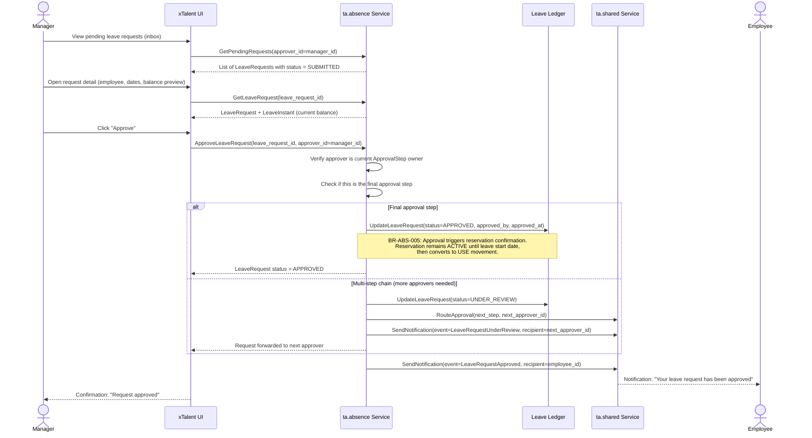
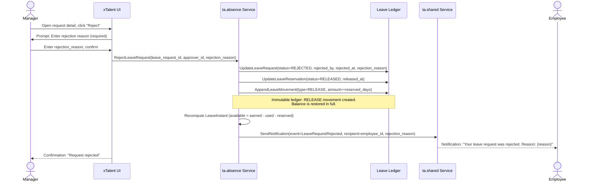
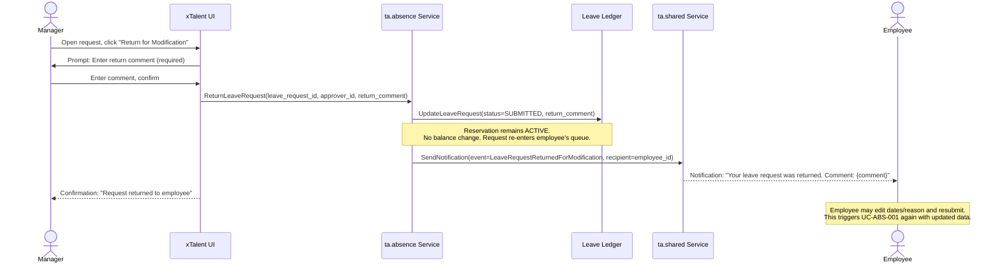

# Flow: Approve Leave Request

**Bounded Context:** ta.absence
**Use Case ID:** UC-ABS-002
**Version:** 1.0 | 2026-03-24

---

## Overview

A manager reviews a pending leave request and either approves, rejects, or
returns it for modification. Approval transitions the reservation to confirmed
status. Rejection releases the balance. Return for modification keeps the
reservation active while the employee revises dates or reason.

---

## Actors

| Actor | Role |
|-------|------|
| Manager | Reviews and acts on the leave request |
| System (ta.absence) | Processes approval action, updates balance, converts/releases reservation |
| System (ta.shared) | Sends notification to employee |
| Employee | Receives outcome notification |

---

## Preconditions

- LeaveRequest exists with status = SUBMITTED or UNDER_REVIEW
- Manager is the designated approver for the current ApprovalStep
- LeaveReservation is ACTIVE (balance is held)

---

## Postconditions (approval)

- LeaveRequest status = APPROVED
- LeaveReservation status = ACTIVE (will convert to USE movement on leave start date)
- Employee notified of approval

## Postconditions (rejection)

- LeaveRequest status = REJECTED
- LeaveReservation status = RELEASED
- LeaveMovement (type = RELEASE) appended — balance restored
- LeaveInstant.reserved decremented, available restored
- Employee notified of rejection with reason

## Postconditions (return for modification)

- LeaveRequest status = SUBMITTED (reset)
- Reservation maintained; no balance change
- Employee notified to revise and resubmit

---

## Happy Path: Manager Approves

---

## Alternative Path A: Manager Rejects

---

## Alternative Path B: Manager Returns for Modification

---

## Business Rules

| Rule ID | Description |
|---------|-------------|
| BR-ABS-005 | Approval triggers reservation confirmation: when all approval steps are complete, LeaveReservation remains ACTIVE and converts to a USE LeaveMovement on the leave start date |
| BR-ABS-010 | Rejection requires a mandatory rejection_reason text; empty reason must be blocked by the UI and API |
| ADR-TA-001 | Immutable ledger: RELEASE LeaveMovement is appended on rejection; the original RESERVE movement is never deleted or modified |
| BR-ABS-002 | Multi-step approval: if ApprovalChain has more than one step, request transitions to UNDER_REVIEW after first approval; APPROVED status requires all steps satisfied |

---

## Key Domain Objects Created / Modified

| Object | Action | Key Fields |
|--------|--------|------------|
| LeaveRequest | Updated | status (APPROVED / REJECTED / SUBMITTED), approved_by, rejected_by, rejection_reason |
| LeaveReservation | Updated | status (ACTIVE remains on approve; RELEASED on reject) |
| LeaveMovement | Appended | type=RELEASE, amount=+reserved_days (on rejection; immutable) |
| LeaveInstant | Updated | reserved--, available++ (on rejection only) |
| Notification | Created | event=LeaveRequestApproved or LeaveRequestRejected, recipient=employee |
