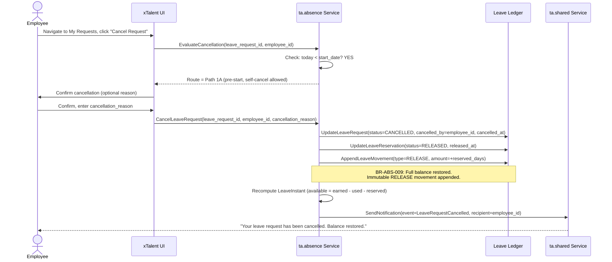
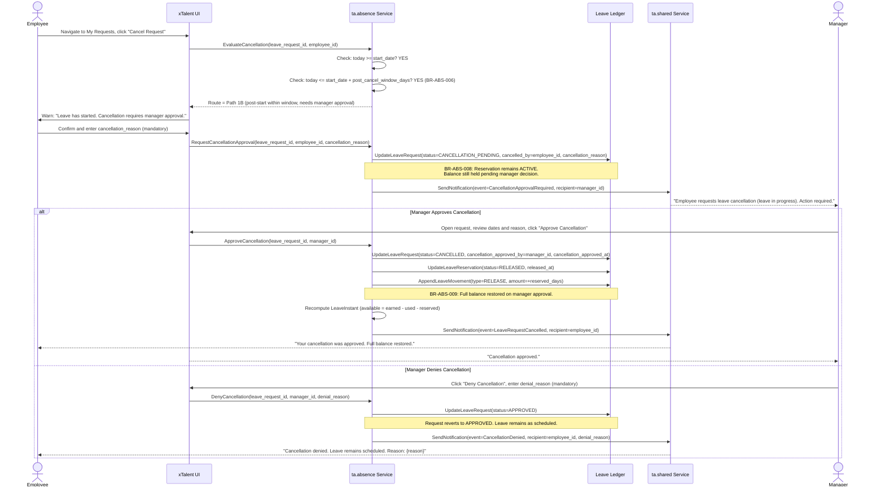
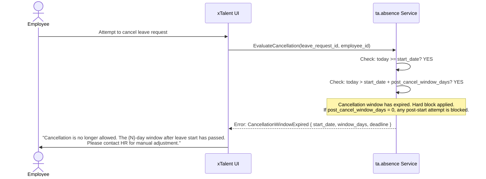
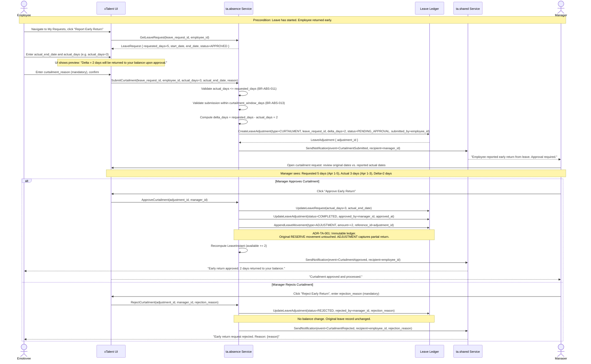
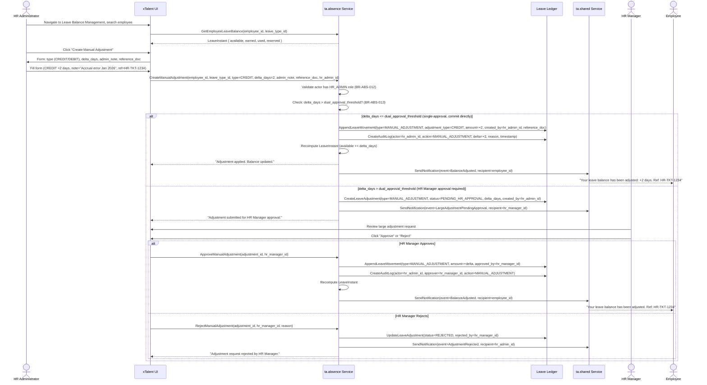

# Flow: Adjust Leave Request (Cancel & Curtailment)

**Bounded Context:** ta.absence
**Use Case ID:** UC-ABS-003 (Cancel) | UC-ABS-004 (Curtailment) | UC-ABS-005 (Manual Adjustment)
**Version:** 3.0 | 2026-03-31

> | Path | Trigger | Approval Required? |
> |------|---------|-------------------|
> | **Path 1 — Full Cancel** | Employee cancels the entire leave request | No (before start_date) / Yes (after start_date within N days) / Blocked (after N days) |
> | **Path 2 — Curtailment** | Employee returned early; actual days < requested days | Yes — always requires manager approval |
> | **Path 3 — Manual Balance Adjustment** | HR Admin corrects balance without a ticket | No (within threshold) / Dual approval (above threshold) |

---

## Overview

After a leave request is submitted or approved, three post-submission modification scenarios exist:

1. **Full Cancel** — Employee cancels the entire leave and will not take it. The approval
   requirement depends on the relationship between today and the leave `start_date`:
   - **Before `start_date`**: self-service cancel, no approval needed.
   - **After `start_date`, within `post_cancel_window_days`**: requires manager approval.
   - **After `start_date + post_cancel_window_days`**: blocked. Cannot cancel at all.
   - **`post_cancel_window_days = 0`**: any attempt after `start_date` is immediately blocked.

2. **Curtailment (Early Return)** — Employee started the leave but returned before the planned
   end date. Delta days (unused) are returned to the balance. Always requires manager approval
   because it modifies a leave that has already started.

3. **Manual Balance Adjustment** — HR Administrator directly credits or debits an employee's
   leave balance without an originating leave request. Dual approval required if adjustment
   exceeds `dual_approval_threshold`.

---

## Actors

| Actor | Role |
|-------|------|
| Employee | Initiates Full Cancel or Curtailment request |
| System (ta.absence) | Evaluates cancel window, transitions status, computes balance changes |
| Manager | Approves post-start-date cancellations; approves curtailment adjustments |
| HR Administrator | Initiates Manual Balance Adjustments |
| HR Manager | Second-level approver for large manual adjustments |
| System (ta.shared) | Sends notifications |

---

## Decision Guide: Which Path to Use?

```
Has leave started yet? (start_date <= today?)
├── NO (today < start_date)
│   └── → Path 1A: Self-Cancel (auto-approved, no manager needed)
└── YES (today >= start_date)
    ├── today <= start_date + post_cancel_window_days?
    │   ├── YES → Path 1B: Post-Start Cancel (manager approval required)
    │   └── NO  → Path 1C: BLOCKED (window expired, cannot cancel)
    │             Special: post_cancel_window_days = 0 → always BLOCKED
    └── Employee returned early (actual_days < requested_days)?
        └── → Path 2: Curtailment (manager approval always required)

HR Admin correcting balance without a ticket?
    └── → Path 3: Manual Balance Adjustment
```

---

## Path 1: Full Cancel

### Constraint Matrix

| Condition | Route | Approval |
|-----------|-------|----------|
| `today < start_date` | Path 1A | None — auto cancel |
| `today >= start_date` AND `today <= start_date + post_cancel_window_days` | Path 1B | Manager approval required |
| `today > start_date + post_cancel_window_days` | Path 1C | BLOCKED |
| `post_cancel_window_days = 0` AND `today >= start_date` | Path 1C | BLOCKED |

> **Config key:** `LeaveType.post_cancel_window_days` (default in `TenantConfig`). If set to `0`,
> any cancellation on or after the leave start date is permanently blocked.

---

### Path 1A: Cancel Before Leave Start (Self-Service, No Approval)

**Preconditions:**
- LeaveRequest status = SUBMITTED, UNDER_REVIEW, or APPROVED
- `today < start_date`

**Postconditions:**
- LeaveRequest status = CANCELLED
- LeaveReservation status = RELEASED
- LeaveMovement (type = RELEASE) appended — full balance restored
- Employee notified



---

### Path 1B: Cancel After Leave Start, Within Window (Manager Approval Required)

**Preconditions:**
- LeaveRequest status = APPROVED
- `today >= start_date` (leave has started)
- `today <= start_date + post_cancel_window_days` (still within allowed window)
- `post_cancel_window_days > 0`

**Postconditions (Approved):**
- LeaveRequest status = CANCELLED
- LeaveReservation status = RELEASED; full balance restored
- Employee and manager notified

**Postconditions (Denied):**
- LeaveRequest status = APPROVED (unchanged)
- Leave proceeds as originally scheduled



---

### Path 1C: Cancel Window Expired — Blocked

**Trigger:** `today > start_date + post_cancel_window_days` OR `post_cancel_window_days = 0` AND `today >= start_date`



---

## Path 2: Curtailment — Early Return (Manager Approval Always Required)

> **When to use:** Employee started the leave but returned to work before the planned end date.
> The system returns the unused days to the employee's balance.
> The original LeaveRequest is preserved with updated `actual_days` and `actual_end_date`.
>
> **Why approval is always required:** The leave has already started. The manager must confirm
> the actual return date to prevent unilateral balance manipulation.

**Preconditions:**
- LeaveRequest status = APPROVED
- `today >= start_date` (leave has begun)
- Curtailment submitted within `curtailment_window_days` after leave ends (BR-ABS-013)
- `actual_days < requested_days`

**Postconditions (Approved):**
- LeaveRequest updated: `actual_days`, `actual_end_date` recorded
- LeaveAdjustment: status = COMPLETED
- LeaveMovement appended: type=ADJUSTMENT, amount=+(requested_days - actual_days)
- LeaveInstant.available += delta_days

**Postconditions (Rejected):**
- LeaveAdjustment: status = REJECTED
- No balance change; original leave record unchanged
- Employee notified with reason



---

## Path 3: Manual Balance Adjustment (HR Admin — Standalone)

> **When to use:** HR Administrator needs to directly credit or debit an employee's leave balance
> without an originating leave request.
>
> **Common scenarios:**
> - Accrual calculation error correction
> - Retroactive carry-forward grant
> - Special leave compensation (e.g., compensatory days for weekend work)
> - Disciplinary balance deduction
> - Migration or system data fix

**Preconditions:**
- Actor has `HR_ADMIN` or `HR_MANAGER` role
- Employee has an active LeaveInstant for the target `leave_type_id`
- Mandatory fields: `admin_note`, `reference_doc`

**Approval logic:**
- `delta_days <= dual_approval_threshold` → HR Admin can commit directly (single approval)
- `delta_days > dual_approval_threshold` → HR Manager second approval required before ledger commit



---

## Business Rules

| Rule ID | Description |
|---------|-------------|
| BR-ABS-006 | Cancel window configuration: `LeaveType.post_cancel_window_days` defines how many days after `start_date` a cancel request is still permitted. Configured at tenant/leave-type level. |
| BR-ABS-007 | Pre-start self-cancel: if `today < start_date`, employee may cancel without any manager approval. No deadline sub-constraint within this window. |
| BR-ABS-008 | Post-start cancel requires manager approval: if `today >= start_date` AND `today <= start_date + post_cancel_window_days`, request transitions to `CANCELLATION_PENDING`; reservation stays ACTIVE until manager decides. |
| BR-ABS-009 | Full balance restore: a completed cancellation (auto or manager-approved) always restores the full reserved amount via a RELEASE LeaveMovement. No partial balance restore on cancel. |
| BR-ABS-010 | Cancel hard block: if `today > start_date + post_cancel_window_days`, the system blocks the cancel completely with error `CancellationWindowExpired`. Employee must contact HR for manual adjustment. If `post_cancel_window_days = 0`, any attempt on or after `start_date` is immediately blocked. |
| BR-ABS-011 | Curtailment constraint: `actual_days` must be strictly less than `requested_days`. Requesting more days than originally approved requires a new leave submission. |
| BR-ABS-012 | Manual adjustment authorization and dual-approval: only `HR_ADMIN` or `HR_MANAGER` roles may initiate. Adjustments with `delta_days > dual_approval_threshold` (configurable, default 5 days) require a second HR Manager approval before the movement is committed to the ledger. |
| BR-ABS-013 | Curtailment submission window: employee must submit the curtailment within `curtailment_window_days` (default 5 business days) after `actual_end_date`. Submissions past this window are blocked; HR Admin must use Path 3 instead. |
| ADR-TA-001 | Immutable ledger: balance changes are always captured as new movements (RELEASE, ADJUSTMENT, MANUAL_ADJUSTMENT). No existing movement is modified or deleted. |

---

## LeaveMovement Type Reference

| Movement Type | Path | Direction | Description |
|---------------|------|-----------|-------------|
| `RESERVE` | Submit (UC-ABS-001) | (-) debit | Balance held at submission |
| `RELEASE` | Path 1 (Full Cancel) | (+) credit | Full reservation released on cancel |
| `ADJUSTMENT` | Path 2 (Curtailment) | (+) credit | Partial return of unused days after early return |
| `MANUAL_ADJUSTMENT` | Path 3 (HR Admin) | (+/-) | Direct HR balance correction — CREDIT or DEBIT |
| `USE` | Scheduled post-approval | (-) debit | Converted from RESERVE when leave actually starts |

---

## Key Domain Objects Created / Modified

| Object | Action | Path | Key Fields |
|--------|--------|------|------------|
| LeaveRequest | Updated | Path 1 | `status=CANCELLATION_PENDING → CANCELLED`, `cancelled_by`, `cancellation_approved_by` |
| LeaveRequest | Updated | Path 2 | `actual_days`, `actual_end_date` |
| LeaveReservation | Updated | Path 1 | `status=RELEASED`, `released_at` |
| LeaveAdjustment | Created | Path 2, 3 | `type`, `delta_days`, `reason`, `status`, `reference_doc`, `approved_by`, `rejected_by` |
| LeaveMovement | Appended | All paths | `type=(RELEASE/ADJUSTMENT/MANUAL_ADJUSTMENT)`, `amount`, `reference_id` |
| LeaveInstant | Updated | All paths | `reserved--`, `available++` (Path 1, 2) or direct delta (Path 3) |
| AuditLog | Created | Path 3 | `actor`, `approver`, `action`, `delta`, `reason`, `timestamp` |
| Notification | Created | All paths | Varies by path and outcome |

---

## State Transition Summary

```
Path 1 — Full Cancel:
  Evaluation:
    today < start_date                          → Path 1A: auto-cancel (CANCELLED immediately)
    today >= start_date, within window          → Path 1B: CANCELLATION_PENDING → CANCELLED or APPROVED
    today > start_date + post_cancel_window_days → Path 1C: ERROR CancellationWindowExpired
    post_cancel_window_days = 0, today >= start  → Path 1C: ERROR CancellationWindowExpired

  LeaveRequest status chain (Path 1B):
    SUBMITTED/APPROVED
      → CANCELLATION_PENDING   (awaiting manager)
      → CANCELLED              (manager approved)
      → APPROVED               (manager denied, reverts)

Path 2 — Curtailment (always needs approval):
  LeaveAdjustment status chain:
    PENDING_APPROVAL
      → COMPLETED   (manager approved, balance returned)
      → REJECTED    (manager rejected, no balance change)

Path 3 — Manual Adjustment:
  LeaveAdjustment status chain (large delta):
    PENDING_HR_APPROVAL
      → COMPLETED   (HR Manager approved, balance updated)
      → REJECTED    (HR Manager rejected)
  Direct commit (small delta): no intermediate status
```
