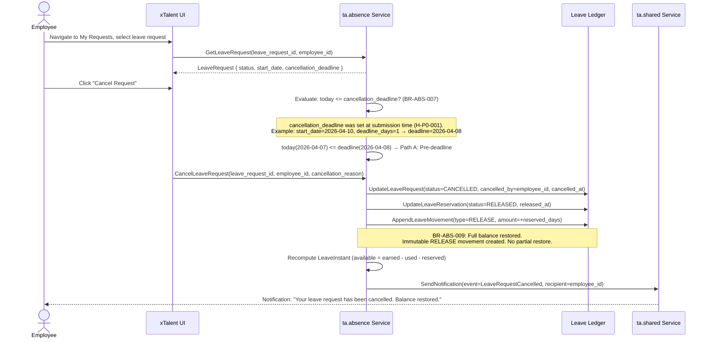
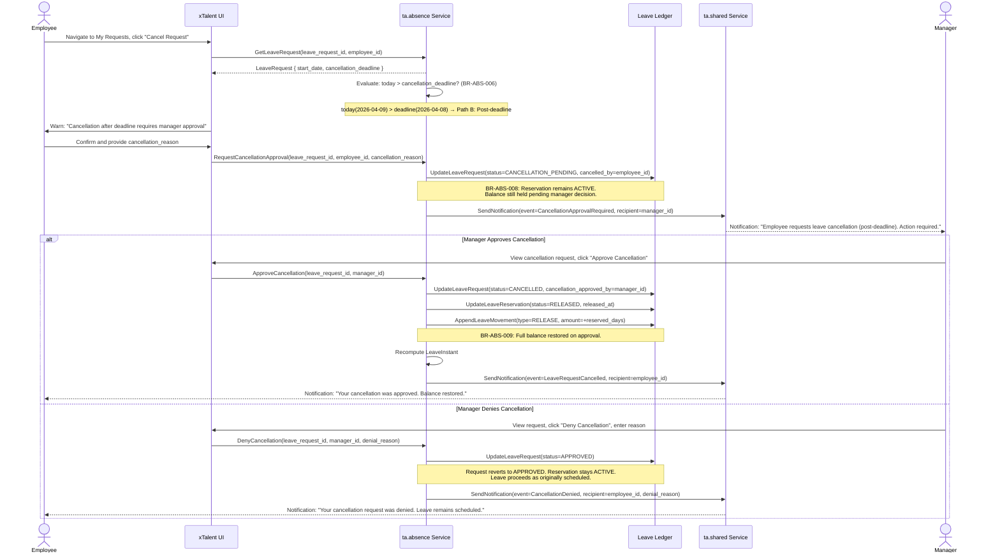
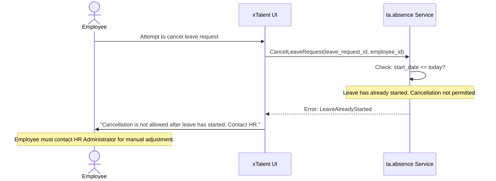

# Flow: Cancel Leave Request

**Bounded Context:** ta.absence
**Use Case ID:** UC-ABS-003
**Version:** 1.0 | 2026-03-24

---

## Overview

An employee requests cancellation of a previously submitted or approved leave
request. The flow branches based on H-P0-001: whether the cancellation is before
or after the configured deadline. Pre-deadline cancellations are auto-approved.
Post-deadline cancellations require manager approval.

Cancellation of a leave request that has already started (leave_start_date <= today)
is not permitted.

---

## Actors

| Actor | Role |
|-------|------|
| Employee | Initiates the cancellation request |
| System (ta.absence) | Evaluates deadline, transitions status, restores balance |
| Manager | Acts on post-deadline cancellation requests (Path B only) |
| System (ta.shared) | Sends notifications |

---

## Preconditions

- LeaveRequest exists with status = SUBMITTED, UNDER_REVIEW, or APPROVED
- LeaveRequest.start_date > today (leave has not yet started)
- Employee is the request owner (cancelled_by = employee_id)

---

## Postconditions (Path A — pre-deadline, auto-approved)

- LeaveRequest status = CANCELLED
- LeaveReservation status = RELEASED
- LeaveMovement (type = RELEASE) appended — full balance restored
- LeaveInstant.reserved decremented, available fully restored (BR-ABS-009)
- Employee notified of cancellation confirmation

## Postconditions (Path B — post-deadline, manager approved)

- LeaveRequest status = CANCELLED (after manager approval)
- LeaveReservation status = RELEASED
- LeaveMovement (type = RELEASE) appended — full balance restored
- Employee and manager both notified

## Postconditions (Path B — post-deadline, manager rejected)

- LeaveRequest status = APPROVED (unchanged)
- LeaveReservation remains ACTIVE
- Employee notified that cancellation was denied

---

## Path A: Cancel Before Deadline (Auto-Approved)

---

## Path B: Cancel After Deadline (Requires Manager Approval)

---

## Exception Path: Leave Already Started

---

## Business Rules

| Rule ID | Description |
|---------|-------------|
| BR-ABS-006 | Cancellation deadline is configurable: set in LeaveType.cancellation_deadline_days (tenant-level default in TenantConfig.cancellation_deadline_days). Computed at request submission time (H-P0-001) |
| BR-ABS-007 | Self-cancel before deadline: employee may cancel without manager approval if today <= cancellation_deadline |
| BR-ABS-008 | Manager approval after deadline: cancellations submitted after the deadline require manager approval; LeaveRequest transitions to CANCELLATION_PENDING; reservation remains active until manager acts |
| BR-ABS-009 | Full balance restore: when a cancellation is completed (either auto or manager-approved), the full reserved balance is restored via a RELEASE LeaveMovement; no partial restoration |
| ADR-TA-001 | Immutable ledger: RELEASE movement is appended; original RESERVE movement is never deleted |
| H-P0-001 | Cancellation deadline policy: deadline computed at submission time and stored on LeaveRequest; default = 1 business day before leave start date; configurable per tenant/BU |

---

## Key Domain Objects Created / Modified

| Object | Action | Key Fields |
|--------|--------|------------|
| LeaveRequest | Updated | status (CANCELLATION_PENDING → CANCELLED or APPROVED), cancelled_by, cancellation_approved_by |
| LeaveReservation | Updated | status = RELEASED (on final cancellation approval) |
| LeaveMovement | Appended | type=RELEASE, amount=+reserved_days (immutable; full restore per BR-ABS-009) |
| LeaveInstant | Updated | reserved--, available++ (on cancellation completion) |
| Notification | Created | CancellationApprovalRequired (to manager), LeaveRequestCancelled or CancellationDenied (to employee) |
