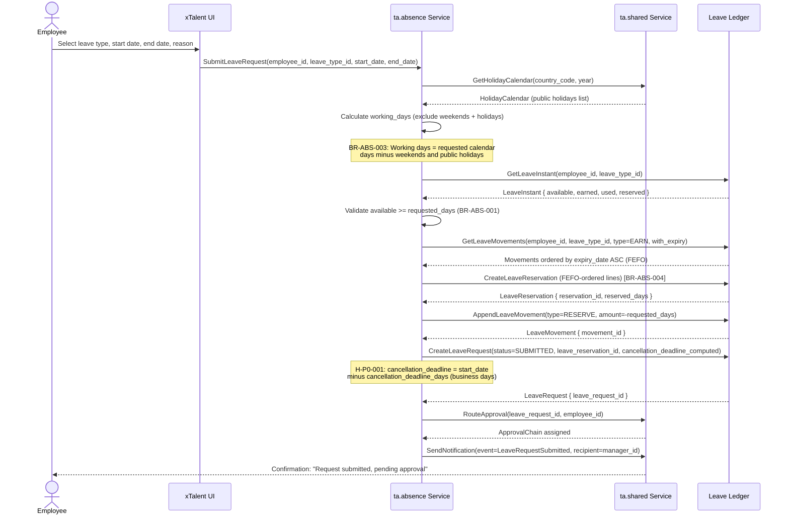
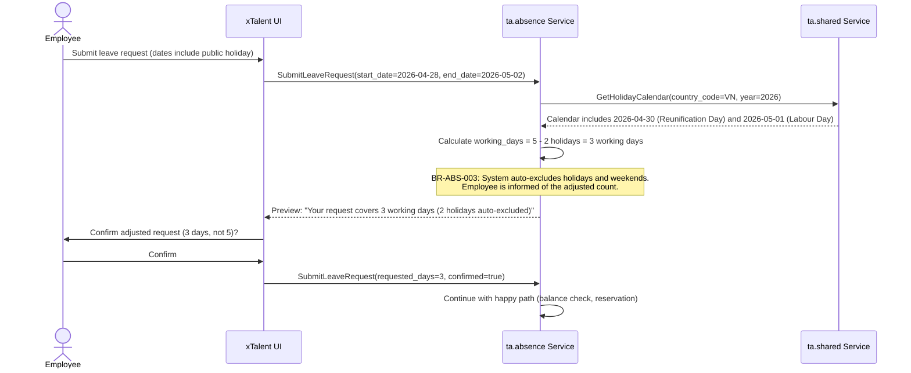

# Flow: Submit Leave Request

**Bounded Context:** ta.absence
**Use Case ID:** UC-ABS-001
**Version:** 1.0 | 2026-03-24

---

## Overview

An employee submits a request for time off. The system validates available
balance, adjusts for public holidays and weekends, reserves balance using FEFO
ordering, and routes the request to the appropriate manager for approval.

---

## Actors

| Actor | Role |
|-------|------|
| Employee | Initiates the leave request |
| System (ta.absence) | Validates balance, calculates working days, creates reservation |
| System (ta.shared) | Resolves holiday calendar, triggers notifications |
| Manager | Receives notification; acts in UC-ABS-002 |

---

## Preconditions

- Employee is active with a valid employment record in Employee Central
- At least one LeavePolicy is active for the employee and leave type
- The Period covering the requested dates is in OPEN status
- HolidayCalendar for the employee's country_code is published for the year

---

## Postconditions

- LeaveRequest created with status = SUBMITTED
- LeaveReservation created with status = ACTIVE (FEFO-ordered lines)
- LeaveInstant.reserved is incremented by requested_days
- LeaveMovement (type = RESERVE) appended to the ledger
- Manager notified via Notification event

---

## Happy Path



---

## Alternative Path A: Insufficient Balance

```mermaid
sequenceDiagram
    actor Employee
    participant UI as xTalent UI
    participant ABS as ta.absence Service

    Employee->>UI: Submit leave request
    UI->>ABS: SubmitLeaveRequest(...)
    ABS->>ABS: Validate available >= requested_days
    ABS-->>UI: Error: InsufficientBalance { available, requested }

    alt LeaveType.allow_advance_leave = true
        UI->>Employee: Prompt: "Balance insufficient. Submit advance leave request?"
        Employee->>UI: Confirm advance leave
        UI->>ABS: SubmitLeaveRequest(advance_leave=true)
        ABS->>ABS: Allow negative balance; flag request as ADVANCE_LEAVE
        ABS-->>UI: Reservation created with advance_leave=true warning
    else allow_advance_leave = false
        UI->>Employee: Error: "Insufficient balance. Available: {X} days. Requested: {Y} days."
        Note over Employee: Employee may adjust dates or choose a different leave type
    end
```

---

## Exception Path: Holiday / Weekend Overlap



---

## Business Rules

| Rule ID | Description |
|---------|-------------|
| BR-ABS-001 | Balance check: available >= requested_days. Block submission if insufficient, unless allow_advance_leave = true on the LeaveType |
| BR-ABS-003 | Working day calculation: exclude Saturdays, Sundays, and public holidays from the HolidayCalendar |
| BR-ABS-004 | FEFO reservation: consume leave balance in First-Expired-First-Out order by expiry_date of source LeaveMovements |
| H-P0-001 | Cancellation deadline: computed at submission time as start_date minus cancellation_deadline_days (business days). Stored on LeaveRequest. Enables self-cancel vs. manager-approval path in UC-ABS-003 |

---

## Key Domain Objects Created / Modified

| Object | Action | Key Fields |
|--------|--------|------------|
| LeaveRequest | Created | status=SUBMITTED, leave_reservation_id, cancellation_deadline |
| LeaveReservation | Created | status=ACTIVE, FEFO-ordered reservation_lines |
| LeaveMovement | Appended | type=RESERVE, amount=-requested_days (immutable) |
| LeaveInstant | Updated | reserved += requested_days, available -= requested_days |
| Notification | Created | event=LeaveRequestSubmitted, recipient=manager |
