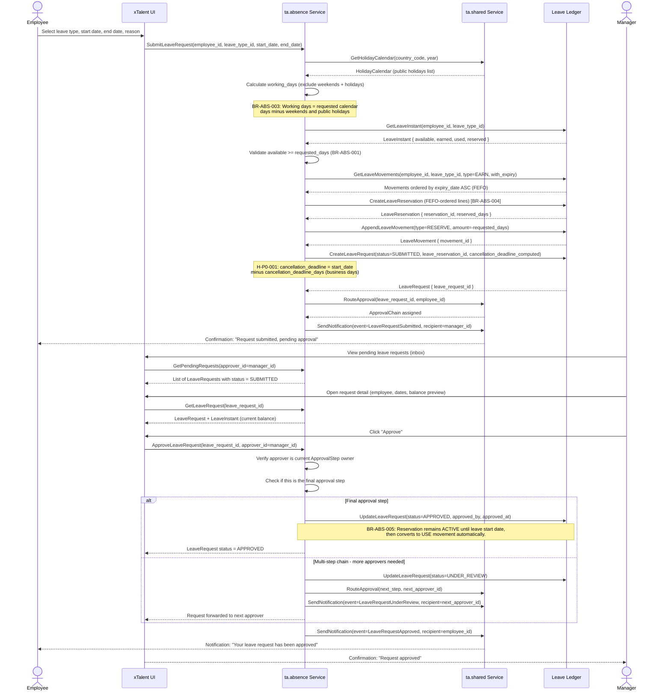
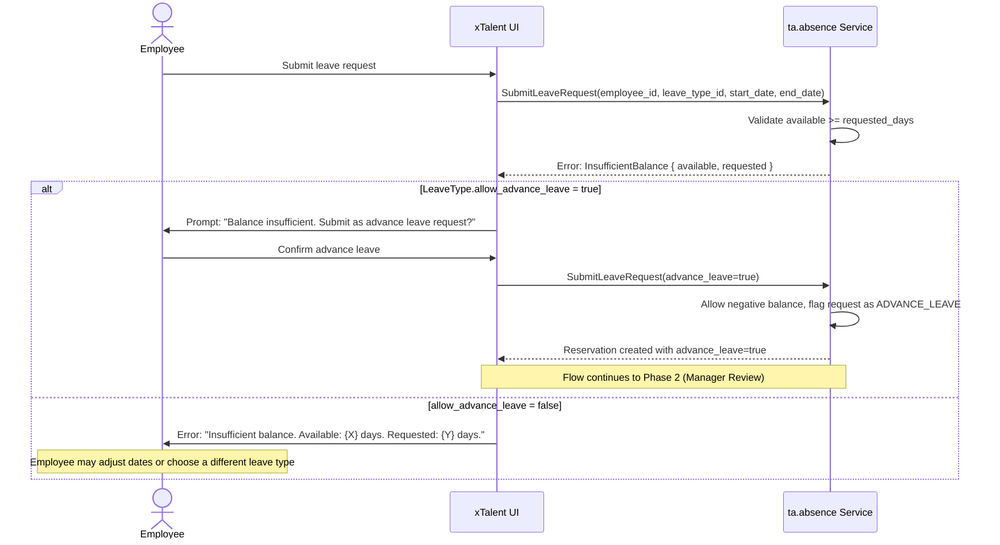
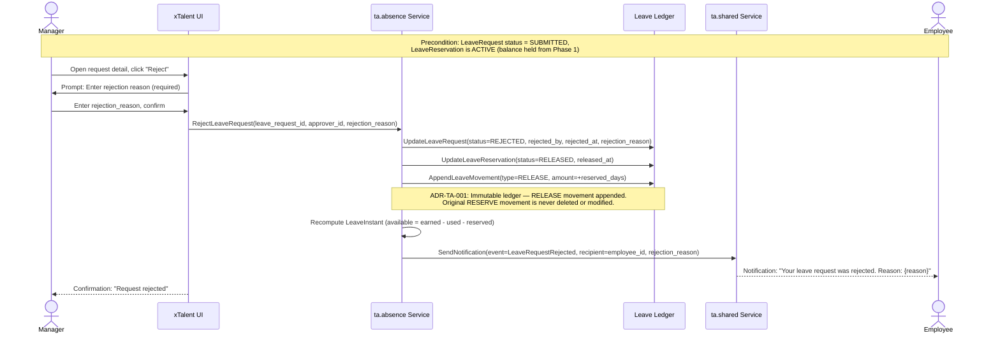
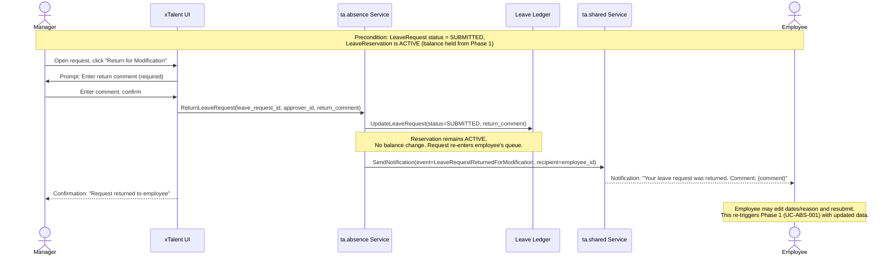

# Flow: Submit & Approve Leave Request (End-to-End)

**Bounded Context:** ta.absence
**Use Case ID:** UC-ABS-001 → UC-ABS-002
**Version:** 2.0 | 2026-03-31

> **Note:** This document merges UC-ABS-001 (Submit Leave Request) and UC-ABS-002 (Approve Leave Request)
> into a single end-to-end flow. The process does not stop at RESERVE balance — it continues through
> the full approval lifecycle until the request reaches a terminal state (APPROVED, REJECTED, or
> returned for employee revision).

---

## Overview

An employee submits a request for time off. The system validates available balance, adjusts for
public holidays and weekends, reserves balance using FEFO ordering, and routes the request to the
appropriate manager for approval. The manager then reviews the request and either approves, rejects,
or returns it for modification — completing the full leave request lifecycle.

---

## Actors

| Actor | Role |
|-------|------|
| Employee | Initiates the leave request; receives outcome notification |
| System (ta.absence) | Validates balance, calculates working days, creates reservation, processes approval action |
| System (ta.shared) | Resolves holiday calendar, triggers notifications, routes approval chain |
| Manager | Reviews and acts on the leave request (approve / reject / return) |

---

## Preconditions

- Employee is active with a valid employment record in Employee Central
- At least one LeavePolicy is active for the employee and leave type
- The Period covering the requested dates is in OPEN status
- HolidayCalendar for the employee's country_code is published for the year
- Manager is designated as the approver for the current ApprovalStep

---

## Postconditions (APPROVED)

- LeaveRequest status = APPROVED
- LeaveReservation status = ACTIVE (will convert to USE movement on leave start date)
- LeaveMovement (type = RESERVE) remains immutable in the ledger
- Employee notified of approval

## Postconditions (REJECTED)

- LeaveRequest status = REJECTED
- LeaveReservation status = RELEASED
- LeaveMovement (type = RELEASE) appended — balance restored
- LeaveInstant.reserved decremented, available restored
- Employee notified with rejection reason

## Postconditions (RETURNED FOR MODIFICATION)

- LeaveRequest status = SUBMITTED (reset)
- LeaveReservation remains ACTIVE; no balance change
- Employee notified to revise and resubmit

---

## Happy Path: Submit → Approve



---

## Alternative Path A: Insufficient Balance



---

## Alternative Path B: Manager Rejects



---

## Alternative Path C: Manager Returns for Modification



---

## Exception Path: Holiday / Weekend Overlap


---

## Business Rules

| Rule ID | Description |
|---------|-------------|
| BR-ABS-001 | Balance check: available >= requested_days. Block submission if insufficient, unless allow_advance_leave = true on the LeaveType |
| BR-ABS-002 | Multi-step approval: if ApprovalChain has more than one step, request transitions to UNDER_REVIEW after first approval; APPROVED status requires all steps satisfied |
| BR-ABS-003 | Working day calculation: exclude Saturdays, Sundays, and public holidays from the HolidayCalendar |
| BR-ABS-004 | FEFO reservation: consume leave balance in First-Expired-First-Out order by expiry_date of source LeaveMovements |
| BR-ABS-005 | Approval triggers reservation confirmation: when all approval steps are complete, LeaveReservation remains ACTIVE and converts to a USE LeaveMovement on the leave start date |
| BR-ABS-010 | Rejection requires a mandatory rejection_reason text; empty reason must be blocked by the UI and API |
| ADR-TA-001 | Immutable ledger: RELEASE LeaveMovement is appended on rejection; the original RESERVE movement is never deleted or modified |
| H-P0-001 | Cancellation deadline: computed at submission time as start_date minus cancellation_deadline_days (business days). Stored on LeaveRequest. Enables self-cancel vs. manager-approval path in UC-ABS-003 |

---

## Key Domain Objects Created / Modified

| Object | Action | Key Fields |
|--------|--------|------------|
| LeaveRequest | Created | status=SUBMITTED, leave_reservation_id, cancellation_deadline |
| LeaveRequest | Updated (approve) | status=APPROVED, approved_by, approved_at |
| LeaveRequest | Updated (reject) | status=REJECTED, rejected_by, rejected_at, rejection_reason |
| LeaveRequest | Updated (return) | status=SUBMITTED (reset), return_comment |
| LeaveReservation | Created | status=ACTIVE, FEFO-ordered reservation_lines |
| LeaveReservation | Updated (reject) | status=RELEASED, released_at |
| LeaveMovement | Appended (submit) | type=RESERVE, amount=-requested_days (immutable) |
| LeaveMovement | Appended (reject) | type=RELEASE, amount=+reserved_days (immutable) |
| LeaveInstant | Updated (submit) | reserved += requested_days, available -= requested_days |
| LeaveInstant | Updated (reject) | reserved--, available++ |
| Notification | Created | event=LeaveRequestSubmitted → Approved / Rejected / Returned |

---

## Flow State Transitions Summary

```
[DRAFT] → SUBMITTED (employee submits)
         → UNDER_REVIEW (multi-step: first approver approves, passes to next)
         → APPROVED (final approver approves) ✅ terminal
         → REJECTED (any approver rejects) ✅ terminal
         → SUBMITTED (manager returns for modification → employee resubmits)
```
