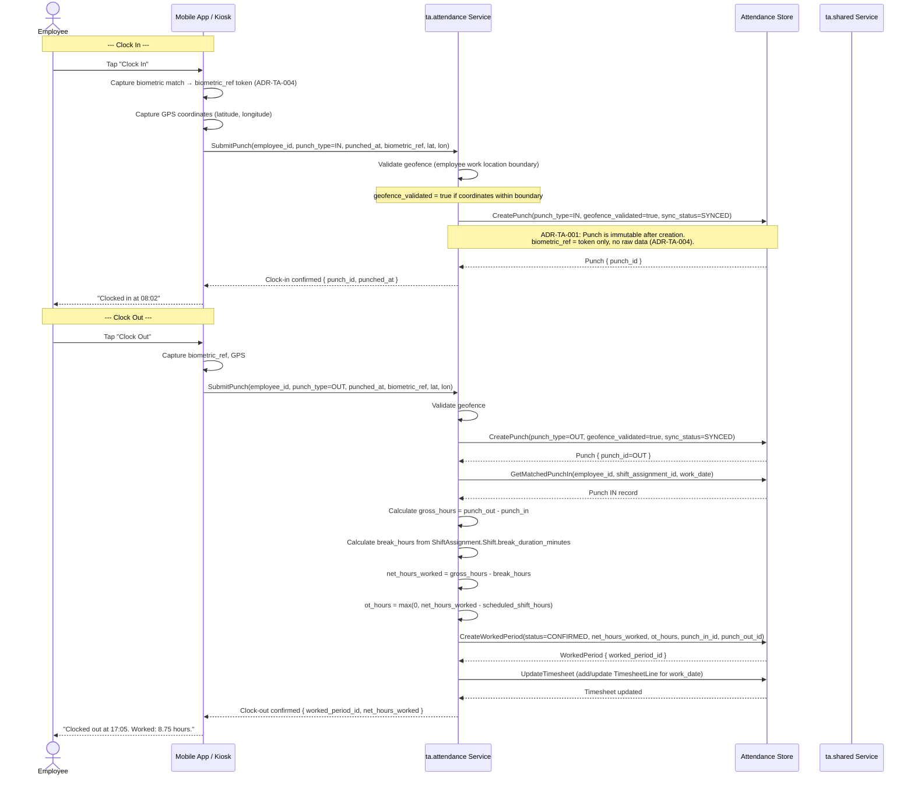
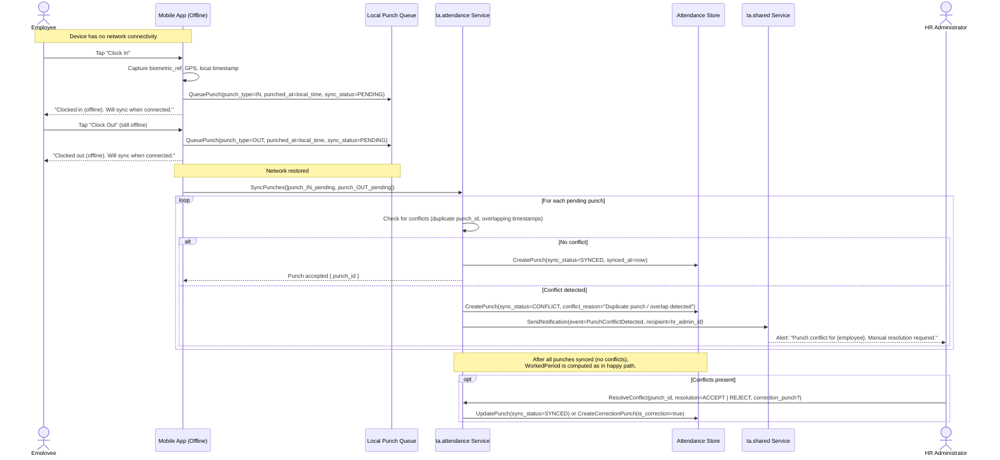
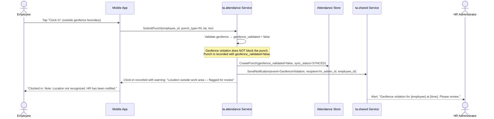
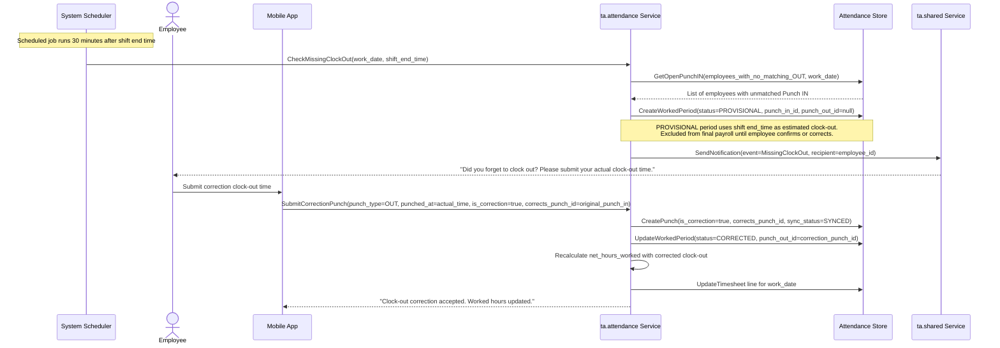

# Flow: Clock In / Clock Out

**Bounded Context:** ta.attendance
**Use Case ID:** UC-ATT-001
**Version:** 1.0 | 2026-03-24

---

## Overview

An employee clocks in at the start of a shift and clocks out at the end.
The system records immutable Punch events, validates geofence, and calculates
a WorkedPeriod. Offline mode (H8) queues punches locally and syncs on reconnect
with conflict detection. Missing clock-out triggers a system prompt.

---

## Actors

| Actor | Role |
|-------|------|
| Employee | Performs clock-in and clock-out via mobile app or kiosk |
| Biometric Device / Mobile App | Captures punch event and biometric token |
| System (ta.attendance) | Records Punch, validates geofence, computes WorkedPeriod |
| System (ta.shared) | Sends exception notifications |
| HR Administrator | Reviews geofence violations and CONFLICT punches |

---

## Preconditions

- Employee has an active ShiftAssignment for today
- The Period covering today is in OPEN status

---

## Postconditions (Happy Path)

- Punch IN and Punch OUT created (sync_status = SYNCED, immutable)
- WorkedPeriod created with status = CONFIRMED
- net_hours_worked calculated: (punch_out - punch_in) - break_hours
- WorkedPeriod linked to the active Timesheet for the Period
- OT hours flagged if net_hours_worked > scheduled shift hours

---

## Happy Path: Clock In and Clock Out (Online, Geofence Valid)

---

## Alternative Path: Offline Mode (H8 — No Connectivity)

---

## Exception Path A: Geofence Violation

---

## Exception Path B: Forgot to Clock Out

---

## Business Rules

| Rule ID | Description |
|---------|-------------|
| ADR-TA-001 | Punch records are immutable after creation. Corrections require a new Punch with is_correction=true and corrects_punch_id referencing the original |
| ADR-TA-004 | biometric_ref must be an opaque token only; raw biometric data must never be stored in the Punch record |
| BR-ATT-001 | Geofence violations do not block punch recording; they set geofence_validated=false and trigger an HR notification |
| BR-ATT-002 | Offline punches (sync_status=PENDING) use local device timestamp; server records synced_at separately |
| BR-ATT-003 | Punch conflicts (H8): when a sync is received that overlaps with an existing punch, sync_status=CONFLICT and HR is notified for manual resolution |
| BR-ATT-004 | Missing clock-out: system creates a PROVISIONAL WorkedPeriod using shift end time as an estimate; employee must confirm or correct within the period |
