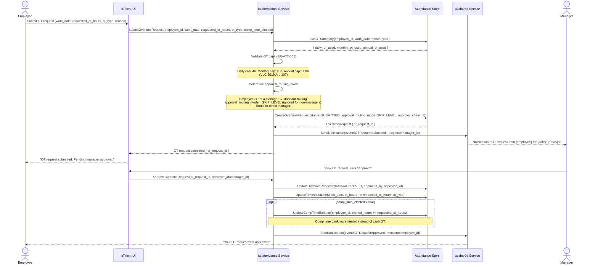
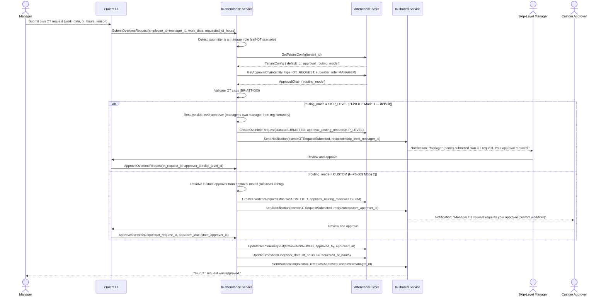

# Flow: Request Overtime

**Bounded Context:** ta.attendance
**Use Case ID:** UC-ATT-002
**Version:** 1.0 | 2026-03-24

---

## Overview

An employee (or manager) requests overtime hours beyond their scheduled shift.
The system validates OT caps (Vietnam Labor Code 2019, Art. 107) and routes
the request for approval. H-P0-003: when a manager submits their own OT,
the system prevents self-approval by routing to a skip-level manager (Mode 1)
or a custom workflow approver (Mode 2). Approved OT is logged to the timesheet
and optionally to the employee's CompTimeBalance.

---

## Actors

| Actor | Role |
|-------|------|
| Employee | Submits an OT request for planned overtime work |
| Manager | Reviews and approves/rejects OT requests; may also submit own OT |
| Skip-Level Manager | Reviews manager's own OT requests (H-P0-003 Mode 1) |
| Custom Approver | Configured workflow approver for manager OT (H-P0-003 Mode 2) |
| System (ta.attendance) | Validates OT caps, routes approval, logs approved OT |
| System (ta.shared) | Sends notifications |

---

## Preconditions

- Employee has an active ShiftAssignment for the requested work_date
- The Period covering work_date is in OPEN status
- Employee is not already at or above any OT cap for the period

---

## Postconditions (approved)

- OvertimeRequest status = APPROVED
- TimesheetLine updated with ot_hours
- If comp_time_elected = true: CompTimeBalance.earned_hours incremented
- Manager (and skip-level if applicable) notified

## Postconditions (rejected)

- OvertimeRequest status = REJECTED
- No timesheet update
- Employee notified with rejection reason

---

## Happy Path: Employee Submits OT (Standard Routing)



---

## Special Case: Manager Submits Own OT (H-P0-003)



---

## Exception Path: OT Cap Exceeded

```mermaid
sequenceDiagram
    actor Employee
    participant UI as xTalent UI
    participant ATT as ta.attendance Service
    participant DB as Attendance Store

    Employee->>UI: Submit OT request (work_date=2026-03-24, requested_ot_hours=5)
    UI->>ATT: SubmitOvertimeRequest(employee_id, work_date, requested_ot_hours=5)

    ATT->>DB: GetOTSummary(employee_id, work_date, month=March, year=2026)
    DB-->>ATT: { daily_ot_used=2, monthly_ot_used=38, annual_ot_used=295 }

    ATT->>ATT: Validate daily cap: 2 + 5 = 7 > 4 (daily_ot_cap_hours)
    Note over ATT: Daily cap violation. Block submission.

    ATT-->>UI: Error: OTCapExceeded { cap_type=DAILY, cap_hours=4, already_used=2, requested=5, max_allowed=2 }
    UI-->>Employee: "OT request blocked. Daily OT cap is 4 hours; you have already used 2h today. Maximum additional: 2h."

    Note over Employee: Employee may resubmit with reduced hours (max 2h for today)

    opt Monthly cap check (separate example)
        ATT->>ATT: Validate monthly cap: 38 + 4 = 42 > 40 (monthly_ot_cap_hours)
        ATT-->>UI: Error: OTCapExceeded { cap_type=MONTHLY, cap_hours=40, already_used=38, max_allowed=2 }
        UI-->>Employee: "Monthly OT cap (40h) nearly reached. Maximum additional this month: 2h."
    end
```

---

## Business Rules

| Rule ID | Description |
|---------|-------------|
| BR-ATT-005 | OT caps enforced at submission: daily 4h, monthly 40h, annual 300h (VLC 2019 Art. 107). System blocks submission if any cap would be breached by the requested hours |
| BR-ATT-006 | OT rate: 150% for weekday OT, 200% for weekend, 300% for public holiday (VLC 2019 Art. 98) |
| H-P0-003 Mode 1 | SKIP_LEVEL routing (default): when a manager submits their own OT, the request is routed to the manager's own manager (one level up in org hierarchy). Self-approval is not permitted |
| H-P0-003 Mode 2 | CUSTOM routing: when routing_mode = CUSTOM, the approver is resolved from the tenant's role/level-based approval matrix (configured in ApprovalChain) |
| BR-ATT-007 | Comp time election: when comp_time_elected = true on an approved OvertimeRequest, CompTimeBalance.earned_hours is incremented; cash OT payment is not generated |

---

## Key Domain Objects Created / Modified

| Object | Action | Key Fields |
|--------|--------|------------|
| OvertimeRequest | Created | status, approval_routing_mode, comp_time_elected, ot_type, requested_ot_hours |
| TimesheetLine | Updated | ot_hours_150/200/300 incremented by approved ot_hours |
| CompTimeBalance | Updated | earned_hours += requested_ot_hours (if comp_time_elected = true) |
| Notification | Created | OTRequestSubmitted (to manager/skip-level/custom), OTRequestApproved/Rejected (to employee) |
