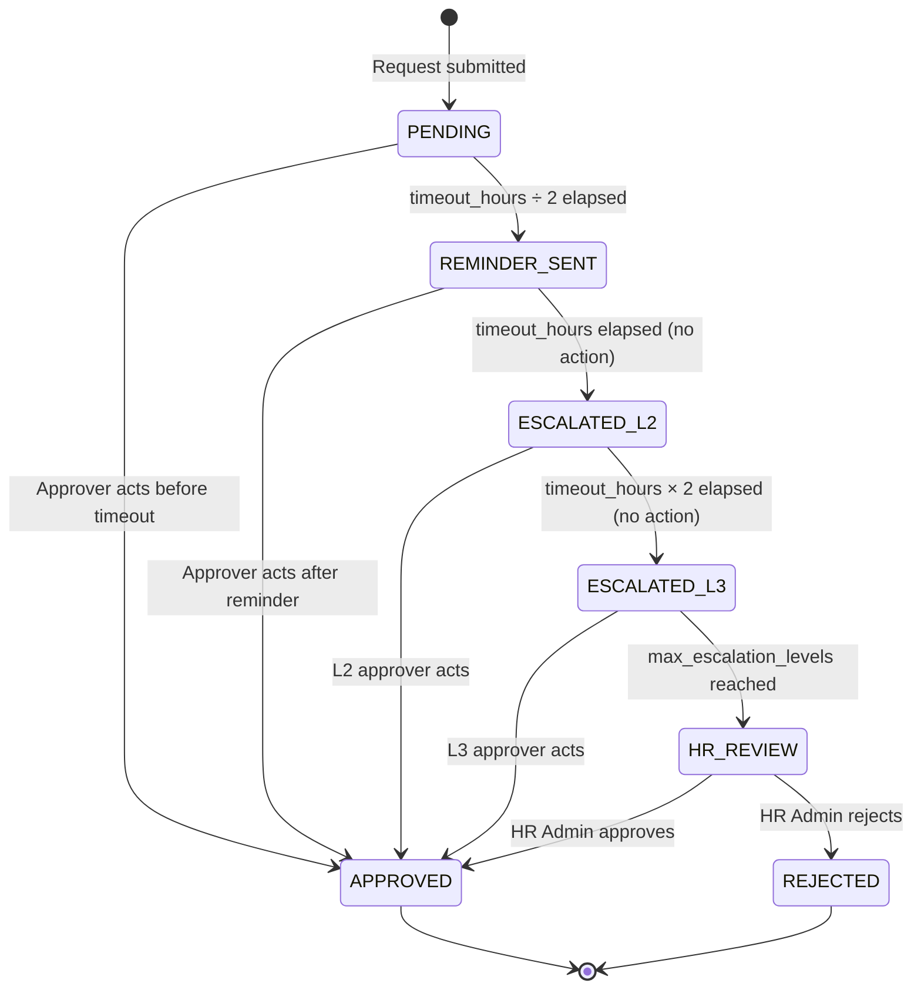
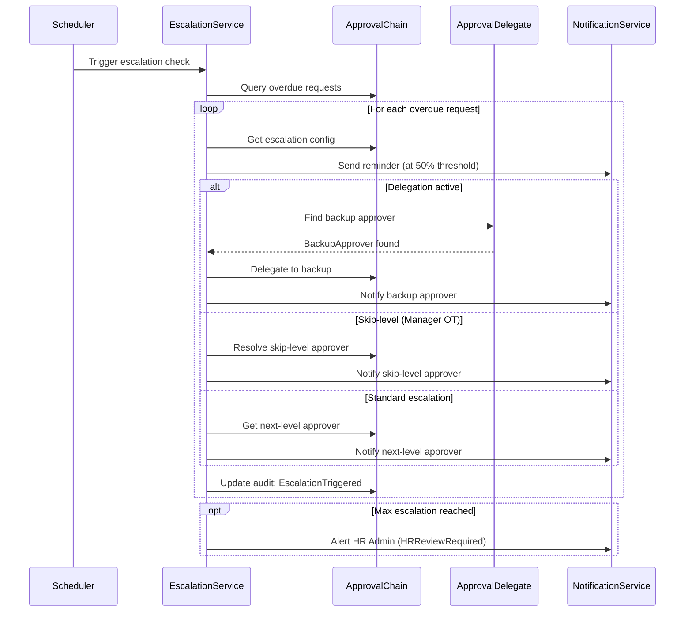

# Escalate Approval — UC-SHR-002

**Context:** TA.Shared
**Use Case ID:** UC-SHR-002
**Flow File:** `escalate-approval.flow.md`
**Priority:** P1 (V1 Release)
**Feature Reference:** SHD-T-005 (Escalation Processing)
**BRD Reference:** BRD-SHD-003
**Hot Spot Resolution:** H-P0-003 (Manager OT approval routing), H-P1-008 (Approval delegation)
**Date:** 2026-03-24

---

## Overview

| Attribute | Value |
|-----------|-------|
| **Use Case Name** | Escalate Overdue Approval |
| **Primary Actor** | System (Scheduled Automation) |
| **Secondary Actors** | Current Approver (notified), Next-Level Approver, Backup Approver (if delegation active), HR Admin (final safety net) |
| **Trigger** | Approval timeout exceeded — `ApprovalChain.timeout_hours` (default 48h) |
| **Precondition** | A leave or OT request has been in `SUBMITTED` or `UNDER_REVIEW` state longer than the configured timeout |
| **Postcondition** | Request is re-routed to the next responsible approver; all parties notified; audit trail updated |
| **Frequency** | Low (exception path; target <5% of all requests) |

---

## Happy Path Flow

```
Scheduler           EscalationService      ApprovalChain     NotificationService
    |                     |                      |                    |
    | 1. Trigger          |                      |                    |
    |    (every N min)    |                      |                    |
    |-------------------> |                      |                    |
    |                     |                      |                    |
    |                     | 2. Query overdue      |                    |
    |                     |    requests           |                    |
    |                     |--------------------> |                    |
    |                     |                      |                    |
    |                     | 3. Return overdue     |                    |
    |                     |    list               |                    |
    |                     | <--------------------|                    |
    |                     |                      |                    |
    |                     | 4. For each request:  |                    |
    |                     |    get escalation     |                    |
    |                     |    configuration      |                    |
    |                     |--------------------> |                    |
    |                     |                      |                    |
    |                     | 5. Send reminder to  |                    |
    |                     |    current approver  |                    |
    |                     |--------------------------------------------> |
    |                     |                      |                    |
    |                     | 6. Escalate request   |                    |
    |                     |    to next level /   |                    |
    |                     |    backup approver   |                    |
    |                     |--------------------> |                    |
    |                     |                      |                    |
    |                     | 7. Update audit trail |                    |
    |                     |    (EscalationTriggered)                  |
    |                     |--------------------> |                    |
    |                     |                      |                    |
    |                     | 8. Notify new approver|                    |
    |                     |--------------------------------------------> |
    |                     |                      |                    |
```

---

## State Machine



---

## Alternative Flows

### AF-1: Delegation Active

**Trigger:** `ApprovalChain.delegation_rule = BACKUP_APPROVER` and a backup approver is configured for the current approver's role.

```
System                 ApprovalDelegate        BackupApprover
    |                     |                        |
    | Detect timeout      |                        |
    |---------------------|                        |
    |                     |                        |
    | Check delegation    |                        |
    |-------------------->|                        |
    |                     |                        |
    | Backup found        |                        |
    |<--------------------|                        |
    |                     |                        |
    | Route to backup     |                        |
    |  (not next level)   |                        |
    |---------------------------------------->|   |
    |                     |                    |   |
    |                     |           Backup approver receives notification
```

### AF-2: Max Escalation Levels Reached

**Trigger:** Request has been escalated `max_escalation_levels` times (default 3) with no action.

- System emits `HRReviewRequired` event
- HR Admin receives high-priority alert: "Request #[ID] unactioned after [N] escalations — requires HR intervention"
- HR Admin has full override authority (approve / reject / reassign)

### AF-3: Skip-Level (Manager OT Only — H-P0-003)

**Trigger:** Requestor is a Manager submitting an OT request.

- `ApprovalChain.skip_level_lookup` resolves to the requesting manager's own Line Manager
- Normal approval chain is bypassed at L1; request goes directly to L2 (Line Manager)
- Applies only where `OvertimePolicy.requestor_role = MANAGER`

---

## Domain Events

| Event | Emitted By | Payload | Consumer |
|-------|------------|---------|----------|
| `ApprovalTimeoutTriggered` | EscalationService | `request_id`, `current_approver_id`, `timeout_hours`, `escalation_level` | EscalationService |
| `EscalationTriggered` | EscalationService | `request_id`, `new_approver_id`, `escalation_level`, `reason` | NotificationService, AuditLog |
| `DelegationResolved` | EscalationService | `request_id`, `backup_approver_id`, `original_approver_id` | NotificationService |
| `HRReviewRequired` | EscalationService | `request_id`, `escalation_count` | NotificationService, HR Dashboard |
| `NotificationSent` | NotificationService | `recipient_id`, `notification_type`, `channel` | AuditLog |

---

## Business Rules Applied

| Rule ID | Rule | Source |
|---------|------|--------|
| BR-SHR-003 | Approval timeout — default 48h; configurable per `ApprovalChain` | `ApprovalChain.timeout_hours` |
| BR-SHR-004 | Reminder sent at 50% of timeout elapsed | `ApprovalChain.reminder_at_pct` (default 0.5) |
| BR-SHR-005 | Maximum escalation levels before HR takeover | `ApprovalChain.max_escalation_levels` (default 3) |
| BR-SHR-006 | Delegation takes priority over skip-level | `ApprovalChain.delegation_rule` enum |
| H-P0-003 | Manager OT requests auto-route to skip-level approver | `ApprovalChain.skip_level_lookup`, `RoleApproverMapping` |
| H-P1-008 | Backup approver can be configured per role with date-range activation | `BackupApprover.approver_id`, `active_from`, `active_until` |

---

## Notification Templates

| Event | Recipient | Channel | Template |
|-------|-----------|---------|----------|
| Reminder (50% timeout) | Current Approver | Push + Email | "Reminder: [Employee Name]'s [leave/OT] request is awaiting your approval. Deadline: [date/time]." |
| Escalation to L2 | New Approver | Push + Email | "[Employee Name]'s [leave/OT] request has been escalated to you as the previous approver did not respond. Please review." |
| Delegation used | Backup Approver | Push + Email | "You are covering for [Original Approver] — a [leave/OT] request requires your approval." |
| HR Review Required | HR Admin | Push + Email + Dashboard badge | "Request #[ID] is unactioned after [N] escalations and requires HR intervention." |

---

## Sequence Diagram



---

## Error Handling

| Error | Behavior |
|-------|----------|
| No next-level approver configured | Escalate to HR Admin directly; emit `HRReviewRequired` |
| Backup approver is also unavailable | Fall through to next-level; log chain gap |
| Notification service unavailable | Retry 3× with exponential backoff; log failure; do not block escalation |
| Max escalation already reached on previous cycle | Skip (idempotent check); do not re-notify |

---

**Document Control:**
- **Version:** 1.1 (migrated from 99.odsa, enhanced with Mermaid state machine, skip-level AF-3, HR safety net, notification templates)
- **Last Updated:** 2026-03-25
- **Status:** READY FOR GATE G3 REVIEW
