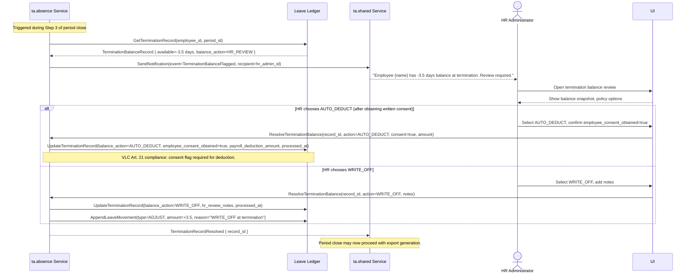
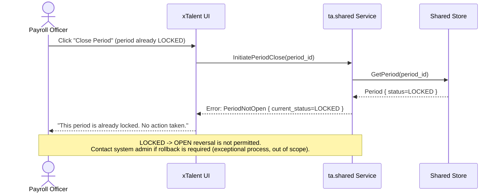

# Flow: Period Close and Payroll Export

**Bounded Context:** ta.shared (orchestrator); ta.absence + ta.attendance (consumers)
**Use Case ID:** UC-SHD-001
**Version:** 1.0 | 2026-03-24

---

## Overview

A Payroll Officer triggers period close at the end of a payroll period. The system
locks the period, validates all timesheets, processes any terminated employees with
negative leave balances per H-P0-004 policy, generates the PayrollExportPackage,
and dispatches the PayrollExportCreated integration event to the Payroll module.

Period state machine: OPEN -> LOCKED -> CLOSED. No reversal.

---

## Actors

| Actor | Role |
|-------|------|
| Payroll Officer | Initiates period close; reviews flagged items before final export |
| System (ta.shared) | Orchestrates the close sequence; manages Period state machine |
| System (ta.absence) | Provides leave balance snapshots for terminated employees |
| System (ta.attendance) | Provides timesheet data for all employees |
| HR Administrator | Reviews H-P0-004 flagged records before AUTO_DEDUCT or HR_REVIEW resolution |
| Payroll Module | Receives PayrollExportCreated event; acknowledges receipt |

---

## Preconditions

- Period status = OPEN
- All active employees have a Timesheet for this period
- No other period close is in progress for this tenant
- Payroll Officer has PAYROLL_OFFICER role

---

## Postconditions

- Period status = CLOSED
- All Timesheets status = LOCKED
- PayrollExportPackage created (immutable, checksum verified)
- PayrollExportCreated event dispatched to Payroll module
- All terminated employees' negative balances processed per configured policy
- Period.closed_at and Period.closed_by set

---

## Happy Path: Period Close and Export

```mermaid
sequenceDiagram
    actor PayrollOfficer as Payroll Officer
    participant UI as xTalent UI
    participant SHD as ta.shared Service
    participant ABS as ta.absence Service
    participant ATT as ta.attendance Service
    participant DB as Shared Store
    participant Payroll as Payroll Module

    PayrollOfficer->>UI: Navigate to Period Management, select period, click "Close Period"
    UI->>SHD: InitiatePeriodClose(period_id, initiated_by=payroll_officer_id)

    SHD->>DB: GetPeriod(period_id)
    DB-->>SHD: Period { status=OPEN, start_date, end_date }

    SHD->>SHD: Validate: period status = OPEN (guard)

    Note over SHD: Step 1: Lock the period (OPEN -> LOCKED)
    SHD->>DB: UpdatePeriod(status=LOCKED, locked_at, locked_by=payroll_officer_id)

    Note over SHD: Step 2: Validate all timesheets
    SHD->>ATT: ValidateTimesheets(period_id)
    ATT->>DB: GetAllTimesheets(period_id)
    DB-->>ATT: List<Timesheet>

    ATT->>ATT: Check all timesheets have status = APPROVED
    ATT->>DB: LockAllTimesheets(period_id, locked_at)
    Note over ATT,DB: All Timesheets transition to LOCKED status.<br/>No further WorkedPeriod records may be added.
    ATT-->>SHD: TimesheetsValidated { total=450, locked=448, exceptions=2 }

    opt Timesheet exceptions exist
        SHD-->>UI: Warning: "2 timesheets pending approval. Proceed anyway?"
        PayrollOfficer->>UI: Confirm override (HR Admin approval required)
    end

    Note over SHD: Step 3: Process terminated employees (H-P0-004)
    SHD->>ABS: GetTerminatedEmployeeBalances(period_id)
    ABS->>DB: QueryTerminationBalanceRecords(period_id, balance_action_pending=true)
    DB-->>ABS: List<TerminationBalanceRecord> with negative available balances

    loop For each terminated employee with negative balance
        ABS->>DB: GetTenantConfig(tenant_id)
        DB-->>ABS: TenantConfig { termination_balance_default_action }

        alt termination_balance_default_action = AUTO_DEDUCT
            ABS->>ABS: Verify employee_consent_obtained = true (VLC Art. 21)
            ABS->>DB: UpdateTerminationRecord(balance_action=AUTO_DEDUCT, payroll_deduction_amount)
            Note over ABS: VLC Art. 21: Deduction requires prior written consent.<br/>If consent not obtained, escalate to HR_REVIEW.

        else termination_balance_default_action = HR_REVIEW
            ABS->>DB: UpdateTerminationRecord(balance_action=HR_REVIEW)
            ABS->>SHD: SendNotification(event=TerminationBalanceFlagged, recipient=hr_admin_id)
            Note over ABS: HR must review before export is finalized.<br/>Payroll Officer is blocked until HR resolves.

        else termination_balance_default_action = WRITE_OFF
            ABS->>DB: UpdateTerminationRecord(balance_action=WRITE_OFF, processed_at)
            ABS->>DB: AppendLeaveMovement(type=ADJUST, amount=+|negative_balance|, reason=WRITE_OFF)

        else termination_balance_default_action = RULE_BASED
            ABS->>ABS: Apply threshold rule (TenantConfig.termination_writeoff_threshold_days)
            Note over ABS: balance <= threshold → WRITE_OFF;<br/>balance > threshold → HR_REVIEW
            ABS->>DB: UpdateTerminationRecord per rule outcome
        end
    end

    ABS-->>SHD: TerminationProcessingComplete { processed, flagged_for_hr }

    opt Flagged for HR review
        Note over SHD,PayrollOfficer: Export cannot complete until HR resolves flagged records
        SHD-->>UI: Block: "N termination records require HR review before export"
    end

    Note over SHD: Step 4: Generate PayrollExportPackage
    SHD->>ATT: CollectTimesheetSummary(period_id)
    ATT-->>SHD: { total_regular_hours, total_ot_hours, total_comp_time_hours, per_employee_lines }

    SHD->>ABS: CollectLeaveSummary(period_id)
    ABS-->>SHD: { total_leave_days, termination_deductions, cashout_amounts }

    SHD->>DB: CreatePayrollExportPackage(period_id, generated_by, ..., checksum=SHA256(payload))
    Note over SHD,DB: Package is immutable once created (ADR-TA-001 pattern).<br/>Idempotent: re-running will not create a second package.
    DB-->>SHD: PayrollExportPackage { export_package_id, checksum }

    Note over SHD: Step 5: Close the period (LOCKED -> CLOSED)
    SHD->>DB: UpdatePeriod(status=CLOSED, closed_at, closed_by=payroll_officer_id)

    Note over SHD: Step 6: Dispatch integration event
    SHD->>Payroll: PayrollExportCreated(export_package_id, period_id, checksum, payload_url)
    Payroll-->>SHD: Acknowledged { payroll_system_ref }

    SHD->>DB: UpdatePayrollExportPackage(dispatch_status=ACKNOWLEDGED, payroll_system_ref)

    SHD-->>UI: Period closed successfully { export_package_id, period_id }
    UI-->>PayrollOfficer: "Period {period_name} closed. Export dispatched to Payroll."
```

---

## H-P0-004 Branch Detail: Termination Balance Policy



---

## Exception Path: Period Already Locked or Closed



---

## Business Rules

| Rule ID | Description |
|---------|-------------|
| BR-SHD-001 | Period state machine: OPEN -> LOCKED -> CLOSED only. No reversal permitted |
| BR-SHD-002 | Only one OPEN period per tenant at a time; new period cannot be opened until previous is CLOSED |
| BR-SHD-003 | PayrollExportPackage is idempotent: re-running period close for an already-CLOSED period returns the existing package; no duplicate created |
| BR-SHD-007-01 | H-P0-004: Configured policy (AUTO_DEDUCT / HR_REVIEW / WRITE_OFF / RULE_BASED) is applied to all terminated employees with negative balances at period close |
| BR-SHD-007-02 | H-P0-004 + VLC Art. 21: AUTO_DEDUCT requires employee_consent_obtained = true; if consent is absent, the system must escalate to HR_REVIEW regardless of configured policy |
| BR-SHD-008 | Export package checksum: SHA-256 computed over the full payload; stored on the package; verified by Payroll module on receipt |

---

## Key Domain Objects Created / Modified

| Object | Action | Key Fields |
|--------|--------|------------|
| Period | Updated | status (LOCKED then CLOSED), locked_at, locked_by, closed_at, closed_by |
| Timesheet | Updated | status = LOCKED (all timesheets for the period) |
| TerminationBalanceRecord | Updated | balance_action, processed_at, payroll_deduction_amount, employee_consent_obtained |
| LeaveMovement | Appended | type=ADJUST (for WRITE_OFF cases; immutable) |
| PayrollExportPackage | Created | immutable; checksum, dispatch_status, payroll_system_ref |
| Notification | Created | TerminationBalanceFlagged (to HR), PayrollExportDispatched (to Payroll Officer) |
