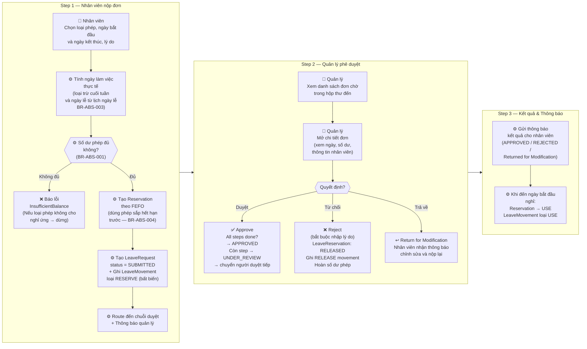
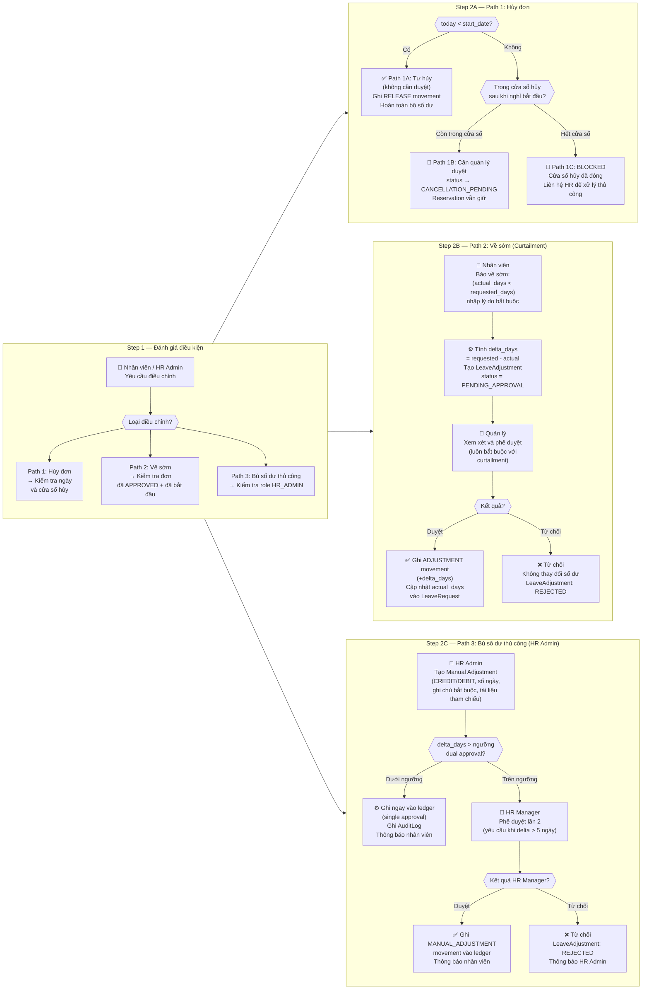
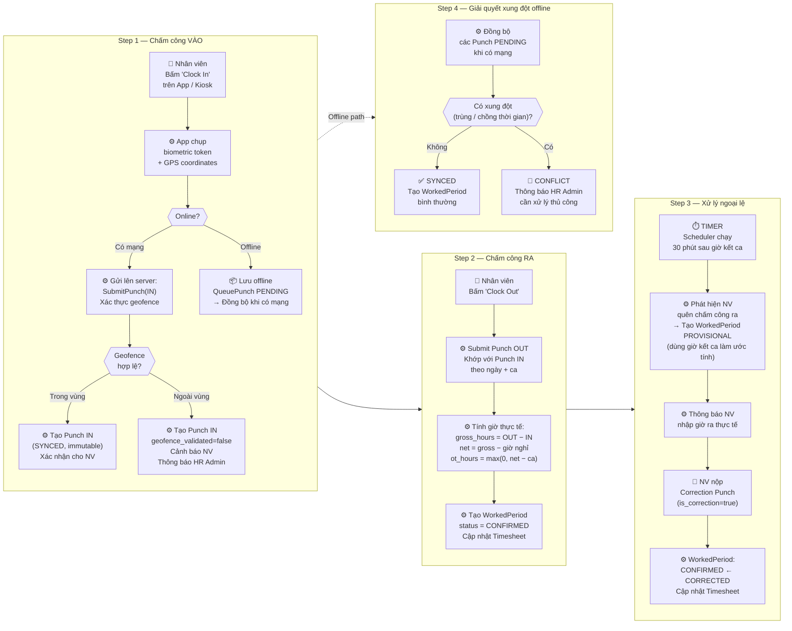
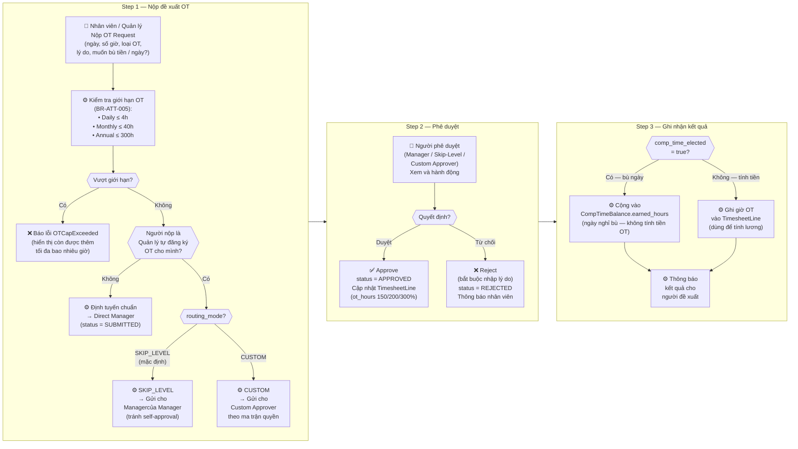
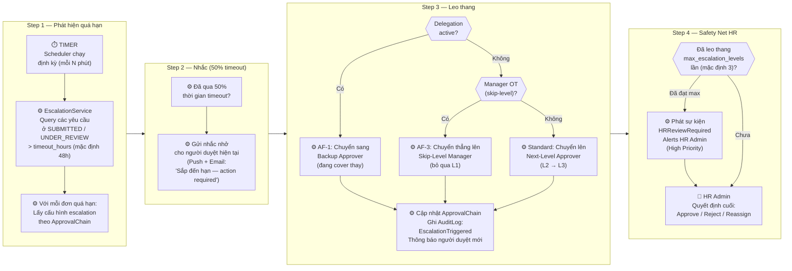
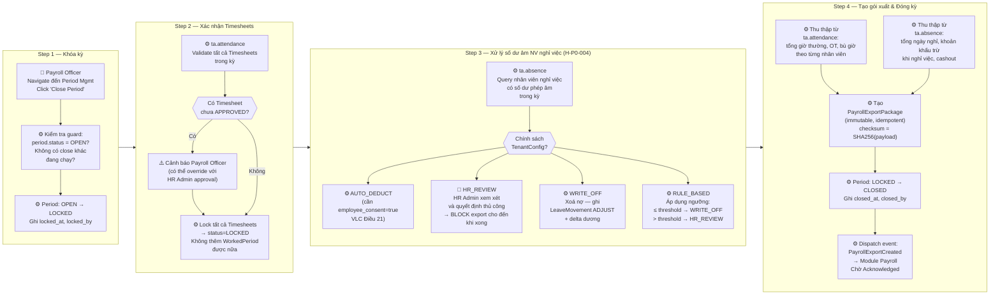
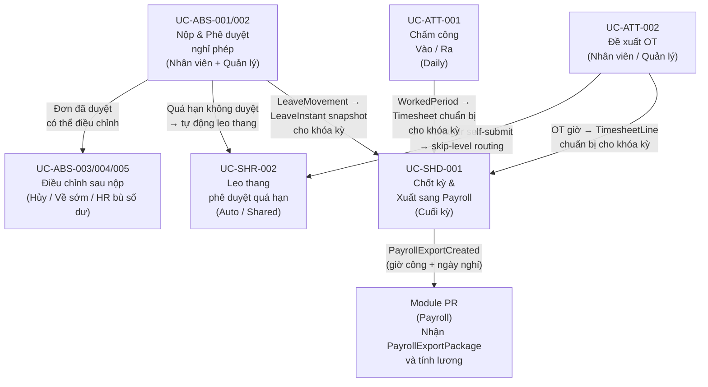

# Tổng Quan Quy Trình Nghiệp Vụ — Module Time & Absence (TA)

**Module**: Time & Absence (TA)
**Phiên bản**: 1.0
**Ngày**: 2026-04-01

> Tài liệu này tổng hợp toàn bộ các quy trình (workflow) thuộc module Time & Absence, được đọc từ các file `*.flow.md` của từng bounded context. Mỗi quy trình được trình bày bằng tiếng Việt với sơ đồ Mermaid thể hiện cấu trúc các bước theo phong cách A4B Workflow Designer: **các Step là các group xếp ngang (LR), bên trong mỗi Step là các task chạy từ trên xuống (TD)**.

---

## Tổng Quan Các Bounded Context Và Quy Trình

| Bounded Context | Quy Trình | Use Case ID |
|---|---|---|
| **ta.absence** | Nộp & Phê duyệt đơn nghỉ phép | UC-ABS-001 → UC-ABS-002 |
| **ta.absence** | Điều chỉnh đơn nghỉ phép (Hủy / Về sớm / Bù số dư) | UC-ABS-003, 004, 005 |
| **ta.attendance** | Chấm công vào / ra (Clock In / Out) | UC-ATT-001 |
| **ta.attendance** | Đề xuất làm thêm giờ (OT) | UC-ATT-002 |
| **ta.shared** | Leo thang phê duyệt quá hạn | UC-SHR-002 |
| **ta.shared** | Chốt kỳ & Xuất dữ liệu sang Payroll | UC-SHD-001 |

---

## UC-ABS-001/002: Nộp & Phê Duyệt Đơn Nghỉ Phép (End-to-End)

### Ý nghĩa & Mục đích

Đây là quy trình **self-service cốt lõi** của module TA, cho phép nhân viên chủ động nộp đơn xin nghỉ và theo dõi trạng thái phê duyệt. Quy trình kết hợp hai use case: nhân viên nộp đơn (UC-ABS-001) và quản lý phê duyệt (UC-ABS-002) thành một luồng liên tục.

**Mục đích:**
- Cho phép nhân viên tự đăng ký nghỉ phép một cách minh bạch
- Tự động tính ngày làm việc thực tế (loại trừ cuối tuần và ngày lễ theo lịch nghỉ quốc gia)
- Dự trữ số dư phép theo cơ chế FEFO (hết hạn trước dùng trước) — bảo vệ phép cũ sắp hết hạn
- Thực hiện phê duyệt đa cấp và thông báo tức thời cho các bên liên quan

**Tác nhân:** Nhân viên → Hệ thống (ta.absence + ta.shared) → Quản lý

**Kích hoạt:** Nhân viên chủ động nộp đơn trên ứng dụng

> **💡 Nguyên tắc sổ cái bất biến (ADR-TA-001):** Mọi thay đổi số dư được ghi thành movement mới vào ledger, không bao giờ sửa hay xóa movement cũ. RESERVE → RELEASE khi từ chối; RESERVE → USE khi nghỉ thực tế.

---

## UC-ABS-003/004/005: Điều Chỉnh Đơn Nghỉ Phép (Hủy / Về Sớm / Bù Số Dư)

### Ý nghĩa & Mục đích

Sau khi đơn nghỉ đã được nộp hoặc phê duyệt, có ba tình huống điều chỉnh hậu kỳ:

1. **Hủy toàn bộ** (Path 1) — nhân viên không nghỉ nữa
2. **Về sớm / Curtailment** (Path 2) — nhân viên nghỉ ít ngày hơn và muốn lấy lại phần chưa nghỉ
3. **Điều chỉnh số dư thủ công bởi HR** (Path 3) — sửa lỗi tính toán, bù đắp, phạt

**Mục đích:**
- Đảm bảo số dư phép luôn phản ánh đúng thực tế (không nghỉ đủ, không mất phép oan)
- Kiểm soát tính toàn vẹn: không sửa dữ liệu gốc, chỉ ghi bổ sung
- Bảo vệ khỏi gian lận số dư thông qua quy tắc cửa sổ hủy và phê duyệt quản lý

**Tác nhân:** Nhân viên (Path 1, 2); HR Admin + HR Manager (Path 3)

> **💡 Cửa sổ hủy (post_cancel_window_days):** Là số ngày sau ngày bắt đầu nghỉ mà nhân viên còn được phép hủy (cần duyệt quản lý). Nếu = 0, mọi yêu cầu hủy sau khi nghỉ bắt đầu đều bị chặn hoàn toàn.

---

## UC-ATT-001: Chấm Công Vào / Ra (Clock In / Clock Out)

### Ý nghĩa & Mục đích

Quy trình ghi nhận giờ làm việc hàng ngày của nhân viên thông qua thiết bị di động hoặc máy chấm công. Đây là **nguồn dữ liệu đầu vào** cho tính lương (giờ OT), kiểm soát tuân thủ và quản lý ca làm việc.

**Mục đích:**
- Ghi nhận thời gian làm việc thực tế theo từng ca
- Xác thực vị trí địa lý (geofence) để phòng ngừa gian lận chấm công
- Hỗ trợ chế độ offline — đồng bộ dữ liệu khi có kết nối trở lại
- Tự động tính giờ OT khi vượt ca làm việc tiêu chuẩn

**Tác nhân:** Nhân viên → App / Thiết bị → Hệ thống (ta.attendance) → HR Admin (xử lý ngoại lệ)

**Kích hoạt:** Nhân viên bấm chấm công vào / ra

> **⚠️ Nguyên tắc bất biến (ADR-TA-001):** Punch đã được ghi không được sửa. Correction phải tạo một Punch mới với `is_correction=true`, tham chiếu đến Punch gốc. Dữ liệu sinh trắc học chỉ lưu dạng token mờ, không lưu dữ liệu thô (ADR-TA-004).

---

## UC-ATT-002: Đề Xuất Làm Thêm Giờ (Request Overtime)

### Ý nghĩa & Mục đích

Nhân viên (hoặc quản lý) đăng ký làm thêm giờ trước hoặc sau khi thực hiện. Hệ thống kiểm soát giới hạn OT theo Bộ Luật Lao động 2019 và định tuyến phê duyệt phù hợp. Trường hợp đặc biệt: **quản lý đăng ký OT cho chính mình** — hệ thống phải tự động tránh tình huống tự phê duyệt.

**Mục đích:**
- Kiểm soát tuân thủ giới hạn OT (4h/ngày, 40h/tháng, 300h/năm) theo VLC 2019 Điều 107
- Ghi nhận OT vào timesheet để làm cơ sở tính lương (hệ số 150% / 200% / 300%)
- Hỗ trợ lựa chọn bù bằng ngày nghỉ bù (CompTime) thay vì tiền mặt
- Ngăn chặn self-approval qua định tuyến skip-level hoặc custom approver

**Tác nhân:** Nhân viên / Quản lý → Hệ thống → Quản lý (hoặc Skip-Level / Custom Approver)

**Kích hoạt:** Nhân viên tự đăng ký; hoặc hệ thống phát hiện giờ thực tế vượt ca

---

## UC-SHR-002: Leo Thang Phê Duyệt Quá Hạn (Escalate Approval)

### Ý nghĩa & Mục đích

Khi một đơn nghỉ phép hay đề xuất OT không được xử lý trong thời hạn cấu hình (mặc định 48h), hệ thống tự động leo thang lên cấp cao hơn để đảm bảo không có yêu cầu nào bị bỏ quên. Đây là **cơ chế an toàn** giúp HR và nhân viên không phải theo dõi thủ công.

**Mục đích:**
- Đảm bảo SLA phê duyệt được tuân thủ (không để đơn chờ quá lâu gây bức xúc nhân viên)
- Tự động xử lý các trường hợp quản lý vắng mặt hoặc không phản hồi
- Cung cấp safety net cuối cùng: HR Admin có quyền quyết định mọi đơn không có người duyệt

**Tác nhân:** Hệ thống (Scheduler) → EscalationService → Người duyệt tiếp theo / Backup / HR Admin

**Kích hoạt:** TIMER — chạy định kỳ, phát hiện đơn quá hạn

> **💡 Thứ tự ưu tiên:** Delegation (backup) > Skip-Level (manager OT) > Standard escalation. Delegation luôn được ưu tiên xử lý trước.

---

## UC-SHD-001: Chốt Kỳ & Xuất Dữ Liệu Sang Payroll (Period Close & Payroll Export)

### Ý nghĩa & Mục đích

Cuối mỗi kỳ lương, Payroll Officer thực hiện "đóng kỳ" Time & Absence: khóa toàn bộ timesheet, xử lý nhân viên nghỉ việc có số dư âm, tổng hợp dữ liệu chấm công + nghỉ phép và gửi sang module Payroll để tính lương. Đây là **cầu nối quan trọng** giữa module TA và module PR.

**Mục đích:**
- Đảm bảo không có dữ liệu chấm công nào bị thay đổi sau khi xuất sang Payroll
- Xử lý đúng quy định pháp luật với số dư phép âm khi nghỉ việc (VLC Điều 21)
- Tạo gói xuất (PayrollExportPackage) bất biến, có checksum xác thực toàn vẹn
- Bảo đảm idempotency — chạy lại không tạo thêm gói xuất thứ hai

**Tác nhân:** Payroll Officer → Hệ thống (ta.shared + ta.absence + ta.attendance) → HR Admin (cho trường hợp đặc biệt) → Module Payroll

**Kích hoạt:** Payroll Officer thủ công kích hoạt cuối kỳ lương

> **💡 Idempotency:** Nếu kỳ đã CLOSED mà chạy lại, hệ thống trả về gói xuất đã tồn tại, không tạo mới. Period machine chỉ đi một chiều: **OPEN → LOCKED → CLOSED**, không đảo ngược.

---

## Ma Trận Quan Hệ Giữa Các Quy Trình TA

---

## Chú Thích Loại Task Trong Sơ Đồ

| Ký hiệu | Loại Task | Mô tả |
|---|---|---|
| 👤 | USER_TASK | Người dùng thực hiện: nộp, duyệt, xem xét |
| ⚙️ | SERVICE_TASK | Hệ thống tự động xử lý, tính toán, ghi dữ liệu |
| ⏱️ | TIMER | Scheduler chạy định kỳ hoặc theo điều kiện thời gian |
| 📦 | EVENT_LISTENER | Lắng nghe / chờ sự kiện (ví dụ: offline queue) |
| 🚩 | Exception Flagging | Hệ thống gắn cờ cần xử lý thủ công |
| ◇ (hình thoi) | Decision / Gateway | Điểm rẽ nhánh điều kiện |
| 🚫 | Hard Block | Hành động bị chặn hoàn toàn bởi business rule |

---

## Danh Sách Business Rules Quan Trọng

| Rule ID | Quy tắc | Quy trình áp dụng |
|---|---|---|
| BR-ABS-001 | Kiểm tra số dư trước khi RESERVE phép | UC-ABS-001 |
| BR-ABS-003 | Chỉ tính ngày làm việc thực tế (loại cuối tuần + lễ) | UC-ABS-001 |
| BR-ABS-004 | FEFO reserve: dùng phép sắp hết hạn trước | UC-ABS-001 |
| BR-ABS-006 | Cửa sổ hủy sau ngày bắt đầu (post_cancel_window_days) | UC-ABS-003 |
| BR-ABS-012 | Điều chỉnh thủ công > ngưỡng cần dual approval HR Manager | UC-ABS-005 |
| BR-ABS-013 | Curtailment phải nộp trong vòng N ngày sau khi về sớm | UC-ABS-004 |
| ADR-TA-001 | Sổ cái bất biến — chỉ ghi thêm, không sửa/xóa | Tất cả |
| ADR-TA-004 | Biometric chỉ lưu token, không lưu dữ liệu thô | UC-ATT-001 |
| BR-ATT-001 | Geofence violation không chặn Punch — chỉ cảnh báo HR | UC-ATT-001 |
| BR-ATT-004 | Quên chấm công ra → PROVISIONAL period, NV tự sửa | UC-ATT-001 |
| BR-ATT-005 | OT caps: 4h/ngày, 40h/tháng, 300h/năm (VLC 2019) | UC-ATT-002 |
| H-P0-003 | Manager tự đăng ký OT → skip-level / custom routing | UC-ATT-002 |
| BR-SHR-003 | Timeout duyệt: 48h (cấu hình được) | UC-SHR-002 |
| BR-SHR-004 | Nhắc nhở tại 50% timeout | UC-SHR-002 |
| BR-SHD-001 | Period machine: OPEN → LOCKED → CLOSED, không đảo ngược | UC-SHD-001 |
| BR-SHD-007-02 | AUTO_DEDUCT khi nghỉ việc cần employee_consent=true (VLC Điều 21) | UC-SHD-001 |

---

*Tài liệu này được tổng hợp từ các file flow trong bounded contexts: `absence/flows/`, `attendance/flows/`, `shared/flows/`. Để xem chi tiết đầy đủ, tham khảo từng file `*.flow.md` trong thư mục tương ứng. File `[Depricated].approve-leave-request.flow.md` đã lỗi thời và được bỏ qua.*
