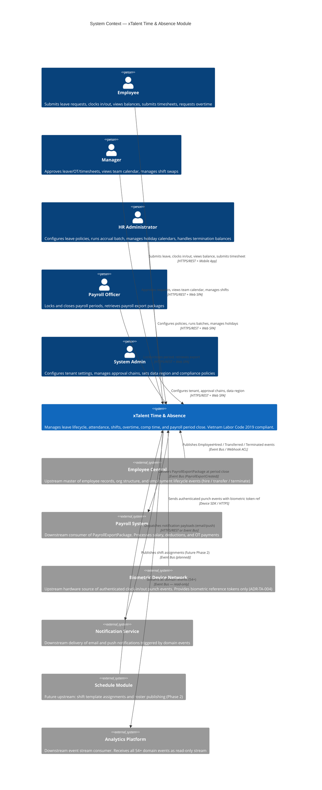

# C4 Level 1: System Context — Time & Absence

**Module:** xTalent HCM — Time & Absence
**Step:** 4 — Solution Architecture
**Date:** 2026-03-24
**Version:** 1.0

---

## System: xTalent Time & Absence Module

The xTalent Time & Absence module is a SaaS HCM component that manages employee leave
lifecycles, attendance tracking, shift scheduling, overtime management, and payroll period
close for Vietnam-first multi-tenant deployments.

---

## Actors

| Actor | Role | Primary Interactions |
|-------|------|----------------------|
| Employee | End user: individual contributor | Submit leave, clock in/out, request OT, view balance, submit timesheet |
| Manager | Approver: team lead or department head | Approve/reject leave/OT/timesheet, view team calendar, manage shift swaps |
| HR Administrator | Configurator: HR operations team | Configure leave policies, run accrual batch, manage holiday calendars, process termination balances |
| Payroll Officer | Operator: finance/payroll team | Lock payroll period, close period, retrieve and validate export package |
| System Admin | Tenant administrator | Configure tenant policies (H-P0-001/002/003/004), set data region (H10), manage approval chains |

---

## External Systems

| System | Direction | Integration Pattern | Data Exchanged | Trigger |
|--------|-----------|---------------------|----------------|---------|
| Employee Central | Upstream | Published Language / ACL | EmployeeHired, EmployeeTransferred, EmployeeTerminated events; employee master data | Employment lifecycle events |
| Payroll System | Downstream | Open Host Service | PayrollExportPackage (worked hours, OT by rate, leave days, comp time cash-outs, termination deductions) | Period close (PeriodClosed event) |
| Biometric Device Network | Upstream | Device SDK / HTTPS push | Authenticated punch events with biometric_ref token only (ADR-TA-004: no raw biometric) | Real-time punch; also offline batch sync (H8) |
| Notification Service | Downstream | Event-driven / HTTPS REST | Notification payloads (recipient_id, channel, template_key, subject, body_preview) | Domain events (approval, balance, expiry) |
| Analytics Platform | Downstream | Published Language — event stream | All domain events (54+) read-only forward | All state-changing domain events |
| Schedule Module | Upstream (Phase 2) | Event Bus (planned) | Shift roster and assignment events | Roster publish (future) |

---

## Architecture Decisions Reflected in L1

| Decision | Impact on System Context |
|----------|--------------------------|
| ADR-TA-001: Immutable ledger | LeaveMovement and Punch are append-only; no DELETE flows from external systems |
| ADR-TA-003: Vietnam-first | All VLC 2019 compliance (caps, rates, consent) enforced inside the system boundary |
| ADR-TA-004: No raw biometric | Biometric network sends token only; raw data never enters xTalent |
| H8: Offline-first | Biometric network and mobile app may batch-sync punches; conflict resolution inside system |
| H9: Multi-tenancy | Row-level isolation; tenant_id on all data; single cluster MVP |
| H10: Data residency | TenantConfig.data_region controls physical deployment region per tenant |
