# C4 Level 2: Container Diagram — Time & Absence

**Module:** xTalent HCM — Time & Absence
**Step:** 4 — Solution Architecture
**Date:** 2026-03-24
**Version:** 1.0

---

## Container Decomposition

```mermaid
C4Container
  title Container Diagram — xTalent Time & Absence Module

  Person(employee, "Employee", "Self-service leave, clock in/out, timesheet")
  Person(manager, "Manager", "Approvals, team calendar, shift management")
  Person(hr_admin, "HR Administrator", "Policy config, batch runs, exports")
  Person(payroll_officer, "Payroll Officer", "Period close, export retrieval")
  Person(sys_admin, "System Admin", "Tenant config, approval chains")

  System_Ext(employee_central, "Employee Central", "Upstream employee master")
  System_Ext(payroll_system, "Payroll System", "Downstream payroll processing")
  System_Ext(biometric_network, "Biometric Device Network", "Punch events source")
  System_Ext(notification_service, "Notification Service", "Email/push delivery")
  System_Ext(analytics_platform, "Analytics Platform", "Event stream consumer")

  Container_Boundary(ta_system, "xTalent Time & Absence") {

    Container(web_app, "Web Application", "React SPA / TypeScript", "Employee and Manager self-service portal. Leave calendar, approval inbox, timesheet view, shift schedule.")

    Container(mobile_app, "Mobile App", "React Native / iOS + Android", "Clock in/out (online + offline), leave requests, approval notifications. H8: local SQLite punch queue + sync.")

    Container(api_gateway, "API Gateway", "Kong / AWS API Gateway", "TLS termination, JWT auth, rate limiting, tenant routing, request logging. Routes to microservices.")

    Container(absence_service, "Absence Service", "Node.js / NestJS", "ta.absence bounded context. Leave lifecycle, balance ledger (immutable LeaveMovement), accrual batch, carryover, termination balance.")

    Container(attendance_service, "Attendance Service", "Node.js / NestJS", "ta.attendance bounded context. Punch recording, offline sync (H8), worked period calc, shift management, OT with Vietnam cap enforcement, comp time, timesheets.")

    Container(shared_service, "Shared Service", "Node.js / NestJS", "ta.shared bounded context. Period state machine, holiday calendars, multi-level approval engine, notification dispatch, payroll export orchestration, tenant config, Employee Central ACL.")

    Container(accrual_batch, "Accrual Batch Job", "Node.js / cron / k8s CronJob", "ADR-TA-002: Monthly accrual processing per AccrualPlan. Idempotent. Creates LeaveMovement EARN records. Triggered by period transitions.")

    Container(payroll_export_job, "Payroll Export Job", "Node.js / k8s Job", "Period close export generation. Aggregates ta.absence and ta.attendance data. Generates PayrollExportPackage. Dispatches PayrollExportCreated event.")

    Container(event_bus, "Event Bus", "Kafka (or RabbitMQ)", "Domain event streaming. Producers: all three services. Consumers: Notification Service, Analytics Platform, cross-context event handlers, Payroll System.")

    Container(primary_db, "Primary Database", "PostgreSQL 15+", "Shared PostgreSQL instance with schema-per-context (ta_absence, ta_attendance, ta_shared). Row-level security (RLS) enforces tenant_id isolation (H9). Append-only tables: leave_movements, punches.")

    Container(cache, "Cache", "Redis 7+", "LeaveInstant balance read-through cache. Invalidated on LeaveMovement creation. TTL: 60 seconds. Also: session tokens, idempotency keys.")

    Container(offline_sync_queue, "Offline Sync Queue", "PostgreSQL queue / Kafka", "Receives offline punch batches from Mobile App (H8). Processes idempotent sync with conflict detection. FIFO ordering per employee.")
  }

  Rel(employee, web_app, "Uses (leave, timesheet, balance)", "HTTPS")
  Rel(employee, mobile_app, "Uses (clock in/out, notifications)", "HTTPS + offline")
  Rel(manager, web_app, "Uses (approvals, team calendar)", "HTTPS")
  Rel(hr_admin, web_app, "Uses (policy config, batch, export)", "HTTPS")
  Rel(payroll_officer, web_app, "Uses (period close, export)", "HTTPS")
  Rel(sys_admin, web_app, "Uses (tenant config)", "HTTPS")

  Rel(web_app, api_gateway, "API calls", "HTTPS/JSON REST")
  Rel(mobile_app, api_gateway, "API calls + offline sync batch", "HTTPS/JSON REST")

  Rel(api_gateway, absence_service, "Routes leave requests", "HTTP/REST")
  Rel(api_gateway, attendance_service, "Routes attendance requests", "HTTP/REST")
  Rel(api_gateway, shared_service, "Routes shared/period/config requests", "HTTP/REST")

  Rel(absence_service, primary_db, "Reads/writes ta_absence schema", "PostgreSQL")
  Rel(attendance_service, primary_db, "Reads/writes ta_attendance schema", "PostgreSQL")
  Rel(shared_service, primary_db, "Reads/writes ta_shared schema", "PostgreSQL")

  Rel(absence_service, cache, "Balance read-through (LeaveInstant)", "Redis")
  Rel(attendance_service, cache, "Idempotency keys for punch sync", "Redis")

  Rel(absence_service, event_bus, "Publishes domain events (E-ABS-*)", "Kafka producer")
  Rel(attendance_service, event_bus, "Publishes domain events (E-ATT-*)", "Kafka producer")
  Rel(shared_service, event_bus, "Publishes domain events (E-SHD-*); consumes Employee Central events", "Kafka producer/consumer")

  Rel(accrual_batch, absence_service, "Calls internal accrual API", "HTTP/internal")
  Rel(payroll_export_job, absence_service, "Reads leave data for export", "HTTP/internal")
  Rel(payroll_export_job, attendance_service, "Reads timesheet data for export", "HTTP/internal")
  Rel(payroll_export_job, shared_service, "Creates PayrollExportPackage", "HTTP/internal")

  Rel(mobile_app, offline_sync_queue, "Submits punch batch (H8)", "HTTPS POST")
  Rel(offline_sync_queue, attendance_service, "Processes sync with conflict detection", "Internal queue")

  Rel(employee_central, event_bus, "Publishes EmployeeHired/Transferred/Terminated", "Kafka / webhook")
  Rel(event_bus, notification_service, "Forwards notification trigger events", "Kafka consumer")
  Rel(event_bus, analytics_platform, "Forwards all domain events", "Kafka consumer")
  Rel(event_bus, payroll_system, "Delivers PayrollExportCreated", "Kafka consumer")
```

---

## Bounded Context to Container Mapping

| Bounded Context | Primary Container | Supporting Containers | DB Schema | Deployment Unit |
|----------------|------------------|----------------------|-----------|-----------------|
| `ta.absence` | Absence Service | Accrual Batch Job | `ta_absence` | k8s Deployment (absence-service) |
| `ta.attendance` | Attendance Service | Payroll Export Job (partial) | `ta_attendance` | k8s Deployment (attendance-service) |
| `ta.shared` | Shared Service | Payroll Export Job (orchestration) | `ta_shared` | k8s Deployment (shared-service) |
| Cross-cutting | Event Bus | — | — | Kafka cluster |
| Cross-cutting | Primary Database | — | 3 schemas | PostgreSQL cluster |
| Cross-cutting | Cache | — | — | Redis cluster |

---

## DDD Relationship Types in L2

| Upstream Context / Container | Downstream Context / Container | Relationship Type | Notes |
|-----------------------------|-------------------------------|-------------------|-------|
| Employee Central | Shared Service | Published Language / Anti-Corruption Layer | Shared Service owns ACL translation of EC events |
| Shared Service | Absence Service | Shared Kernel | Period, HolidayCalendar published as read-only |
| Shared Service | Attendance Service | Shared Kernel | Period, HolidayCalendar published as read-only |
| Absence Service | Shared Service | Customer-Supplier | Absence uses ApprovalChain, Notification (ta.shared owns) |
| Attendance Service | Shared Service | Customer-Supplier | Attendance uses ApprovalChain, Period (ta.shared owns) |
| Shared Service | Payroll System | Open Host Service | PayrollExportPackage via published event |
| All Services | Analytics Platform | Published Language | Event stream, read-only |

---

## Architecture Decisions Reflected in L2

| Decision ID | Container Impact |
|-------------|-----------------|
| ADR-TA-001: Immutable Ledger | `leave_movements` and `punches` tables: INSERT only. No UPDATE/DELETE endpoints in Absence/Attendance services for these tables. |
| ADR-TA-002: Hybrid Accrual | Dedicated Accrual Batch Job container. Invokes Absence Service internal API. Idempotency enforced by AccrualBatchRun table. |
| ADR-TA-003: Vietnam-First | VLC cap enforcement (40h/month, 300h/year) in Attendance Service. Rate enums (150/200/300%) in TimesheetLine. |
| ADR-TA-004: No Raw Biometric | Biometric Device Network sends token only. Attendance Service stores biometric_ref (string token). No biometric processing container. |
| H8: Offline-First | Mobile App uses local SQLite queue. Dedicated Offline Sync Queue container. Conflict detection uses timestamp ordering + idempotency key per punch. Server-timestamp wins on conflict. |
| H9: Multi-Tenancy (MVP) | Row-level security in PostgreSQL. `tenant_id` indexed on all tables. Single shared cluster for MVP. Enterprise path: schema-per-tenant with PgBouncer connection pooler. |
| H10: Data Residency | TenantConfig.data_region determines Kubernetes namespace + node affinity. MVP: single cluster with region label. Production: separate regional clusters (ap-southeast-1 Singapore, ap-southeast-2 Vietnam). |

---

## Non-Functional Requirements

| Concern | Target | Implementation |
|---------|--------|----------------|
| Punch recording latency | < 200ms P99 | Attendance Service: async event publish; Redis idempotency key; optimistic insert |
| Balance read latency | < 100ms P95 | LeaveInstant Redis cache; invalidated on LeaveMovement write |
| Availability | 99.9% uptime | k8s HPA; 2+ replicas per service; PostgreSQL HA with read replica |
| Offline punch sync | 100% eventual consistency | Offline Sync Queue with FIFO per employee; idempotency key = employee_id + punched_at + device_id |
| Payroll export idempotency | Byte-identical re-runs | PayrollExportPackage: unique constraint on (tenant_id, period_id); checksum verification |
| Data retention | LeaveMovement: permanent; Notifications: 90 days; Punches: 7 years (VLC audit) | PostgreSQL table partitioning by year for punches and movements |
