# Leave Approval / Rejection — ABS-T-002

**Classification:** Transaction (T)
**Priority:** P0
**Primary Actor:** Manager
**Secondary Actors:** HR Admin (override approval), Senior Manager (escalation / skip-level)
**Workflow States:** SUBMITTED → UNDER_REVIEW → APPROVED / REJECTED
**API:** `POST /leaves/requests/{id}/approve`, `POST /leaves/requests/{id}/reject`, `GET /leaves/requests/{id}`
**User Stories:** US-ABS-003, US-ABS-004
**BRD Reference:** FR-ABS-003, BRD-SHD-003
**Hypothesis:** H1, H5

---

## Purpose

Leave approval is the primary Manager action in the Absence Management bounded context. Managers must be able to review a leave request with full context — employee leave history, remaining balance, and team availability on the requested dates — and approve or reject in a single workflow. Speed and context are the key design goals: a manager should be able to action an approval in under 30 seconds with enough information to make a confident decision.

---

## State Machine

```mermaid
stateDiagram-v2
    [*] --> SUBMITTED : Employee submits request
    SUBMITTED --> UNDER_REVIEW : Manager opens request (first view)
    UNDER_REVIEW --> APPROVED : Manager approves (all levels pass)
    UNDER_REVIEW --> REJECTED : Manager rejects
    APPROVED --> [*]
    REJECTED --> [*] : Employee notified; can resubmit
    SUBMITTED --> ESCALATED : Approval timeout reached
    ESCALATED --> APPROVED : Escalation target approves
    ESCALATED --> REJECTED : Escalation target rejects
```

---

## Screens and Steps

### Step 1: Pending Approvals Queue

**Entry points:**
- Manager → Dashboard (approval badge count)
- Manager → Approvals → Leave Requests
- Push notification → direct deep-link to Step 2

**Layout:**
- Header: "Leave Requests" + pending count badge
- Filter tabs: Pending / Approved / Rejected / All
- Sort: Date submitted (newest first) / Leave start date (soonest first)
- Request list cards:
  - Employee avatar + name
  - Leave type + icon
  - Date range + working day count
  - Submitted [X] hours/days ago
  - "Urgent" badge if leave starts within 3 days
  - Quick action buttons: "Approve" / "Reject" (accessible without opening full detail)
  - Tap/click anywhere to open full detail (Step 2)

### Step 2: Request Detail Screen

**Layout (split-panel on desktop; stacked on mobile):**

**Left / Top panel — Request Information:**
- Employee name + avatar + position + department
- Leave type (icon + name)
- Requested dates + working day count
- Reason / notes (from employee)
- Evidence attachment (if provided; download link)
- Submission timestamp
- Approval chain visualization:
  - Step 1: [Manager Name] — Pending / Approved / Rejected
  - Step 2 (if multi-level): [Senior Manager Name] — Waiting

**Right / Bottom panel — Context:**
- **Team Calendar mini-view (H5):** 2-week view centered on requested dates; colored dots for each team member currently on leave
  - Clicking a dot shows that employee's leave type
  - Key metric: "X of [team size] team members out on [date]"
- **Employee Leave Summary:**
  - Available balance by type (current)
  - Days taken this year
  - Pending requests (other requests in SUBMITTED state)
- **Recent History:** last 3 leave requests with status

**Action bar (sticky at bottom of screen):**
- "Approve" button (primary, green)
- "Reject" button (secondary, outlined red)
- "Request More Info" link (opens comment thread)

### Step 3a: Approve Confirmation

Triggered by clicking "Approve":
- Confirmation modal: "Approve [N] days [Leave Type] for [Employee Name] from [date] to [date]?"
- No additional fields required for basic approval
- Optional: "Add a note" (shown as text to employee in approval notification)
- "Confirm Approval" button → POST /leaves/requests/{id}/approve
- On success: modal closes, request card updates to APPROVED, employee notified

### Step 3b: Reject Dialog

Triggered by clicking "Reject":
- Rejection reason (textarea; required; min 10 chars)
- Optional: "Suggest alternative dates" — two date pickers (suggested_start, suggested_end); these are sent as metadata in the notification
- "Confirm Rejection" button → POST /leaves/requests/{id}/reject
- On success: modal closes, request card updates to REJECTED, employee notified with reason

---

## Notification Triggers

| Event | Recipient | Channel | Template |
|-------|-----------|---------|---------|
| Approval request received | Manager | Push + Email | "Action required: [Employee] requests [N] days [type] from [date]. View request." |
| Approved | Employee | Push + In-app | "Your [type] leave for [dates] has been approved by [Manager Name]." |
| Rejected | Employee | Push + In-app | "Your [type] leave for [dates] has been rejected. Reason: [reason]. Suggested dates: [dates if provided]." |
| Escalation — approval overdue | Escalation target | Push + Email | "Leave approval overdue: [Employee]'s request has been escalated to you. [Manager Name] has not acted in [N] hours." |

---

## Error States

| Error | User Message | Recovery Action |
|-------|-------------|-----------------|
| Request already actioned | "This request has already been [approved/rejected] by another approver in the chain." | Refresh queue; the item disappears |
| Approval chain conflict | "Approval chain configuration error — contact HR Admin." | HR Admin reviews approval chain config |
| Network failure on submit | "Unable to submit your decision. Please check your connection and try again." | Retry; decision not lost locally |

---

## Business Rules Applied

| Rule | Description |
|------|-------------|
| BR-ABS-040 | Approval is final at each step; an approved request moves to the next approval level or to APPROVED final state |
| BR-ABS-041 | Rejection at any level immediately transitions request to REJECTED; no further escalation |
| BR-ABS-042 | A manager cannot approve their own leave request; system routes to skip-level per SHD-T-001 chain config |
| BR-ABS-043 | Approval timeout (configurable in SHD-T-001) triggers automatic escalation; escalation target inherits the approval task |
| BR-ABS-044 | Once APPROVED, balance reservation is confirmed; LeaveMovement (DEDUCTION) will be created when leave period starts |
