# Accrual Batch Processing — ABS-T-006

**Classification:** Transaction (T — system-executed batch with HR Admin monitoring interface)
**Priority:** P0
**Primary Actor:** HR Admin (monitor + manual trigger)
**Secondary Actor:** System (automated execution)
**Workflow States:** PENDING → RUNNING → COMPLETED / FAILED
**API:** `GET /accrual-batch-runs`, `POST /accrual-batch-runs` (manual trigger), `GET /accrual-batch-runs/{id}`
**User Story:** US-ABS-010
**BRD Reference:** FR-ABS-009
**Hypothesis:** H2

---

## Purpose

Accrual Batch Processing is the automated engine that periodically calculates and credits leave entitlements to eligible employees based on their assigned accrual plans. HR Admin monitors batch execution, investigates failures, and can trigger a manual run when needed (e.g., after configuration changes or to correct a missed scheduled run). This feature replaces manual spreadsheet-based entitlement calculations.

---

## State Machine

```mermaid
stateDiagram-v2
    [*] --> PENDING : Scheduled trigger fires OR HR Admin triggers manually
    PENDING --> RUNNING : Batch job picked up by worker
    RUNNING --> COMPLETED : All employees processed successfully
    RUNNING --> FAILED : Unrecoverable error during processing
    RUNNING --> COMPLETED_WITH_ERRORS : Some employees failed; others succeeded
    FAILED --> PENDING : HR Admin retries failed batch
    COMPLETED_WITH_ERRORS --> PENDING : HR Admin retries only failed employees
    COMPLETED --> [*] : Accrual records persisted; balances updated
```



---

## Screens and Steps

### Screen 1: Batch Run History List

**Route:** `/admin/accrual/batch-runs`

**Entry points:**
- HR Admin → Absence Config → Accrual → Batch Runs
- System notification link (batch failure alert → direct deep-link)

**Layout:**

Header section:
- Page title: "Accrual Batch Runs"
- "Run Now" button (primary, top-right) — triggers manual batch for current month
- Schedule status indicator: "Next scheduled run: [date/time]" + "Automatic: ON/OFF" toggle

Batch runs table:

| Run ID | Period | Triggered By | Started At | Duration | Status | Employees | Records | Errors |
|--------|--------|-------------|-----------|---------|--------|-----------|---------|-------|
| BR-2026-03 | Mar 2026 | Scheduled | Mar 1 02:00 | 4m 12s | COMPLETED | 340 | 340 | 0 |
| BR-2026-02 | Feb 2026 | Scheduled | Feb 1 02:00 | 3m 58s | COMPLETED | 338 | 338 | 0 |
| BR-2026-01-M | Jan 2026 | Manual (admin@co) | Jan 15 10:32 | 1m 05s | COMPLETED_WITH_ERRORS | 340 | 337 | 3 |

**Column definitions:**
- Run ID: system-generated identifier (click to open detail view)
- Period: the leave period this batch accrual applies to (month/year)
- Triggered By: "Scheduled" or user email if manual
- Started At: datetime stamp
- Duration: total processing time
- Status badge:
  - PENDING: grey "Queued"
  - RUNNING: animated blue "Running..."
  - COMPLETED: green "Completed"
  - COMPLETED_WITH_ERRORS: amber "Completed with errors"
  - FAILED: red "Failed"
- Employees Processed: count of employees attempted
- Records Created: count of LeaveMovement (ACCRUAL) records created
- Errors: count of employees who encountered processing errors (click count → jump to error section in detail)

**Filters:**
- Year selector (default: current year)
- Status filter: All / Completed / Failed / Running

**Pagination:** 12 rows per page

---

### Screen 2: Batch Detail View

**Route:** `/admin/accrual/batch-runs/{runId}`

**Entry points:**
- Click any row in the batch history list

**Layout:**

**Section A — Run Summary:**
- Run ID, Period, Triggered By, Started At, Completed At, Duration
- Status badge (large)
- Totals: Employees attempted / Succeeded / Failed / Skipped (no accrual plan)

**Section B — Per-Employee Accrual Summary:**

Searchable, paginated table (50 rows/page):

| Employee | Leave Type | Accrual Plan | Days Accrued | New Balance | Status |
|---------|-----------|-------------|-------------|------------|--------|
| Nguyen Van A | Annual Leave | Standard Monthly | +1.67 days | 8.33 days | OK |
| Tran Thi B | Annual Leave | Standard Monthly | +1.67 days | 5.00 days | OK |
| Le Van C | Comp Time | Hourly Accrual | +0.00 days | 2.00 days | SKIPPED — no eligible hours |

- Search by employee name
- Filter by status: All / OK / Skipped / Error
- Export button: "Export to CSV"

**Section C — Error Log (shown only if errors > 0):**

```
┌──────────────────────────────────────────────────────────────────┐
│ ERRORS (3)                                                       │
├──────────────────────────────────────────────────────────────────┤
│ Pham Thi D   │ Annual Leave  │ No accrual plan assigned         │
│              │               │ [Assign Plan] button             │
├──────────────────────────────────────────────────────────────────┤
│ Hoang Van E  │ Annual Leave  │ Leave year boundary: start date  │
│              │               │ mismatch — review hire date      │
│              │               │ [View Employee] button           │
├──────────────────────────────────────────────────────────────────┤
│ Dao Thi F    │ Annual Leave  │ Policy inactive at run time      │
│              │               │ [View Policy] button             │
└──────────────────────────────────────────────────────────────────┘
```

- Each error row: employee name, leave type, error message (human-readable), quick-action link
- "Retry Failed Employees" button (secondary): re-queues only the failed employees for a new partial run
- "Export Error Log" button

---

### Screen 3: Manual Trigger — Confirmation Modal

**Entry point:** "Run Now" button on Screen 1

**Modal content:**
```
Run Accrual Batch Now?

This will process accruals for the current period:
  Period:     March 2026
  Employees:  ~340 employees in scope
  Plans:      Standard Monthly, Pro-rata, Hourly

⚠ Note: Running a manual batch when an automatic batch has
already completed for this period may create duplicate accruals.
Check the history above before proceeding.

[ Cancel ]   [ Confirm Run ]
```

- Period is pre-populated (cannot be changed from this modal; only current period)
- Warning shown if a COMPLETED batch already exists for the same period
- On confirm: POST /accrual-batch-runs → modal closes, new row appears in history with PENDING status, auto-refreshes every 10 seconds while RUNNING

---

### Screen 4: Batch Scheduling Configuration

**Route:** `/admin/accrual/batch-schedule`

**Entry points:**
- Screen 1 → "Schedule Settings" link (beside the next-run indicator)

**Layout:**
- Toggle: "Enable Automatic Monthly Accrual" (ON/OFF)
- Day of month: number input (1–28; note: "Use 28 to avoid end-of-month ambiguity")
- Time of day: time picker (HH:MM; 24h; defaults to 02:00 in tenant timezone)
- Timezone display (read-only; inherited from tenant config)
- Notification recipients: multi-select of HR Admin users who receive batch completion/failure emails
- "Save Schedule" button

**Validation:**
- Day > 28: error "To ensure reliable monthly execution, choose a day between 1 and 28"
- Empty notification recipients: warning "No recipients configured — batch failures will not be emailed"

---

## Notification Triggers

| Event | Recipient | Channel | Template |
|-------|-----------|---------|---------|
| Batch COMPLETED | HR Admin (configured recipients) | Email + In-app | "Accrual batch for [Month Year] completed: [N] employees processed, [N] records created." |
| Batch COMPLETED_WITH_ERRORS | HR Admin | Email + In-app (alert) | "Accrual batch for [Month Year] completed with [N] errors. Review errors at [link]." |
| Batch FAILED | HR Admin | Email + Push | "Accrual batch for [Month Year] FAILED. No accruals were applied. Immediate review required. [link]" |
| Batch RUNNING (manual) | Triggering HR Admin | In-app toast | "Accrual batch started. You will be notified when it completes." |

---

## Error States

| Error | User Message | Recovery Action |
|-------|-------------|-----------------|
| Duplicate run (same period already COMPLETED) | Warning modal with "Already processed" confirmation step | Admin must explicitly confirm double-run |
| Batch already RUNNING for same period | "A batch run is already in progress for this period. Please wait for it to complete." | Wait; no duplicate run created |
| Zero employees in scope | "No employees are currently in scope for accrual. Check that accrual plans are assigned." | HR Admin verifies plan assignments |
| Partial failure | Batch status set to COMPLETED_WITH_ERRORS; HR Admin must resolve per-employee errors | Use error log and "Retry Failed" action |

---

## Business Rules Applied

| Rule | Description |
|------|-------------|
| BR-ABS-090 | Accrual runs are idempotent for the same employee + period + plan combination; duplicate records are blocked by unique constraint |
| BR-ABS-091 | Manual batch runs for a period already processed require explicit admin confirmation |
| BR-ABS-092 | Accrual amounts are calculated per the plan formula (monthly_rate, pro-rata on hire date, cap enforcement) |
| BR-ABS-093 | Employees hired after the batch period start date receive pro-rata accrual (first run only) |
| BR-ABS-094 | Employees with no assigned accrual plan are recorded as SKIPPED (not an error) |
