# Punch In / Clock Out — ATT-T-001

**Classification:** Transaction (T — Mobile-first, offline-capable)
**Priority:** P0
**Primary Actor:** Employee (Mobile-first per H6)
**Secondary Actors:** HR Admin (exception review), Manager (visibility in team view)
**Workflow States:** UNPUNCHED → PUNCHED_IN → PUNCHED_OUT (per day); CONFLICT (exception state)
**API:** `POST /attendance/punches`, `GET /attendance/punches`
**User Story:** US-ATT-001
**BRD Reference:** BRD-ATT-001
**Hypothesis:** H4, H6 (mobile-first, offline mode, biometric, geofencing)

---

## Purpose

Clock In / Clock Out is the most frequent daily touchpoint in the Time & Attendance module. The design goal is zero-friction: an employee should be able to punch in or out in under 5 seconds with one tap. The feature must degrade gracefully in offline mode (H6), support geofence validation (H6), and use device biometrics for authentication before confirming a punch (H4). Sync status is always visible to the employee.

---

## State Machine

```mermaid
stateDiagram-v2
    [*] --> UNPUNCHED : Start of working day
    UNPUNCHED --> PUNCHED_IN : Employee clocks in (SYNCED or PENDING)
    PUNCHED_IN --> PUNCHED_OUT : Employee clocks out
    PUNCHED_OUT --> [*] : Day complete; timesheet record created
    PUNCHED_IN --> CONFLICT : Duplicate punch detected on sync
    PUNCHED_OUT --> CONFLICT : Out-of-sequence punch on sync
    CONFLICT --> PUNCHED_OUT : HR Admin resolves conflict
    CONFLICT --> [*] : HR Admin discards duplicate
```



Sync states (overlay, not separate workflow state):
- SYNCED: punch record confirmed by server
- PENDING: punch stored locally, awaiting network
- CONFLICT: server rejected punch due to data inconsistency

---

## Screens and Steps

### Screen 1: Clock In / Clock Out (Mobile — Primary)

**Route:** `/attendance/punch` (mobile app home screen, pinned)

**CRITICAL (H6): Mobile-first design — this is the primary daily interaction surface. Every element must be reachable with one thumb. Full-width CTA button at the bottom of the screen.**

**Layout (portrait mobile, top to bottom):**

```
┌─────────────────────────────────────────┐
│  Wednesday, March 25, 2026              │
│  09:14:32  ← real-time clock           │
│                                         │
│  [Geofence Status Indicator]            │
│  🟢 In zone — HQ Office                │
│                                         │
│  [Sync Status Badge]                    │
│  ✅ All punches synced                  │
│                                         │
│  ┌─────────────────────────────────┐   │
│  │  Last punch: Clock Out          │   │
│  │  Yesterday at 18:03             │   │
│  └─────────────────────────────────┘   │
│                                         │
│                                         │
│                                         │
│  ╔═════════════════════════════════╗   │
│  ║         CLOCK IN                ║   │  ← Primary CTA (full-width)
│  ╚═════════════════════════════════╝   │
└─────────────────────────────────────────┘
```

**Geofence Status Indicator:**
- Green (🟢): "In zone — [Zone Name]" — employee is within a configured geofence
- Red (🔴): "Out of zone" — employee is outside all configured geofences
  - If policy allows out-of-zone punches: button is enabled + flag added to record
  - If policy blocks out-of-zone: button is disabled, tooltip "You must be at [Zone Name] to clock in"
- Yellow (🟡): "Checking location..." — GPS acquiring signal (max 10s; times out to last known status)
- Grey: "Location unavailable — punch will be flagged" (GPS disabled or permission denied)

**Sync Status Badge:**
- ✅ SYNCED: "All punches synced" (green)
- Pending icon: "1 punch pending sync" (amber) — tap to see pending queue
- Warning (⚠): "Punch conflict detected — HR will review" (red)

**CTA Button state logic:**
- Employee has not clocked in today → shows "CLOCK IN" (green)
- Employee is clocked in → shows "CLOCK OUT" (red)
- Employee already clocked out → shows "CLOCK IN" (green, for second shift if applicable)
- Policy blocks punch (e.g., too early before shift start): button disabled, tooltip "Shift starts at [time]"

---

### Step 2: Biometric Confirmation

Triggered when employee taps the CLOCK IN / CLOCK OUT button.

**Device native biometric prompt (Face ID / Touch ID / Fingerprint):**
- System-native dialog: "Authenticate to [Clock In / Clock Out]"
- On success → proceed to punch confirmation
- On failure (3 attempts):
  - Fallback: "Use Passcode" option
  - If biometric not enrolled: "Please enroll Face ID / Fingerprint in your device settings to use this feature. Punch will be recorded without biometric for now."
  - Biometric bypass flag recorded on punch record for HR review

**If biometric is disabled by policy (ATT-M-002 config):**
- Biometric step is skipped entirely; punch fires immediately on button tap
- Single-tap confirmation to prevent accidental punches:
  - "Tap again to confirm" state (3-second window)

---

### Step 3: Punch Confirmed

Displayed immediately after successful punch (online) or local queue (offline):

**Online (SYNCED):**
```
┌─────────────────────────────────────────┐
│  ✅ Clocked In                          │
│  09:14:35                               │
│  HQ Office  •  In zone                 │
│                                         │
│  [View Today's Punches]                 │
└─────────────────────────────────────────┘
```

- Toast notification auto-dismisses after 3 seconds
- Screen returns to clock screen showing "CLOCK OUT" button

**Offline (PENDING — H6):**
```
┌─────────────────────────────────────────┐
│  🕐 Punch queued — no connection        │
│  09:14:35  (will sync when connected)   │
│                                         │
│  Pending punches: 1                     │
│  [View pending]                         │
└─────────────────────────────────────────┘
```

- Punch stored in local device storage with timestamp
- Sync status badge on home screen shows pending count
- On reconnect: auto-sync runs in background, "Punches synced" toast confirmation shown

**Conflict state (post-sync CONFLICT):**
```
┌─────────────────────────────────────────┐
│  ⚠ Punch conflict detected             │
│  A duplicate clock-in was detected.    │
│  HR will review and resolve this.      │
│                                         │
│  [OK — I understand]                    │
└─────────────────────────────────────────┘
```

---

### Screen 4: Today's Punch Summary (accessible from punch confirmation)

**Route:** `/attendance/punch/today`

Shows the current day's punch timeline:
```
Today — Wednesday, March 25, 2026
─────────────────────────────────────────
09:14  Clock In   ✅ SYNCED   HQ Office  In zone
13:01  Clock Out  ✅ SYNCED   HQ Office  In zone  (break)
14:05  Clock In   ✅ SYNCED   HQ Office  In zone
─────────────────────────────────────────
Total worked: 4h 51m (so far)
─────────────────────────────────────────
```

---

### Screen 5: Punch History List

**Route:** `/attendance/punches`

**Layout:**
- Date range filter (default: current week)
- Grouped by day:

```
Tuesday, March 24
  09:02 Clock In  → 18:05 Clock Out  =  8h 03m worked
  Geofence: In zone  •  Sync: ✅ SYNCED

Monday, March 23
  08:57 Clock In  → 17:48 Clock Out  =  8h 51m worked
  Geofence: ⚠ Out of zone (flagged)  •  Sync: ✅ SYNCED
```

- Tap any day to expand detailed punch events
- Filter by: Geofence status (All / In zone / Out of zone), Sync status (All / Synced / Pending / Conflict)

---

## Offline Mode — Full Specification (H6)

**Offline detection:** App monitors network reachability continuously. On loss of connectivity, the punch screen displays an amber "Offline" banner at the top.

**Punch while offline:**
1. Employee taps CLOCK IN / CLOCK OUT
2. Biometric authenticates against local device (no server call)
3. Punch event stored in local encrypted queue with:
   - Timestamp (device clock)
   - Type (CLOCK_IN / CLOCK_OUT)
   - GPS coordinates at time of punch (if available)
   - Device ID
4. Confirmation screen shows "Punch queued — will sync when connected"
5. Sync status badge shows pending count

**On reconnect:**
1. App detects network restoration
2. Background sync job sends all queued punches to `POST /attendance/punches` in timestamp order
3. Server validates sequence; creates attendance records
4. CONFLICT response: app marks that punch as CONFLICT and surfaces the conflict notification to employee
5. "Punches synced" confirmation toast shown
6. Pending count badge clears

**Multi-day offline scenario:**
- All punches from all offline days are queued and synced in order on reconnect
- Server processes each day independently; CONFLICT detection is per-day
- If more than 7 days of offline punches are detected: warning "You have 7+ days of unsynced punches — please connect to sync your attendance record"

---

## Notification Triggers

| Event | Recipient | Channel | Template |
|-------|-----------|---------|---------|
| Punch CONFLICT detected | Employee | Push + In-app | "A clock-in conflict was detected on [date]. Your attendance on this day is under HR review." |
| Punch CONFLICT detected | HR Admin | In-app badge | New item in Punch Exception queue (ATT-T-010, Phase 2) |
| Punches synced (batch) | Employee | In-app toast | "Your [N] offline punch(es) from [date range] have been synced successfully." |
| Clock-in not detected by [shift start + X min] | Employee | Push | "Reminder: You haven't clocked in yet. Start time was [time]." (configurable per policy) |

---

## Error States

| Error | User Message | Recovery Action |
|-------|-------------|-----------------|
| GPS unavailable | "Location unavailable — punch will be flagged for HR review" | Punch allowed with LOCATION_MISSING flag; HR reviews |
| Biometric failure (3 attempts) | "Unable to verify biometric — use device passcode to continue" | Passcode fallback; punch recorded with BIOMETRIC_FAILED flag |
| Out-of-zone and policy blocks punch | "You must be within [Zone Name] to clock in. Your current location is outside the allowed zone." | Employee must move to zone; contact manager for exception |
| Sync failure (server-side rejection) | "Unable to sync punch. Error: [reason]. Contact HR if this persists." | HR Admin reviews manually |
| Duplicate punch on sync | CONFLICT state displayed | HR Admin resolves via Punch Exception queue (ATT-T-010) |
| Device storage full (cannot queue) | "Punch cannot be saved — device storage is full. Free up space and try again." | Employee frees storage |

---

## Business Rules Applied

| Rule | Description |
|------|-------------|
| BR-ATT-001 | Only one CLOCK_IN without matching CLOCK_OUT is allowed per employee per day |
| BR-ATT-002 | Out-of-zone punches are recorded with a GEOFENCE_VIOLATION flag; whether they are blocked is controlled by `allow_outside_zone` in the geofence policy |
| BR-ATT-003 | Offline punch timestamps are based on device clock; if device clock drift > 15 minutes, punch is flagged CLOCK_DRIFT for HR review |
| BR-ATT-004 | CONFLICT is raised when the server receives two CLOCK_IN events for the same employee without an intervening CLOCK_OUT |
| BR-ATT-005 | Biometric authentication is required unless disabled by ATT-M-002 policy config or device does not support biometrics |

---

## Mobile Considerations (H6 — Critical)

- CTA button must be minimum 56dp height, full screen width on mobile
- Real-time clock updates every second using device timer (no server polling)
- GPS acquisition must not block the button interaction; punch fires immediately, location attached asynchronously
- App bundle must include offline mode support from Day 1 — not a V2 feature
- Biometric uses device-native APIs: Face ID (iOS), BiometricPrompt (Android)
- Local punch queue uses encrypted device storage (AES-256); cleared only after confirmed server sync
