# Overtime Calculation — ATT-T-002

**Classification:** Transaction (T — System-computed; read-only for Employee/Manager; HR Admin adjustable)
**Priority:** P0
**Primary Actor:** System (automated computation); Employee (view own); Manager (view team); HR Admin (adjust)
**Workflow States:** Read-only computed view; no independent state machine (part of Timesheet lifecycle)
**API:** `GET /attendance/timesheets/{periodId}`
**User Story:** US-ATT-005
**BRD Reference:** BRD-ATT-002
**Hypothesis:** H3, H-P0-003 (OT cap enforcement informs skip-level routing)

---

## Purpose

Overtime Calculation provides a transparent view of how the system has computed OT hours for each employee. OT lines are derived automatically from two sources: approved OT requests and actual punch data exceeding the standard shift duration. Employees can verify their OT is calculated correctly; Managers can review before timesheet approval; HR Admin can make manual adjustments with audit reasons. This feature is embedded within the Timesheet Submission view (ATT-T-004) and also accessible as a standalone OT summary screen.

---

## State Machine

Overtime Calculation is a derived view, not an independent workflow. It inherits the state of the parent timesheet period:

```mermaid
stateDiagram-v2
    [*] --> OPEN : Period is open; OT lines computed nightly from punch data
    OPEN --> OT_ADJUSTED : HR Admin makes manual OT adjustment
    OT_ADJUSTED --> OPEN : Adjustment recorded; view refreshes
    OPEN --> LOCKED : Period locks (part of ATT-T-004 / SHD-T-002)
    LOCKED --> [*] : OT values frozen for payroll
```



---

## Screens and Steps

### Screen 1: Timesheet Detail View — OT Breakdown (Embedded in ATT-T-004)

**Route:** `/attendance/timesheets/{periodId}` — OT section within the timesheet page

**Entry points:**
- Timesheet list → open any period → scroll to OT section
- ATT-T-003 OT Request confirmation → "View in timesheet" link

**Layout — Daily Breakdown Table:**

```
Period: March 2026
─────────────────────────────────────────────────────────────────────
Date        Day     Worked  Regular  OT Hrs  OT Rate   OT Source
─────────────────────────────────────────────────────────────────────
Mar 3       Mon     9.5h    8.0h     1.5h    150%      Auto (punch)
Mar 4       Tue     8.0h    8.0h     0.0h    —         —
Mar 5       Wed     10.5h   8.0h     2.5h    150%      Approved OT [OT-2026-03-012]
Mar 8       Sat     4.0h    0.0h     4.0h    200%      Approved OT [OT-2026-03-015]
Mar 20      Fri     0.0h    0.0h     0.0h    —         Public Holiday (working day)
Mar 20 (*) Thu(H)   8.0h    0.0h     8.0h    300%      Approved OT [OT-2026-03-022]
─────────────────────────────────────────────────────────────────────
```

**Column definitions:**
- Worked: total punch-derived hours for the day
- Regular: min(Worked, standard shift hours); standard shift from assigned shift pattern
- OT Hours: Worked − Regular (auto-computed); or hours from approved OT request if explicit request exists
- OT Rate: 150% (weekday excess), 200% (Saturday/rest day), 300% (public holiday) per VLC Art. 97-98
- OT Source: "Auto (punch)" if derived from punch data alone; "Approved OT [ID]" if from an approved OT request; links are clickable

**Color coding:**
- Regular hours: blue text / row
- OT hours (150%): orange text
- OT hours (200%): amber text
- OT hours (300%/holiday): red text
- Public holiday rows: yellow background

---

### Screen 2: Monthly OT Summary Panel (Embedded in ATT-T-004)

Shown below the daily breakdown table:

```
Monthly OT Summary — March 2026
─────────────────────────────────────────────────────────────
OT Used (Month):   27.5 h  ████████████████████░░░░░░  69%
Monthly Cap:       40 h

Annual OT Used:    187.0 h ██████████████████████░░░░  83%  ⚠
Annual Cap:        225 h   (Vietnam — 200h base + 25h approved extension)
─────────────────────────────────────────────────────────────
```

**Monthly OT progress bar:**
- Green if < 80% of cap
- Amber if 80–99% of cap
- Red if at or over cap (with message: "Monthly OT cap reached — new OT requests blocked this month")

**Annual OT progress bar:**
- Same color logic; >80% triggers warning banner
- If >200h (base cap): warning "Annual OT exceeds standard limit. Extended hours require local labor authority approval (VLC Art. 107)."

**Cap exceeded — blocking banner:**
```
┌─────────────────────────────────────────────────────────────┐
│  ⛔ Monthly OT cap reached (40h / 40h used)                │
│  New OT approval requests will be blocked until next month. │
│  Contact HR Admin if an exception is needed.               │
└─────────────────────────────────────────────────────────────┘
```

---

### Screen 3: HR Admin OT Adjustment

**Access:** HR Admin only — shown as an "Adjust" button per row in the daily breakdown table (Screen 1)

**Adjustment Modal:**

```
Adjust OT for [Employee Name] — March 3, 2026

Current OT: 1.5 hours (Auto-calculated)
New OT:     [____] hours

Reason (required):
[                                          ]
[                                          ]

Original calculation kept in audit trail.

[ Cancel ]   [ Save Adjustment ]
```

- New OT value: number input (0.0–24.0; 0.5 increment)
- Reason: textarea, required (min 10 characters)
- On save: adjustment recorded as a LeaveMovement ADJUSTMENT type with admin user, timestamp, reason
- Row in daily breakdown updates to show adjusted value + "Adj." badge
- Original auto-calculated value shown in tooltip on hover over "Adj." badge

---

## Notification Triggers

| Event | Recipient | Channel | Template |
|-------|-----------|---------|---------|
| OT cap approaching (80% monthly) | Employee | In-app toast | "You have used [N] of [cap] OT hours this month. Approaching monthly limit." |
| OT cap approaching (80% monthly) | Manager | In-app badge on team OT summary | "[Employee] is at 80% of monthly OT cap" |
| OT cap reached (100%) | Employee | Push + In-app | "Monthly OT cap reached. No further OT can be approved this month." |
| Annual OT >80% | HR Admin | In-app alert | "[N] employees are approaching the annual OT cap. Review in Compliance Report." |
| HR Admin OT adjustment made | Employee | In-app | "Your OT for [date] has been adjusted by HR Admin. New value: [X]h. Reason: [reason]." |

---

## Error States

| Error | User Message | Recovery Action |
|-------|-------------|-----------------|
| Punch data incomplete for a day | "OT cannot be calculated for [date] — missing clock-out record. Please contact HR." | HR Admin uses ATT-T-010 (Phase 2) punch resolution |
| OT cap already exceeded (pre-submission check) | "This employee has already reached the monthly OT cap. OT cannot be added." | HR Admin can override with justification |
| Shift pattern not assigned | "Standard hours unknown — OT calculation requires a shift assignment. Contact HR to assign a shift." | HR Admin assigns shift via ATT-M-001 |
| Adjustment validation failure | "OT value cannot exceed total worked hours for this day." | Correct the OT value |

---

## Business Rules Applied

| Rule | Description |
|------|-------------|
| BR-ATT-020 | OT = max(0, actual worked hours − standard shift hours); standard shift from assigned shift pattern |
| BR-ATT-021 | OT rate applied by day type: 150% for weekdays, 200% for Saturday/rest day, 300% for public holiday (VLC Art. 97-98) |
| BR-ATT-022 | Monthly OT cap defaults to 40h; annual cap defaults to 200h (VLC Art. 107); HR Admin can set tenant overrides |
| BR-ATT-023 | Reaching monthly cap blocks new OT request approvals for the employee in that period |
| BR-ATT-024 | Annual cap >200h requires additional approval and is flagged in the OT Compliance Report (ATT-A-001, Phase 2) |
| BR-ATT-025 | HR Admin adjustments are additive to the audit trail; original computed values are never deleted |

---

## Mobile Considerations

- OT summary panel shown as collapsible section on mobile (collapsed by default to reduce scroll depth)
- Monthly and annual progress bars must render legibly on small screens (min bar width: full screen width)
- OT cap warning banners persist until dismissed (not auto-dismissing toasts) when cap is exceeded
- Deep-link from OT approval notification to the relevant day row in the timesheet
