# Period Open / Lock / Close — SHD-T-002

**Classification:** Transaction (T — Period lifecycle with validation gates and payroll export)
**Priority:** P1
**Primary Actor:** Payroll Officer
**Secondary Actors:** HR Admin (exception handling), System (auto-lock trigger)
**Workflow States:** OPEN → LOCKED → CLOSED (no reversal)
**API:** `POST /periods/{id}/lock`, `POST /periods/{id}/close`, `GET /periods`, `GET /periods/{id}/validation`
**User Story:** US-SHD-001
**BRD Reference:** BRD-SHD-001
**Hypothesis:** H-P0-004 (negative balance handling at termination)

---

## Purpose

Period Close is the end-of-cycle operation that finalizes all attendance, leave, and OT records for a payroll period. The Payroll Officer must validate all timesheets are accounted for, handle any terminated employees with negative leave balances per the configured policy (H-P0-004), and then close the period to generate the payroll export. The process is irreversible — a closed period cannot be reopened — making the validation steps critical. This feature is the integration point between xTalent Time & Absence and the external payroll system.

---

## State Machine

```mermaid
stateDiagram-v2
    [*] --> OPEN : Period created (automatic or manual)
    OPEN --> LOCKED : Payroll Officer triggers lock; validation passes
    OPEN --> LOCKED : Auto-lock on configured period end date + N days grace
    LOCKED --> CLOSED : Payroll Officer triggers close; all validations pass
    LOCKED --> OPEN : (Emergency unlock — HR Admin only; audit log required)
    CLOSED --> [*] : Payroll export generated; period immutable
```



Note: Emergency unlock from LOCKED to OPEN is a break-glass action available to HR Admin only. It is not surfaced as a normal button — requires an explicit "Unlock Period" flow with mandatory justification.

---

## Screens and Steps

### Screen 1: Period List

**Route:** `/payroll/periods`

**Entry points:**
- Payroll Officer → Payroll → Periods
- HR Admin → Administration → Period Management

**Layout:**

```
Payroll Periods
──────────────────────────────────────────────────────────────────
Period       Start       End          Employees  Outstanding  Status  Actions
──────────────────────────────────────────────────────────────────
Mar 2026     Mar 1       Mar 31       342        12 issues    OPEN    [Lock Period]
Feb 2026     Feb 1       Feb 28       340        0 issues     LOCKED  [Close Period]
Jan 2026     Jan 1       Jan 31       338        —            CLOSED  [Download Export]
──────────────────────────────────────────────────────────────────
```

**Column definitions:**
- Period: Month + Year label
- Start / End: period boundary dates
- Employees: headcount in scope for this period
- Outstanding Issues: count of validation failures (timesheets not submitted, pending approvals); "0 issues" shown in green, "> 0 issues" shown in amber
- Status: OPEN (blue), LOCKED (amber), CLOSED (grey)

**Actions:**
- OPEN period: "Lock Period" button (visible to Payroll Officer and HR Admin)
- LOCKED period: "Close Period" button
- CLOSED period: "Download Export" link
- Any period: "View Details" always accessible

---

### Step 2: Lock Period — Pre-Lock Validation

Triggered by "Lock Period" button.

**Validation Screen (shown before the lock confirmation modal):**

```
Pre-Lock Validation — March 2026
──────────────────────────────────────────────────────────────────
Validating 342 employees...

✅ Timesheets submitted:          330 / 342
⚠ Timesheets not submitted:       12 employees
   [View list of 12 employees ▾]

✅ Pending leave approvals:         0 pending
✅ Pending OT approvals:            0 pending
✅ Accrual batch completed:         Yes (Mar 1, 02:04)

⚠ 12 timesheets are not submitted.
  Locking will freeze these timesheets in DRAFT state.
  These employees will NOT be able to submit after lock.

  Proceed?
──────────────────────────────────────────────────────────────────
[ Cancel ]   [ Lock Period (with 12 outstanding) ]
```

- Expandable list of employees with outstanding issues
- Each employee name is a link to their timesheet
- Lock is NOT blocked by outstanding timesheets; Payroll Officer accepts the risk
- If any pending approvals exist: amber warning; Payroll Officer can proceed
- If accrual batch has NOT run: red warning + "Lock blocked — run accrual batch first" (Lock button disabled)

---

### Step 3: Close Period — Pre-Close Validation

Triggered by "Close Period" button on a LOCKED period.

**Step 3a: Timesheet Summary Validation:**

```
Pre-Close Validation — February 2026 (LOCKED)
──────────────────────────────────────────────────────────────────
Step 1 of 3: Timesheet Summary

Approved timesheets:   336 / 340  ✅
Locked (not approved):   4        ⚠ (locked in DRAFT — 2, SUBMITTED — 2)

Total regular hours:   53,760 h
Total OT hours:         1,240 h  (150%: 680h, 200%: 380h, 300%: 180h)
Total leave hours:      2,720 h

[ Back ]   [ Next: Check Balances ]
```

**Step 3b: Terminated Employee Balance Check (H-P0-004):**

```
Pre-Close Validation — February 2026 (LOCKED)
──────────────────────────────────────────────────────────────────
Step 2 of 3: Terminated Employee Balance Review

Employees terminated in this period: 5
Employees with NEGATIVE leave balance: 3

Configured policy: HR_REVIEW
────────────────────────────────────────────────────────────────
Employee          Leave Type    Balance    Policy Action  Your Action
────────────────────────────────────────────────────────────────
Nguyen Van A      Annual Leave  -3.5 days  HR_REVIEW      [Approve Deduction] [Write Off]
Tran Thi B        Annual Leave  -1.0 day   HR_REVIEW      [Approve Deduction] [Write Off]
Le Van C          Annual Leave  -2.0 days  HR_REVIEW      [Approve Deduction] [Write Off]
────────────────────────────────────────────────────────────────
All 3 must be actioned before you can proceed.
```

**Policy-specific views (H-P0-004 — varies by configured policy):**

- **AUTO_DEDUCT policy:** Step 2 shows: "3 employees have negative balances. [X] hours will be automatically deducted from final pay. No action required." → no buttons, just informational table + "Next" button
- **HR_REVIEW policy:** (as above) — each row needs "Approve Deduction" or "Write Off" action before proceeding
- **WRITE_OFF policy:** Step 2 shows: "[X] days across 3 employees will be written off. No deductions will occur." → informational only + "Next" button
- **RULE_BASED policy:** Each row shows the rule applied: "Rule: Deduct if balance < -5 days → Write off applied" or "Rule: Deduct if balance < -5 days → Deduction applied"

"Approve Deduction" action: confirms the negative balance will be flagged for payroll deduction. No modal; inline row state changes to "Deduction Approved".
"Write Off" action: confirms the balance will be written off. No modal; inline row state changes to "Written Off".

**Step 3c: Final Confirmation:**

```
Pre-Close Validation — February 2026 (LOCKED)
──────────────────────────────────────────────────────────────────
Step 3 of 3: Confirm Close

Period:             February 2026
Timesheets:         336 approved, 4 locked
Total hours:        53,760 regular + 1,240 OT + 2,720 leave
Negative balances:  3 employees resolved (2 deductions + 1 write-off)

Closing this period is IRREVERSIBLE.
Export will be generated automatically after close.

Type "CONFIRM" to proceed:
[                ]

[ Back ]   [ Close Period ]
```

- Text confirmation ("CONFIRM") required to prevent accidental closure
- "Close Period" button enabled only when all Step 3b items are actioned AND text field matches "CONFIRM"

---

### Screen 4: Export Download

**Entry points:**
- Period list → CLOSED period → "Download Export"
- Automatic on period close: download link appears in success toast

**Export formats:**
- CSV (primary)
- Excel (.xlsx)
- Future: direct push to payroll system via integration (SHD-T-003)

**Export contents per employee row:**
- Employee ID, Name, Department, Period
- Regular hours, OT hours (by rate: 150% / 200% / 300%), Leave hours (by type)
- Deductions flagged (from H-P0-004 review)
- Timesheet status at close time

---

## Notification Triggers

| Event | Recipient | Channel | Template |
|-------|-----------|---------|---------|
| Period auto-locked (grace period expired) | Payroll Officer + HR Admin | Email + In-app | "Period [Month Year] has been automatically locked. [N] timesheets were locked in non-approved state." |
| Period closed | Payroll Officer | In-app | "Period [Month Year] has been closed. Payroll export is ready for download." |
| Period closed | HR Admin | In-app | "Period [Month Year] closed by [Payroll Officer Name]. [N] deductions flagged for payroll." |
| Outstanding timesheets (3 days before lock) | HR Admin + Manager | Email | "[N] employees have not submitted their timesheets for [period]. Period locks in 3 days." |

---

## Error States

| Error | User Message | Recovery Action |
|-------|-------------|-----------------|
| Accrual batch not run for period | "Cannot lock — accrual batch has not run for this period. Run the accrual batch first." | HR Admin triggers ABS-T-006 manual batch |
| H-P0-004: HR_REVIEW items not all resolved | "Cannot close — [N] terminated employee balance issues require your action before closing." | Payroll Officer actions all rows in Step 3b |
| Confirmation text mismatch | "Please type CONFIRM exactly to proceed." | User types "CONFIRM" in the text field |
| Close fails (server error) | "Period close failed. No data has been changed. Please retry or contact support." | Retry; period remains LOCKED |
| Export generation fails after close | "Period closed successfully. Export generation failed — retry download from the period list." | Retry download (export can be regenerated from closed period data) |

---

## Business Rules Applied

| Rule | Description |
|------|-------------|
| BR-SHD-010 | A period can only be locked after the accrual batch for that period has completed (COMPLETED status in ABS-T-006) |
| BR-SHD-011 | Locking a period freezes all timesheets in their current state; employees can no longer submit; managers can no longer approve |
| BR-SHD-012 | Closing a period is irreversible; all associated leave, OT, and timesheet data becomes immutable |
| BR-SHD-013 (H-P0-004) | Terminated employees with negative leave balance must be reviewed before period close; action taken (deduct/write-off) is recorded as a LeaveMovement (ADJUSTMENT) with the payroll officer's ID |
| BR-SHD-014 | The payroll export is generated synchronously on close; if generation fails the period remains CLOSED but export can be regenerated on demand |
