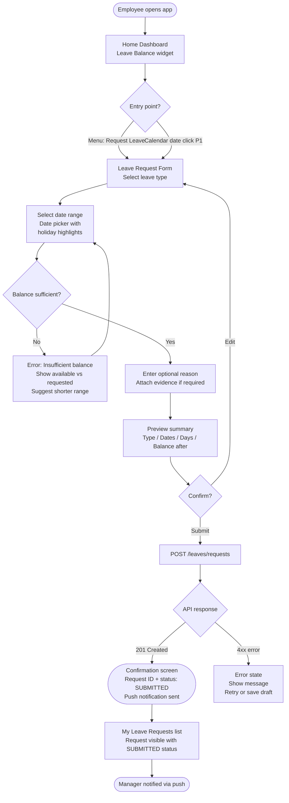
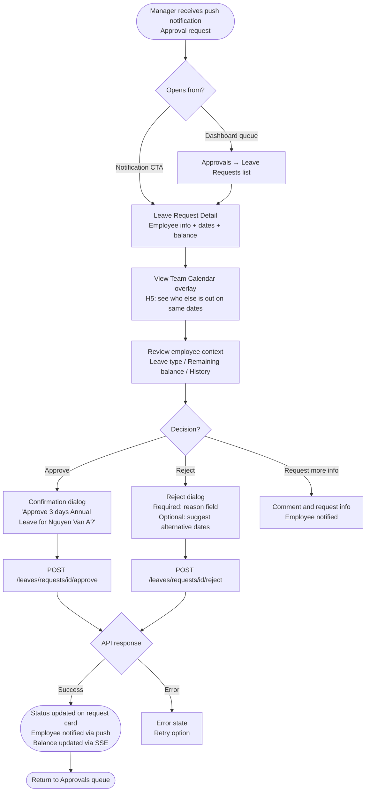
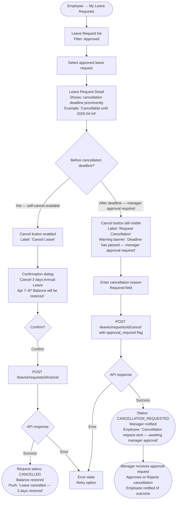
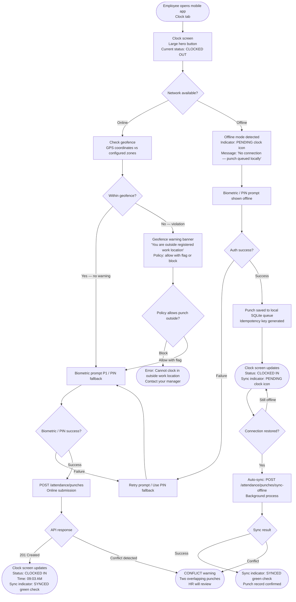
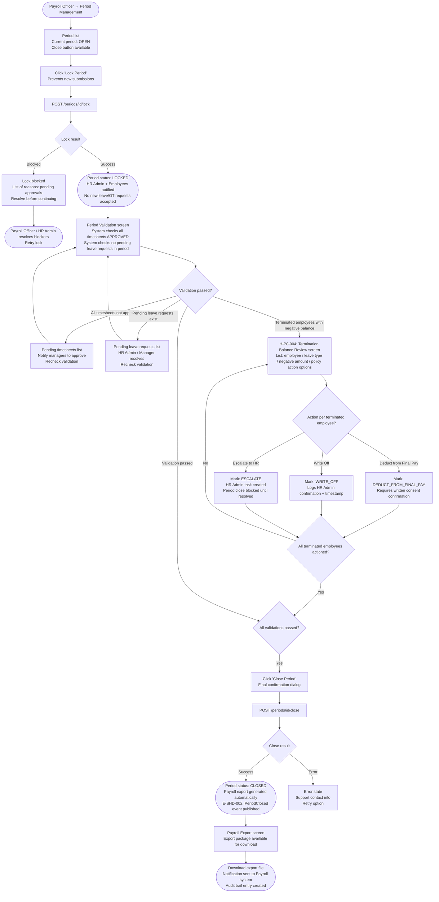

# Navigation Flows: Time & Absence

**Module:** xTalent HCM — Time & Absence
**Step:** 5 — Product Experience Design
**Date:** 2026-03-25
**Version:** 1.0

---

## Overview

Six primary navigation flows corresponding to the six core use-case flows from Step 3. Each flow uses a Mermaid `flowchart TD` diagram. Screen nodes use rectangles; decision points use diamonds; terminal states use rounded rectangles.

---

## Flow F1: Employee Submits Leave Request

**Persona:** Employee (mobile + web)
**Features:** ABS-T-001, ABS-T-004
**H5 note:** Calendar entry point available in P1



---

## Flow F2: Manager Approves / Rejects Leave Request

**Persona:** Manager (web primary, mobile secondary)
**Features:** ABS-T-002, ABS-T-004, ABS-T-007
**H5 note:** Calendar overlay shows team availability in approval context



---

## Flow F3: Employee Cancels Approved Leave (H-P0-001 Deadline Branching)

**Persona:** Employee
**Features:** ABS-T-003
**H-P0-001:** Cancellation deadline check is the core branching logic in this flow



---

## Flow F4: Employee Clocks In / Out (Mobile, H6 Offline Mode)

**Persona:** Employee (mobile)
**Features:** ATT-T-001, ATT-T-005
**H6:** Offline mode, sync status indicator, geofence handling



---

## Flow F5: Employee / Manager Requests and Approves Overtime (H-P0-003 Skip-Level Routing)

**Persona:** Employee submitting, Manager approving
**Features:** ATT-T-003
**H-P0-003:** When manager submits own OT, system routes to their manager (skip-level)

```mermaid
flowchart TD
    A([Employee / Manager → Overtime Requests → New]) --> B[OT Request Form\nDate / Duration / Purpose / Rate category]
    B --> C{Submitter is a Manager?}

    C -->|Yes — manager submitting own OT| D[System checks approval chain\nLevel 1 approver = same person as submitter]
    D --> E[Skip-level routing applied automatically\nInfo banner: 'This request will be reviewed by\n[Skip-level Manager Name]']
    E --> F[Submit OT Request]

    C -->|No — employee submitting| G[System checks approval chain\nLevel 1 approver = direct manager]
    G --> H{OT cap status?}
    H -->|Below 80% monthly cap| F
    H -->|Between 80–100% cap| I[Warning toast: 'You are at 82% of monthly OT cap'\nNon-blocking — can proceed]
    I --> F
    H -->|At 100% cap| J([Block: 'Monthly OT cap reached (40h)'\nRequest blocked until next period\nOR HR override required])

    F --> K[POST /attendance/overtime/requests]
    K --> L{API response}
    L -->|201 Created| M([OT request status: SUBMITTED\nApprover notified via push\nEmployee: 'OT request submitted'])
    L -->|Error| N[Error state\nRetry]

    M --> O([Approver opens notification → OT Request Detail])
    O --> P[View OT request details\nEmployee name / Date / Hours / Purpose\nEmployee monthly OT total to date]
    P --> Q{Decision?}
    Q -->|Approve| R[POST /attendance/overtime/requests/id/approve]
    Q -->|Reject| S[POST /attendance/overtime/requests/id/reject\nReason required]
    R --> T([Status: APPROVED\nEmployee notified\nComp time accrual triggered if elected])
    S --> U([Status: REJECTED\nEmployee notified with reason])
```

---

## Flow F6: Payroll Officer Closes Period and Handles Negative Balance (H-P0-004)

**Persona:** Payroll Officer
**Features:** SHD-T-002, SHD-T-003, SHD-T-008
**H-P0-004:** Terminated employees with negative balance require action before close


