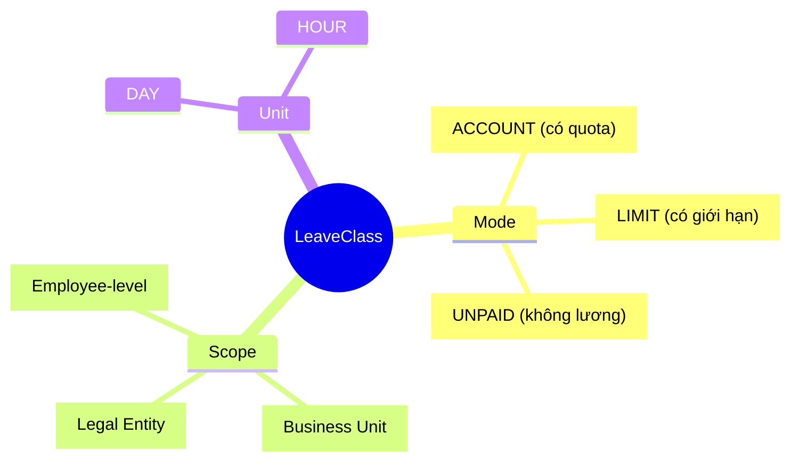
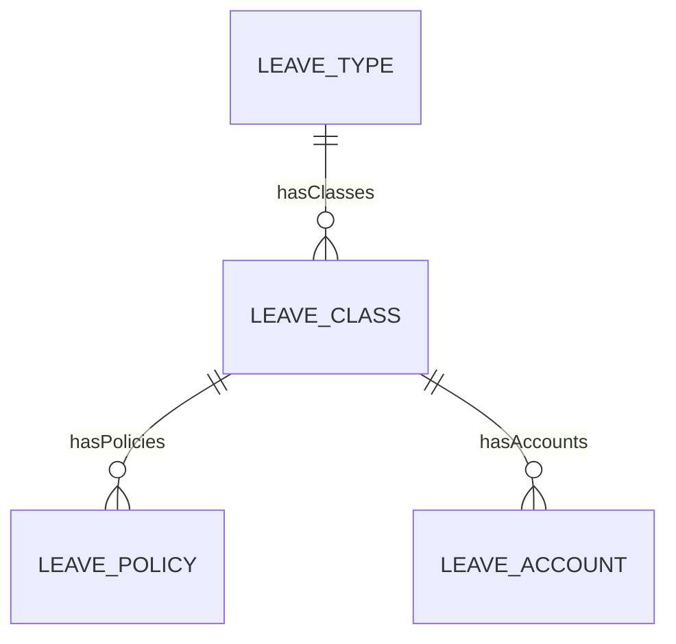
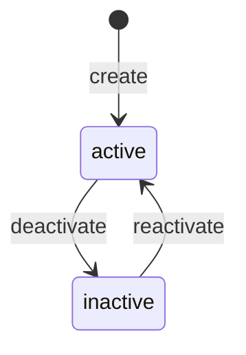

# LeaveClass

## Overview

**LeaveClass** là cấu hình cụ thể của [[LeaveType]] - định nghĩa cách thức quản lý balance, scope và rules. Mỗi LeaveType có thể có nhiều LeaveClass cho các ngữ cảnh khác nhau.



## Business Context

### Key Stakeholders
- **HR Policy**: Định nghĩa leave class theo chính sách
- **Payroll**: Xử lý UNPAID leave
- **Employee**: Xem balance theo class

### Mode vs Scope Matrix

| Mode | Balance Tracking | Pay Impact | Ví dụ |
|------|------------------|------------|-------|
| **ACCOUNT** | Track quota | Paid | Annual leave 12 ngày |
| **LIMIT** | Cap only | Paid | Sick leave max 30 ngày |
| **UNPAID** | No tracking | Unpaid | Leave without pay |

| Scope | Meaning | Use Case |
|-------|---------|----------|
| **EMP** | Per employee | Standard leave balance |
| **BU** | Shared within BU | Team floating holidays |
| **LE** | Shared within LE | Company-wide pool |

### Business Value
LeaveClass cho phép cùng một LeaveType (như Annual) có nhiều cấu hình khác nhau theo pháp nhân, theo policy hoặc theo nhóm nhân viên.

## Attributes Guide

### Core Identity
- **code**: Mã duy nhất. Format: VN_ANNUAL_12D, SG_SICK_14D
- **name**: Tên hiển thị. VD: "Phép năm VN - 12 ngày"
- **typeCode**: Link đến [[LeaveType]] parent

### Mode Configuration
- **modeCode**: Cách thức tracking:
  - *ACCOUNT*: Có quota cụ thể, track balance từng nhân viên
  - *LIMIT*: Có giới hạn max nhưng không cộng dồn
  - *UNPAID*: Không giới hạn, không trả lương
- **unitCode**: Đơn vị tính (DAY or HOUR)
- **scopeOwner**: Level của balance (EMP/BU/LE)

### Advanced Configuration
- **periodProfile**: Cấu hình năm (calendar/fiscal)
- **postingMap**: Mapping với GL account (cho payroll)
- **defaultEligibilityProfileId**: Ai được dùng class này

## Relationships Explained



### LeaveType
- **belongsToType** → [[LeaveType]]: Parent (Annual, Sick, etc.)

### LeavePolicy
- **hasPolicies** → [[LeavePolicy]]: Accrual, carry-over, limit rules

## Lifecycle & Workflows



| State | Meaning |
|-------|---------|
| **active** | Có thể sử dụng |
| **inactive** | Không thể tạo request mới |

## Actions & Operations

### create
**Who**: HR Policy  
**Required**: typeCode, code, name, modeCode, unitCode, effectiveStartDate

### deactivate
**Who**: HR Policy  
**When**: Class không còn sử dụng

## Business Rules

#### Unique Code (uniqueCode)
**Rule**: Leave class code phải duy nhất.

#### Mode Determines Tracking (modeConsistency)
**Rule**: Mode quyết định behavior:
- ACCOUNT → Create LeaveAccount per employee
- LIMIT → Check against limit only
- UNPAID → No balance check

## Examples

### Example 1: VN Annual Leave Class
```yaml
code: VN_ANNUAL_12D
name: "Phép năm VN - 12 ngày"
typeCode: ANNUAL
modeCode: ACCOUNT
scopeOwner: EMP
unitCode: DAY
```

### Example 2: Sick Leave Class
```yaml
code: VN_SICK_BHXH
name: "Nghỉ ốm BHXH"
typeCode: SICK
modeCode: LIMIT
scopeOwner: EMP
```

## Related Entities

| Entity | Relationship | Description |
|--------|--------------|-------------|
| [[LeaveType]] | belongsToType | Parent type |
| [[LeavePolicy]] | hasPolicies | Accrual/carry rules |
