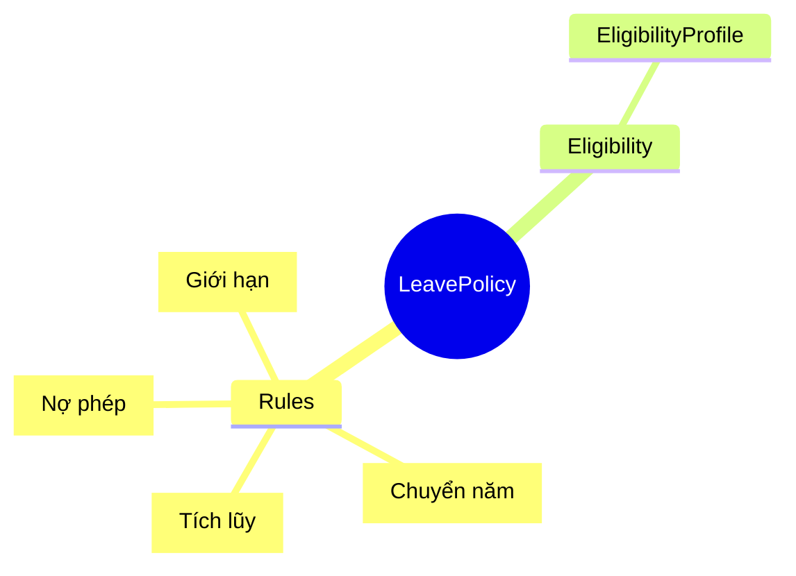
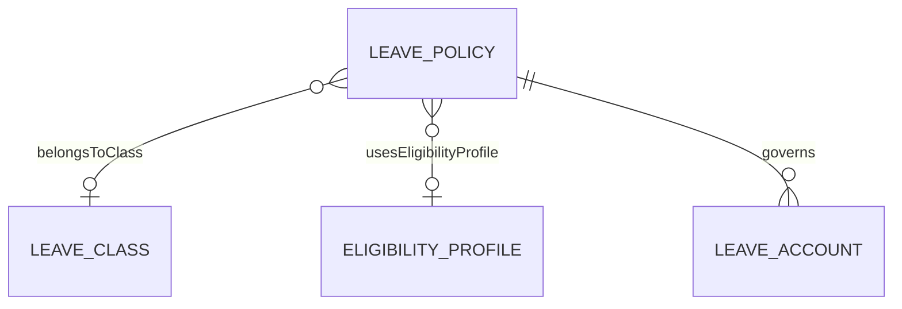
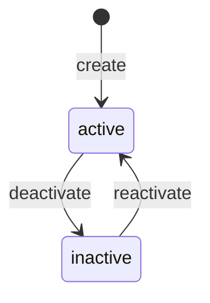
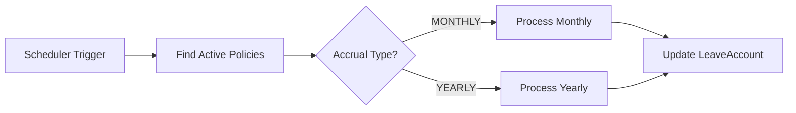

# LeavePolicy

## Overview

**LeavePolicy** định nghĩa rules cụ thể cho nghỉ phép - cách tích lũy, carry-over, giới hạn, overdraft. Mỗi [[LeaveClass]] có thể có nhiều policies cho các nhóm nhân viên khác nhau.



## Business Context

### Key Stakeholders
- **HR Policy**: Thiết lập rules
- **Payroll**: Accrual processing
- **Employee**: Xem số dư theo policy

### Policy Components

| Component | Purpose | Example |
|-----------|---------|---------|
| **Accrual** | Cách tích lũy | 1 day/month hoặc 12 days/year |
| **Carry-over** | Chuyển số dư sang năm sau | Max 5 days, expire in 3 months |
| **Limits** | Giới hạn sử dụng | Max 3 days/request |
| **Overdraft** | Cho phép nợ | Max -5 days |

### Accrual Types

| Type | Behavior | Use Case |
|------|----------|----------|
| **MONTHLY** | Tích lũy mỗi tháng | Nhân viên mới |
| **YEARLY** | Cấp đầu năm | Nhân viên có thâm niên |
| **FRONT_LOAD** | Cấp ngay khi eligible | Fast-track |
| **HIRE_ANNIVERSARY** | Cấp theo ngày vào | Custom policy |

### Business Value
LeavePolicy cho phép cùng một LeaveType có nhiều chính sách khác nhau theo group nhân viên, thâm niên, hoặc pháp nhân.

## Attributes Guide

### Core Identity
- **code**: Mã duy nhất. Format: VN_ANNUAL_STD, VN_ANNUAL_SENIOR
- **name**: Tên hiển thị. VD: "Phép năm VN - Thâm niên ≥5 năm"
- **typeCode**: Link đến [[LeaveType]]

### Accrual Configuration
- **accrualRuleJson**: Định nghĩa cách tích lũy:
  ```json
  {
    "type": "YEARLY",
    "amount": 12,
    "unit": "DAY",
    "seniorityBonus": { "perYears": 5, "bonusDays": 1 }
  }
  ```

### Carry-over Configuration
- **carryRuleJson**: Định nghĩa carry-over:
  ```json
  {
    "allowed": true,
    "maxDays": 5,
    "expiryMonths": 3
  }
  ```

### Overdraft & Limits
- **overdraftAllowed**: Cho phép số dư âm (nợ phép)
- **overdraftLimitHours**: Giới hạn nợ tối đa
- **limitRuleJson**: Các giới hạn khác (yearly max, per request max)

## Relationships Explained



### LeaveClass
- **belongsToClass** → [[LeaveClass]]: Parent class xác định mode (ACCOUNT/LIMIT/UNPAID)

### EligibilityProfile
- **usesEligibilityProfile** → [[EligibilityProfile]]: Ai được áp dụng policy này

## Lifecycle & Workflows



### Accrual Processing Flow



## Actions & Operations

### create
**Who**: HR Policy  
**Required**: typeCode, code, name, effectiveStartDate

### configureAccrual
**Who**: HR Policy  
**When**: Thay đổi accrual rules  
**Affects**: accrualRuleJson

### configureCarry
**Who**: HR Policy  
**When**: Thay đổi carry-over rules  
**Affects**: carryRuleJson

## Business Rules

#### Unique Code (uniqueCode)
**Rule**: Policy code phải duy nhất.

#### Accrual Required (accrualRequired)
**Rule**: Mode ACCOUNT cần accrual rules.  
**Reason**: ACCOUNT mode cần biết cách cấp quota.

## Examples

### Example 1: VN Annual Leave Policy (Standard)
```yaml
code: VN_ANNUAL_STD
name: "Phép năm VN - Tiêu chuẩn"
typeCode: ANNUAL
accrualRuleJson:
  type: YEARLY
  amount: 12
  unit: DAY
carryRuleJson:
  allowed: true
  maxDays: 5
  expiryMonths: 3
overdraftAllowed: false
```

### Example 2: VN Annual Leave Policy (Senior)
```yaml
code: VN_ANNUAL_SENIOR
name: "Phép năm VN - Thâm niên ≥5 năm"
typeCode: ANNUAL
accrualRuleJson:
  type: YEARLY
  amount: 13
  unit: DAY
  seniorityBonus:
    perYears: 5
    bonusDays: 1
overdraftAllowed: true
overdraftLimitHours: 40  # Max 5 days negative
```

### Example 3: Sick Leave Policy
```yaml
code: VN_SICK_BHXH
name: "Nghỉ ốm BHXH"
typeCode: SICK
limitRuleJson:
  yearlyMaxDays: 30
  perCaseMaxDays: 7
  requiresMedicalCert: true
overdraftAllowed: false
```

## Related Entities

| Entity | Relationship | Description |
|--------|--------------|-------------|
| [[LeaveClass]] | belongsToClass | Parent class |
| [[EligibilityProfile]] | usesEligibilityProfile | Eligibility rules |
| [[LeaveAccount]] | governs | Account balances |
