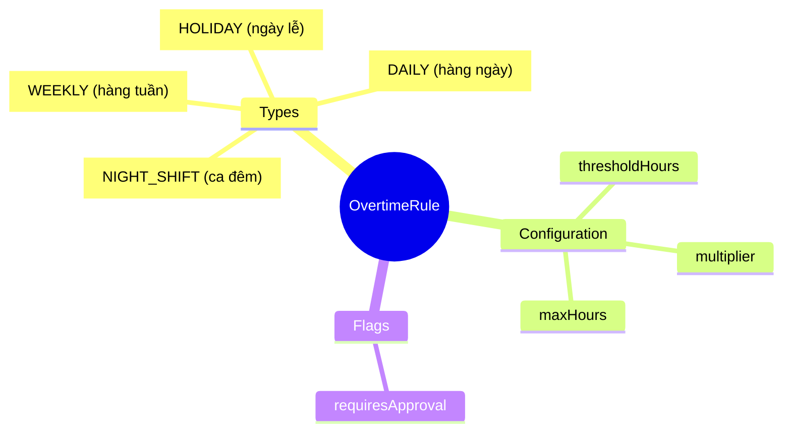
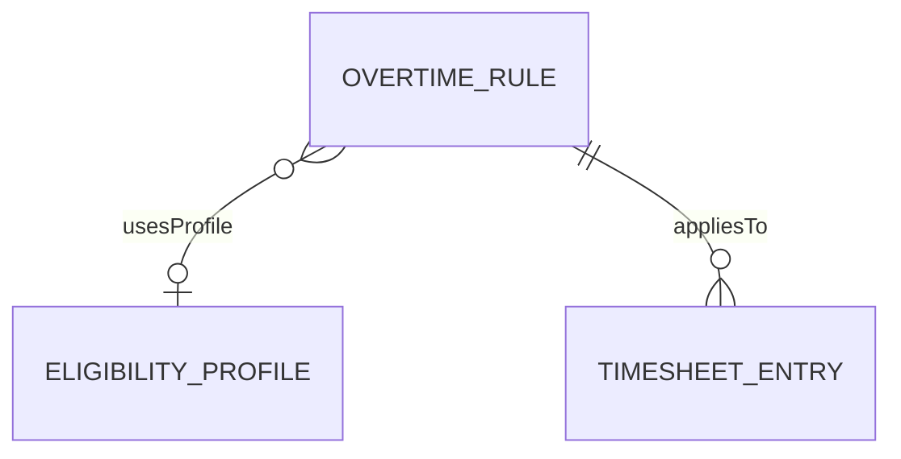
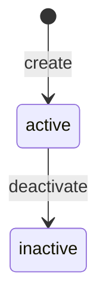
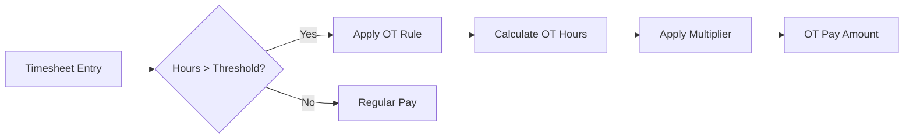

# OvertimeRule

## Overview

**OvertimeRule** định nghĩa quy tắc tính làm thêm giờ - threshold, multiplier, và limits. Quan trọng cho compliance với Luật Lao động VN.



## Business Context

### Key Stakeholders
- **HR Policy**: Define OT rules per labor law
- **Manager**: Approve OT requests
- **Employee**: Request/work OT
- **Payroll**: Calculate OT pay
- **Legal/Compliance**: Ensure labor law compliance

### Vietnam OT Regulations (Labor Code 2019)

| Rule Type | Threshold | Multiplier | Legal Reference |
|-----------|-----------|------------|-----------------|
| **DAILY** | 8 hours | 1.5x (150%) | Điều 98 |
| **WEEKLY** | 40 hours | 1.5x (150%) | Điều 98 |
| **WEEKEND** | 0 hours | 2.0x (200%) | Điều 98 |
| **HOLIDAY** | 0 hours | 3.0x (300%) | Điều 98 |
| **NIGHT_SHIFT** | 22:00-06:00 | +30% | Điều 97 |

### OT Limits (Article 107)

| Limit | Value | Note |
|-------|-------|------|
| **Daily** | Max 4 hours | Per day |
| **Monthly** | Max 40 hours | Normal cases |
| **Yearly** | Max 200 hours | Standard |
| **Yearly (special)** | Max 300 hours | Specific industries |

### Business Value
OvertimeRule ensures consistent OT calculation, legal compliance, and proper payroll integration.

## Attributes Guide

### Core Identity
- **code**: Mã duy nhất. Format: VN_OT_DAILY_150, VN_OT_HOLIDAY_300
- **name**: Tên hiển thị. VD: "OT ngày thường 150%"

### Rule Configuration
- **ruleType**: Loại OT:
  - *DAILY*: OT sau giờ làm hàng ngày
  - *WEEKLY*: OT vượt 40h/tuần
  - *CONSECUTIVE_DAYS*: OT khi làm nhiều ngày liên tục
  - *HOLIDAY*: Làm việc ngày lễ
  - *NIGHT_SHIFT*: Ca đêm (22:00-06:00)
- **thresholdHours**: Giờ bắt đầu tính OT. VD: 8 cho daily, 0 cho holiday
- **multiplier**: Hệ số nhân. VD: 1.5, 2.0, 3.0

### Limits & Controls
- **maxDailyHours**: Giới hạn OT/ngày (VN: max 4h)
- **maxMonthlyHours**: Giới hạn OT/tháng (VN: max 40h)
- **requiresApproval**: Cần manager approve trước không?

### Eligibility
- **eligibilityProfileId**: Ai được áp dụng rule này

## Relationships Explained



### EligibilityProfile
- **usesProfile** → [[EligibilityProfile]]: Xác định ai eligible cho rule

### TimesheetEntry
- Implicit relationship: OT rules apply during timesheet processing

## Lifecycle & Workflows



### OT Calculation Flow



## Actions & Operations

### create
**Who**: HR Policy  
**Required**: code, name, ruleType, thresholdHours, multiplier, effectiveStartDate

### updateMultiplier
**Who**: HR Policy  
**When**: Legal changes (ví dụ: tăng multiplier)  
**Affects**: multiplier

## Business Rules

#### Unique Code (uniqueCode)
**Rule**: Rule code phải duy nhất.

#### Valid Multiplier (validMultiplier)
**Rule**: Multiplier >= 1.0.  
**Reason**: Không có OT ít hơn giờ thường.

#### OT Limits (otLimits)
**Rule**: OT phải comply với giới hạn pháp luật.  
**Enforcement**: System warning khi gần limit, block khi vượt.

## Examples

### Example 1: Daily OT 150%
```yaml
code: VN_OT_DAILY_150
name: "OT ngày thường 150%"
ruleType: DAILY
thresholdHours: 8
multiplier: 1.5
maxDailyHours: 4
requiresApproval: true
```

### Example 2: Weekend OT 200%
```yaml
code: VN_OT_WEEKEND_200
name: "OT cuối tuần 200%"
ruleType: DAILY
thresholdHours: 0  # Từ giờ đầu tiên
multiplier: 2.0
maxDailyHours: 8
requiresApproval: true
```

### Example 3: Holiday OT 300%
```yaml
code: VN_OT_HOLIDAY_300
name: "OT ngày lễ 300%"
ruleType: HOLIDAY
thresholdHours: 0
multiplier: 3.0
requiresApproval: true
```

### Example 4: Night Shift Premium
```yaml
code: VN_NIGHT_PREMIUM
name: "Phụ cấp ca đêm 30%"
ruleType: NIGHT_SHIFT
thresholdHours: 0  # All night hours
multiplier: 1.3    # 30% extra
requiresApproval: false
```

## Related Entities

| Entity | Relationship | Description |
|--------|--------------|-------------|
| [[EligibilityProfile]] | usesProfile | Eligibility criteria |
| [[Shift]] | indirect | Shifts with OT |
| [[PayElement]] | indirect | OT pay elements |
