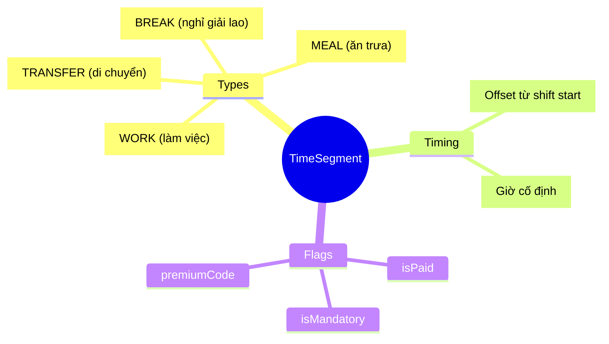
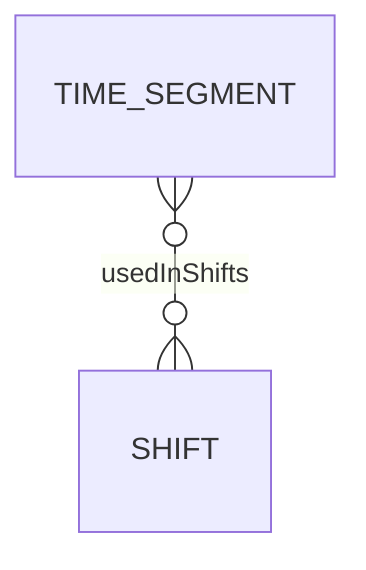
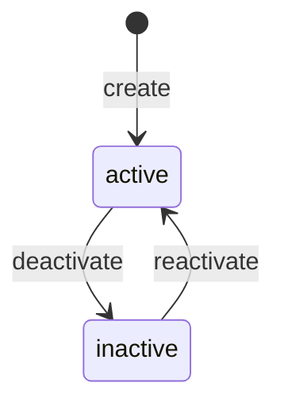

# TimeSegment

## Overview

**TimeSegment** là đơn vị thời gian nguyên tử (atomic) - building block nhỏ nhất của hệ thống Time & Attendance. Là Level 1 trong 6-level Time Hierarchy, là nền tảng cho [[Shift]].



## Business Context

### 6-Level Time Hierarchy

TimeSegment là Level 1 (foundation) trong hierarchy:

```
┌─────────────────────────────────────────────────────────────────┐
│ L1: TimeSegment   │ Work period within a day (07:00-12:00) ◄────│
├───────────────────┼─────────────────────────────────────────────┤
│ L2: Shift         │ Full shift = collection of TimeSegments     │
├───────────────────┼─────────────────────────────────────────────┤
│ L3: DayModel      │ Model for a day (WORK/OFF/HOLIDAY)          │
├───────────────────┼─────────────────────────────────────────────┤
│ L4: WorkPattern   │ Weekly pattern = 7 DayModels                │
├───────────────────┼─────────────────────────────────────────────┤
│ L5: ScheduleRule  │ Assignment rules (rotation, eligibility)    │
├───────────────────┼─────────────────────────────────────────────┤
│ L6: WorkSchedule  │ Actual schedule assigned to employee        │
└───────────────────┴─────────────────────────────────────────────┘
```

### Key Stakeholders
- **TA Admin**: Define and configure segments
- **Payroll**: Use for pay calculation (isPaid, premiumCode)
- **Schedulers**: Compose shifts from segments

### Segment Types

| Type | Mô tả | isPaid | Example |
|------|-------|--------|---------|
| **WORK** | Thời gian làm việc | Yes | 8:00-12:00 Morning block |
| **BREAK** | Giờ nghỉ ngắn | No | 10:00-10:15 Coffee break |
| **MEAL** | Giờ ăn | No | 12:00-13:00 Lunch |
| **TRANSFER** | Di chuyển giữa locations | Varies | 07:30-08:00 Travel |

### Business Value
TimeSegment cho phép define linh hoạt các khoảng thời gian, reuse across shifts, và gắn pay rules (premium) cho từng segment.

## Attributes Guide

### Core Identity
- **code**: Mã duy nhất. Format: WORK_MORNING, LUNCH_BREAK, NIGHT_PREMIUM
- **name**: Tên hiển thị. VD: "Làm việc buổi sáng"
- **segmentType**: Loại segment (WORK/BREAK/MEAL/TRANSFER)

### Timing Options (chọn một)

**Option 1: Relative timing (offset)**
- **startOffsetMin**: Phút từ lúc shift bắt đầu. VD: 0 = ngay khi shift start
- **endOffsetMin**: Phút từ lúc shift bắt đầu. VD: 240 = 4h sau

**Option 2: Absolute timing**
- **startTime**: Giờ cố định. VD: 08:00
- **endTime**: Giờ cố định. VD: 12:00

**Duration**
- **durationMinutes**: Độ dài (phút). Required.

### Pay & Rules
- **isPaid**: Có được trả lương không?
- **isMandatory**: Bắt buộc không? (VD: lunch có thể optional)
- **premiumCode**: Mã phụ cấp cho payroll. VD: NIGHT, HAZARD, WEEKEND

## Relationships Explained



### Shift
- **usedInShifts** → [[Shift]]: Shifts sử dụng segment này. Một segment có thể reuse trong nhiều shifts.

## Lifecycle & Workflows



| State | Meaning |
|-------|---------|
| **active** | Có thể sử dụng trong shifts |
| **inactive** | Không dùng nữa nhưng giữ history |

## Actions & Operations

### create
**Who**: TA Admin  
**Required**: code, name, segmentType, durationMinutes, effectiveStartDate

### configure
**Who**: TA Admin  
**Purpose**: Thiết lập timing (relative hoặc absolute)  
**Affects**: startOffsetMin, endOffsetMin, startTime, endTime

## Business Rules

#### Unique Code (uniqueCode)
**Rule**: Segment code phải duy nhất.

#### Valid Timing (validTiming)
**Rule**: Phải có offset HOẶC time, không được có cả hai.  
**Reason**: Tránh conflict giữa relative và absolute timing.

## Examples

### Example 1: Morning Work Block
```yaml
code: WORK_MORNING
name: "Làm việc buổi sáng"
segmentType: WORK
startTime: "08:00"
endTime: "12:00"
durationMinutes: 240
isPaid: true
isMandatory: true
```

### Example 2: Lunch Break (relative)
```yaml
code: LUNCH_BREAK
name: "Nghỉ trưa"
segmentType: MEAL
startOffsetMin: 240  # 4h từ shift start
endOffsetMin: 300    # 5h từ shift start
durationMinutes: 60
isPaid: false
isMandatory: true
```

### Example 3: Night Premium Work
```yaml
code: NIGHT_WORK
name: "Ca đêm (có phụ cấp)"
segmentType: WORK
startTime: "22:00"
endTime: "06:00"
durationMinutes: 480
isPaid: true
premiumCode: NIGHT_30  # 30% night allowance
```

### Example 4: Transfer Time
```yaml
code: SITE_TRANSFER
name: "Di chuyển giữa công trường"
segmentType: TRANSFER
durationMinutes: 30
isPaid: true
isMandatory: false
```

## Related Entities

| Entity | Relationship | Description |
|--------|--------------|-------------|
| [[Shift]] | usedInShifts | Shifts using this segment |
