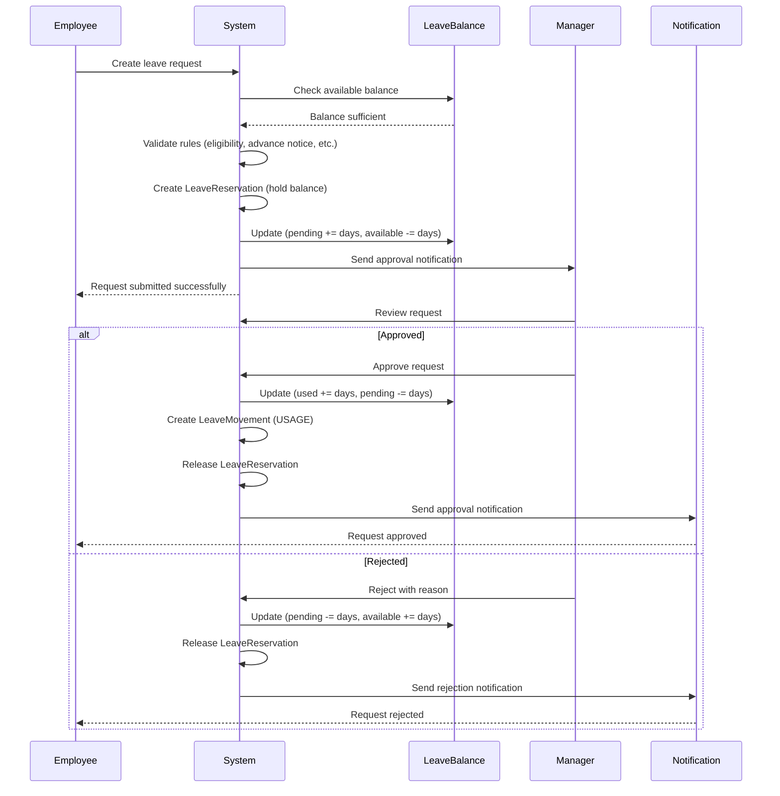
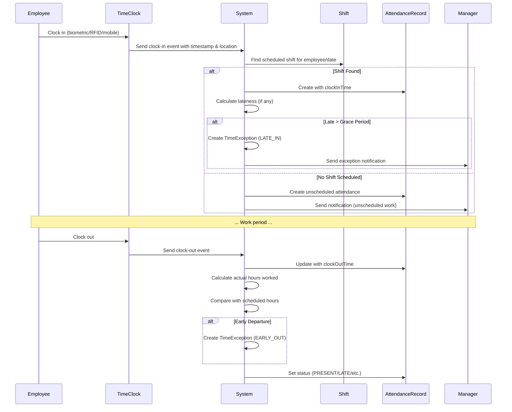
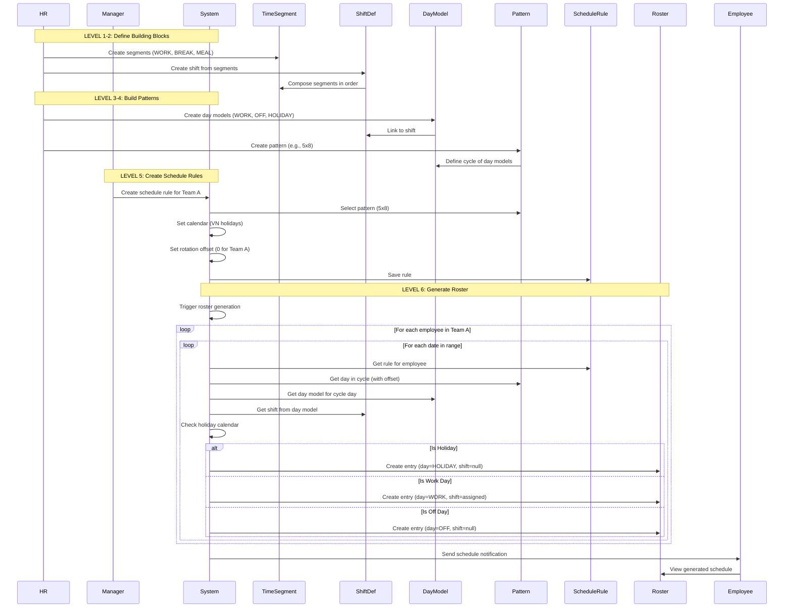
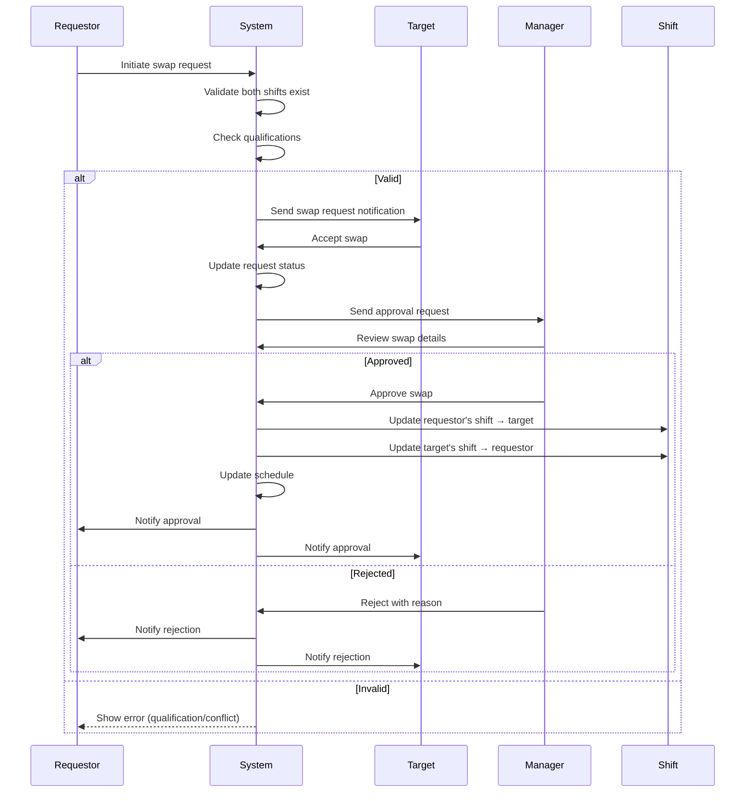
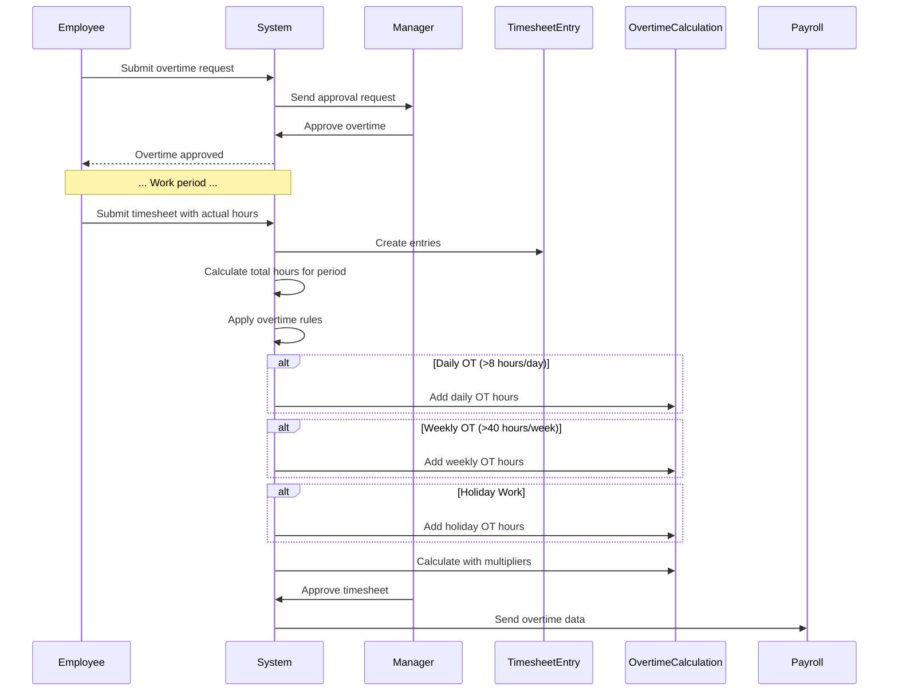
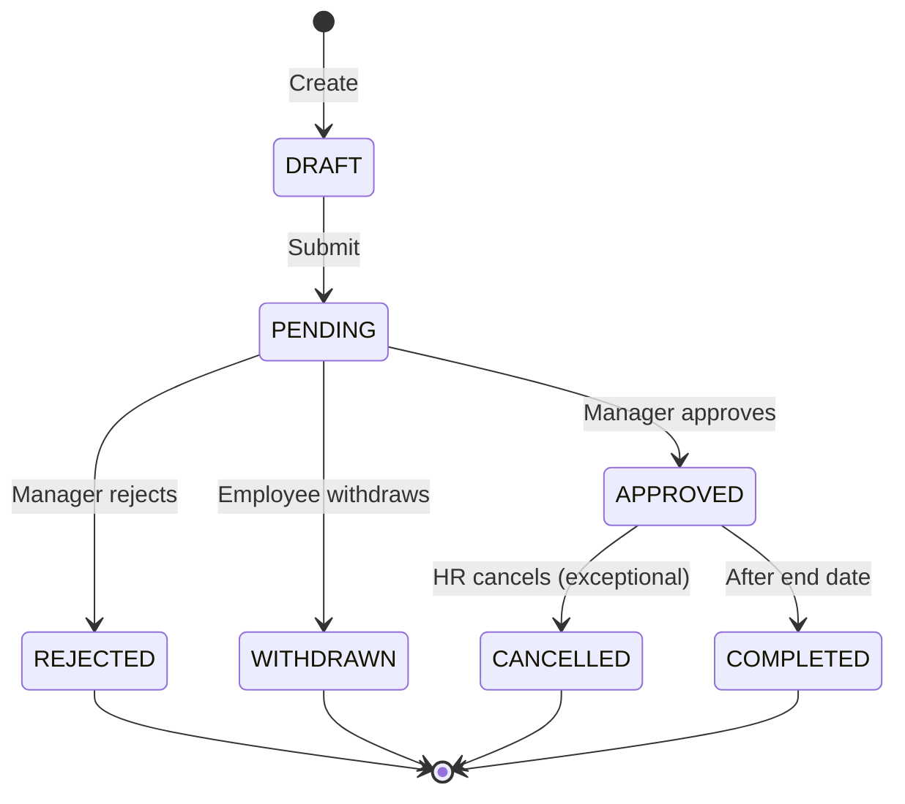
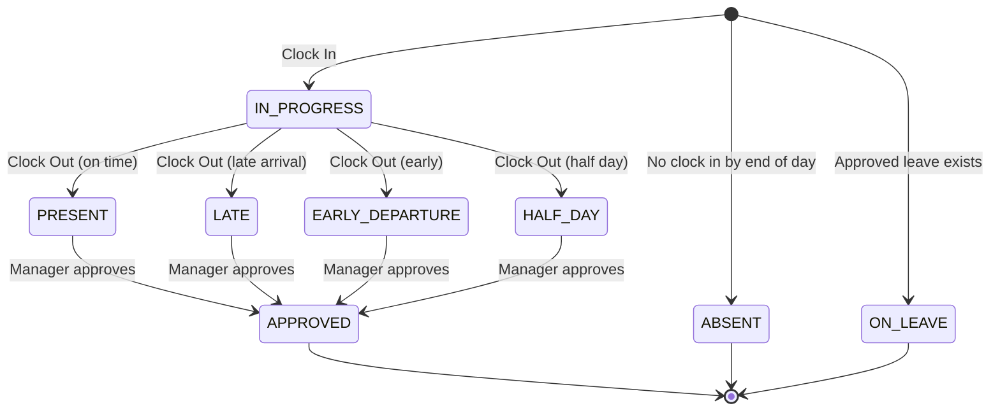
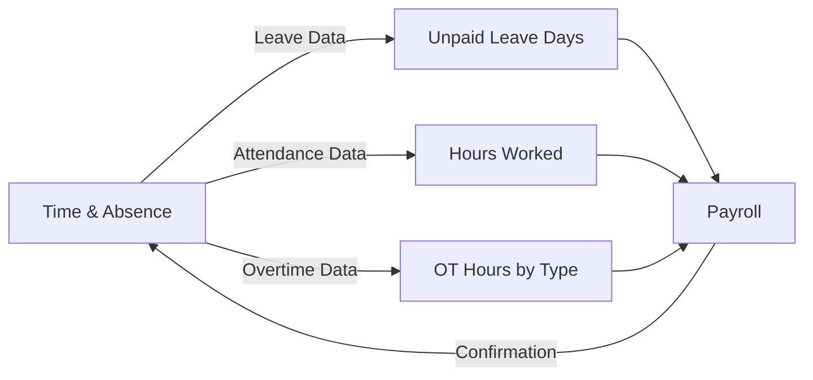
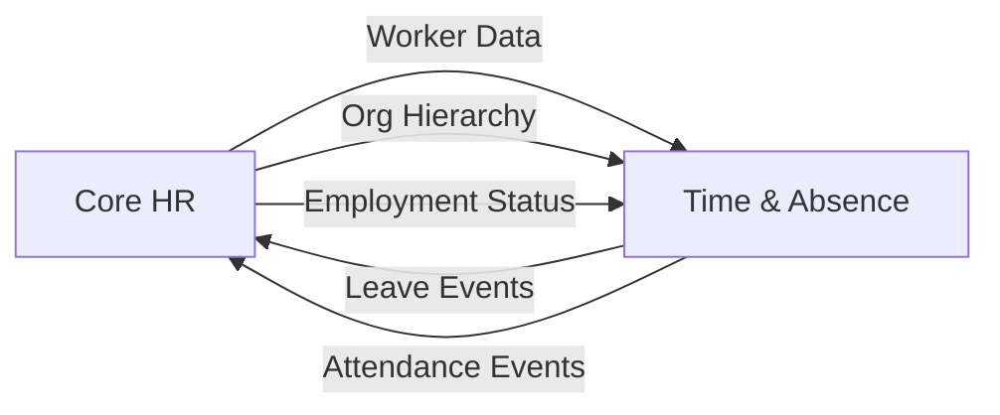

# Time & Absence Management - Conceptual Guide

> This document explains HOW the Time & Absence system works at a conceptual level, covering workflows, behaviors, and interactions across both Absence and Time & Attendance sub-modules.

---

## System Overview

The Time & Absence Management system operates as an integrated platform combining two complementary sub-modules:

**Absence Management** provides a self-service leave request system where employees initiate requests that flow through configurable approval workflows. The system maintains real-time balance tracking using an immutable ledger pattern and enforces flexible policy rules that can be bound at the leave type or class level with priority-based resolution.

**Time & Attendance** enables comprehensive workforce time tracking through shift scheduling, attendance recording, and timesheet management. The system separates scheduled time (shifts) from actual time (attendance records), tracks exceptions automatically, and calculates overtime based on multiple rule types.

**Shared Foundation**: Both sub-modules share common components including working schedules, holiday calendars, period profiles, and an event-driven notification system.

---

## Key Workflows

### Workflow 1: Employee Requests Leave

#### Overview
An employee submits a leave request which flows through validation, approval, and balance update processes.

#### Actors
- **Employee**: Initiates and tracks leave request
- **System**: Validates rules, creates reservation, sends notifications
- **Manager**: Reviews and approves/rejects request
- **HR**: Can intervene for exceptional cases

#### Trigger
Employee selects dates and submits leave request

#### Steps



**Detailed Steps**:

1. **Request Creation**
   - What happens: Employee selects leave type, dates, and optional reason
   - Who: Employee
   - System behavior: Creates draft LeaveRequest entity
   - Business rules applied: None yet (draft state)

2. **Balance Validation**
   - What happens: System checks if employee has sufficient balance
   - Who: System (automatic)
   - System behavior: Queries LeaveBalance for the leave type
   - Business rules applied: 
     - Available balance must be >= requested days
     - Cannot request leave in the past

3. **Rule Validation**
   - What happens: System validates all applicable rules
   - Who: System (automatic)
   - System behavior: Evaluates EligibilityRule, ValidationRule, LimitRule
   - Business rules applied:
     - Employee must be eligible for this leave type
     - Advance notice requirements
     - No blackout periods
     - No overlapping requests
     - Max consecutive days limits

4. **Reservation Creation**
   - What happens: System creates temporary hold on balance
   - Who: System (automatic)
   - System behavior: Creates LeaveReservation entity
   - Business rules applied: Prevents double-booking

5. **Balance Update (Pending)**
   - What happens: Balance adjusted to reflect pending request
   - Who: System (automatic)
   - System behavior: Updates LeaveBalance (pending +, available -)
   - Business rules applied: Maintains balance integrity

6. **Approval Routing**
   - What happens: Request sent to appropriate approver
   - Who: System (automatic)
   - System behavior: Determines approver based on org hierarchy
   - Business rules applied: Multi-level approval if needed

7. **Manager Decision**
   - What happens: Manager reviews and decides
   - Who: Manager
   - System behavior: Updates request status
   - Business rules applied: Cannot approve own request

8. **Final Balance Update**
   - What happens: Balance finalized based on decision
   - Who: System (automatic)
   - System behavior: Creates LeaveMovement, releases reservation
   - Business rules applied: Immutable ledger (movements never deleted)

#### Decision Points

| Decision | Condition | Outcome |
|----------|-----------|---------|
| Sufficient Balance | Available >= Requested | Continue → Validation |
| Insufficient Balance | Available < Requested | Error → Request blocked |
| Rules Valid | All rules pass | Continue → Approval |
| Rules Invalid | Any rule fails | Error → Request blocked |
| Approve | Manager approves | Balance updated → Used |
| Reject | Manager rejects | Balance restored → Available |

#### Outcomes

- **Success**: Leave request approved, balance updated, calendar entries created, notifications sent
- **Failure**: Request rejected, balance restored, employee notified with reason
- **Partial**: Request pending (awaiting additional approvals in multi-level workflow)

#### Variations

**Variation 1: Multi-Level Approval**
- Condition: Request duration > 5 days OR special leave type
- Difference: Requires both direct manager and department head approval
- Flow: Manager approves → Routes to next level → Final approval updates balance

**Variation 2: Auto-Approval**
- Condition: Sick leave < 1 day AND employee has sufficient balance
- Difference: Skips manager approval
- Flow: Validation passes → Immediately approved → Balance updated

---

### Workflow 2: Employee Clocks In/Out

#### Overview
Employee records their work time using a time clock device or mobile app, creating an attendance record.

#### Actors
- **Employee**: Performs clock in/out action
- **Time Clock Device**: Captures biometric/RFID data
- **System**: Creates attendance record, validates against schedule
- **Manager**: Reviews exceptions

#### Trigger
Employee arrives at workplace or starts work

#### Steps



**Detailed Steps**:

1. **Clock In**
   - What happens: Employee scans fingerprint/badge or taps mobile app
   - Who: Employee
   - System behavior: Captures timestamp, location (if GPS), device ID
   - Business rules applied: Cannot clock in if already clocked in

2. **Shift Lookup**
   - What happens: System finds scheduled shift for this employee/date
   - Who: System (automatic)
   - System behavior: Queries Shift entity
   - Business rules applied: Matches by date and employee

3. **Attendance Record Creation**
   - What happens: System creates AttendanceRecord with clock-in time
   - Who: System (automatic)
   - System behavior: Creates new entity, links to shift (if found)
   - Business rules applied: One attendance record per employee per day

4. **Lateness Calculation**
   - What happens: System compares actual vs scheduled start time
   - Who: System (automatic)
   - System behavior: Calculates difference in minutes
   - Business rules applied: Grace period applied (e.g., 5 minutes)

5. **Exception Creation (if needed)**
   - What happens: If late beyond grace period, create exception
   - Who: System (automatic)
   - System behavior: Creates TimeException entity
   - Business rules applied: Severity based on lateness duration

6. **Clock Out**
   - What happens: Employee clocks out at end of shift
   - Who: Employee
   - System behavior: Updates AttendanceRecord with clock-out time
   - Business rules applied: Clock-out must be after clock-in

7. **Hours Calculation**
   - What happens: System calculates actual hours worked
   - Who: System (automatic)
   - System behavior: Subtracts break time, applies rounding rules
   - Business rules applied: Rounding to nearest 15 minutes (configurable)

8. **Status Determination**
   - What happens: System sets final attendance status
   - Who: System (automatic)
   - System behavior: Updates status field
   - Business rules applied: PRESENT, LATE, EARLY_DEPARTURE, etc.

#### Decision Points

| Decision | Condition | Outcome |
|----------|-----------|---------|
| Shift Found | Scheduled shift exists | Normal attendance flow |
| No Shift | No scheduled shift | Unscheduled work → Manager notified |
| On Time | Within grace period | Status: PRESENT |
| Late | Beyond grace period | Status: LATE + Exception created |
| Early Departure | Clock out before scheduled end | Exception created |
| Missing Punch | No clock in or clock out | Exception created (end of day) |

---

### Workflow 3: Hierarchical Roster Generation

#### Overview
System generates employee work schedules using the 6-level hierarchical model: Time Segment → Shift → Day Model → Pattern → Schedule Rule → Roster.

#### Actors
- **HR Administrator**: Configures segments, shifts, day models, patterns
- **Manager**: Creates schedule rules, assigns patterns to teams
- **System**: Generates materialized roster from rules
- **Employees**: View their generated schedules

#### Trigger
HR/Manager sets up schedule rules, or scheduled batch job runs

#### Steps



**Detailed Steps**:

**Phase 1: Configuration (One-time setup)**

1. **Create Time Segments** (Level 1)
   - What happens: HR defines atomic time units
   - Who: HR Administrator
   - System behavior: Creates TimeSegment entities
   - Examples:
     - "Work Morning": 0-240 min (relative)
     - "Lunch": 12:00-13:00 (absolute)
     - "Work Afternoon": 240-480 min (relative)
   - Business rules: Segment must have either offset OR absolute time

2. **Create Shift Definitions** (Level 2)
   - What happens: HR composes segments into shifts
   - Who: HR Administrator
   - System behavior: Creates ShiftDefinition, links to segments via ShiftSegment
   - Examples:
     - "Day Shift" = Work Morning + Lunch + Work Afternoon
     - "Night Shift" = Work Evening + Dinner + Work Night
   - Business rules: 
     - Segments must be ordered sequentially
     - Total hours = sum of segment durations

3. **Create Day Models** (Level 3)
   - What happens: HR defines daily schedule templates
   - Who: HR Administrator
   - System behavior: Creates DayModel entities
   - Examples:
     - "Standard Work Day" → links to "Day Shift"
     - "Weekend" → day type OFF, no shift
     - "Holiday" → day type HOLIDAY, no shift
   - Business rules: WORK days must have a shift

4. **Create Pattern Templates** (Level 4)
   - What happens: HR defines repeating cycles
   - Who: HR Administrator
   - System behavior: Creates PatternTemplate, links to day models via PatternDay
   - Examples:
     - "5x8 Pattern": 7-day cycle = [Work, Work, Work, Work, Work, Off, Off]
     - "4on-4off": 8-day cycle = [Work, Work, Work, Work, Off, Off, Off, Off]
   - Business rules: Cycle length must match number of days defined

**Phase 2: Assignment (Periodic)**

5. **Create Schedule Rule** (Level 5)
   - What happens: Manager assigns pattern to team/employee
   - Who: Manager
   - System behavior: Creates ScheduleAssignment entity
   - Configuration:
     - Pattern: Select from available patterns
     - Calendar: Link to holiday calendar
     - Start date: Anchor point for pattern
     - Offset: Rotation offset (0, 7, 14 for crews A, B, C)
     - Assignment: Team/employee/position
   - Business rules: Must assign to at least one target

**Phase 3: Generation (Automated)**

6. **Generate Roster** (Level 6)
   - What happens: System materializes schedule for each employee/day
   - Who: System (batch job or on-demand)
   - System behavior: Creates GeneratedRoster entries
   - Algorithm:
     ```
     For each employee:
       Find applicable ScheduleRule
       For each date in range:
         Calculate cycle day = (date - startReferenceDate + offsetDays) % cycleLengthDays
         Get DayModel for cycle day from Pattern
         Get Shift from DayModel
         Check if date is holiday (from calendar)
         Create GeneratedRoster entry with full lineage
     ```
   - Business rules:
     - One entry per employee per day
     - Full lineage tracking (rule → pattern → day → shift)
     - Holiday overrides work day

7. **Handle Overrides**
   - What happens: Manager makes ad-hoc changes
   - Who: Manager
   - System behavior: Creates ScheduleOverride
   - Examples:
     - Employee A works on normally-off Saturday
     - Employee B has day off instead of work day
   - Business rules: Override takes precedence over generated roster

8. **Notification**
   - What happens: Employees notified of schedule
   - Who: System (automatic)
   - System behavior: Sends email/push notifications
   - Business rules: Notify X days before schedule starts

#### Decision Points

| Decision | Condition | Outcome |
|----------|-----------|---------|
| Shift Type | ELAPSED vs PUNCH vs FLEX | Determines how attendance is tracked |
| Day Type | WORK vs OFF vs HOLIDAY | Determines if shift is assigned |
| Holiday Check | Date in holiday calendar | Overrides work day to holiday |
| Override Exists | ScheduleOverride for date | Override takes precedence |
| Rotation Offset | Crew A=0, B=7, C=14 | Shifts pattern start by offset days |

#### Outcomes

- **Success**: Complete roster generated for all employees, full lineage tracked
- **Partial**: Some employees missing schedule rules (flagged for review)
- **Override**: Ad-hoc changes applied, original roster preserved for audit

#### Example: 24/7 Rotating Shift

**Setup**:
1. **Segments**: Work(8h), Break(30min)
2. **Shifts**: Day(08:00-16:00), Evening(16:00-00:00), Night(00:00-08:00)
3. **Day Models**: DayShiftDay, EveningShiftDay, NightShiftDay, OffDay
4. **Pattern** (21-day cycle):
   - Days 1-7: Day shift
   - Days 8-14: Off
   - Days 15-21: Evening shift
5. **Schedule Rules**:
   - Crew A: Pattern + offset 0
   - Crew B: Pattern + offset 7
   - Crew C: Pattern + offset 14

**Result** (Week 1):
- Crew A: Day shift (Mon-Sun)
- Crew B: Off (Mon-Sun)
- Crew C: Evening shift (Mon-Sun)

**Result** (Week 2):
- Crew A: Off (Mon-Sun)
- Crew B: Evening shift (Mon-Sun)
- Crew C: Night shift (Mon-Sun)

---

### Workflow 4: Shift Swap Request

#### Overview
Two employees agree to swap their assigned shifts, requiring manager approval.

#### Actors
- **Requestor**: Employee initiating swap
- **Target**: Employee to swap with
- **System**: Validates swap feasibility
- **Manager**: Approves or rejects swap

#### Trigger
Employee wants to swap their shift with a colleague

#### Steps



---

### Workflow 5: Overtime Request and Calculation

#### Overview
Employee requests overtime approval, works the hours, and system calculates overtime pay.

#### Actors
- **Employee**: Requests overtime
- **Manager**: Approves overtime request
- **System**: Tracks hours, calculates overtime
- **Payroll**: Receives overtime data

#### Trigger
Employee anticipates need to work beyond standard hours

#### Steps



---

## Domain Behaviors

### Behavior 1: Leave Balance Calculation

**What it does**: Automatically maintains accurate leave balance for each employee/leave type combination.

**When it happens**: After any balance-affecting event (allocation, accrual, usage, adjustment, carryover, expiry).

**How it works**:
1. System receives balance-affecting event
2. Creates immutable LeaveMovement entry
3. Calculates new balance components
4. Updates LeaveBalance entity
5. Triggers event for notifications/integrations

**Business rules**:
- Available = Total Allocated + Carried Over + Adjusted - Used - Pending - Expired
- Movements are immutable (use REVERSAL type to correct)
- Balance cannot go negative (unless overdraft allowed)
- All changes must have corresponding movement

**Example**:
> Employee starts year with 20 days allocated:
> - Movement: ALLOCATION, +20 days, balance: 0 → 20
> 
> Requests 5 days leave (pending):
> - Balance: pending +5, available -5 (no movement yet)
> 
> Request approved:
> - Movement: USAGE, -5 days, balance: 20 → 15
> - Balance: used +5, pending -5
> 
> Monthly accrual of 1.67 days:
> - Movement: ACCRUAL, +1.67 days, balance: 15 → 16.67

---

### Behavior 2: Attendance Exception Detection

**What it does**: Automatically identifies and flags attendance exceptions.

**When it happens**: 
- Real-time during clock in/out
- End-of-day batch for missing punches
- During timesheet submission

**How it works**:
1. System compares actual vs expected attendance
2. Applies grace period and rounding rules
3. Creates TimeException if threshold exceeded
4. Assigns severity level
5. Notifies manager if action required

**Business rules**:
- Grace period applied before flagging late arrival
- Multiple exceptions may trigger escalation
- Excused exceptions don't count toward violations
- Missing punches must be corrected within X days

**Example**:
> Shift scheduled: 08:00-17:00, Grace period: 5 minutes
> 
> Scenario 1 - On Time:
> - Clock in: 08:03 → No exception (within grace)
> 
> Scenario 2 - Late:
> - Clock in: 08:12 → Exception created (LATE_IN, 12 minutes, WARNING)
> 
> Scenario 3 - Missing Punch:
> - Clock in: 08:00, No clock out → Exception created (MISSING_PUNCH_OUT, VIOLATION)

---

### Behavior 3: Overtime Calculation

**What it does**: Calculates overtime hours and applies appropriate multipliers.

**When it happens**: 
- After timesheet submission
- During payroll period close

**How it works**:
1. System aggregates all timesheet entries for period
2. Applies overtime rules in priority order
3. Categorizes hours by overtime type
4. Calculates payment using multipliers
5. Creates OvertimeCalculation record

**Business rules**:
- Multiple rules can apply (daily + weekly + holiday)
- Highest multiplier wins if rules overlap
- Overtime requires pre-approval (configurable)
- Different overtime types have different multipliers

**Example**:
> Week with 45 hours worked, including 8 hours on a holiday:
> 
> Daily OT Rule: >8 hours/day = 1.5x
> - Monday-Thursday: 9 hours each = 4 hours OT @ 1.5x
> 
> Weekly OT Rule: >40 hours/week = 1.5x
> - Total: 45 hours, 5 hours OT @ 1.5x
> - But 4 hours already counted as daily OT
> - Additional: 1 hour weekly OT @ 1.5x
> 
> Holiday OT Rule: Holiday work = 3.0x
> - Holiday: 8 hours @ 3.0x (overrides daily rule)
> 
> Final Calculation:
> - Regular: 32 hours @ 1.0x
> - Daily OT: 4 hours @ 1.5x
> - Weekly OT: 1 hour @ 1.5x
> - Holiday OT: 8 hours @ 3.0x

---

## Entity Interactions

### How LeaveRequest and LeaveBalance Work Together

When an employee creates a LeaveRequest:

1. **Validation Phase**:
   - System queries LeaveBalance for the employee and leave type
   - Checks: `available >= requested days`
   - If insufficient, request is blocked with error message

2. **Pending Phase** (Request submitted but not approved):
   - LeaveRequest status → PENDING
   - LeaveReservation created (holds the balance)
   - LeaveBalance updated:
     - `pending += requested days`
     - `available -= requested days`
   - No LeaveMovement created yet (balance not finalized)

3. **Approval Phase**:
   - Manager approves LeaveRequest
   - LeaveRequest status → APPROVED
   - LeaveMovement created (type: USAGE, amount: -requested days)
   - LeaveBalance updated:
     - `used += requested days`
     - `pending -= requested days`
   - LeaveReservation released

4. **Rejection Phase**:
   - Manager rejects LeaveRequest
   - LeaveRequest status → REJECTED
   - LeaveBalance restored:
     - `pending -= requested days`
     - `available += requested days`
   - LeaveReservation released
   - No LeaveMovement created

---

### How Shift and AttendanceRecord Work Together

**Scheduled Work Flow**:

1. **Schedule Creation**:
   - Manager creates Shift for employee on specific date
   - Shift contains: `scheduledStartTime`, `scheduledEndTime`, `duration`
   - Shift status: SCHEDULED

2. **Employee Arrival**:
   - Employee clocks in
   - System finds Shift for this employee/date
   - Creates AttendanceRecord:
     - Links to Shift (shiftId)
     - Records `clockInTime`
     - Copies `scheduledStartTime` from Shift

3. **Comparison**:
   - System compares `clockInTime` vs `scheduledStartTime`
   - Calculates lateness
   - Creates TimeException if needed

4. **Employee Departure**:
   - Employee clocks out
   - AttendanceRecord updated with `clockOutTime`
   - System calculates `actualHours`
   - Compares with Shift `duration`

5. **Completion**:
   - Shift status → COMPLETED
   - AttendanceRecord status → PRESENT (or LATE, etc.)

**Unscheduled Work Flow**:

1. Employee clocks in without scheduled Shift
2. System creates AttendanceRecord without Shift link
3. Manager receives notification of unscheduled work
4. Manager can create ad-hoc Shift retroactively or approve as exception

---

### How Rules Bind to Leave Types

The flexible rule binding system allows rules to apply at different levels:

**Class-Level Binding**:
```yaml
EligibilityRule:
  code: "TENURE_6M"
  leaveClassId: "PTO_CLASS"  # Applies to entire class
  priority: 10
```
→ Applies to: All leave types in PTO class (Annual, Sick, Personal)

**Type-Level Binding**:
```yaml
EligibilityRule:
  code: "TENURE_12M"
  leaveTypeId: "ANNUAL_LEAVE"  # Applies to specific type
  priority: 20
```
→ Applies to: Only Annual Leave

**Priority Resolution**:
When evaluating rules for Annual Leave:
1. System finds all rules where:
   - `leaveTypeId = "ANNUAL_LEAVE"` OR
   - `leaveClassId = (class of Annual Leave)`
2. Sorts by priority (descending)
3. Applies highest priority rule if conflict

Result: Type-specific rule (priority 20) overrides class rule (priority 10) for Annual Leave.

---

## State Transitions

### LeaveRequest Lifecycle



**State Descriptions**:

| State | Description | Allowed Actions | Next States |
|-------|-------------|-----------------|-------------|
| DRAFT | Employee composing request | Edit, Delete, Submit | PENDING |
| PENDING | Awaiting manager approval | Withdraw, Approve, Reject | APPROVED, REJECTED, WITHDRAWN |
| APPROVED | Manager approved | View, Cancel (HR only) | CANCELLED, COMPLETED |
| REJECTED | Manager rejected | View | - |
| WITHDRAWN | Employee withdrew before approval | View | - |
| CANCELLED | Cancelled after approval (exceptional) | View | - |
| COMPLETED | Leave period ended | View | - |

---

### AttendanceRecord Lifecycle



---

## Business Rules in Action

### Rule Category 1: Leave Request Validation

#### Rule 1: No Overlapping Leave
- **Statement**: An employee cannot have overlapping approved or pending leave requests
- **Rationale**: Prevents double-booking and ensures accurate absence tracking
- **Enforcement**: System validates date ranges when creating/approving requests
- **Example**: If employee has approved leave Jan 10-15, cannot request Jan 12-17 (overlaps)

#### Rule 2: Sufficient Balance
- **Statement**: Employee must have sufficient available balance to request leave
- **Rationale**: Prevents over-allocation of leave
- **Enforcement**: System checks `available >= requested days` before allowing submission
- **Example**: Employee has 5 days available, cannot request 7 days

#### Rule 3: Advance Notice
- **Statement**: Leave must be requested X days in advance (configurable per leave type)
- **Rationale**: Allows managers time to plan coverage
- **Enforcement**: ValidationRule checks `request date + advance notice <= start date`
- **Example**: Annual leave requires 7 days notice, cannot request for tomorrow

---

### Rule Category 2: Attendance Validation

#### Rule 1: No Duplicate Clock-In
- **Statement**: Employee cannot clock in if already clocked in without clocking out
- **Rationale**: Ensures data integrity and prevents time theft
- **Enforcement**: System checks for existing IN_PROGRESS attendance record
- **Example**: Employee clocked in at 8:00, cannot clock in again at 9:00

#### Rule 2: Clock-Out After Clock-In
- **Statement**: Clock-out time must be after clock-in time
- **Rationale**: Logical time sequence
- **Enforcement**: System validates timestamp order
- **Example**: Cannot clock out at 8:00 if clocked in at 9:00

---

### Rule Category 3: Overtime Calculation

#### Rule 1: Daily Overtime Threshold
- **Statement**: Hours worked beyond X hours per day are overtime (e.g., >8 hours)
- **Rationale**: Compliance with labor laws
- **Enforcement**: OvertimeRule evaluates daily hours
- **Example**: Work 9 hours in a day → 1 hour overtime at 1.5x

#### Rule 2: Weekly Overtime Threshold
- **Statement**: Hours worked beyond X hours per week are overtime (e.g., >40 hours)
- **Rationale**: Compliance with labor laws
- **Enforcement**: OvertimeRule evaluates weekly hours
- **Example**: Work 45 hours in a week → 5 hours overtime at 1.5x

---

## Integration Patterns

### Integration with Payroll

**Purpose**: Provide accurate time and leave data for payroll calculation

**Data Flow**:


**What is shared**:
- **Unpaid Leave Days**: Per employee per pay period for salary deduction
- **Regular Hours**: Standard hours worked for wage calculation
- **Overtime Hours**: Categorized by multiplier (1.5x, 2.0x, 3.0x)
- **Attendance Exceptions**: For potential deductions

**When it happens**: At payroll period close (typically monthly or bi-weekly)

**Flow**:
1. Payroll system requests data for pay period
2. Time & Absence calculates:
   - Approved unpaid leave days
   - Total hours worked from attendance/timesheets
   - Overtime hours by category
3. Data sent to Payroll via API
4. Payroll processes and confirms receipt
5. Time & Absence marks data as "sent to payroll"

---

### Integration with Core HR

**Purpose**: Use employee and organizational data for leave and attendance management

**Data Flow**:


**What is shared**:
- **Worker Data**: Employee ID, name, hire date, employment type
- **Organizational Hierarchy**: Manager relationships for approvals
- **Employment Status**: Active/Inactive for eligibility
- **Leave Events**: For employee record history
- **Attendance Events**: For performance tracking

**When it happens**: 
- Real-time for worker lookups
- Event-driven for status changes
- Nightly sync for organizational changes

---

## Timing and Scheduling

### Scheduled Processes

#### Process 1: Annual Leave Allocation
- **Frequency**: Annually
- **Timing**: January 1st, 00:00 (or fiscal year start)
- **Purpose**: Allocate annual leave for all active employees
- **Steps**:
  1. Identify all active employees
  2. For each employee, find applicable AccrualRule
  3. Calculate leave entitlement based on tenure/policy
  4. Create LeaveMovement (type: ALLOCATION)
  5. Update LeaveBalance
  6. Send notification to employees

#### Process 2: Monthly Leave Accrual
- **Frequency**: Monthly
- **Timing**: 1st day of each month, 00:00
- **Purpose**: Accrue monthly leave for employees with monthly accrual
- **Steps**:
  1. Identify employees with monthly accrual rules
  2. Calculate accrual amount (e.g., 1.67 days)
  3. Create LeaveMovement (type: ACCRUAL)
  4. Update LeaveBalance
  5. Send notification if balance reaches threshold

#### Process 3: Leave Balance Expiry
- **Frequency**: Annually
- **Timing**: Last day of leave year, 23:59
- **Purpose**: Expire unused leave based on carryover rules
- **Steps**:
  1. Identify all leave balances at year end
  2. Apply CarryoverRule for each leave type
  3. Calculate expiring amount
  4. Create LeaveMovement (type: EXPIRY)
  5. Create LeaveMovement (type: CARRYOVER) for carried amount
  6. Update LeaveBalance for new year
  7. Send notification to employees

#### Process 4: Missing Punch Detection
- **Frequency**: Daily
- **Timing**: End of day (e.g., 23:00)
- **Purpose**: Identify employees who forgot to clock in or out
- **Steps**:
  1. Find all AttendanceRecords with status IN_PROGRESS
  2. Create TimeException (type: MISSING_PUNCH_OUT)
  3. Send notification to employee and manager
  4. Set deadline for correction

---

## Error Handling and Edge Cases

### Common Scenarios

#### Scenario 1: Insufficient Leave Balance
- **Situation**: Employee requests more days than available
- **System Response**: Validation fails, request not created
- **User Experience**: Error message: "Insufficient balance. Available: 5 days, Requested: 7 days"
- **Resolution**: Employee adjusts request or requests unpaid leave

#### Scenario 2: Overlapping Leave Requests
- **Situation**: Employee tries to request leave for dates with existing request
- **System Response**: Validation fails
- **User Experience**: Error message: "You have an existing request for Jan 10-15"
- **Resolution**: Employee cancels existing request or chooses different dates

#### Scenario 3: Missing Clock-Out
- **Situation**: Employee forgets to clock out
- **System Response**: Creates TimeException at end of day
- **User Experience**: Notification: "You forgot to clock out yesterday. Please correct."
- **Resolution**: Employee submits correction request, manager approves

#### Scenario 4: Shift Conflict
- **Situation**: Manager tries to schedule employee who has approved leave
- **System Response**: Validation fails with warning
- **User Experience**: Warning: "Employee has approved leave on this date"
- **Resolution**: Manager assigns different employee or adjusts schedule

#### Scenario 5: Overtime Without Approval
- **Situation**: Employee works overtime without pre-approval
- **System Response**: Timesheet flagged for manager review
- **User Experience**: Manager sees "Unapproved OT" flag on timesheet
- **Resolution**: Manager approves retroactively or rejects (hours paid as regular)

---

## Notifications and Communications

### Notification Triggers

| Event | Recipient | Message | Timing |
|-------|-----------|---------|--------|
| Leave request submitted | Manager | "New leave request from {employee} for {dates}" | Immediate |
| Leave request approved | Employee | "Your leave request for {dates} has been approved" | Immediate |
| Leave request rejected | Employee | "Your leave request was rejected. Reason: {reason}" | Immediate |
| Leave balance low | Employee | "Your {leave type} balance is low: {X} days remaining" | When balance < 5 days |
| Leave starting soon | Employee, Manager | "Leave for {employee} starts in 2 days" | 2 days before |
| Attendance exception | Manager | "{Employee} was late by {X} minutes today" | Real-time |
| Missing punch | Employee, Manager | "{Employee} forgot to clock out yesterday" | End of day |
| Schedule published | All team members | "New schedule published for {period}" | When published |
| Shift swap request | Target employee | "{Requestor} wants to swap shifts with you" | Immediate |
| Shift swap approved | Both employees | "Your shift swap has been approved" | Immediate |
| Overtime request | Manager | "{Employee} requests OT approval for {date}" | Immediate |
| Timesheet due | Employee | "Please submit your timesheet by {deadline}" | 2 days before deadline |

---

## Performance and Scale Considerations

### How the System Handles Volume

**Normal Load**:
- Typical organization: 1000 employees
- Daily leave requests: ~10-20
- Daily clock-ins: ~1000
- System handles easily with standard database indexing

**Peak Load**:
- Year-end leave rush: 200+ requests in a week
- Schedule changes: 500+ shifts updated
- Payroll close: Processing 1000+ employee records

**System Behavior**:
- Requests processed in submission order
- Batch operations for schedule changes
- Asynchronous processing for notifications
- Database connection pooling for concurrent requests

**Safeguards**:
- Rate limiting on API endpoints
- Queue-based processing for batch operations
- Caching for frequently accessed data (leave balances, shift patterns)
- Database query optimization with proper indexes

---

## Audit and Compliance

### What is Tracked

**Leave Management**:
- All LeaveRequest state changes (who, when, what changed)
- All LeaveMovement entries (immutable ledger)
- All balance adjustments with reason
- All approval decisions with comments
- All policy/rule changes with effective dates

**Time & Attendance**:
- All clock-in/out events with timestamp and location
- All attendance record changes
- All timesheet submissions and approvals
- All schedule changes
- All shift swaps and approvals
- All exception creations and resolutions

### Audit Trail Example

```
LeaveRequest #12345 History:
- 2025-01-10 09:00 | Created by John Doe | Status: DRAFT
  Details: Annual Leave, 5 days (Jan 15-19)
- 2025-01-10 09:15 | Submitted by John Doe | Status: PENDING
  System: LeaveReservation created, Balance updated (pending +5, available -5)
- 2025-01-10 14:30 | Approved by Jane Manager | Status: APPROVED
  Comment: "Approved. Have a good vacation!"
  System: LeaveMovement created (USAGE, -5 days), Balance updated (used +5, pending -5)
- 2025-01-15 00:00 | System | Leave period started
- 2025-01-19 23:59 | System | Leave period ended
- 2025-01-20 08:00 | System | Status: COMPLETED
```

```
AttendanceRecord #67890 History:
- 2025-01-10 08:12 | Clock In | Device: Entrance_01, Location: Main Office
  System: 12 minutes late, TimeException created (LATE_IN, WARNING)
- 2025-01-10 17:05 | Clock Out | Device: Entrance_01
  System: Actual hours: 8.88, Scheduled: 8.0, Status: LATE
- 2025-01-11 09:00 | Excused by Jane Manager | Exception excused
  Comment: "Traffic jam due to accident, excused"
  System: TimeException updated (isExcused: true)
```

---

## Glossary of Concepts

| Concept | Definition | Example |
|---------|------------|---------|
| **Accrual** | Earning leave over time | Earn 1.67 days per month = 20 days/year |
| **Carryover** | Unused leave moved to next period | 5 days from 2024 → 2025 |
| **Reservation** | Temporary hold on balance while request pending | Request 3 days → 3 days reserved |
| **Movement** | Immutable ledger entry for balance change | ALLOCATION +20, USAGE -5 |
| **Grace Period** | Allowed lateness without penalty | 5 minutes grace → 08:05 is "on time" |
| **Shift Pattern** | Reusable shift template | "Day Shift: 08:00-17:00, Mon-Fri" |
| **Open Shift** | Unassigned shift available for bidding | Weekend shift, no assigned employee |
| **Overtime Multiplier** | Pay rate for overtime hours | 1.5x for daily OT, 3.0x for holiday |
| **Time Exception** | Deviation from expected attendance | Late arrival, missing punch |
| **Shift Differential** | Premium pay for specific shifts | +30% for night shift |

---

## Real-World Scenarios

### Scenario 1: Employee Plans Summer Vacation

**Context**: Sarah wants to take 2 weeks off in July for a family vacation.

**Story**:
Sarah logs into xTalent and navigates to the Leave Management section. She clicks "Request Leave" and selects "Annual Leave" from the dropdown. The system displays her current balance: 15 days available out of 20 allocated.

She selects July 15-26 (10 working days, excluding weekends). The system validates:
- ✅ Sufficient balance (15 >= 10)
- ✅ No overlapping requests
- ✅ Advance notice met (7 days required, requesting 2 months ahead)
- ✅ No blackout period
- ✅ Within max consecutive days (15 days allowed)

Sarah adds a note: "Family vacation to Europe" and submits. The system:
1. Creates LeaveReservation (holds 10 days)
2. Updates her balance: Available: 5 days, Pending: 10 days
3. Sends notification to her manager, Mike

Mike receives an email and reviews the request in the system. He sees:
- Sarah's current balance and usage history
- Team calendar showing no one else is on leave during that period
- Sarah's performance has been excellent

Mike approves the request with comment: "Approved. Enjoy your vacation!"

The system:
1. Creates LeaveMovement (USAGE, -10 days)
2. Updates balance: Used: 10 days, Pending: 0 days, Available: 5 days
3. Releases LeaveReservation
4. Creates calendar entries
5. Sends approval notification to Sarah

**Entities Involved**: Employee (Sarah), LeaveType (Annual Leave), LeaveBalance, LeaveRequest, LeaveReservation, LeaveMovement, Manager (Mike)

**Outcome**: Approved leave request, updated balance, calendar entries created, team visibility

---

### Scenario 2: Shift Worker Swaps Weekend Shift

**Context**: Tom is scheduled for Saturday shift but has a family event. He finds a colleague willing to swap.

**Story**:
Tom opens the mobile app and views his schedule. He sees he's assigned to Saturday 10:00-18:00 shift. He taps "Request Shift Swap" and selects his colleague Lisa from the list.

The system shows Lisa's schedule and identifies a compatible shift: Lisa is scheduled for Sunday 10:00-18:00. Tom selects this shift and sends the swap request.

Lisa receives a push notification. She reviews the swap:
- Tom's Saturday shift: 10:00-18:00
- Her Sunday shift: 10:00-18:00
- Both are same shift pattern (Weekend Day Shift)

Lisa accepts the swap. The system validates:
- ✅ Both employees qualified for both shifts
- ✅ No conflicts with leave or other shifts
- ✅ Within swap request deadline (48 hours before shift)

The swap request goes to their manager, David. David reviews and sees:
- Both employees have good attendance records
- Coverage is maintained
- Both shifts are equivalent

David approves the swap. The system:
1. Updates Tom's schedule: Saturday shift removed, Sunday shift added
2. Updates Lisa's schedule: Sunday shift removed, Saturday shift added
3. Sends notifications to both employees
4. Updates published schedule

**Entities Involved**: Requestor (Tom), Target (Lisa), ShiftSwapRequest, Shift (x2), Manager (David), Schedule

**Outcome**: Shifts successfully swapped, schedule updated, both employees satisfied

---

### Scenario 3: Manager Handles Attendance Exception

**Context**: Employee arrives late due to traffic, manager needs to review and excuse.

**Story**:
John is scheduled for 08:00-17:00 shift. Due to a traffic accident, he arrives at 08:45 and clocks in.

The system:
1. Records clock-in time: 08:45
2. Compares with scheduled start: 08:00
3. Calculates lateness: 45 minutes
4. Applies grace period: 5 minutes
5. Creates TimeException (LATE_IN, 40 minutes, WARNING)
6. Sends notification to manager

Manager receives notification: "John Doe was 45 minutes late today."

Manager opens the Attendance Dashboard and sees:
- John's attendance record for today
- TimeException details
- John's attendance history (usually punctual)

Manager clicks on the exception to review. John has added a note: "Major traffic accident on highway, attached news link."

Manager verifies the news report and decides to excuse the exception. Manager clicks "Excuse Exception" and adds comment: "Verified traffic incident, excused."

The system:
1. Updates TimeException: isExcused = true
2. Records manager's comment
3. Sends notification to John
4. Updates John's violation count (no impact since excused)

At end of day, John clocks out at 17:00. The system:
1. Calculates actual hours: 8.25 hours (08:45-17:00)
2. Sets AttendanceRecord status: PRESENT (exception excused)
3. No penalty applied

**Entities Involved**: Employee (John), AttendanceRecord, TimeException, Manager, Shift

**Outcome**: Exception properly documented and excused, employee not penalized for unavoidable delay

---

## Related Documents

- [Concept Overview](./01-concept-overview.md) - What and why
- [Absence Ontology](../00-ontology/absence-ontology.yaml) - Absence domain entities
- [Time & Attendance Ontology](../00-ontology/time-attendance-ontology.yaml) - T&A domain entities
- [Module Summary](../00-ontology/TA-MODULE-SUMMARY.yaml) - Complete module overview
- [Specifications](../02-spec/) - Detailed technical specs
- [API Documentation](../04-api/) - API endpoints

---

**Document Version**: 1.0  
**Last Updated**: 2025-12-01  
**Author**: xTalent Documentation Team  
**Reviewers**: [To be assigned]
