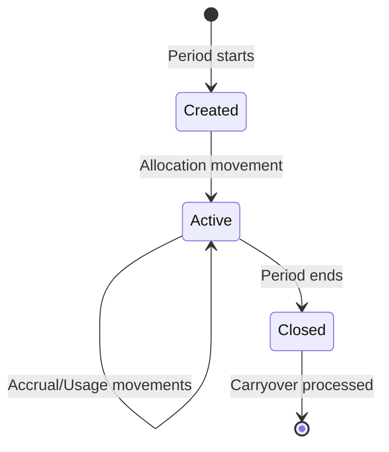
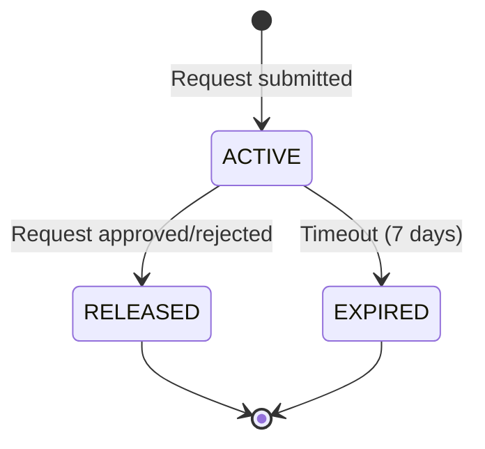

# Leave Balance Ledger Guide

**Version**: 1.0  
**Last Updated**: 2025-12-12  
**Audience**: HR Administrators, Developers, System Analysts  
**Reading Time**: 25-30 minutes

---

## 📋 Overview

This guide explains the **immutable ledger pattern** used for leave balance tracking in the TA module. You'll learn how the system maintains accurate balances, tracks all changes through movements, and ensures data integrity through the reservation system.

### What You'll Learn

- Understanding the ledger architecture
- How LeaveBalance is calculated and maintained
- LeaveMovement types and lifecycle
- The reservation system for pending requests
- Balance integrity guarantees
- Audit trail and compliance
- Common scenarios and troubleshooting

### Prerequisites

- Basic understanding of leave management
- Familiarity with the [Concept Overview](./01-concept-overview.md)
- Understanding of [Leave Policy Configuration](./03-leave-policy-configuration-guide.md)

---

## 🏗️ Ledger Architecture Overview

The TA module uses an **immutable ledger pattern** inspired by double-entry bookkeeping to ensure balance accuracy and provide complete audit trail.

### Core Principle

> **Every change to leave balance creates an immutable movement record**

This means:
- ✅ Complete history of all balance changes
- ✅ Ability to reconstruct balance at any point in time
- ✅ Audit trail for compliance
- ✅ No data loss (movements never deleted, only reversed)

### Three-Entity Model

```
LeaveBalance (Current State)
    ↑
    | Updated by
    |
LeaveMovement (Immutable Ledger)
    ↑
    | Holds during pending
    |
LeaveReservation (Temporary Hold)
```

---

## 📊 LeaveBalance Entity

### What is LeaveBalance?

**LeaveBalance** is the current state of an employee's leave for a specific leave type and period. It's a **calculated snapshot** that gets updated after every movement.

### Structure

```yaml
LeaveBalance:
  id: UUID
  workerId: UUID
  leaveTypeId: UUID
  periodProfileId: UUID
  periodYear: 2025
  periodStartDate: 2025-01-01
  periodEndDate: 2025-12-31
  
  # Balance Components
  totalAllocated: 20.0      # Total days allocated for period
  accrued: 20.0             # Amount accrued so far (if using accrual)
  used: 5.0                 # Amount already used (approved requests)
  pending: 2.0              # Amount in pending requests (reserved)
  reserved: 2.0             # Amount in active reservations
  carriedOver: 3.0          # Amount carried from previous period
  adjusted: 1.0             # Manual adjustments (+ or -)
  expired: 0.0              # Amount expired
  
  # Computed Field
  available: 17.0           # totalAllocated + carriedOver + adjusted - used - pending - expired
  
  # Accrual Tracking
  lastAccrualDate: 2025-12-01
  nextAccrualDate: 2026-01-01
```

### Balance Calculation Formula

```
available = totalAllocated + carriedOver + adjusted - used - pending - expired
```

**Example**:
```
available = 20 + 3 + 1 - 5 - 2 - 0 = 17 days
```

### Balance Lifecycle



**States**:
1. **Created**: Balance record created for new period
2. **Active**: Normal operation (allocations, accruals, usage)
3. **Closed**: Period ended, no more changes allowed
4. **Archived**: After carryover processed

---

## 📝 LeaveMovement Entity

### What is LeaveMovement?

**LeaveMovement** is an immutable ledger entry recording a single change to leave balance. Every balance change creates a movement.

### Structure

```yaml
LeaveMovement:
  id: UUID
  leaveBalanceId: UUID
  movementType: ALLOCATION | ACCRUAL | USAGE | ADJUSTMENT | CARRYOVER | EXPIRY | PAYOUT | REVERSAL
  amount: decimal           # Positive for credit, negative for debit
  balanceBefore: decimal    # Balance before this movement
  balanceAfter: decimal     # Balance after this movement
  movementDate: date        # When movement was created
  effectiveDate: date       # When movement takes effect
  leaveRequestId: UUID      # If caused by leave request (nullable)
  reason: string            # Description of why movement occurred
  referenceType: LEAVE_REQUEST | POLICY | MANUAL | SYSTEM
  referenceId: UUID         # Reference to source entity
  isReversed: boolean       # Whether this movement has been reversed
  reversalMovementId: UUID  # ID of reversal movement (if reversed)
  createdAt: datetime
  createdBy: UUID
```

### Movement Types

#### 1. ALLOCATION

**Purpose**: Initial allocation of leave for a period

**Example**:
```yaml
LeaveMovement:
  movementType: ALLOCATION
  amount: +20.0
  balanceBefore: 0.0
  balanceAfter: 20.0
  movementDate: 2025-01-01
  effectiveDate: 2025-01-01
  reason: "Annual allocation for 2025"
  referenceType: POLICY
```

**When**: 
- Start of leave year
- Employee joins company
- Policy change

---

#### 2. ACCRUAL

**Purpose**: Periodic earning of leave (monthly, biweekly, etc.)

**Example**:
```yaml
LeaveMovement:
  movementType: ACCRUAL
  amount: +1.67
  balanceBefore: 20.0
  balanceAfter: 21.67
  movementDate: 2025-02-01
  effectiveDate: 2025-02-01
  reason: "Monthly accrual for February 2025"
  referenceType: SYSTEM
```

**When**:
- Monthly accrual job runs
- Biweekly accrual
- Custom accrual schedule

---

#### 3. USAGE

**Purpose**: Leave taken (approved request)

**Example**:
```yaml
LeaveMovement:
  movementType: USAGE
  amount: -5.0
  balanceBefore: 21.67
  balanceAfter: 16.67
  movementDate: 2025-02-15
  effectiveDate: 2025-02-20
  leaveRequestId: "REQUEST_123"
  reason: "Annual leave: Feb 20-24, 2025"
  referenceType: LEAVE_REQUEST
  referenceId: "REQUEST_123"
```

**When**:
- Leave request approved
- Leave period starts (depending on policy)

---

#### 4. ADJUSTMENT

**Purpose**: Manual correction by HR

**Example**:
```yaml
LeaveMovement:
  movementType: ADJUSTMENT
  amount: +2.0
  balanceBefore: 16.67
  balanceAfter: 18.67
  movementDate: 2025-03-01
  effectiveDate: 2025-03-01
  reason: "Correction: Sick leave incorrectly deducted"
  referenceType: MANUAL
  createdBy: "HR_ADMIN_ID"
```

**When**:
- HR corrects error
- Policy exception granted
- System error correction

---

#### 5. CARRYOVER

**Purpose**: Transfer unused balance to next period

**Example**:
```yaml
LeaveMovement:
  movementType: CARRYOVER
  amount: +5.0
  balanceBefore: 0.0  # New period balance
  balanceAfter: 5.0
  movementDate: 2026-01-01
  effectiveDate: 2026-01-01
  reason: "Carryover from 2025 (5 days)"
  referenceType: SYSTEM
```

**When**:
- Period end processing
- Carryover rules applied

---

#### 6. EXPIRY

**Purpose**: Remove expired balance

**Example**:
```yaml
LeaveMovement:
  movementType: EXPIRY
  amount: -3.0
  balanceBefore: 18.67
  balanceAfter: 15.67
  movementDate: 2025-12-31
  effectiveDate: 2025-12-31
  reason: "Expired: Unused balance exceeds carryover limit"
  referenceType: SYSTEM
```

**When**:
- Period end processing
- Carryover limit exceeded
- Carried balance expires

---

#### 7. PAYOUT

**Purpose**: Pay out unused balance

**Example**:
```yaml
LeaveMovement:
  movementType: PAYOUT
  amount: -10.0
  balanceBefore: 15.67
  balanceAfter: 5.67
  movementDate: 2025-12-31
  effectiveDate: 2025-12-31
  reason: "Payout: 10 days @ 100% daily rate"
  referenceType: SYSTEM
```

**When**:
- Period end processing
- Employee termination
- Policy allows payout

---

#### 8. REVERSAL

**Purpose**: Reverse a previous movement (error correction)

**Example**:
```yaml
# Original movement (incorrect)
LeaveMovement:
  id: "MOVEMENT_ORIGINAL"
  movementType: USAGE
  amount: -5.0
  balanceBefore: 20.0
  balanceAfter: 15.0
  isReversed: true
  reversalMovementId: "MOVEMENT_REVERSAL"

# Reversal movement
LeaveMovement:
  id: "MOVEMENT_REVERSAL"
  movementType: REVERSAL
  amount: +5.0  # Opposite of original
  balanceBefore: 15.0
  balanceAfter: 20.0
  reason: "Reversal: Leave request cancelled"
  referenceType: MANUAL
```

**When**:
- Leave request cancelled
- Error correction
- Policy change retroactive

---

### Movement Rules

1. **Immutability**: Movements cannot be modified or deleted
2. **Balance Integrity**: `balanceAfter = balanceBefore + amount`
3. **Sign Convention**: 
   - Positive (+) = Credit (increases balance)
   - Negative (-) = Debit (decreases balance)
4. **Reversal Only**: Errors corrected via REVERSAL movements
5. **Audit Trail**: Every movement has `createdBy` and `createdAt`

---

## 🔒 LeaveReservation Entity

### What is LeaveReservation?

**LeaveReservation** is a temporary hold on leave balance while a request is pending approval. It prevents double-booking.

### Structure

```yaml
LeaveReservation:
  id: UUID
  leaveRequestId: UUID
  leaveBalanceId: UUID
  reservedAmount: 5.0
  reservedAt: 2025-02-15T10:30:00
  expiresAt: 2025-02-22T10:30:00  # Auto-expire after 7 days
  status: ACTIVE | RELEASED | EXPIRED
  releasedAt: datetime (nullable)
```

### Reservation Lifecycle



### How Reservations Work

**Step 1: Request Submitted**
```yaml
# Employee submits request for 5 days
LeaveRequest:
  status: PENDING
  totalDays: 5.0

# System creates reservation
LeaveReservation:
  reservedAmount: 5.0
  status: ACTIVE

# Balance updated (no movement yet!)
LeaveBalance:
  pending: +5.0      # Increases
  available: -5.0    # Decreases
```

**Step 2: Request Approved**
```yaml
# Request approved
LeaveRequest:
  status: APPROVED

# Movement created
LeaveMovement:
  movementType: USAGE
  amount: -5.0

# Reservation released
LeaveReservation:
  status: RELEASED

# Balance updated
LeaveBalance:
  used: +5.0         # Increases
  pending: -5.0      # Decreases (reservation released)
  # available stays same (already reduced)
```

**Step 3: Request Rejected**
```yaml
# Request rejected
LeaveRequest:
  status: REJECTED

# Reservation released (no movement!)
LeaveReservation:
  status: RELEASED

# Balance restored
LeaveBalance:
  pending: -5.0      # Decreases
  available: +5.0    # Restored
```

---

## 🔄 Balance Update Workflows

### Workflow 1: Upfront Allocation

**Scenario**: Employee receives 20 days on Jan 1

```yaml
# Step 1: Create balance record
LeaveBalance:
  workerId: "EMP_001"
  leaveTypeId: "ANNUAL"
  periodYear: 2025
  totalAllocated: 0.0
  available: 0.0

# Step 2: Create allocation movement
LeaveMovement:
  movementType: ALLOCATION
  amount: +20.0
  balanceBefore: 0.0
  balanceAfter: 20.0
  reason: "Annual allocation for 2025"

# Step 3: Update balance
LeaveBalance:
  totalAllocated: 20.0
  accrued: 20.0
  available: 20.0
```

---

### Workflow 2: Monthly Accrual

**Scenario**: Employee accrues 1.67 days per month

```yaml
# Month 1 (January)
LeaveMovement:
  movementType: ACCRUAL
  amount: +1.67
  balanceBefore: 0.0
  balanceAfter: 1.67

LeaveBalance:
  totalAllocated: 1.67
  accrued: 1.67
  available: 1.67
  lastAccrualDate: 2025-01-01
  nextAccrualDate: 2025-02-01

# Month 2 (February)
LeaveMovement:
  movementType: ACCRUAL
  amount: +1.67
  balanceBefore: 1.67
  balanceAfter: 3.34

LeaveBalance:
  totalAllocated: 3.34
  accrued: 3.34
  available: 3.34
  lastAccrualDate: 2025-02-01
  nextAccrualDate: 2025-03-01
```

---

### Workflow 3: Leave Request Approval

**Scenario**: Employee requests 5 days, gets approved

```yaml
# Step 1: Request submitted
LeaveRequest:
  totalDays: 5.0
  status: PENDING

# Step 2: Reservation created
LeaveReservation:
  reservedAmount: 5.0
  status: ACTIVE

# Step 3: Balance updated (pending)
LeaveBalance:
  available: 15.0  # Was 20.0, now 20.0 - 5.0
  pending: 5.0
  reserved: 5.0

# Step 4: Request approved
LeaveRequest:
  status: APPROVED

# Step 5: Movement created
LeaveMovement:
  movementType: USAGE
  amount: -5.0
  balanceBefore: 20.0
  balanceAfter: 15.0
  leaveRequestId: "REQUEST_123"

# Step 6: Reservation released
LeaveReservation:
  status: RELEASED

# Step 7: Balance finalized
LeaveBalance:
  available: 15.0  # Stays same
  used: 5.0        # Increases
  pending: 0.0     # Decreases
  reserved: 0.0    # Decreases
```

---

### Workflow 4: Year-End Carryover

**Scenario**: Employee has 5 unused days, max carryover is 5 days

```yaml
# Step 1: Calculate carryover
Unused = totalAllocated + carriedOver + adjusted - used
Unused = 20 + 0 + 0 - 15 = 5 days

MaxCarryover = 5 days
Carryover = min(Unused, MaxCarryover) = 5 days
Expiry = Unused - Carryover = 0 days

# Step 2: Create expiry movement (if any)
# None in this case

# Step 3: Close old period balance
LeaveBalance (2025):
  periodYear: 2025
  status: CLOSED

# Step 4: Create new period balance
LeaveBalance (2026):
  periodYear: 2026
  totalAllocated: 0.0
  carriedOver: 0.0
  available: 0.0

# Step 5: Create carryover movement
LeaveMovement:
  movementType: CARRYOVER
  amount: +5.0
  balanceBefore: 0.0
  balanceAfter: 5.0
  reason: "Carryover from 2025"

# Step 6: Update new balance
LeaveBalance (2026):
  carriedOver: 5.0
  available: 5.0

# Step 7: Create new allocation
LeaveMovement:
  movementType: ALLOCATION
  amount: +20.0
  balanceBefore: 5.0
  balanceAfter: 25.0

LeaveBalance (2026):
  totalAllocated: 20.0
  carriedOver: 5.0
  available: 25.0
```

---

## ✅ Balance Integrity Guarantees

### 1. Immutability

**Guarantee**: Movements cannot be modified or deleted

**Implementation**:
- Database constraints prevent UPDATE/DELETE on movements
- Only INSERT allowed
- Errors corrected via REVERSAL movements

**Benefit**: Complete, tamper-proof audit trail

---

### 2. Balance Consistency

**Guarantee**: Balance always equals sum of movements

**Formula**:
```
current_balance = initial_balance + sum(all_movements.amount)
```

**Verification**:
```sql
-- Verify balance integrity
SELECT 
  lb.id,
  lb.available AS current_balance,
  COALESCE(SUM(lm.amount), 0) AS calculated_balance,
  lb.available - COALESCE(SUM(lm.amount), 0) AS difference
FROM leave_balance lb
LEFT JOIN leave_movement lm ON lm.leave_balance_id = lb.id
GROUP BY lb.id
HAVING ABS(lb.available - COALESCE(SUM(lm.amount), 0)) > 0.01;
```

---

### 3. No Negative Balance (Unless Allowed)

**Guarantee**: Balance cannot go negative unless overdraft allowed

**Validation**:
```yaml
# Before creating movement
IF (balance.available + movement.amount < 0) THEN
  IF (overdraftRule.allowOverdraft = false) THEN
    REJECT "Insufficient balance"
  ELSE IF (balance.available + movement.amount < -overdraftRule.maxOverdraftAmount) THEN
    REJECT "Exceeds overdraft limit"
  END IF
END IF
```

---

### 4. Reservation Prevents Double-Booking

**Guarantee**: Cannot approve overlapping requests

**Validation**:
```yaml
# Before creating reservation
existingReservations = SELECT * FROM leave_reservation
  WHERE leave_balance_id = balance.id
  AND status = 'ACTIVE'
  AND (requested_dates OVERLAP existing_dates)

IF (existingReservations.count > 0) THEN
  REJECT "Overlapping request exists"
END IF
```

---

## 📊 Audit Trail and Compliance

### Complete History

Every balance change is recorded with:
- ✅ What changed (movementType, amount)
- ✅ When it changed (movementDate, effectiveDate)
- ✅ Who changed it (createdBy)
- ✅ Why it changed (reason)
- ✅ Source of change (referenceType, referenceId)

### Reconstruction

Balance can be reconstructed at any point in time:

```sql
-- Balance as of specific date
SELECT 
  SUM(amount) AS balance_as_of_date
FROM leave_movement
WHERE leave_balance_id = ?
  AND effective_date <= '2025-06-30';
```

### Compliance Reports

**1. Balance Change History**
```sql
SELECT 
  lm.movement_date,
  lm.movement_type,
  lm.amount,
  lm.balance_before,
  lm.balance_after,
  lm.reason,
  u.name AS created_by
FROM leave_movement lm
JOIN users u ON u.id = lm.created_by
WHERE lm.leave_balance_id = ?
ORDER BY lm.movement_date;
```

**2. Pending Requests Report**
```sql
SELECT 
  w.name AS employee,
  lt.name AS leave_type,
  lr.start_date,
  lr.end_date,
  lr.total_days,
  lb.available AS available_balance
FROM leave_request lr
JOIN leave_balance lb ON lb.id = lr.leave_balance_id
JOIN worker w ON w.id = lb.worker_id
JOIN leave_type lt ON lt.id = lb.leave_type_id
WHERE lr.status = 'PENDING';
```

---

## ⚠️ Common Scenarios

### Scenario 1: Employee Joins Mid-Year

**Setup**:
- Annual allocation: 20 days
- Employee joins: July 1 (6 months remaining)
- Proration: Enabled

**Movements**:
```yaml
# Prorated allocation
LeaveMovement:
  movementType: ALLOCATION
  amount: +10.0  # 20 × (6/12)
  reason: "Prorated allocation: Joined Jul 1, 2025"

LeaveBalance:
  totalAllocated: 10.0
  available: 10.0
```

---

### Scenario 2: Leave Request Cancelled

**Setup**:
- Request approved: 5 days
- Employee cancels before leave starts

**Movements**:
```yaml
# Original usage movement
LeaveMovement:
  id: "MOVEMENT_001"
  movementType: USAGE
  amount: -5.0
  balanceBefore: 20.0
  balanceAfter: 15.0
  isReversed: true
  reversalMovementId: "MOVEMENT_002"

# Reversal movement
LeaveMovement:
  id: "MOVEMENT_002"
  movementType: REVERSAL
  amount: +5.0
  balanceBefore: 15.0
  balanceAfter: 20.0
  reason: "Reversal: Leave request LR-2025-00123 cancelled"

LeaveBalance:
  used: 0.0      # Back to 0
  available: 20.0  # Restored
```

---

### Scenario 3: HR Adjustment

**Setup**:
- Employee incorrectly charged 3 days sick leave
- Should have been unpaid leave
- HR corrects balance

**Movements**:
```yaml
# Adjustment movement
LeaveMovement:
  movementType: ADJUSTMENT
  amount: +3.0
  balanceBefore: 7.0
  balanceAfter: 10.0
  reason: "Correction: 3 days incorrectly deducted from sick leave (should be unpaid)"
  referenceType: MANUAL
  createdBy: "HR_ADMIN_ID"

LeaveBalance:
  adjusted: +3.0
  available: 10.0  # Restored
```

---

## 🔧 Troubleshooting

### Issue 1: Balance Mismatch

**Symptom**: `available` doesn't match calculated value

**Diagnosis**:
```sql
-- Check balance calculation
SELECT 
  total_allocated + carried_over + adjusted - used - pending - expired AS calculated,
  available AS stored,
  available - (total_allocated + carried_over + adjusted - used - pending - expired) AS difference
FROM leave_balance
WHERE id = ?;
```

**Solution**:
1. Identify missing or duplicate movements
2. Create adjustment movement to correct
3. Update balance components

---

### Issue 2: Orphaned Reservation

**Symptom**: Reservation still ACTIVE after request processed

**Diagnosis**:
```sql
-- Find orphaned reservations
SELECT lr.*
FROM leave_reservation lr
JOIN leave_request lreq ON lreq.id = lr.leave_request_id
WHERE lr.status = 'ACTIVE'
  AND lreq.status IN ('APPROVED', 'REJECTED', 'CANCELLED');
```

**Solution**:
```sql
-- Release orphaned reservations
UPDATE leave_reservation
SET status = 'RELEASED', released_at = NOW()
WHERE id IN (...);

-- Restore balance
UPDATE leave_balance
SET pending = pending - reservation.reserved_amount,
    available = available + reservation.reserved_amount
WHERE id = reservation.leave_balance_id;
```

---

### Issue 3: Negative Balance (Unintended)

**Symptom**: Balance goes negative without overdraft rule

**Diagnosis**:
```sql
-- Find negative balances
SELECT *
FROM leave_balance
WHERE available < 0
  AND leave_type_id NOT IN (
    SELECT DISTINCT leave_type_id 
    FROM overdraft_rule 
    WHERE allow_overdraft = true
  );
```

**Solution**:
1. Identify root cause (missing validation, race condition)
2. Create adjustment movement to correct
3. Fix validation logic to prevent recurrence

---

## 📚 Related Guides

- [Concept Overview](./01-concept-overview.md) - Module overview
- [Conceptual Guide](./02-conceptual-guide.md) - How the system works
- [Leave Policy Configuration Guide](./03-leave-policy-configuration-guide.md) - Rule configuration
- [Absence Ontology](../00-ontology/absence-ontology.yaml) - Data model

---

**Document Version**: 1.0  
**Created**: 2025-12-12  
**Last Review**: 2025-12-12  
**Author**: xTalent Documentation Team
