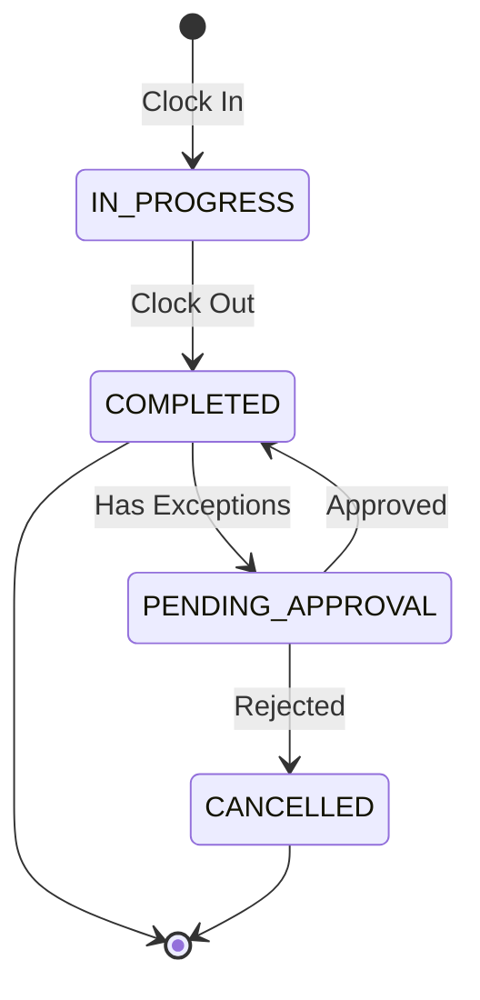
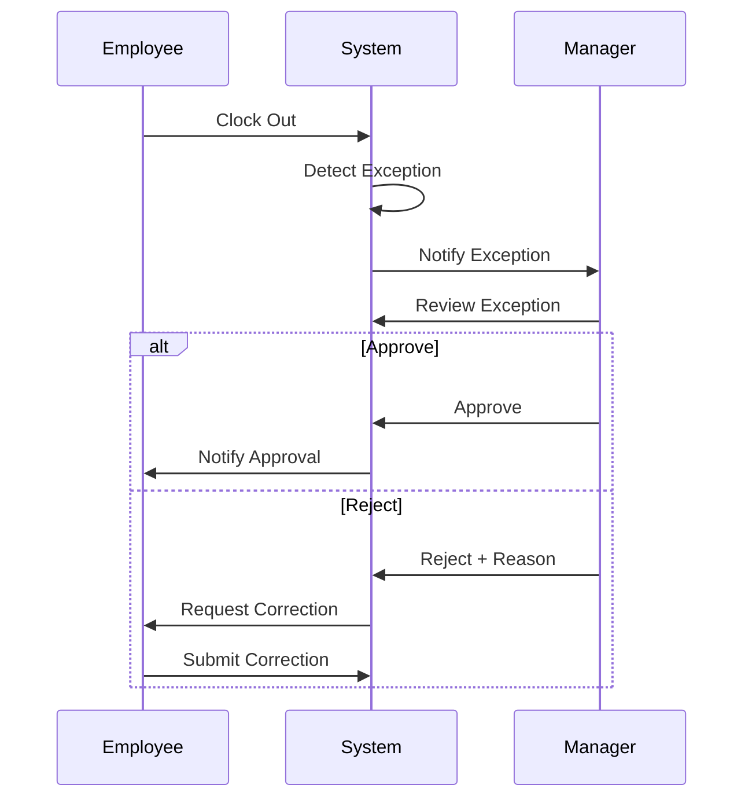
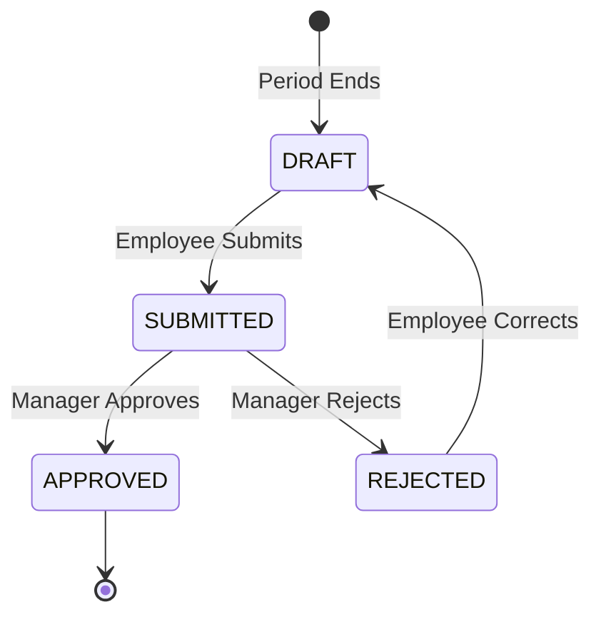

# Attendance Tracking Guide

**Version**: 1.0  
**Last Updated**: 2025-12-12  
**Audience**: Managers, HR Administrators, Employees  
**Reading Time**: 25-30 minutes

---

## 📋 Overview

This guide explains how to track employee attendance using the TA module. You'll learn about clock in/out processes, attendance record lifecycle, exception detection, timesheet management, and overtime calculation.

### What You'll Learn

- Clock in/out mechanisms (manual, biometric, mobile)
- Attendance record structure and lifecycle
- Time exception types and handling
- Grace periods and rounding rules
- Timesheet entry and approval
- Overtime calculation methods
- Common scenarios and troubleshooting

### Prerequisites

- Basic understanding of time tracking
- Familiarity with [Shift Scheduling Guide](./05-shift-scheduling-guide.md)
- Understanding of [Concept Overview](./01-concept-overview.md)

---

## ⏰ Clock In/Out Mechanisms

### Overview

The TA module supports multiple clock in/out methods to accommodate different work environments.

### Clock Methods

| Method | Description | Use Case | Accuracy |
|--------|-------------|----------|----------|
| **Manual Entry** | Employee enters time manually | Office workers, flexible hours | Low |
| **Biometric** | Fingerprint/face recognition | Manufacturing, high security | High |
| **Mobile App** | GPS-enabled mobile clock | Field workers, remote teams | Medium |
| **Badge Swipe** | RFID/NFC card reader | Retail, healthcare | High |
| **Web Portal** | Browser-based clock | Remote workers | Low |

---

### Clock In Process

**Step 1: Employee Initiates Clock In**

```yaml
# Employee action
ClockInRequest:
  workerId: "EMP_001"
  clockMethod: BIOMETRIC
  clockTime: "2025-01-15T08:05:00"
  location:
    latitude: 10.7769
    longitude: 106.7009
    accuracy: 10  # meters
```

**Step 2: System Validates**

```yaml
# Validation checks
Validations:
  - Check if employee has active shift for today
  - Check if already clocked in (prevent duplicate)
  - Verify location (if GPS-enabled)
  - Apply grace period rules
  - Check for blackout periods
```

**Step 3: System Creates Attendance Record**

```yaml
AttendanceRecord:
  id: UUID
  workerId: "EMP_001"
  rosterEntryId: "ROSTER_2025_01_15"
  attendanceDate: "2025-01-15"
  
  # Clock times
  clockInTime: "2025-01-15T08:05:00"
  clockInMethod: BIOMETRIC
  clockInLocation: [10.7769, 106.7009]
  
  # Planned vs Actual
  plannedStartTime: "08:00"
  actualStartTime: "08:05"  # After rounding
  
  # Status
  status: IN_PROGRESS
  
  # Metadata
  createdAt: "2025-01-15T08:05:00"
```

**Step 4: Apply Grace Period and Rounding**

```yaml
# Shift definition has grace period
ShiftDefinition:
  graceInMinutes: 15
  roundingIntervalMinutes: 15
  roundingMode: NEAREST

# Clock in: 08:05
# Grace period: 15 minutes (allowed until 08:15)
# Rounding: Nearest 15 minutes
# Result: 08:05 → 08:00 (rounded to nearest 15)

AttendanceRecord:
  clockInTime: "08:05"  # Actual
  actualStartTime: "08:00"  # After rounding
  isLate: false  # Within grace period
```

---

### Clock Out Process

**Step 1: Employee Initiates Clock Out**

```yaml
ClockOutRequest:
  workerId: "EMP_001"
  clockTime: "2025-01-15T17:10:00"
  clockMethod: BIOMETRIC
```

**Step 2: System Updates Attendance Record**

```yaml
AttendanceRecord:
  # Clock times
  clockOutTime: "2025-01-15T17:10:00"
  clockOutMethod: BIOMETRIC
  
  # Planned vs Actual
  plannedEndTime: "17:00"
  actualEndTime: "17:15"  # After rounding
  
  # Calculated hours
  totalWorkedHours: 9.25  # 08:00 - 17:15 = 9h 15m
  totalBreakHours: 1.0    # Lunch break
  totalPaidHours: 8.25    # 9.25 - 1.0 = 8.25
  
  # Status
  status: COMPLETED
  completedAt: "2025-01-15T17:10:00"
```

**Step 3: Detect Exceptions**

```yaml
# System checks for exceptions
TimeException:
  attendanceRecordId: "ATT_001"
  exceptionType: OVERTIME
  exceptionDate: "2025-01-15"
  plannedHours: 8.0
  actualHours: 8.25
  differenceHours: 0.25
  reason: "Worked 15 minutes overtime"
  status: PENDING_APPROVAL
```

---

## 📊 Attendance Record Entity

### Structure

```yaml
AttendanceRecord:
  # Identity
  id: UUID
  workerId: UUID
  rosterEntryId: UUID
  attendanceDate: date
  
  # Clock Times (Actual)
  clockInTime: datetime
  clockInMethod: MANUAL | BIOMETRIC | MOBILE | BADGE | WEB
  clockInLocation: [latitude, longitude]
  clockOutTime: datetime
  clockOutMethod: enum
  clockOutLocation: [latitude, longitude]
  
  # Planned Times (From Roster)
  plannedStartTime: time
  plannedEndTime: time
  plannedWorkHours: decimal
  
  # Actual Times (After Rounding)
  actualStartTime: time
  actualEndTime: time
  totalWorkedHours: decimal
  totalBreakHours: decimal
  totalPaidHours: decimal
  
  # Exceptions
  isLate: boolean
  isEarlyOut: boolean
  hasExceptions: boolean
  
  # Status
  status: IN_PROGRESS | COMPLETED | CANCELLED | PENDING_APPROVAL
  approvedBy: UUID (nullable)
  approvedAt: datetime (nullable)
  
  # Metadata
  createdAt: datetime
  updatedAt: datetime
```

### Lifecycle



---

## ⚠️ Time Exceptions

### Exception Types

#### 1. LATE_IN

**Trigger**: Clock in after grace period

**Example**:
```yaml
# Shift starts: 08:00
# Grace period: 15 minutes
# Clock in: 08:20 (20 minutes late)

TimeException:
  exceptionType: LATE_IN
  plannedTime: "08:00"
  actualTime: "08:20"
  differenceMinutes: 20
  isWithinGrace: false
  requiresApproval: true
```

---

#### 2. EARLY_OUT

**Trigger**: Clock out before grace period

**Example**:
```yaml
# Shift ends: 17:00
# Grace period: 15 minutes
# Clock out: 16:30 (30 minutes early)

TimeException:
  exceptionType: EARLY_OUT
  plannedTime: "17:00"
  actualTime: "16:30"
  differenceMinutes: 30
  isWithinGrace: false
  requiresApproval: true
```

---

#### 3. MISSING_PUNCH

**Trigger**: Missing clock in or clock out

**Example**:
```yaml
# Employee clocked in but forgot to clock out

TimeException:
  exceptionType: MISSING_PUNCH
  missingPunchType: CLOCK_OUT
  attendanceDate: "2025-01-15"
  requiresCorrection: true
  requiresApproval: true
```

---

#### 4. UNAUTHORIZED_ABSENCE

**Trigger**: No clock in/out for scheduled work day

**Example**:
```yaml
# Employee scheduled to work but didn't show up

TimeException:
  exceptionType: UNAUTHORIZED_ABSENCE
  attendanceDate: "2025-01-15"
  plannedShift: "DAY_SHIFT"
  requiresApproval: true
  severity: HIGH
```

---

#### 5. OVERTIME

**Trigger**: Worked hours exceed planned hours

**Example**:
```yaml
# Planned: 8 hours
# Actual: 9.5 hours
# Overtime: 1.5 hours

TimeException:
  exceptionType: OVERTIME
  plannedHours: 8.0
  actualHours: 9.5
  overtimeHours: 1.5
  overtimeType: REGULAR  # or WEEKEND, HOLIDAY
  requiresApproval: true
```

---

### Exception Handling Workflow



---

## 🕐 Grace Periods and Rounding

### Grace Periods

**Purpose**: Allow small deviations without penalty

**Configuration**:
```yaml
ShiftDefinition:
  graceInMinutes: 15      # Late arrival tolerance
  graceOutMinutes: 15     # Early departure tolerance
```

**Examples**:

| Planned | Actual | Grace | Result | Exception? |
|---------|--------|-------|--------|------------|
| 08:00 | 08:10 | 15 min | OK | No |
| 08:00 | 08:20 | 15 min | LATE | Yes (LATE_IN) |
| 17:00 | 16:50 | 15 min | OK | No |
| 17:00 | 16:30 | 15 min | EARLY | Yes (EARLY_OUT) |

---

### Rounding Rules

**Purpose**: Standardize time entries

**Rounding Modes**:

#### NEAREST

**Rule**: Round to nearest interval

```yaml
roundingIntervalMinutes: 15
roundingMode: NEAREST

# Examples:
08:05 → 08:00  # Closer to 08:00
08:08 → 08:15  # Closer to 08:15
08:00 → 08:00  # Exact match
```

---

#### UP

**Rule**: Always round up

```yaml
roundingIntervalMinutes: 15
roundingMode: UP

# Examples:
08:01 → 08:15
08:05 → 08:15
08:15 → 08:15  # Already on interval
```

---

#### DOWN

**Rule**: Always round down

```yaml
roundingIntervalMinutes: 15
roundingMode: DOWN

# Examples:
08:14 → 08:00
08:05 → 08:00
08:00 → 08:00  # Already on interval
```

---

## 📝 Timesheet Management

### Timesheet Entry

**Structure**:
```yaml
TimesheetEntry:
  id: UUID
  workerId: UUID
  periodStartDate: "2025-01-01"
  periodEndDate: "2025-01-15"
  
  # Summary
  totalScheduledHours: 80.0
  totalWorkedHours: 82.5
  totalPaidHours: 82.5
  totalOvertimeHours: 2.5
  
  # Status
  status: DRAFT | SUBMITTED | APPROVED | REJECTED
  submittedAt: datetime (nullable)
  approvedBy: UUID (nullable)
  approvedAt: datetime (nullable)
  
  # Breakdown
  attendanceRecords: [AttendanceRecord]
  exceptions: [TimeException]
```

### Timesheet Workflow



**Steps**:

1. **Auto-Generation**: System creates timesheet at period end
2. **Employee Review**: Employee reviews and submits
3. **Manager Review**: Manager reviews exceptions
4. **Approval**: Manager approves or rejects
5. **Payroll Integration**: Approved timesheet sent to payroll

---

### Timesheet Approval

**Manager View**:
```yaml
TimesheetApproval:
  timesheetId: UUID
  employeeName: "John Doe"
  period: "2025-01-01 to 2025-01-15"
  
  # Summary
  totalHours: 82.5
  regularHours: 80.0
  overtimeHours: 2.5
  
  # Exceptions Requiring Approval
  exceptions:
    - type: LATE_IN
      date: "2025-01-05"
      minutes: 20
      reason: "Traffic jam"
    
    - type: OVERTIME
      date: "2025-01-10"
      hours: 2.5
      reason: "Project deadline"
  
  # Manager Actions
  actions:
    - APPROVE_ALL
    - APPROVE_SELECTED
    - REJECT_WITH_REASON
    - REQUEST_CORRECTION
```

---

## 💰 Overtime Calculation

### Overtime Types

| Type | Multiplier | Trigger | Example |
|------|------------|---------|---------|
| **Regular OT** | 1.5x | Weekday > 8h | Mon-Fri after 8 hours |
| **Weekend OT** | 2.0x | Weekend work | Saturday/Sunday |
| **Holiday OT** | 3.0x | Holiday work | Public holidays |
| **Night OT** | 1.5x | Night shift | 22:00-06:00 |

---

### Calculation Methods

#### Method 1: Daily Overtime

**Rule**: Overtime calculated per day

```yaml
OvertimeCalculation:
  method: DAILY
  threshold: 8.0  # hours per day
  
# Example:
# Day 1: 9 hours → 1 hour OT
# Day 2: 7 hours → 0 hours OT
# Day 3: 10 hours → 2 hours OT
# Total OT: 3 hours
```

---

#### Method 2: Weekly Overtime

**Rule**: Overtime calculated per week

```yaml
OvertimeCalculation:
  method: WEEKLY
  threshold: 40.0  # hours per week
  
# Example:
# Week total: 45 hours
# Threshold: 40 hours
# Overtime: 5 hours
```

---

#### Method 3: Biweekly Overtime

**Rule**: Overtime calculated per pay period

```yaml
OvertimeCalculation:
  method: BIWEEKLY
  threshold: 80.0  # hours per 2 weeks
  
# Example:
# Period total: 85 hours
# Threshold: 80 hours
# Overtime: 5 hours
```

---

### Overtime Approval

```yaml
OvertimeRequest:
  workerId: "EMP_001"
  requestDate: "2025-01-15"
  overtimeType: REGULAR
  plannedHours: 2.0
  reason: "Project deadline"
  
  # Approval
  status: PENDING | APPROVED | REJECTED
  approvedBy: "MANAGER_ID"
  approvalNotes: "Approved for critical project"
```

---

## 🎯 Common Scenarios

### Scenario 1: Late Arrival with Grace Period

**Setup**:
- Shift: 08:00-17:00
- Grace period: 15 minutes
- Employee clocks in: 08:12

**Result**:
```yaml
AttendanceRecord:
  clockInTime: "08:12"
  actualStartTime: "08:15"  # Rounded to nearest 15
  isLate: false  # Within grace period
  
# No exception created
```

---

### Scenario 2: Late Arrival Beyond Grace

**Setup**:
- Shift: 08:00-17:00
- Grace period: 15 minutes
- Employee clocks in: 08:25

**Result**:
```yaml
AttendanceRecord:
  clockInTime: "08:25"
  actualStartTime: "08:30"  # Rounded
  isLate: true

TimeException:
  exceptionType: LATE_IN
  differenceMinutes: 30
  status: PENDING_APPROVAL
  requiresApproval: true
```

---

### Scenario 3: Missing Clock Out

**Setup**:
- Employee clocked in but forgot to clock out
- Next day arrives

**Result**:
```yaml
TimeException:
  exceptionType: MISSING_PUNCH
  missingPunchType: CLOCK_OUT
  attendanceDate: "2025-01-15"
  status: PENDING_CORRECTION
  
# Manager receives notification
# Employee must submit correction
```

---

### Scenario 4: Overtime Work

**Setup**:
- Shift: 08:00-17:00 (8 hours)
- Employee works: 08:00-19:00 (10 hours)
- Overtime: 2 hours

**Result**:
```yaml
AttendanceRecord:
  totalWorkedHours: 10.0
  totalPaidHours: 10.0

OvertimeCalculation:
  overtimeType: REGULAR
  overtimeHours: 2.0
  overtimeRate: 1.5
  overtimePay: basePay * 2.0 * 1.5

TimeException:
  exceptionType: OVERTIME
  overtimeHours: 2.0
  status: PENDING_APPROVAL
```

---

## 🔧 Troubleshooting

### Issue 1: Duplicate Clock In

**Symptom**: Employee clocks in twice

**Diagnosis**:
```sql
SELECT * FROM attendance_record
WHERE worker_id = ?
  AND attendance_date = CURRENT_DATE
  AND status = 'IN_PROGRESS';
```

**Solution**:
- System should prevent duplicate clock in
- If occurred, manager cancels duplicate record

---

### Issue 2: Missing Attendance Record

**Symptom**: Employee worked but no attendance record

**Diagnosis**:
- Check if roster entry exists for that date
- Check if employee clocked in/out
- Check system logs for errors

**Solution**:
- Manager creates manual attendance record
- Mark as manual entry for audit

---

### Issue 3: Incorrect Overtime Calculation

**Symptom**: Overtime hours don't match expected

**Diagnosis**:
```yaml
# Check calculation method
OvertimeCalculation:
  method: DAILY | WEEKLY | BIWEEKLY
  threshold: ?
  
# Verify worked hours
AttendanceRecord:
  totalWorkedHours: ?
  totalPaidHours: ?
```

**Solution**:
- Verify calculation method matches policy
- Check for break deductions
- Recalculate if needed

---

## ✅ Best Practices

### 1. Clock In/Out Discipline

✅ **DO**:
- Clock in/out at actual work times
- Use designated clock method
- Report missing punches immediately

❌ **DON'T**:
- Clock in for colleagues
- Forget to clock out
- Manipulate clock times

---

### 2. Exception Management

✅ **DO**:
- Provide clear reasons for exceptions
- Submit corrections promptly
- Keep documentation (medical certificates, etc.)

❌ **DON'T**:
- Ignore exception notifications
- Delay corrections
- Provide vague reasons

---

### 3. Overtime Management

✅ **DO**:
- Request overtime approval in advance
- Document overtime reason
- Track overtime hours

❌ **DON'T**:
- Work unauthorized overtime
- Exceed overtime limits
- Fail to submit overtime requests

---

## 📚 Related Guides

- [Concept Overview](./01-concept-overview.md) - Module overview
- [Shift Scheduling Guide](./05-shift-scheduling-guide.md) - Roster generation
- [Approval Workflows Guide](./07-approval-workflows-guide.md) - Approval processes
- [Time & Attendance Ontology](../00-ontology/time-attendance-ontology.yaml) - Data model

---

**Document Version**: 1.0  
**Created**: 2025-12-12  
**Last Review**: 2025-12-12  
**Author**: xTalent Documentation Team
