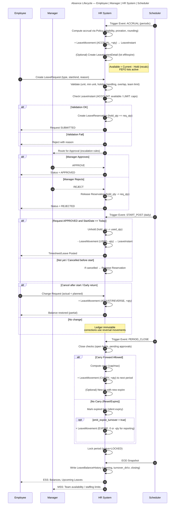
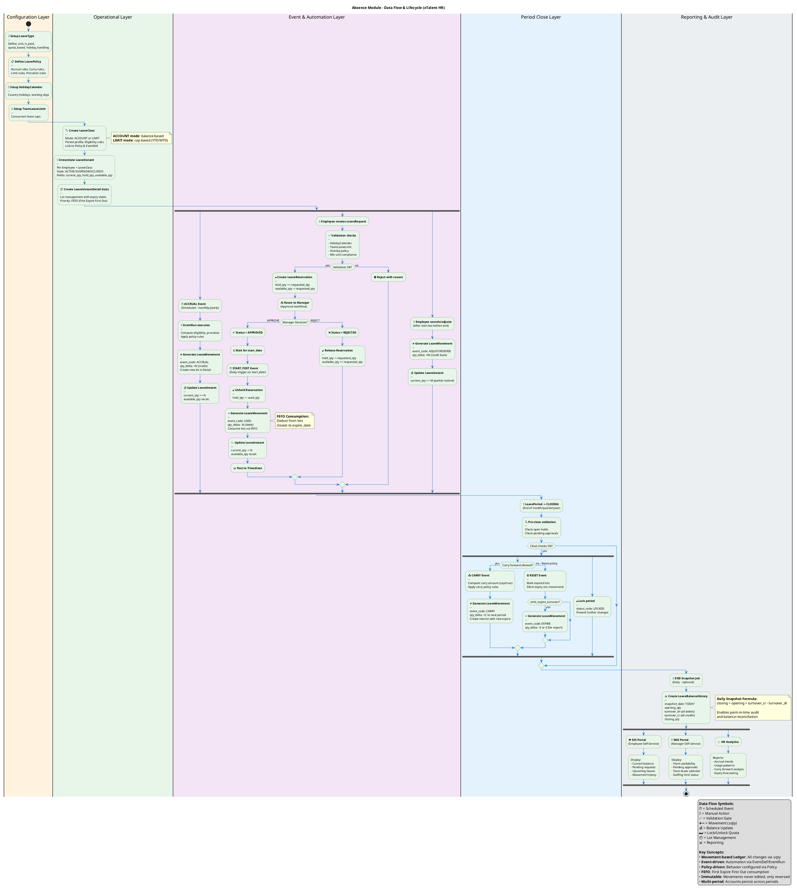
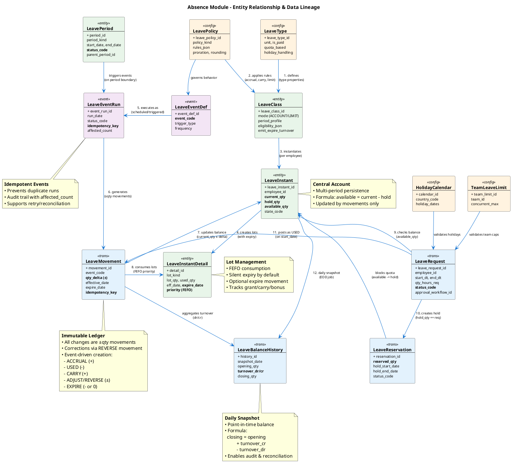
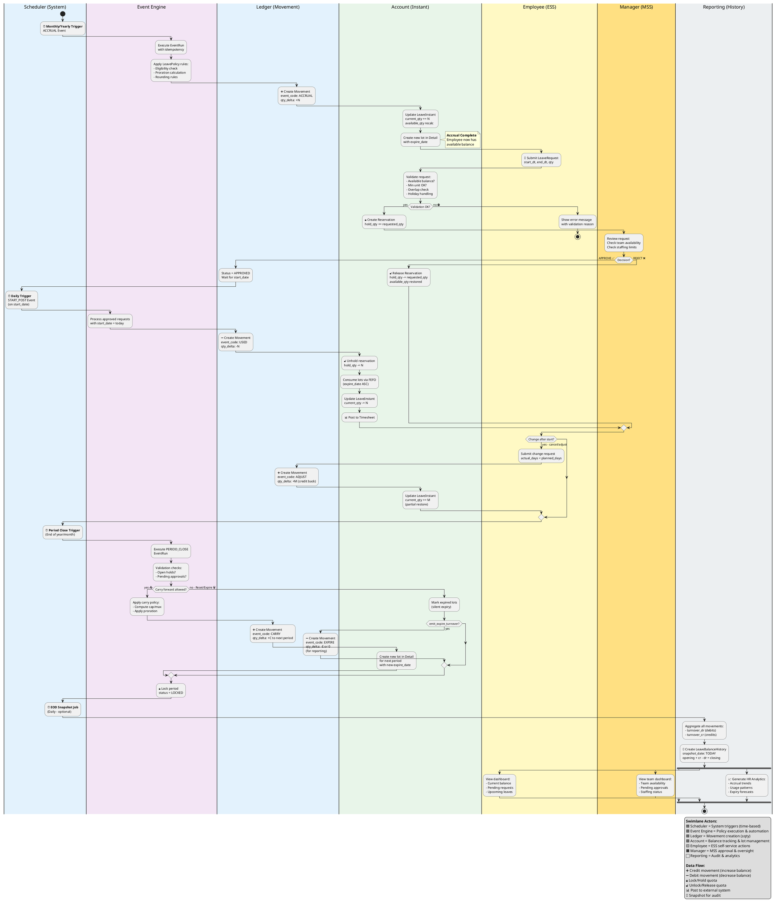

---
puppeteer:
  landscape: true
  format: "A2"
---

# 🔄 ABSENCE LIFECYCLE

*(Accrual → Request → Approve → Start → Post → Close → Carry/Reset)*

## 1️⃣ Khái niệm chung

Vòng đời của một kỳ nghỉ phép trong hệ thống **Absence** được tổ chức theo chuỗi **nghiệp vụ khép kín**, đảm bảo:

* Cấp phát & ghi nhận chính xác số dư phép (Leave Balance).
* Kiểm soát hợp lý việc đăng ký và phê duyệt nghỉ.
* Tự động hóa việc trừ phép, hoàn phép, và chuyển tồn cuối kỳ.
* Giữ tính **minh bạch, audit đầy đủ, và khả năng tái tính (recalc)** bất kỳ thời điểm nào.

Mỗi giai đoạn trong chuỗi vận hành này đều được hệ thống kiểm soát bằng các **Leave Event**, **Leave Policy**, và **Leave Movement** tương ứng.

---

## 2️⃣ Tổng quan luồng vận hành

```
  ┌──────────────────────────────────────────────┐
  │      ACCRUAL / GRANT (Tích lũy / Cấp phép)  │
  └──────────────────────────────────────────────┘
                         │
                         ▼
  ┌──────────────────────────────────────────────┐
  │      REQUEST & RESERVATION (Đăng ký nghỉ)    │
  └──────────────────────────────────────────────┘
                         │
                         ▼
  ┌──────────────────────────────────────────────┐
  │      APPROVAL WORKFLOW (Phê duyệt nghỉ)      │
  └──────────────────────────────────────────────┘
                         │
                         ▼
  ┌──────────────────────────────────────────────┐
  │      START & POSTING (Thực nghỉ / Ghi sổ)    │
  └──────────────────────────────────────────────┘
                         │
                         ▼
  ┌──────────────────────────────────────────────┐
  │      CLOSE / ADJUSTMENT (Hoàn nghỉ / Chỉnh)  │
  └──────────────────────────────────────────────┘
                         │
                         ▼
  ┌──────────────────────────────────────────────┐
  │      CARRY / RESET (Chuyển / Xoá cuối kỳ)    │
  └──────────────────────────────────────────────┘
```



---

## 3️⃣ Chi tiết từng giai đoạn

---

### 🟩 1. **Accrual / Grant – Tích lũy và cấp phép**

**Mục đích:**
Tạo số dư phép (đối với loại nghỉ có mode = `ACCOUNT`), hoặc khởi tạo hạn mức (mode = `LIMIT`) cho nhân viên đủ điều kiện.

**Cơ chế:**

* Khi kỳ (Leave Period) bắt đầu, hệ thống chạy **LeaveEvent “ACCRUAL”** theo định nghĩa trong **LeaveClass**.
* Dựa vào **Policy** (ví dụ `accrual_rule_json`), hệ thống tính số giờ/ngày phép được cộng:

  ```json
  {"freq":"MONTH","hours":1.75,"basis":"WORKDAYS"}
  ```
* Hệ thống tạo **LeaveMovement** `+qty` (credit) gắn với `LeaveInstant`.
* Nếu loại nghỉ sử dụng lô cấp phát, một **LeaveInstantDetail (lot)** mới cũng được sinh ra, có `eff_date` và `expire_date` riêng (VD: phép năm 2025, hết hạn 31/03/2026).

**Kết quả:**
Nhân viên có thể thấy **Available Balance** tăng lên trong ví nghỉ của họ.

---

### 🟨 2. **Request & Reservation – Đăng ký nghỉ và giữ chỗ**

**Mục đích:**
Cho phép nhân viên đăng ký nghỉ trước, đồng thời hệ thống giữ chỗ (block quota) để tránh vượt số dư.

**Cơ chế:**

* Nhân viên gửi yêu cầu nghỉ (`LeaveRequest`) với thời gian cụ thể.
* Hệ thống xác định:

  * Loại nghỉ (`LeaveClass`)
  * Tổng thời lượng nghỉ (`qty_hours_req`)
  * Các ngày lễ cần loại trừ (theo `holiday_handling` trong `LeaveType`)
* Kiểm tra **eligibility** và **limit/policy**:

  * Nếu vượt hạn mức (`available_qty` hoặc `limit_yearly`), request bị từ chối.
* Khi hợp lệ, hệ thống tạo **LeaveReservation**:

  * `reserved_qty` được cộng vào `hold_qty` trong `LeaveInstant`.

**Kết quả:**
Quota của nhân viên tạm thời bị block, chờ phê duyệt.
Các báo cáo tổng hợp sẽ thấy “số phép đã giữ chỗ”.

---

### 🟦 3. **Approval Workflow – Phê duyệt nghỉ**

**Mục đích:**
Xác nhận việc nghỉ phép thông qua quy trình phê duyệt tự động hoặc nhiều cấp.

**Cơ chế:**

* Khi request được nộp, workflow tự động xác định cấp phê duyệt (`escalation_level`).
* Quản lý (team lead / director) duyệt hoặc từ chối.
* Khi **Approved**, trạng thái `LeaveRequest.status_code` → `APPROVED`.
* Reservation (`hold_qty`) vẫn được giữ cho đến ngày bắt đầu nghỉ.

**Kết quả:**
Yêu cầu nghỉ được xác nhận, chuẩn bị cho việc ghi nhận chính thức khi đến thời điểm nghỉ thực tế.

---

### 🟧 4. **Start & Posting – Nghỉ thực tế và ghi sổ**

**Mục đích:**
Khi đến ngày bắt đầu nghỉ, hệ thống chính thức trừ phép và ghi sổ ledger.

**Cơ chế:**

* Vào ngày `start_dt` của request, **LeaveEvent “START_POST”** được trigger.
* Hệ thống:

  1. **Giảm `hold_qty`** trên LeaveInstant (unblock reservation).
  2. **Tạo LeaveMovement** `-qty` (debit) để trừ phép chính thức.
  3. Nếu nghỉ nhiều ngày, movement có thể được chia theo từng `LeavePeriod` hoặc từng ngày (tuỳ config).
* Nếu loại nghỉ là `LIMIT`, movement vẫn được ghi để trừ vào hạn mức (`used_ytd`, `used_mtd`).

**Kết quả:**
Số dư khả dụng giảm đi; lịch sử giao dịch (`LeaveMovement`) có dòng ghi nhận “USED”.

---

### 🟥 5. **Close / Adjustment – Hoàn nghỉ hoặc điều chỉnh**

**Mục đích:**
Ghi nhận các trường hợp nhân viên hủy, thay đổi, hoặc nghỉ ít hơn dự kiến.

**Cơ chế:**

* Nếu request bị hủy trước ngày nghỉ:

  * Xoá `LeaveReservation`, **hoàn lại hold_qty**.
* Nếu nhân viên quay lại sớm:

  * Tạo **LeaveMovement reversal** `+qty` để cộng lại phần chưa nghỉ.
* Nếu có sai lệch (VD: tính sai số ngày), admin có thể thực hiện **Manual Adjustment** (bảng `leave_movement` thêm dòng `event_code='ADJUST'`).

**Kết quả:**
Ledger phản ánh chính xác lịch sử nghỉ thực tế; số dư hiện hành được cập nhật tương ứng.

---

### 🟩 6. **Carry / Reset – Kết thúc kỳ và xử lý tồn**

**Mục đích:**
Khi kỳ (Leave Period) kết thúc, hệ thống xử lý số dư tồn, carry sang kỳ mới hoặc reset.

**Cơ chế:**

* Khi **LeavePeriod.status = CLOSED**, job tự động chạy **LeaveEvent “CARRY” hoặc “RESET”**:

  * Nếu class cho phép chuyển phép (`carry_rule_json`):

    * Tính số ngày được carry (ví dụ tối đa 5 ngày).
    * Tạo `LeaveMovement +qty` ở kỳ mới và **LeaveInstantDetail (lot)** mới.
  * Nếu không được chuyển:

    * Đánh dấu các lô (lot) hết hạn.
    * Nếu `emit_expire_turnover = true`, tạo movement EXPIRE (reporting purpose).
* Hệ thống khóa kỳ (`status=LOCKED`) để tránh post ngược.

**Kết quả:**
Số dư kỳ cũ được chốt, các dòng carryover hoặc expire được ghi rõ trong ledger.
Toàn bộ LeaveInstant được duy trì xuyên kỳ, không cần khởi tạo lại.

---

## 4️⃣ Dòng dữ liệu (Data Flow Summary)

| Giai đoạn                 | Event                      | Loại movement | Ảnh hưởng đến số dư    | Bảng chính                               |
| ------------------------- | -------------------------- | ------------- | ---------------------- | ---------------------------------------- |
| **Accrual / Grant**       | `ACCRUAL`                  | `+qty`        | Tăng số dư khả dụng    | `leave_movement`, `leave_instant_detail` |
| **Request / Reservation** | `REQUEST_HOLD`             | (no qty)      | Block quota (hold_qty) | `leave_reservation`, `leave_instant`     |
| **Approval**              | `APPROVE`                  | (no qty)      | Giữ nguyên quota       | `leave_request`                          |
| **Start / Post**          | `START_POST`               | `-qty`        | Giảm số dư thực tế     | `leave_movement`                         |
| **Close / Adjustment**    | `ADJUST`, `REVERSE`        | `±qty`        | Điều chỉnh tăng/giảm   | `leave_movement`                         |
| **Carry / Reset**         | `CARRY`, `EXPIRE`, `RESET` | `±qty`        | Kết chuyển / hết hạn   | `leave_movement`, `leave_instant_detail` |

---

## 5️⃣ Chu kỳ tự động (Automation)

Hệ thống hỗ trợ tự động hóa các hoạt động định kỳ thông qua **LeaveEventRun**:

| Tần suất   | Tác vụ              | Event      | Diễn giải                                   |
| ---------- | ------------------- | ---------- | ------------------------------------------- |
| Hàng tháng | Tích lũy phép       | `ACCRUAL`  | Cộng phép tháng                             |
| Cuối năm   | Chuyển phép còn lại | `CARRY`    | Tạo lô mới cho năm sau                      |
| Cuối kỳ    | Xoá phép hết hạn    | `EXPIRE`   | Đánh dấu hoặc tạo turnover                  |
| Cuối ngày  | Snapshot            | `SNAPSHOT` | Ghi lại balance vào `leave_balance_history` |

---

## 6️⃣ Mối liên hệ giữa nghiệp vụ và hệ thống

| Nghiệp vụ thực tế | Thực thể vận hành                              | Giải thích             |
| ----------------- | ---------------------------------------------- | ---------------------- |
| Cấp phép năm      | `LeaveEventDef.ACCRUAL` → `LeaveMovement +qty` | Tự động cộng phép      |
| Đăng ký nghỉ      | `LeaveRequest` + `LeaveReservation`            | Giữ quota chờ duyệt    |
| Phê duyệt nghỉ    | Workflow / `status_code`                       | Kiểm soát cấp duyệt    |
| Nghỉ thực tế      | `LeaveMovement -qty`                           | Trừ số dư thật         |
| Hoàn phép         | `LeaveMovement +qty`                           | Cộng lại khi huỷ       |
| Hết hạn phép      | `LeaveInstantDetail.expire_date`               | FEFO silent expiry     |
| Chuyển phép       | `LeaveEventDef.CARRY`                          | Movement chuyển lô mới |
| Reset phép        | `LeaveEventDef.RESET`                          | Xoá số dư cũ cuối kỳ   |

---

## 7️⃣ Lợi ích vận hành

| Khía cạnh               | Lợi ích nổi bật                                                            |
| ----------------------- | -------------------------------------------------------------------------- |
| **Tự động hóa**         | Giảm thao tác thủ công, job định kỳ tự động thực hiện accrual/carry/reset. |
| **Tính minh bạch**      | Mọi thay đổi đều lưu trace trong ledger (LeaveMovement).                   |
| **Phù hợp đa quốc gia** | Có dimension BU/LE/Country, holiday calendar riêng.                        |
| **Kiểm soát linh hoạt** | Hỗ trợ cả loại phép cấp phát (ACCOUNT) và hạn mức (LIMIT).                 |
| **Tái tính dễ dàng**    | Hệ thống có thể recalculation theo period hoặc per-employee.               |
| **Báo cáo rõ ràng**     | Balance history giúp phân tích open/turnover/close từng ngày.              |

---

## 8️⃣ Tổng kết

Mô hình **Absence Lifecycle** trong hệ thống xTalent:

* Phản ánh đúng bản chất kế toán nghỉ phép (accrual – usage – expiration).
* Tách biệt giữa **sự kiện (Event)**, **chính sách (Policy)** và **sổ cái (Movement)**.
* Linh hoạt mở rộng cho các quy tắc riêng của từng doanh nghiệp, quốc gia, hoặc loại phép.
* Giữ **dấu vết đầy đủ** và **an toàn dữ liệu cao**, sẵn sàng cho audit hoặc phân tích chuyên sâu.

## 9️⃣ Phục lục
### 9.1 Data Flow quá trình config và sử dụng Absence

### 9.2 Sơ đồ bổ sung: Entity Relationship với Data Lineage




### 9.3 Sơ đồ bổ sung: Swimlane - Lifecycle Flow

Để thể hiện rõ hơn luồng vận hành qua các actor [1][3][4]:


