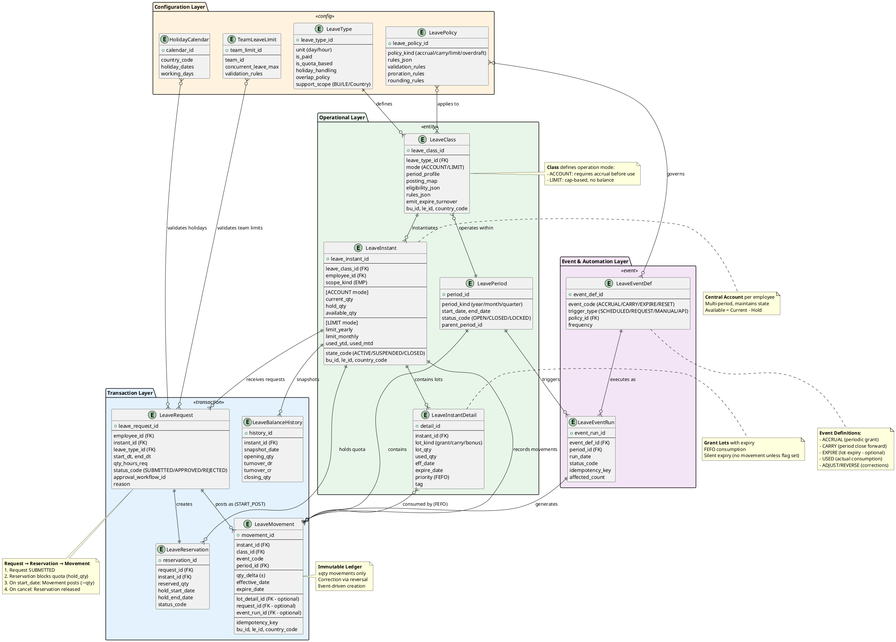

---
puppeteer:
  landscape: true
  format: "A2"
---

# 🧭 TỔNG QUAN MODULE ABSENCE (LEAVE MANAGEMENT)

## 1. Mục tiêu thiết kế

Module **Absence (Leave Management)** được xây dựng nhằm quản lý toàn bộ vòng đời của các loại nghỉ phép trong doanh nghiệp, từ định nghĩa chính sách, cấp phát và tích lũy phép (accrual), đến kiểm soát hạn mức, ghi nhận giao dịch nghỉ (movements), tự động hoá sự kiện nghiệp vụ (events) và theo dõi số dư phép của từng nhân viên trong thời gian thực.

Hệ thống được thiết kế theo nguyên tắc:

* **Movement-based ledger** (bảng ghi sổ đơn, ±quantity) – thay vì bút toán Dr/Cr truyền thống.
* **Event-driven** – các sự kiện (event) sinh ra các movement một cách tự động hoặc theo trigger nghiệp vụ.
* **Policy-based** – mọi hành vi nghiệp vụ được cấu hình qua chính sách (policy) có thể tái sử dụng.
* **Multi-period & auditable** – mỗi tài khoản nghỉ được duy trì xuyên kỳ, có lịch sử, có thể đối chiếu số dư từng ngày.

Mô hình này tương đương về logic với hệ thống của **Oracle HCM**, **SAP SuccessFactors**, và **Workday Absence**, nhưng được thiết kế linh hoạt hơn cho nhu cầu tùy chỉnh và mở rộng theo từng doanh nghiệp.


## 2. Tổng quan các nhóm entity

| Nhóm                              | Vai trò chính                                                     | Mối liên hệ                                     |
| --------------------------------- | ----------------------------------------------------------------- | ----------------------------------------------- |
| **Leave Type**                    | Định nghĩa loại nghỉ (annual, sick, unpaid, …)                    | Cấp cao nhất – xác định phạm vi và đơn vị đo    |
| **Leave Class**                   | Lớp vận hành cho từng loại nghỉ (policy + event + period)         | Sinh ra **Leave Instant**                       |
| **Leave Instant**                 | “Tài khoản nghỉ” của nhân viên (account/limit)                    | Sinh ra bởi Class, ghi nhận số dư               |
| **Leave Instant Detail**          | Lô cấp phát chi tiết (grant lot) có hiệu lực/expiry riêng         | FEFO khi tiêu thụ                               |
| **Leave Event / Event Run**       | Các sự kiện nghiệp vụ (accrual, use, carry, expire, …)            | Tạo ra **Leave Movements**                      |
| **Leave Policy**                  | Quy tắc nghiệp vụ (accrual, carry, limit, overdraft, validation…) | Được Event & Class sử dụng                      |
| **Leave Movement**                | Giao dịch nghỉ ± (ledger entry)                                   | Kết quả cuối cùng của Event                     |
| **Leave Request / Reservation**   | Yêu cầu nghỉ và giữ chỗ (block quota)                             | Gắn vào Instant, sinh movement khi nghỉ bắt đầu |
| **Leave Period**                  | Kỳ kiểm soát (year, month, quarter, rolling)                      | Đóng/mở kỳ, chạy carry/reset                    |
| **Leave Balance History**         | Snapshot số dư theo ngày                                          | Báo cáo & đối soát                              |
| **Holiday Calendar / Team Limit** | Hỗ trợ kiểm tra lịch nghỉ & giới hạn nhân sự nghỉ đồng thời       | Tích hợp kiểm tra khi request                   |


## 3. Mô hình dữ liệu khái niệm (Conceptual Model)
### 3.1 Các Entities phân tầng

```
LeaveType
   ↓
LeaveClass ──> LeavePolicy
   ↓
LeaveInstant (per Employee)
   ├─ LeaveInstantDetail (grant lots)
   ├─ LeaveMovement (±qty)
   ├─ LeaveBalanceHistory
   └─ LeaveRequest → LeaveReservation
LeaveEventDef
   ↓
LeaveEventRun ──> tạo LeaveMovements
LeavePeriod
HolidayCalendar / TeamLimit (validation context)
```
### 3.2 Mô hình dữ liệu



#### Giải thích Data Lineage theo các luồng chính

##### a. Configuration Flow (Thiết lập ban đầu)

**LeaveType** → **LeaveClass** → **LeaveInstant**

- `LeaveType` định nghĩa khái niệm nghỉ (đơn vị, xử lý ngày lễ)
- `LeaveClass` áp dụng Policy và Event để vận hành
- `LeaveInstant` là tài khoản cá nhân được sinh ra từ Class cho từng nhân viên

##### b. Accrual Flow (Cấp phát phép định kỳ)

**LeaveEventDef** → **LeaveEventRun** → **LeaveMovement (+qty)** → **LeaveInstantDetail (lot)** 

- Event ACCRUAL chạy theo lịch (monthly/yearly)
- Tạo Movement credit (+qty) vào LeaveInstant
- Tạo lot mới trong LeaveInstantDetail với expire_date
- Available balance được tính lại: Current - Hold

##### c. Request & Reservation Flow (Đăng ký nghỉ)

**LeaveRequest** → **LeaveReservation** → **LeaveInstant (hold_qty)** 

- Employee tạo LeaveRequest
- System validates qua HolidayCalendar, TeamLeaveLimit
- LeaveReservation block quota (hold_qty += requested)
- Available = Current - Hold (giảm tạm thời)

##### d. Posting Flow (Nghỉ thực tế)

**LeaveEventRun (START_POST)** → **LeaveMovement (−qty)** → **LeaveInstantDetail (FEFO consume)** 

- Khi đến start_date, event START_POST trigger
- Unhold quota: hold_qty -= used_qty
- Tạo Movement debit (−qty)
- Trừ từ lot theo FEFO (lot gần hết hạn nhất trước)
- Current_qty giảm thực tế

##### e. Period Close Flow (Kết kỳ)

**LeavePeriod (CLOSED)** → **LeaveEventRun (CARRY/EXPIRE/RESET)** → **LeaveMovement** → **LeaveInstantDetail (new lot)** 

- Period chuyển status CLOSED
- Event CARRY: tính số dư được chuyển, tạo lot mới kỳ sau
- Event EXPIRE: đánh dấu lot hết hạn (silent expiry hoặc tạo movement nếu flag bật)
- Event RESET: xóa số dư nếu không carry

##### f. Snapshot Flow (Báo cáo hàng ngày)

**LeaveMovement** → **LeaveBalanceHistory (EOD snapshot)** 
- Job EOD đọc tất cả movements trong ngày
- Tính opening + turnover_dr + turnover_cr = closing
- Lưu vào LeaveBalanceHistory để audit và reporting

#### Các nguyên tắc cốt lõi trong lineage

- **Movement-based Ledger:** Mọi thay đổi số dư đều qua LeaveMovement (±qty), không dùng Dr/Cr 
- **Event-driven:** Tất cả movements sinh ra từ Events (ACCRUAL, CARRY, USED, ADJUST) 
- **Policy-driven:** Event và Class đều tuân theo LeavePolicy (accrual rules, carry rules, limits) 
- **FEFO Consumption:** Khi trừ phép, ưu tiên lot gần expire nhất 
- **Immutable Transactions:** Movement không sửa, chỉ reversal 
- **Multi-period Continuity:** LeaveInstant sống xuyên kỳ, không reset account 

Data lineage này phản ánh đầy đủ vòng đời nghỉ phép từ setup → accrual → request → approval → posting → close → carry/expire, đảm bảo tính audit và khả năng truy vết mọi giao dịch 

## 4. Giải thích chi tiết từng entity

---

### 🟩 1. **LeaveType**

**Vai trò:** Định nghĩa khái niệm loại nghỉ — ví dụ: Annual Leave (Nghỉ phép năm), Sick Leave (Nghỉ bệnh), Maternity Leave (Nghỉ thai sản), Unpaid Leave (Nghỉ không lương).

**Chức năng chính:**

* Xác định bản chất loại nghỉ:

  * `is_paid`: có tính lương hay không.
  * `is_quota_based`: có giới hạn số dư hay không.
* Thiết lập **unit** (đơn vị tính: ngày/giờ), **core_min_unit** (bước nhỏ nhất được phép đặt), **holiday_handling** (cách xử lý ngày nghỉ lễ) và **overlap_policy** (cho phép trùng với nghỉ khác hay không).
* `support_scope`: quy định phạm vi BU/LE áp dụng cho từng quốc gia hoặc vùng.

👉 LeaveType chỉ là **định nghĩa nghiệp vụ** – bản thân nó không tạo số dư; cần có **LeaveClass** để vận hành.

#### Mockup

<button class="mock-btn mock-open" data-title="LeaveType" data-src="MOCKUP/absence/leaveType.html">LeaveType</button>

---

### 🟦 2. **LeaveClass**

**Vai trò:** Lớp trừu tượng điều khiển cách vận hành một LeaveType.

**Đặc điểm:**

* Mỗi `LeaveClass` gắn với một `LeaveType`.
* Có hai **mode chính**:

  * `ACCOUNT`: Loại nghỉ phải được **cấp phát trước** mới có thể sử dụng (Annual Leave).
  * `LIMIT`: Loại nghỉ được **giới hạn theo hạn mức**, không cấp phát số dư (Sick Leave, Unpaid Leave).
* Quy định:

  * `period_profile`: xác định cấu trúc kỳ (năm, tháng, rolling).
  * `posting_map`: bản đồ event → công thức ±qty.
  * `eligibility_json`: điều kiện mở tài khoản tự động.
  * `rules_json`: các rule/policy vận hành (accrual/carry/limit/overdraft…).
  * `emit_expire_turnover`: flag cho phép tạo “movement EXPIRE” phục vụ báo cáo nếu cần.
* Gắn **context dimension** (`bu_id`, `le_id`, `country_code`) để hỗ trợ tổng hợp báo cáo theo đơn vị tổ chức.

👉 Một LeaveClass không có cấu hình thì **LeaveType chưa thể vận hành** – chưa sinh được LeaveInstant.

#### Mockup

<button class="mock-btn mock-open" data-title="Leave Class" data-src="MOCKUP/absence/leaveClass.html">Leave Class</button>

---

### 🟨 3. **LeaveInstant**

**Vai trò:** “Tài khoản nghỉ” của từng nhân viên (hoặc chủ thể scope=EMP).

**Đặc tính:**

* Một `LeaveInstant` sinh ra từ một `LeaveClass`.
* Là **multi-period account** – dùng xuyên kỳ, số dư thay đổi theo các event/policy.
* `mode=ACCOUNT`: có `current_qty`, `hold_qty`, `available_qty`.
* `mode=LIMIT`: có các trường `limit_yearly`, `limit_monthly`, `limit_per_case`, và các counters `used_ytd`, `used_mtd`.
* `state_code`: ACTIVE/SUSPENDED/CLOSED/EXPIRED.
* Có `bu_id`, `le_id`, `country_code` để phân tích báo cáo theo tổ chức.

👉 `LeaveInstant` là **trung tâm ghi sổ** của toàn bộ module.

#### Mockup
<button class="mock-btn mock-open" data-title="Leave Instant (Account)" data-src="MOCKUP/absence/leave_account.html">Leave Instant (Account)</button>

---

### 🟧 4. **LeaveInstantDetail** (depricated)

**Vai trò:** Lưu từng **lô cấp phép (grant lot)** có hiệu lực riêng biệt.

**Cấu trúc:**

* `eff_date`, `expire_date`, `lot_qty`, `used_qty`.
* `lot_kind`: phân loại lô (grant, carry, bonus, transfer).
* `priority`: xác định thứ tự trừ (FEFO).
* `tag`: gắn nhãn nguồn cấp.
* Không tạo movement “expire” khi hết hạn (theo mô hình *silent expiry*).

👉 Khi tính available, hệ thống chỉ cộng các lô **chưa hết hạn**. Nếu cần thống kê turnover “hết hạn”, có thể bật flag `emit_expire_turnover` ở LeaveClass để tạo movement EXPIRE (logic báo cáo).

---

### 🟪 5. **LeaveEventDef / LeaveEventRun**

**Vai trò:**

* `LeaveEventDef`: định nghĩa loại sự kiện (accrual, carry, expire, adjust…).
* `LeaveEventRun`: ghi nhận một lần thực thi sự kiện (theo batch, theo period, hoặc trigger tay).

**Tính năng chính:**

* Event chứa thông tin trigger (`SCHEDULED`, `REQUEST_BASED`, `MANUAL`, `API`) và danh sách policy áp dụng.
* Run có `idempotency_key` để đảm bảo chạy lại an toàn.
* Khi event được thực thi, hệ thống tạo **LeaveMovement** tương ứng theo `posting_map` của Class.

👉 Đây là “động cơ vận hành” của hệ thống, giúp automation các nghiệp vụ định kỳ hoặc theo hành động người dùng.

#### Mockup
<button class="mock-btn mock-open" data-title="Event Definitions" data-src="MOCKUP/absence/event_view.html">Event Definitions</button>
<button class="mock-btn mock-open" data-title="Event Run" data-src="MOCKUP/absence/eventrun_view.html">Event Run</button>

---

### 🟩 6. **LeavePolicy**

**Vai trò:** Tập hợp các quy tắc nghiệp vụ (rule/policy) có thể tái sử dụng cho nhiều Class hoặc Event.

**Nội dung có thể bao gồm:**

* Accrual Rule (tích lũy)
* Carry Forward Rule (chuyển phép)
* Limit Rule (giới hạn sử dụng)
* Overdraft Rule (ứng trước)
* Validation Rule (kiểm tra điều kiện khi đặt phép)
* Rounding / Proration Rule -- `đang check lại`

👉 Chính sách tách rời giúp doanh nghiệp dễ dàng thay đổi logic mà không phải chỉnh event hoặc class.

#### Mockup Cho Leave Policies

<!-- Ví dụ các nút: chỉnh `data-src` theo file của bạn -->
<div class="mock-grid">
  <button class="mock-btn mock-open" data-title="Policy Library" data-src="MOCKUP/absence/policylibrary.html">Policy Library</button>
  <button class="mock-btn mock-open" data-title="Accrual Policy" data-src="MOCKUP/absence/accrual.html">Accrual Rules</button>
  <button class="mock-btn mock-open" data-title="Eligibility Policy" data-src="MOCKUP/absence/eligibility.html">Eligibility Rules</button>
  <button class="mock-btn mock-open" data-title="Validtion Policy" data-src="MOCKUP/absence/validation.html">Validation Rules</button>
  <button class="mock-btn mock-open" data-title="Overdraft Policy" data-src="MOCKUP/absence/overdraft.html">Overdraft Policy</button>
  <button class="mock-btn mock-open" data-title="Limits Policy" data-src="MOCKUP/absence/limits.html">Limits Policy</button>
  <!-- nếu muốn 1 số nút mở tab mới thay vì popup, dùng class mock-open-tab -->
  <!-- <button class="mock-btn outline mock-open-tab" data-src="MOCKUP/absence/policyLib1.html">Mở PolicyLib1 ở tab mới</button> -->
  <!-- URL ngoài (nếu server cho phép embed) -->
  <!-- <button class="mock-btn mock-open" data-title="External" data-src="https://example.com/prototype.html">External</button> -->
</div>

<!-- Overlay dùng chung cho tất cả nút -->
<div id="mockOverlay" class="mock-ovl" hidden>
  <div class="mock-ovl__toolbar">
    <span class="title" id="mockTitle">Mockup</span>
    <div class="actions">
      <button id="btnFullscreen" class="ghost">Fullscreen</button>
      <button id="btnOpenTab" class="ghost">Mở tab</button>
      <button id="btnClose" class="danger">Đóng</button>
    </div>
  </div>
  <div class="mock-ovl__body" id="ovlBody">
    <iframe id="mockIframe" title="Mockup" loading="lazy" allowfullscreen></iframe>
  </div>
</div>

<style>
/* lưới nút */
.mock-grid { display: grid; grid-template-columns: repeat(auto-fill, minmax(210px, 1fr));
  gap: .75rem; margin: 1rem 0 1.5rem; }
.mock-btn { padding:.65rem .9rem; border-radius:10px; border:1px solid #cbd5e1;
  background:#f8fafc; font-weight:600; cursor:pointer; text-align:center; }
.mock-btn:hover { filter:brightness(.98); }
.mock-btn.outline { background:#fff; }

/* overlay full-viewport */
.mock-ovl[hidden]{display:none!important}
.mock-ovl{position:fixed; inset:0; z-index:9999; display:grid; grid-template-rows:auto 1fr; background:#0b1020}
.mock-ovl__toolbar{display:flex; align-items:center; justify-content:space-between; gap:1rem;
  padding:.5rem .75rem; background:rgba(17,24,39,.85); color:#e5e7eb;
  border-bottom:1px solid rgba(255,255,255,.08); backdrop-filter:blur(6px)}
.mock-ovl__toolbar .actions{display:flex; gap:.5rem}
.ghost,.danger{border:1px solid rgba(229,231,235,.2); background:transparent; color:#e5e7eb;
  border-radius:8px; padding:.45rem .7rem; cursor:pointer}
.danger{border-color:rgba(239,68,68,.5)}
.mock-ovl__body{position:relative; width:100%; height:100%; background:#0b1020}
.mock-ovl__body>iframe{position:absolute; inset:0; width:100%; height:100%; border:0; background:#fff}

</style>

<script>
(function () {
  /**
   * CẤU HÌNH ĐƯỜNG DẪN
   * - Nếu index.html của Docsify ở product/xTalent (bạn “start từ xTalent”) => để BASE_PREFIX = '' (mặc định).
   * - Nếu index.html ở root và bạn dùng basePath 'product/xTalent/' => đặt BASE_PREFIX = 'product/xTalent/'.
   */
const BASE_PREFIX = ''; // đổi thành 'product/xTalent/' nếu index.html ở root

  /** ========================
   *  DOM ELEMENTS
   * ======================== */
  const overlay = document.getElementById('mockOverlay');
  const iframe  = document.getElementById('mockIframe');
  const titleEl = document.getElementById('mockTitle');
  const fsBtn   = document.getElementById('btnFullscreen');
  const closeBtn= document.getElementById('btnClose');
  const openTab = document.getElementById('btnOpenTab');
  const bodyEl  = document.getElementById('ovlBody');

  /** ========================
   *  STATE
   * ======================== */
  let lastScrollY = 0; // lưu vị trí scroll trước khi mở popup

  /** ========================
   *  HELPERS
   * ======================== */
  function resolveSrc(src) {
    if (!src) return '';
    const isAbs = /^(https?:)?\/\//i.test(src) || src.startsWith('/');
    return isAbs ? src : BASE_PREFIX + src;
  }

  function openOverlay(src, title) {
    // lưu lại vị trí hiện tại
    lastScrollY = window.scrollY || document.documentElement.scrollTop;

    titleEl.textContent = title || 'Mockup';
    iframe.src = src;
    overlay.hidden = false;
    document.documentElement.style.overflow = 'hidden';
  }

  function closeOverlay() {
    overlay.hidden = true;
    document.documentElement.style.overflow = '';
    if (document.fullscreenElement) document.exitFullscreen();

    // KHÔI PHỤC LẠI SCROLL
    requestAnimationFrame(() => {
      //window.scrollTo({ top: lastScrollY, behavior: 'instant' });
      window.scrollTo({ top: lastScrollY, behavior: 'smooth' });

    });
  }

  /** ========================
   *  EVENTS
   * ======================== */
  // 1️⃣ Click nút mở
  document.addEventListener('click', (e) => {
    const btn = e.target.closest('.mock-open, .mock-open-tab');
    if (!btn) return;

    const src = resolveSrc(btn.getAttribute('data-src'));
    const ttl = btn.getAttribute('data-title') || btn.textContent?.trim() || 'Mockup';

    if (btn.classList.contains('mock-open')) {
      e.preventDefault();
      openOverlay(src, ttl);
    } else if (btn.classList.contains('mock-open-tab')) {
      e.preventDefault();
      window.open(src, '_blank', 'noopener');
    }
  });

  // 2️⃣ Nút trong overlay
  openTab?.addEventListener('click', () => {
    if (iframe.src) window.open(iframe.src, '_blank', 'noopener');
  });

  closeBtn?.addEventListener('click', closeOverlay);

  // 3️⃣ Fullscreen
  fsBtn?.addEventListener('click', async () => {
    try {
      if (!document.fullscreenElement) {
        await bodyEl.requestFullscreen();
        fsBtn.textContent = 'Thoát Fullscreen';
      } else {
        await document.exitFullscreen();
        fsBtn.textContent = 'Fullscreen';
      }
    } catch (e) {
      console.warn('Fullscreen không khả dụng:', e);
      if (iframe.src) window.open(iframe.src, '_blank', 'noopener');
    }
  });

  document.addEventListener('fullscreenchange', () => {
    if (!document.fullscreenElement) fsBtn.textContent = 'Fullscreen';
  });

  // 4️⃣ ESC để thoát
  document.addEventListener('keydown', (e) => {
    if (!overlay.hidden && e.key === 'Escape') {
      e.preventDefault();
      closeOverlay();
    }
  });
})();
</script>


---

### 🟥 7. **LeaveMovement**

**Vai trò:** Bút toán nghỉ phép – ghi nhận mọi biến động của số dư.

**Đặc điểm:**

* Ghi ±qty (tăng hoặc giảm), không dùng Dr/Cr.
* Mỗi dòng gắn với:

  * `instant_id` – tài khoản nghỉ (EMP).
  * `class_id` – lớp vận hành.
  * `event_code` – loại sự kiện sinh ra dòng đó.
  * `period_id` – kỳ liên quan (nếu có).
  * `effective_date`, `expire_date` (nếu movement có hiệu lực giới hạn).
* `idempotency_key` để đảm bảo không post trùng khi rerun.
* **Immutable** – không có trạng thái, chỉ có thể sửa sai bằng dòng reversal ±qty.

👉 Đây là bảng ledger trung tâm (giống “sổ cái”) của toàn bộ module Absence.

#### Mockup
<button class="mock-btn mock-open" data-title="Movement Viewer" data-src="MOCKUP/absence/movement_view.html">Movement Viewer</button>

---

### 🟨 8. **LeaveRequest / LeaveReservation**

**Vai trò:** Quản lý yêu cầu nghỉ và việc block quota trước khi nghỉ diễn ra.

**Cơ chế:**

1. Khi nhân viên tạo yêu cầu → tạo `LeaveRequest`.
2. Hệ thống tạo `LeaveReservation` (block `hold_qty` trên LeaveInstant).
3. Khi đến ngày nghỉ bắt đầu → event `START_POST` post movement trừ thật và release hold.
4. Khi hủy hoặc từ chối → release hold.

👉 Giúp đảm bảo **booking chính xác, không vượt hạn mức**, và **đồng bộ số dư tức thời** giữa request và ledger.

---

### 🟦 9. **LeavePeriod**

**Vai trò:** Quản lý kỳ hoạt động của hệ thống nghỉ (year/month/quarter…).

**Chức năng:**

* `status_code`: OPEN / CLOSED / LOCKED.
* Có thể lồng nhau (năm → tháng).
* Dùng để trigger các event như:

  * Accrual định kỳ.
  * Carry Forward.
  * Reset Limit.
  * Snapshot / Audit.

👉 Period độc lập với kỳ Payroll, giúp vận hành nghỉ phép linh hoạt.

#### Mockup
<button class="mock-btn mock-open" data-title="Period Profile" data-src="MOCKUP/absence/period_profiles.html">Period Profiles</button>

---

### 🟧 10. **LeaveBalanceHistory**

**Vai trò:** Lưu snapshot số dư theo ngày (EOD) để báo cáo, đối soát, và khôi phục nhanh.

**Thông tin lưu:**

* `opening_qty`, `turnover_dr`, `turnover_cr`, `closing_qty`.
* Tính toán dựa trên `LeaveMovement` của ngày đó.

👉 Giúp đối chiếu với trial balance, và phân tích dòng chảy số dư theo thời gian.

---

### 🟩 11. **HolidayCalendar / TeamLeaveLimit**

**Vai trò phụ trợ:**

* `HolidayCalendar`: định nghĩa ngày lễ, nghỉ chung, bán ngày…
* `TeamLeaveLimit`: kiểm soát tỉ lệ nhân sự được nghỉ cùng lúc trong một đơn vị.

👉 Được dùng trong giai đoạn **validation khi submit request**, tránh trùng nghỉ quá nhiều người hoặc nghỉ vào ngày cấm.

#### Mockup

<button class="mock-btn mock-open" data-title="Holiday Calendar" data-src="MOCKUP/absence/Holiday_calendar.html">Holiday Calendar</button>

---

## 5. Nguyên tắc hoạt động của hệ thống Absence

1. **Định nghĩa loại nghỉ (LeaveType)** → xác định đơn vị, xử lý ngày lễ, và phạm vi quốc gia.
2. **Tạo lớp vận hành (LeaveClass)** → gắn các event, policy, period.
3. **Sinh tài khoản nghỉ (LeaveInstant)** cho nhân viên đủ điều kiện.
4. **Event định kỳ (accrual, reset, carry)** hoặc hành động người dùng (request) tạo **LeaveMovements**.
5. **Lot (LeaveInstantDetail)** quản lý các khoản cấp phát có thời hạn riêng.
6. **Ledger (LeaveMovement)** luôn cân bằng tổng số lượng hiện hành.
7. **LeavePeriod** điều khiển quá trình đóng/mở kỳ và chạy job tự động.
8. **LeaveBalanceHistory** lưu lại snapshot số dư để báo cáo và audit.

---

## 6. Các nguyên tắc cốt lõi trong thiết kế

| Nguyên tắc                    | Giải thích                                                                             |
| ----------------------------- | -------------------------------------------------------------------------------------- |
| **Single-entry Ledger**       | Ghi ±qty, không cần Dr/Cr; dễ tổng hợp, hiệu năng cao.                                 |
| **Immutable Transactions**    | Mọi movement không chỉnh sửa; correction = reversal.                                   |
| **FEFO Consumption**          | Khi trừ phép, ưu tiên lô gần hết hạn nhất.                                             |
| **Event-driven Architecture** | Tự động hóa theo trigger nghiệp vụ (period close, request, manual…).                   |
| **Policy-driven Logic**       | Cấu hình chính sách tách biệt giúp dễ thay đổi quy tắc mà không đổi code.              |
| **Multi-period Continuity**   | LeaveInstant sống xuyên kỳ; period chỉ đóng và reset số dư logic.                      |
| **Context Dimension**         | Tất cả movement có `bu_id`, `le_id`, `country_code` để phục vụ báo cáo tổ chức.        |
| **Silent Expiry**             | Lot hết hạn tự ngưng tính vào available; optional movement EXPIRE chỉ phục vụ báo cáo. |
| **Auditability**              | Mọi số dư đều truy ngược được: Instant → Movements → Events → Policies.                |

---

## 7. Kết luận

Thiết kế mới của module **Absence** giúp:

* **Gộp 4 thực thể cũ (account, limit class, limit line, policy)** thành mô hình gọn gàng, nhất quán.
* **Tăng độ linh hoạt** khi cấu hình (có thể triển khai cho hàng chục loại phép khác nhau trong cùng hệ thống).
* **Đảm bảo tính audit & compliance**, hỗ trợ tái tính (recalc) và phân tích báo cáo chi tiết theo ngày, kỳ, tổ chức.
* **Dễ mở rộng** cho các bài toán đặc thù như nghỉ bù, nghỉ đặc cách, phép rollover, phép chuyển đổi giữa đơn vị…

Hệ thống này là nền tảng để triển khai các nghiệp vụ **Nghỉ phép thông minh (Smart Absence)** – tự động tính phép dựa trên thâm niên, khối lượng làm việc, và tương tác với Payroll hoặc Time Tracking.

---
