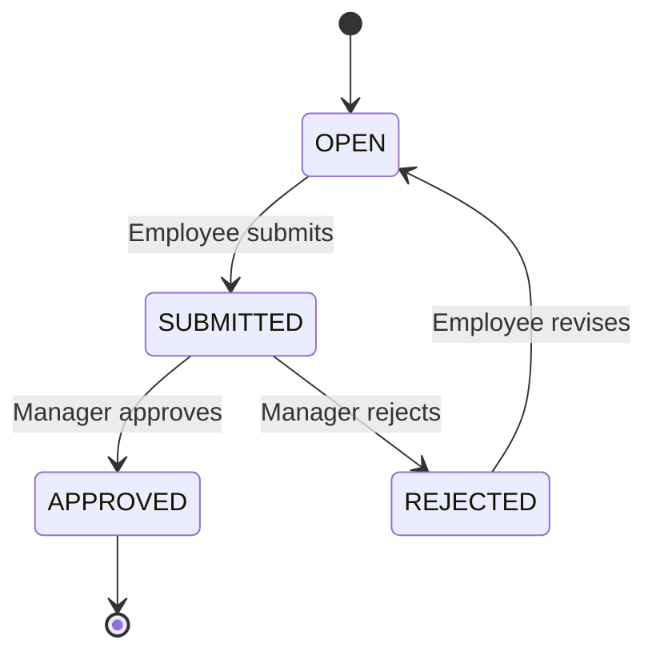

# Timesheet API

## Overview

The Timesheet API manages compiled time entries from clock events, manual entries, and leave records. Timesheets are submitted for approval and feed into payroll processing.

**Base Path:** `/api/v1/timesheets`

---

## Endpoints

### List Timesheets

```http
GET /api/v1/timesheets
```

**Query Parameters:**

| Parameter | Type | Required | Description |
|-----------|------|----------|-------------|
| `employeeId` | UUID | No | Filter by employee |
| `periodStart` | date | No | Period start date |
| `periodEnd` | date | No | Period end date |
| `status` | string | No | OPEN, SUBMITTED, APPROVED, REJECTED |
| `limit` | integer | No | Page size (default: 50) |

**Example Response:**
```json
{
  "data": [
    {
      "id": "ts_abc123",
      "employeeId": "emp_123456",
      "periodStart": "2025-11-01",
      "periodEnd": "2025-11-30",
      "statusCode": "SUBMITTED",
      "totalHours": 176.00,
      "workflowState": {
        "submittedAt": "2025-12-01T09:00:00Z",
        "submittedBy": "emp_123456",
        "currentApprover": "emp_manager01"
      },
      "metadata": {
        "notes": "Regular month"
      }
    }
  ]
}
```

---

### Get Timesheet

```http
GET /api/v1/timesheets/{timesheetId}
```

**Response includes timesheet lines:**
```json
{
  "data": {
    "id": "ts_abc123",
    "employeeId": "emp_123456",
    "periodStart": "2025-11-01",
    "periodEnd": "2025-11-30",
    "statusCode": "SUBMITTED",
    "totalHours": 176.00,
    "lines": [
      {
        "id": "tsl_001",
        "workDate": "2025-11-01",
        "timeTypeCode": "REG",
        "qtyHours": 8.00,
        "sourceClockId": "evt_xyz789",
        "metadata": {
          "shiftCode": "D1"
        }
      },
      {
        "id": "tsl_002",
        "workDate": "2025-11-02",
        "timeTypeCode": "REG",
        "qtyHours": 8.00
      }
    ]
  }
}
```

---

### Compile Timesheet

Generate timesheet from clock events and leave records for a period.

```http
POST /api/v1/timesheets/compile
```

**Request Body:**
```json
{
  "employeeId": "emp_123456",
  "periodStart": "2025-11-01",
  "periodEnd": "2025-11-30",
  "includeLeave": true,
  "runEvaluation": true
}
```

**Response:**
```json
{
  "data": {
    "id": "ts_new123",
    "employeeId": "emp_123456",
    "periodStart": "2025-11-01",
    "periodEnd": "2025-11-30",
    "statusCode": "OPEN",
    "totalHours": 176.00,
    "linesGenerated": 22,
    "exceptionsDetected": 0
  }
}
```

---

### Submit Timesheet

Submit timesheet for approval.

```http
POST /api/v1/timesheets/{timesheetId}/submit
```

**Request Body:**
```json
{
  "notes": "All hours accurate, no exceptions"
}
```

---

### Approve Timesheet

Approve a submitted timesheet (manager/HR only).

```http
POST /api/v1/timesheets/{timesheetId}/approve
```

**Request Body:**
```json
{
  "comments": "Approved",
  "approvedBy": "emp_manager01"
}
```

---

### Reject Timesheet

```http
POST /api/v1/timesheets/{timesheetId}/reject
```

**Request Body:**
```json
{
  "reason": "Missing clock-out on Nov 15",
  "rejectedBy": "emp_manager01"
}
```

---

## Timesheet Lines

### List Timesheet Lines

```http
GET /api/v1/timesheets/{timesheetId}/lines
```

---

### Add Timesheet Line

Manually add a time entry.

```http
POST /api/v1/timesheets/{timesheetId}/lines
```

**Request Body:**
```json
{
  "workDate": "2025-11-15",
  "timeTypeCode": "REG",
  "qtyHours": 8.00,
  "projectId": "proj_abc",
  "taskId": "task_xyz",
  "metadata": {
    "notes": "Manual entry - forgot to clock in"
  }
}
```

---

### Update Timesheet Line

```http
PUT /api/v1/timesheets/{timesheetId}/lines/{lineId}
```

---

### Delete Timesheet Line

```http
DELETE /api/v1/timesheets/{timesheetId}/lines/{lineId}
```

---

## Time Type Codes

Standard time type codes (from `common.code_list`):

| Code | Description | Multiplier |
|------|-------------|------------|
| `REG` | Regular hours | 1.0 |
| `OT1.5` | Overtime 1.5x | 1.5 |
| `OT2.0` | Overtime 2.0x (double time) | 2.0 |
| `NIGHT` | Night differential | 1.3 |
| `WEEKEND` | Weekend premium | 1.5 |
| `HOLIDAY` | Holiday pay | 2.0 |
| `ANL` | Annual leave | 1.0 |
| `SL` | Sick leave | 1.0 |
| `MAT` | Maternity leave | 1.0 |
| `UNPAID` | Unpaid leave | 0.0 |

---

## Timesheet Compilation Logic

The compilation process:

1. **Fetch clock events** for the period
2. **Pair IN/OUT events** to calculate work hours
3. **Apply rounding rules** from shift configuration
4. **Deduct break time** (paid/unpaid)
5. **Add leave records** (approved absences)
6. **Run time evaluation** (overtime, premiums)
7. **Detect exceptions** (missing punches, late arrivals)
8. **Generate timesheet lines** grouped by time type

---

## Workflow States



---

## Use Cases

### Compile Monthly Timesheet

```bash
curl -X POST https://api.xtalent.vng.com/v1/timesheets/compile \
  -H "Authorization: Bearer {token}" \
  -H "Content-Type: application/json" \
  -d '{
    "employeeId": "emp_123456",
    "periodStart": "2025-11-01",
    "periodEnd": "2025-11-30",
    "includeLeave": true,
    "runEvaluation": true
  }'
```

### Submit for Approval

```bash
curl -X POST https://api.xtalent.vng.com/v1/timesheets/ts_abc123/submit \
  -H "Authorization: Bearer {token}" \
  -H "Content-Type: application/json" \
  -d '{
    "notes": "All hours accurate"
  }'
```

### Manager Approval

```bash
curl -X POST https://api.xtalent.vng.com/v1/timesheets/ts_abc123/approve \
  -H "Authorization: Bearer {token}" \
  -H "Content-Type: application/json" \
  -d '{
    "comments": "Approved",
    "approvedBy": "emp_manager01"
  }'
```

---

## Integration with Payroll

Approved timesheets are exported to payroll:

```http
POST /api/v1/timesheets/export/payroll
```

**Request Body:**
```json
{
  "periodStart": "2025-11-01",
  "periodEnd": "2025-11-30",
  "employeeIds": ["emp_123", "emp_456"],
  "format": "JSON"
}
```

**Response:**
```json
{
  "data": {
    "exportId": "export_abc123",
    "timesheetsExported": 2,
    "totalHours": 352.00,
    "exportedAt": "2025-12-01T10:00:00Z",
    "downloadUrl": "https://api.xtalent.vng.com/v1/exports/export_abc123"
  }
}
```

---

## Next Steps

- Configure [Time Evaluation Rules](./08-time-evaluation-api.md)
- Review [Exceptions](./09-exceptions-api.md)
- Process [Clock Events](./06-clock-events-api.md)
