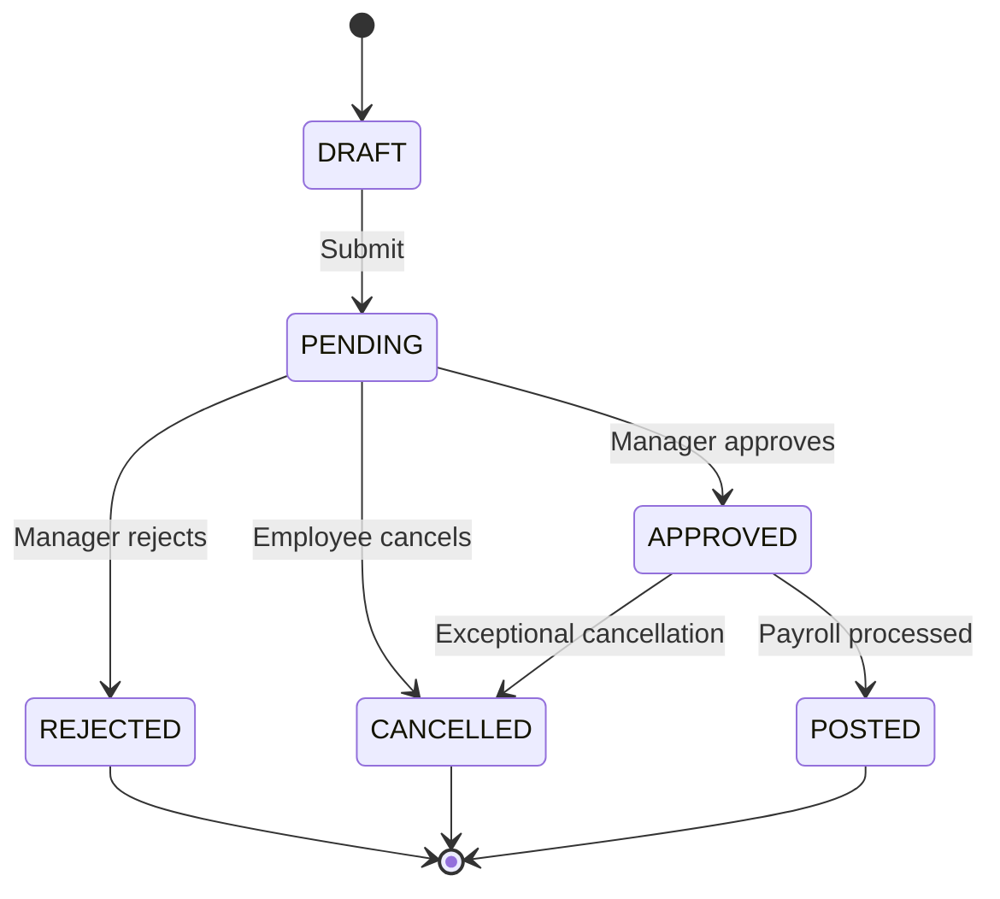

# Leave Requests API

## Overview

The Leave Requests API manages employee absence requests, including leave submission, approval workflows, and balance impact. This is a core component of the Absence Management system.

**Base Path:** `/api/v1/leave-requests`

---

## Endpoints

### List Leave Requests

```http
GET /api/v1/leave-requests
```

**Query Parameters:**

| Parameter | Type | Required | Description |
|-----------|------|----------|-------------|
| `employeeId` | UUID | No | Filter by employee |
| `leaveTypeId` | UUID | No | Filter by leave type |
| `status` | string | No | DRAFT, PENDING, APPROVED, REJECTED, CANCELLED |
| `startDate` | date | No | Requests starting from this date |
| `endDate` | date | No | Requests ending before this date |
| `limit` | integer | No | Page size (default: 50) |

**Example Response:**
```json
{
  "data": [
    {
      "id": "lr_abc123",
      "requestNumber": "LR-2025-00123",
      "employeeId": "emp_123456",
      "leaveTypeId": "lt_annual",
      "startDate": "2025-12-15",
      "endDate": "2025-12-17",
      "totalDays": 3.0,
      "totalHours": 24.0,
      "isHalfDay": false,
      "status": "APPROVED",
      "submittedAt": "2025-12-01T09:00:00Z",
      "approvedAt": "2025-12-01T10:30:00Z",
      "approvedBy": "emp_manager01",
      "reason": "Family vacation",
      "metadata": {
        "attachments": []
      }
    }
  ]
}
```

---

### Get Leave Request

```http
GET /api/v1/leave-requests/{requestId}
```

---

### Create Leave Request

Submit a new leave request.

```http
POST /api/v1/leave-requests
```

**Request Body:**

```json
{
  "employeeId": "emp_123456",
  "leaveTypeId": "lt_annual",
  "startDate": "2025-12-15",
  "endDate": "2025-12-17",
  "isHalfDay": false,
  "reason": "Family vacation",
  "metadata": {
    "emergencyContact": "+84 901 234 567"
  }
}
```

**Field Descriptions:**

| Field | Type | Required | Description |
|-------|------|----------|-------------|
| `employeeId` | UUID | Yes | Employee identifier |
| `leaveTypeId` | UUID | Yes | Leave type (ANL, SL, MAT, etc.) |
| `startDate` | date | Yes | Leave start date |
| `endDate` | date | Yes | Leave end date (>= startDate) |
| `startTime` | time | No | For hourly leave |
| `endTime` | time | No | For hourly leave |
| `isHalfDay` | boolean | No | Half-day leave (default: false) |
| `halfDayPeriod` | enum | No | MORNING or AFTERNOON (if isHalfDay) |
| `reason` | string | No | Reason for leave (max 1000 chars) |
| `attachments` | array | No | File URLs (e.g., medical certificates) |

**Response:**
```json
{
  "data": {
    "id": "lr_new123",
    "requestNumber": "LR-2025-00124",
    "employeeId": "emp_123456",
    "leaveTypeId": "lt_annual",
    "startDate": "2025-12-15",
    "endDate": "2025-12-17",
    "totalDays": 3.0,
    "totalHours": 24.0,
    "status": "DRAFT",
    "balanceImpact": {
      "leaveTypeCode": "ANL",
      "currentBalance": 80.0,
      "requestedHours": 24.0,
      "remainingBalance": 56.0
    }
  }
}
```

---

### Update Leave Request

Update a draft or pending request.

```http
PUT /api/v1/leave-requests/{requestId}
```

> [!WARNING]
> Only DRAFT or PENDING requests can be updated. Approved requests cannot be modified.

---

### Submit Leave Request

Submit a draft request for approval.

```http
POST /api/v1/leave-requests/{requestId}/submit
```

**Response:**
```json
{
  "data": {
    "id": "lr_abc123",
    "status": "PENDING",
    "submittedAt": "2025-12-01T09:00:00Z",
    "approvalWorkflow": {
      "levels": [
        {
          "level": 1,
          "approverRole": "MANAGER",
          "approverId": "emp_manager01",
          "status": "PENDING"
        }
      ]
    }
  }
}
```

---

### Cancel Leave Request

Cancel a pending or approved request.

```http
POST /api/v1/leave-requests/{requestId}/cancel
```

**Request Body:**
```json
{
  "cancellationReason": "Plans changed"
}
```

---

### Approve Leave Request

Approve a pending request (manager/HR only).

```http
POST /api/v1/leave-requests/{requestId}/approve
```

**Request Body:**
```json
{
  "comments": "Approved",
  "approvedBy": "emp_manager01"
}
```

---

### Reject Leave Request

```http
POST /api/v1/leave-requests/{requestId}/reject
```

**Request Body:**
```json
{
  "rejectionReason": "Insufficient coverage during this period",
  "rejectedBy": "emp_manager01"
}
```

---

## Half-Day Leave

For half-day leave requests:

```json
{
  "employeeId": "emp_123456",
  "leaveTypeId": "lt_annual",
  "startDate": "2025-12-15",
  "endDate": "2025-12-15",
  "isHalfDay": true,
  "halfDayPeriod": "MORNING",
  "reason": "Doctor appointment"
}
```

**Half-day periods:**
- `MORNING`: First half of the day
- `AFTERNOON`: Second half of the day

---

## Hourly Leave

For hourly leave (if leave type allows):

```json
{
  "employeeId": "emp_123456",
  "leaveTypeId": "lt_personal",
  "startDate": "2025-12-15",
  "endDate": "2025-12-15",
  "startTime": "14:00:00",
  "endTime": "16:00:00",
  "totalHours": 2.0,
  "reason": "Personal errand"
}
```

---

## Leave Request Lifecycle



---

## Balance Validation

When creating a leave request, the system:

1. **Checks available balance** for the leave type
2. **Reserves balance** (creates `LeaveReservation`)
3. **Validates against limits** (max per year, max per request)
4. **Checks eligibility rules** (tenure, employment type)
5. **Validates business rules** (advance notice, blackout periods)

**Insufficient balance error:**
```json
{
  "error": {
    "code": "INSUFFICIENT_BALANCE",
    "message": "Insufficient leave balance",
    "details": {
      "leaveType": "Annual Leave",
      "availableHours": 16.0,
      "requestedHours": 24.0,
      "shortfall": 8.0
    }
  }
}
```

---

## Approval Workflow

Leave requests can have multi-level approval:

**Example workflow:**
```json
{
  "approvalWorkflow": {
    "levels": [
      {
        "level": 1,
        "approverRole": "MANAGER",
        "approverId": "emp_manager01",
        "status": "APPROVED",
        "approvedAt": "2025-12-01T10:00:00Z"
      },
      {
        "level": 2,
        "approverRole": "HR",
        "approverId": "emp_hr01",
        "status": "PENDING"
      }
    ]
  }
}
```

---

## Attachments

For leave types requiring documentation (e.g., sick leave > 3 days):

```json
{
  "leaveTypeId": "lt_sick",
  "startDate": "2025-12-15",
  "endDate": "2025-12-18",
  "reason": "Medical treatment",
  "attachments": [
    {
      "url": "https://storage.xtalent.vng.com/docs/lr_abc123_cert.pdf",
      "name": "medical_certificate.pdf",
      "uploadedAt": "2025-12-01T09:00:00Z"
    }
  ]
}
```

---

## Use Cases

### Submit Annual Leave

```bash
curl -X POST https://api.xtalent.vng.com/v1/leave-requests \
  -H "Authorization: Bearer {token}" \
  -H "Content-Type: application/json" \
  -d '{
    "employeeId": "emp_123456",
    "leaveTypeId": "lt_annual",
    "startDate": "2025-12-15",
    "endDate": "2025-12-17",
    "reason": "Family vacation"
  }'
```

### Submit Half-Day Leave

```bash
curl -X POST https://api.xtalent.vng.com/v1/leave-requests \
  -H "Authorization: Bearer {token}" \
  -H "Content-Type: application/json" \
  -d '{
    "employeeId": "emp_123456",
    "leaveTypeId": "lt_annual",
    "startDate": "2025-12-15",
    "endDate": "2025-12-15",
    "isHalfDay": true,
    "halfDayPeriod": "MORNING",
    "reason": "Doctor appointment"
  }'
```

### Manager Approval

```bash
curl -X POST https://api.xtalent.vng.com/v1/leave-requests/lr_abc123/approve \
  -H "Authorization: Bearer {token}" \
  -H "Content-Type: application/json" \
  -d '{
    "comments": "Approved",
    "approvedBy": "emp_manager01"
  }'
```

---

## Integration with Timesheets

When a leave request is approved:

1. **Leave balance is deducted** (creates `LeaveMovement`)
2. **Timesheet lines are created** with leave time type code
3. **Roster is updated** to reflect absence
4. **Notifications are sent** to employee and manager

---

## Next Steps

- Check [Leave Balances](./13-leave-balance-api.md)
- Configure [Leave Types](./10-leave-types-api.md)
- Review [Leave Policies](./11-leave-policies-api.md)
