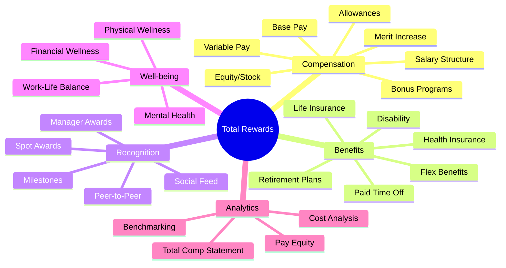
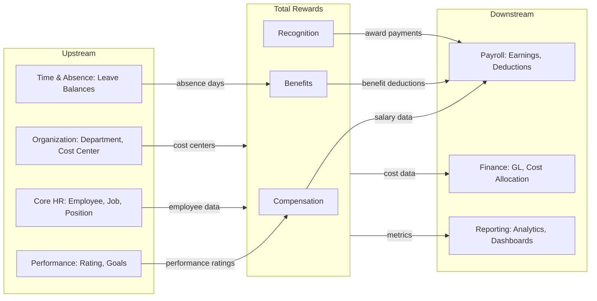

# Architectural Domain Research: Total Rewards (TR)

---

## 1. Executive Summary

**Domain Classification:** CORE Domain

| Strategy | Investment | Build/Buy |
|----------|------------|-----------|
| Critical differentiator - holistic employee value proposition | HIGH | Build core + Buy analytics |

**Value Proposition:** 
Total Rewards module provides a comprehensive approach to attract, motivate, and retain employees through strategic management of:
- **Compensation**: Fair and competitive pay structures
- **Benefits**: Health, retirement, and welfare programs  
- **Recognition**: Formal and informal appreciation programs
- **Well-being**: Physical, mental, and financial wellness support

Total Rewards is identified as a **CORE domain** based on WorldatWork's industry-standard 5-pillar framework and competitive analysis of 4 major HCM vendors.

**Critical Constraints:**
- **Regulatory**: Vietnam Labor Code 2019, Social Insurance Law 2024 (effective July 2025), BHXH/BHYT/BHTN regulations
- **Technical**: Must integrate seamlessly with Core HR, Payroll, Performance Management, Time & Absence
- **Business**: Must support multi-currency, multi-region compensation for global workforce
- **Security**: Contains PII-sensitive salary and benefits data requiring encryption and access control

---

## 2. Explicit Non-Goals (Out of Scope)

> *Define what this domain will NOT do. This prevents scope creep and protects long-term architecture.*

| Non-Goal | Rationale | Handled By |
|----------|-----------|------------|
| **Payroll Execution** | Complex tax calculations, payment processing | Payroll Module (PY) |
| **Tax Filing & Compliance** | Requires specialized tax engine | Payroll/Tax Module |
| **Full Wellness Platform** | Specialized health technology | Third-party wellness partners |
| **Insurance Claims Processing** | Carrier-specific workflows | Benefits carrier systems |
| **Financial Advisory Services** | Requires licensing | External financial partners |
| **Performance Rating Calculation** | Core performance logic | Performance Management (PM) |
| **Recruitment Offer Negotiation** | Different business process | Talent Acquisition (TA) |
| **Learning & Development Tracking** | Separate domain | Learning (LM) |

**Scope Boundary Rule:** If feature is not in this document → It's out of scope by default.

---

## 3. Domain Evolution Outlook (Temporal Analysis)

> *Forecast how this domain will change over 1-5 years.*

| Horizon | Timeframe | Expected Change | Impact | Architecture Implication |
|---------|-----------|-----------------|--------|-------------------------|
| **H1** | 0-1 year | Vietnam Social Insurance Law 2024 (effective Jul 2025) - pension eligibility 15 years | HIGH | Implement flexible eligibility engine, version SI calculation rules |
| **H1** | 0-1 year | Regional minimum wage adjustments | HIGH | Config-driven wage floor management |
| **H2** | 1-3 years | AI-powered compensation recommendations | MEDIUM | Build data foundation for ML models |
| **H2** | 1-3 years | Pay transparency regulations (global trend) | MEDIUM | Prepare salary range disclosure features |
| **H2** | 1-3 years | ESG-linked compensation | MEDIUM | Add sustainability metrics to bonus criteria |
| **H3** | 3-5 years | Cryptocurrency/blockchain salary payments | UNKNOWN | Abstract payment layer interface |
| **H3** | 3-5 years | Gig economy total rewards | UNKNOWN | Flexible contract-based rewards model |

**Volatility Assessment:**
- **High-volatility areas:** 
  - Social Insurance rates and thresholds → Require rule engine
  - Tax brackets and allowances → Config-driven
  - Benefits carrier plans → Annual update capability
  
- **Stable core:** 
  - Compensation plan structures → Strict schema
  - Total rewards framework (5 pillars) → Industry standard
  - Recognition program types → Well-established patterns

---

## 4. Domain Confidence Assessment

> *Overall "trustworthiness" of this research before major investment.*

| Dimension | Score | Notes |
|-----------|-------|-------|
| **Regulatory Clarity** | HIGH | Vietnam Labor Code 2019 well-defined, SI Law 2024 published |
| **Market Consensus** | HIGH | All 4 vendors agree on core features (Compensation, Benefits, Recognition) |
| **Business Stability** | MEDIUM | Benefits plans change annually, compensation structures relatively stable |
| **Technical Maturity** | HIGH | Well-established patterns from 20+ years of HCM development |

**Overall Domain Confidence:** **HIGH**

**Investment Recommendation:**
- ✅ Proceed with confidence, standard timeline
- Core compensation and benefits features are well-understood
- Recognition is emerging as differentiator - invest in modern UX

---

## 5. Decision Log (Architectural Decision Records)

> *Document major architectural choices and conflict resolutions.*

| ID | Title | Decision | Rationale | Source | Status |
|:---|:------|:---------|:----------|:-------|:-------|
| **ADR-TR-001** | Recognition Platform | Build native, integrate third-party rewards catalog | Control UX, leverage existing reward fulfillment | P2 (Market leaders) | PROPOSED |
| **ADR-TR-002** | Total Rewards Statement Storage | Generate on-demand, cache as PDF artifacts | Balance performance vs storage costs | P2 (Best practice) | PROPOSED |
| **ADR-TR-003** | Vietnam SI Calculation | Build internal engine with versioned rules | Localization control, regulatory compliance | P0 (Legal) | PROPOSED |
| **ADR-TR-004** | Pay Equity Analytics | Integrate external benchmarking data | Market data requires specialized sourcing | P2 (Market practice) | PROPOSED |
| **ADR-TR-005** | Benefits Carrier Integration | Standard API connectors + file-based fallback | Carrier technology varies widely | P2 (Pragmatic) | PROPOSED |

### ADR Details

#### ADR-TR-001: Recognition Platform Build vs Buy

**Status:** PROPOSED  
**Date:** 2026-01-30  
**Source Conflict:** P3 (Cost-conscious stakeholder) vs P2 (UX differentiation strategy)

**Context:**
Decision needed on whether to build recognition features natively or integrate third-party recognition platform (e.g., Achievers, O.C. Tanner, Workhuman).

**Decision:**
Build core recognition features natively within xTalent platform, but integrate third-party rewards catalog for redemption.

**Rationale:**
- Native build provides seamless UX within HCM
- Control over gamification and social features
- Third-party catalogs offer better reward variety without inventory management
- Oracle, SAP, Workday all have native recognition (Celebrate, Spot Awards, etc.)

**Consequences:**
- **Positive:** Unified employee experience, competitive feature set
- **Negative:** Higher development investment than pure integration
- **Trade-off:** Accept that reward fulfillment is outsourced

---

#### ADR-TR-003: Vietnam Social Insurance Calculation Engine

**Status:** PROPOSED  
**Date:** 2026-01-30  
**Source Conflict:** P0 (Legal requirement) drives decision

**Context:**
Vietnam's SI contributions involve complex rules:
- BHXH: 17.5% employer + 8% employee
- BHYT: 3% employer + 1.5% employee  
- BHTN: 1% each
- Salary cap: 20x statutory minimum wage
- New SI Law 2024 changes effective July 2025

**Decision:**
Build internal calculation engine with versioned rule sets, effective dating, and clear audit trail.

**Rationale:**
- Legal compliance is non-negotiable (P0)
- Rules change periodically - need versioning
- Integration with Payroll module required
- Local customization control important

**Consequences:**
- **Positive:** Full compliance control, audit capability
- **Negative:** Must maintain rule updates
- **Trade-off:** Internal expertise required for rule maintenance

---

## 6. Domain Map

---

## 7. Cross-Domain Dependencies

### Dependency Diagram

### Dependency Details

**Upstream Dependencies** (Inputs we consume):
| Dependency | Data Consumed | Impact if Changes |
|------------|---------------|-------------------|
| **Core HR (CO)** | Employee, Job Profile, Position, Employment | All comp/benefits rely on employee context |
| **Organization** | Department, Cost Center, Legal Entity | Budget allocation, reporting hierarchy |
| **Performance (PM)** | Performance Rating, Goals Achievement | Merit increase, bonus calculation |
| **Time & Absence (TA)** | Leave balances, Attendance | Benefits eligibility, PTO tracking |

**Downstream Dependencies** (Others consuming from us):
| Dependency | Data Provided | Integration Pattern |
|------------|---------------|---------------------|
| **Payroll (PY)** | Salary, Bonus, Benefits Deductions, Award Payments | Real-time sync for earnings |
| **Finance (FIN)** | Compensation cost, Benefits cost allocation | Batch posting to GL |
| **Reporting (RPT)** | Total Rewards metrics, Pay equity data | Event-based to Data Warehouse |

**Integration Risks:**
- If **Core HR** employee termination process changes → Impact on benefits termination
- If **Payroll** pay period structure changes → Impact on compensation effective dating
- If we change **compensation elements** structure → Breaks downstream GL mappings

---

## 8. Regulatory & Compliance Matrix

| Regulation | Article | Requirement | Design Impact | Priority |
|------------|---------|-------------|---------------|----------|
| **Vietnam Labor Code 2019** | Art. 90-96 | Wage payment regulations | Compensation frequency, method | P0 |
| **Vietnam Labor Code 2019** | Art. 98 | Overtime pay (150%/200%/300%) | Overtime calculation rules | P0 |
| **Vietnam Labor Code 2019** | Art. 113 | Annual leave entitlement | Leave accrual in Benefits | P0 |
| **SI Law 2024** | Various | 17.5%+8% BHXH, 3%+1.5% BHYT, 1%+1% BHTN | SI contribution calculation | P0 |
| **SI Law 2024** | Art. 64 | Pension eligibility 15 years (down from 20) | Eligibility rules engine | P0 |
| **Regional Minimum Wage** | Decree | 4 regions, VND 3.25M - 4.68M | Wage floor validation | P0 |
| **GDPR-like (PDPA future)** | - | Data subject rights | PII handling for salary data | P1 |
| **Tax Law** | - | Personal income tax brackets | Integration with Payroll | P1 |

---

## 9. Strategic Insights

### Best Practices (from Competitors)

| Practice | Source | Adoption Decision |
|----------|--------|-------------------|
| **Total Compensation Statement** | Oracle, SAP, Workday (3/3) | ✅ Adopt (standard) - Employee transparency |
| **Self-Service Benefits Enrollment** | All vendors (4/4) | ✅ Adopt (standard) - Reduce HR workload |
| **Life Event Triggers** | Oracle, Workday (3/4) | ✅ Adopt (standard) - Automated eligibility |
| **Peer-to-Peer Recognition** | Oracle Celebrate, SAP Spot Awards | ✅ Adopt (innovation) - Culture driver |
| **Pay Equity Dashboard** | Workday, Oracle (2/4) | ✅ Adopt (innovation) - Compliance trend |
| **AI Compensation Insights** | SAP (1/4) | ⏳ Future (H2) - Emerging feature |
| **Gamification in Recognition** | Third-party focus | ✅ Adopt (innovation) - Engagement driver |
| **Wellness Program Native** | Limited in core HCM | ❌ Partner (generic) - Not core competency |

### Gaps & Risks

**Identified Gaps:**
| Gap | Description | Impact | Mitigation |
|-----|-------------|--------|------------|
| **Gap 1** | No existing recognition module in legacy | HIGH | Greenfield build opportunity |
| **Gap 2** | Benefits carrier integration complexity | MEDIUM | Standard connector framework |
| **Gap 3** | Pay benchmarking data sourcing | MEDIUM | Partner with data providers |

**Regulatory Risks:**
| Risk | Probability | Impact | Mitigation |
|------|-------------|--------|------------|
| SI Law 2024 implementation | HIGH | HIGH | Versioned rules engine, July 2025 deadline |
| Minimum wage annual adjustment | HIGH | LOW | Config-driven wage floor |
| Future pay transparency laws | MEDIUM | MEDIUM | Build disclosure capability early |

**Technical Debt Risks:**
- Legacy compensation structures may not map cleanly to new model
- Migration of historical salary data requires careful planning

### Recommendations

1. **Build Native Recognition Platform** - Priority: HIGH
   - **Justification:** All competitors have native solution, key differentiator for employee experience
   - **ADR Reference:** ADR-TR-001

2. **Implement Flexible Benefits Engine** - Priority: HIGH
   - **Justification:** Complex eligibility rules, life events, flex credits require configurable engine
   - **ADR Reference:** (New ADR needed)

3. **Prepare for SI Law 2024** - Priority: CRITICAL
   - **Justification:** Legal deadline July 2025, pension eligibility changes
   - **ADR Reference:** ADR-TR-003

4. **Total Rewards Statement MVP** - Priority: HIGH
   - **Justification:** Industry standard feature, high employee value
   - **ADR Reference:** ADR-TR-002

---

## 10. Research Audit Trail

### Search Queries Executed

| Query | Key Finding | Source Tier |
|-------|-------------|-------------|
| "Total Rewards HCM enterprise features" | 5 pillars framework from WorldatWork | Tier 1 (Industry standard) |
| "Oracle HCM Total Rewards" | Compensation + Benefits + Celebrate modules | Tier 1 (Vendor docs) |
| "SAP SuccessFactors Compensation Benefits" | EC Compensation, Spot Awards, AI insights | Tier 1 (Vendor docs) |
| "Workday HCM Total Rewards" | Unified platform, Total Rewards Hub | Tier 1 (Vendor docs) |
| "Microsoft Dynamics 365 HR Compensation" | Fixed/Variable comp, Flex credits | Tier 1 (Vendor docs) |
| "Employee Recognition platforms" | Peer-to-peer, Gamification, Integration | Tier 2 (Blogs) |
| "Employee Wellness HCM modules" | Mental health, Financial wellness | Tier 2 (Blogs) |
| "Vietnam Labor Law compensation" | Labor Code 2019, SI rates, overtime | Tier 1 (Legal) |
| "WorldatWork Total Rewards framework" | 5 pillars since 2000 | Tier 1 (Standard body) |

### Confidence Assessment
- **Source Triangulation:** 4+ Tier 1 sources confirmed core features
- **Market Consensus:** HIGH - All vendors align on Compensation/Benefits/Recognition
- **Regulatory Clarity:** HIGH - Vietnam laws well-documented
- **Overall Research Confidence:** HIGH

---

## 11. Next Steps

- [x] Complete domain research report
- [ ] Generate `entity-catalog.md` from this research
- [ ] Generate `feature-catalog.md` from this research
- [ ] Create ontology files (`*.onto.md`) from Entity Catalog
- [ ] Create FRS files (`*.frs.md`) from Feature Catalog
- [ ] Review ADRs with architecture team
- [ ] Validate dependencies with Core HR, Payroll teams
- [ ] Present Domain Confidence to leadership for investment approval
