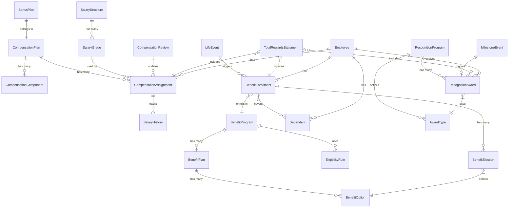
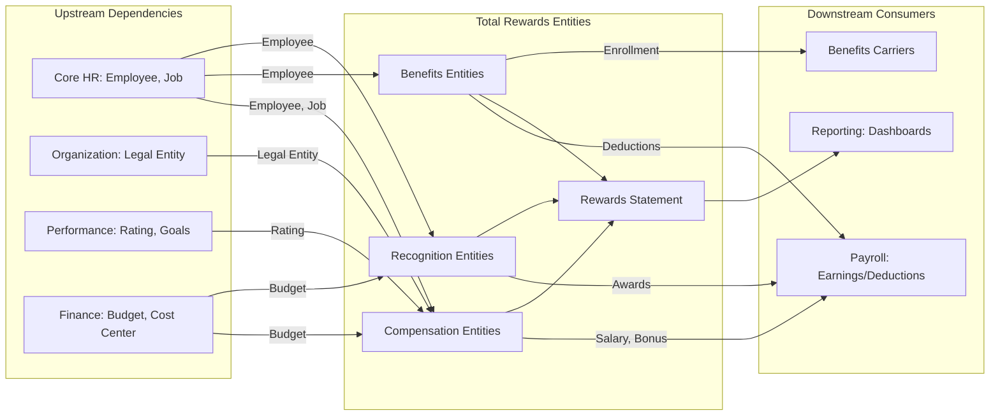

# Entity Catalog: Total Rewards (TR)

> **Note**: YAML above is for AI processing. Tables and diagrams below for human reading.

---

## A. Core Master Data - Compensation

| ID | Entity | Stability | Frequency | PII | Definition |
|----|--------|-----------|-----------|-----|------------|
| E-TR-001 | **[[CompensationPlan]]** | HIGH | YEARLY | NONE | Master compensation plan with rules for salary, bonus, equity |
| E-TR-002 | **[[SalaryStructure]]** | HIGH | YEARLY | NONE | Hierarchical salary structure with grades and ranges |
| E-TR-003 | **[[SalaryGrade]]** | HIGH | YEARLY | NONE | Individual grade level with min/mid/max salary |
| E-TR-004 | **[[CompensationComponent]]** | MEDIUM | QUARTERLY | NONE | Individual pay elements (base, allowance, etc.) |
| E-TR-005 | **[[BonusPlan]]** | MEDIUM | YEARLY | NONE | Variable pay plan with targets and payout rules |

**Key Relationships:**
- CompensationPlan has many CompensationComponents
- SalaryStructure has many SalaryGrades
- BonusPlan links to Performance.Rating

**Competitor Mapping:**
- Oracle: Salary Basis, Grade Structure, Elements
- Workday: Compensation Plans, Grades, Compensation Elements
- SAP: Pay Structure, Wage Types, Variable Pay

---

## B. Core Master Data - Benefits

| ID | Entity | Stability | Frequency | PII | Definition |
|----|--------|-----------|-----------|-----|------------|
| E-TR-009 | **[[BenefitProgram]]** | HIGH | YEARLY | NONE | Top-level benefit program grouping |
| E-TR-010 | **[[BenefitPlan]]** | MEDIUM | YEARLY | NONE | Specific benefit plan with carrier and premiums |
| E-TR-011 | **[[BenefitOption]]** | MEDIUM | YEARLY | NONE | Coverage option/tier within a plan |
| E-TR-012 | **[[EligibilityRule]]** | MEDIUM | QUARTERLY | NONE | Rules defining benefits eligibility |
| E-TR-016 | **[[Dependent]]** | MEDIUM | REALTIME | HIGH | Dependent individuals for coverage |

---

## C. Core Master Data - Recognition

| ID | Entity | Stability | Frequency | PII | Definition |
|----|--------|-----------|-----------|-----|------------|
| E-TR-017 | **[[RecognitionProgram]]** | HIGH | YEARLY | NONE | Recognition program with budget and rules |
| E-TR-018 | **[[AwardType]]** | HIGH | YEARLY | NONE | Types of recognition awards |

---

## D. Transactional Entities

| ID | Entity | Stability | Frequency | Lifecycle | PII |
|----|--------|-----------|-----------|-----------|-----|
| E-TR-006 | **[[CompensationAssignment]]** | MEDIUM | REALTIME | Pending → Active → Ended | HIGH |
| E-TR-007 | **[[SalaryHistory]]** | HIGH | REALTIME | (Immutable audit) | HIGH |
| E-TR-008 | **[[CompensationReview]]** | MEDIUM | QUARTERLY | Planning → InProgress → Approved → Executed | NONE |
| E-TR-013 | **[[BenefitEnrollment]]** | LOW | REALTIME | Pending → Active → Terminated | HIGH |
| E-TR-014 | **[[BenefitElection]]** | LOW | REALTIME | (Part of Enrollment) | HIGH |
| E-TR-015 | **[[LifeEvent]]** | LOW | REALTIME | Reported → Verified → Applied → Closed | HIGH |
| E-TR-019 | **[[RecognitionAward]]** | LOW | REALTIME | Pending → Approved → Delivered → Redeemed | LOW |
| E-TR-020 | **[[MilestoneEvent]]** | MEDIUM | REALTIME | Auto-generated | LOW |
| E-TR-021 | **[[TotalRewardsStatement]]** | MEDIUM | YEARLY | Generated → Published → Viewed | HIGH |
| E-TR-022 | **[[PayEquityAnalysis]]** | MEDIUM | QUARTERLY | Generated | MEDIUM |

---

## E. Reference/Config Data

| ID | Entity | Frequency | Definition |
|----|--------|-----------|------------|
| E-TR-023 | **[[PayFrequency]]** | RARE | Monthly, Bi-weekly, Weekly |
| E-TR-024 | **[[CompensationType]]** | RARE | Fixed, Variable, One-time |
| E-TR-025 | **[[BenefitCoverageLevel]]** | YEARLY | Employee Only, Family, etc. |
| E-TR-026 | **[[RecognitionCategory]]** | YEARLY | Achievement, Milestone, Values |
| E-TR-027 | **[[LifeEventType]]** | YEARLY | Marriage, Birth, Death, etc. |
| E-TR-028 | **[[MinimumWageRegion]]** | YEARLY | Vietnam regional minimum wages |
| E-TR-029 | **[[SocialInsuranceRate]]** | YEARLY | Vietnam SI contribution rates |

---

## F. Entity Relationships

---

## G. Change Frequency Analysis

### Architecture Implications

| Frequency | Count | Entities | Recommended Architecture |
|-----------|-------|----------|-------------------------|
| **RARE** (< 5yr) | 2 | PayFrequency, CompensationType | Hard-coded enum, schema migrations |
| **YEARLY** | 13 | Plans, Structures, Programs, Rates | Configuration tables, admin UI, versioning |
| **QUARTERLY** | 4 | Components, Rules, Reviews, Analysis | Rule engine, workflow, config-driven |
| **REALTIME** | 10 | Assignments, Enrollments, Awards | Event-driven, state machines, audit trail |

**High-Change Entities Requiring Special Attention:**
- **LifeEvent, BenefitEnrollment, RecognitionAward** - Need flexible state machines
- **MinimumWageRegion, SocialInsuranceRate** - Need effective-dated versioning for Vietnam regulations
- **CompensationComponent** - May change with new allowance types

---

## H. Cross-Domain Dependency Map

**Risk Analysis:**
- If **Core.Employee** termination logic changes → Must update BenefitEnrollment termination
- If **Performance.Rating** scale changes → Must update BonusPlan calculations
- If **Payroll.EarningsCode** structure changes → Impact on CompensationComponent mapping

---

## I. PII Sensitivity Summary

| Level | Count | Entities | Compliance Requirement |
|-------|-------|----------|------------------------|
| **HIGH** | 8 | CompensationAssignment, SalaryHistory, BenefitEnrollment, BenefitElection, LifeEvent, Dependent, TotalRewardsStatement | Encryption at rest, access control, audit logging, consent management |
| **MEDIUM** | 1 | PayEquityAnalysis | Aggregate data only, no individual identification |
| **LOW** | 2 | RecognitionAward, MilestoneEvent | Standard data protection |
| **NONE** | 18 | Master data, Reference data | No special handling required |

**GDPR/PDPA Considerations:**
- Salary data requires explicit consent for processing
- Right to access: TotalRewardsStatement provides export
- Right to delete: Must handle with retention requirements
