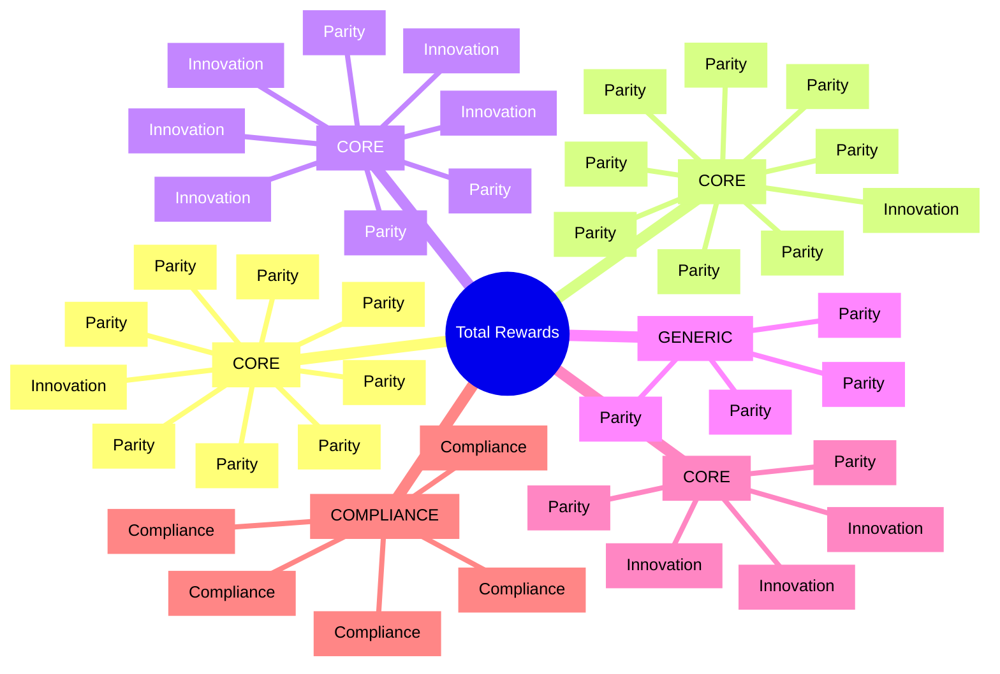

# Feature Catalog: Total Rewards (TR)

> **Note**: YAML above is for AI processing. Tables and diagrams below for human reading.

---

## Feature Mindmap

---

## Capability 1: Compensation Management

**Type:** CORE Domain  
Complete compensation planning, structure management, and salary administration for competitive and equitable pay

| ID | Feature | Priority | Differentiation | Complexity | Competitor |
|----|---------|----------|-----------------|------------|------------|
| FR-TR-001 | **Compensation Planning & Budgeting** | MUST | Parity | HIGH | Oracle, SAP, Workday (3/3) |
| FR-TR-002 | **Salary Structure Management** | MUST | Parity | MEDIUM | All vendors (4/4) |
| FR-TR-003 | **Base Pay Management** | MUST | Parity | MEDIUM | All vendors (4/4) |
| FR-TR-004 | **Variable Pay & Bonus Management** | MUST | Parity | HIGH | All vendors (4/4) |
| FR-TR-005 | **Merit Increase Processing** | MUST | Parity | HIGH | Oracle, SAP, Workday (3/4) |
| FR-TR-006 | **Equity & Stock Compensation** | SHOULD | Innovation | HIGH | Oracle, Workday (2/4) |
| FR-TR-007 | **Allowance Management** | MUST | Parity | MEDIUM | Oracle, SAP (2/4) |
| FR-TR-008 | **Global Compensation Support** | SHOULD | Parity | HIGH | Oracle, SAP, Workday (3/4) |
| FR-TR-009 | **Compensation Review Workflow** | MUST | Parity | HIGH | Oracle, SAP, Workday (3/4) |

---

## Capability 2: Benefits Administration

**Type:** CORE Domain  
Comprehensive benefits program management from plan configuration to employee enrollment and carrier integration

| ID | Feature | Priority | Differentiation | Complexity | Competitor |
|----|---------|----------|-----------------|------------|------------|
| FR-TR-010 | **Benefits Program Definition** | MUST | Parity | MEDIUM | All vendors (4/4) |
| FR-TR-011 | **Benefits Plan Configuration** | MUST | Parity | HIGH | All vendors (4/4) |
| FR-TR-012 | **Eligibility Rules Engine** | MUST | Parity | HIGH | Oracle, SAP, Workday (3/4) |
| FR-TR-013 | **Open Enrollment Management** | MUST | Parity | HIGH | All vendors (4/4) |
| FR-TR-014 | **Life Event Processing** | MUST | Parity | HIGH | Oracle, Workday (2/4) |
| FR-TR-015 | **Benefits Self-Service Enrollment** | MUST | Parity | MEDIUM | All vendors (4/4) |
| FR-TR-016 | **Dependent & Beneficiary Management** | MUST | Parity | MEDIUM | All vendors (4/4) |
| FR-TR-017 | **Flex Credit Programs** | SHOULD | Innovation | HIGH | Workday, Microsoft (2/4) |
| FR-TR-018 | **Benefits Carrier Integration** | SHOULD | Parity | HIGH | Oracle, SAP, Workday (3/4) |

---

## Capability 3: Recognition & Rewards

**Type:** CORE Domain (Differentiator)  
Employee recognition programs including peer-to-peer kudos, manager awards, milestone celebrations, and rewards redemption

| ID | Feature | Priority | Differentiation | Complexity | Competitor |
|----|---------|----------|-----------------|------------|------------|
| FR-TR-019 | **Recognition Program Setup** | MUST | Parity | MEDIUM | Oracle Celebrate, SAP Spot (2/4) |
| FR-TR-020 | **Peer-to-Peer Recognition** | MUST | Innovation | MEDIUM | Oracle, SAP (2/4) |
| FR-TR-021 | **Manager Recognition Awards** | MUST | Parity | MEDIUM | Oracle, SAP, Workday (3/4) |
| FR-TR-022 | **Milestone Celebrations** | SHOULD | Innovation | MEDIUM | Oracle Celebrate (1/4) |
| FR-TR-023 | **Spot Awards** | MUST | Parity | MEDIUM | Oracle, SAP (2/4) |
| FR-TR-024 | **Points-Based Rewards** | SHOULD | Innovation | HIGH | Third-party focus |
| FR-TR-025 | **Rewards Catalog & Redemption** | SHOULD | Innovation | HIGH | Third-party focus |
| FR-TR-026 | **Social Recognition Feed** | SHOULD | Innovation | MEDIUM | Oracle Celebrate (1/4) |

---

## Capability 4: Well-being Programs

**Type:** GENERIC Subdomain  
Employee wellness and well-being support including physical, mental, and financial health integrations

| ID | Feature | Priority | Differentiation | Complexity | Competitor |
|----|---------|----------|-----------------|------------|------------|
| FR-TR-027 | **Wellness Program Integration** | COULD | Parity | MEDIUM | Oracle, SAP (2/4) |
| FR-TR-028 | **Mental Health Resources** | COULD | Parity | LOW | Third-party focus |
| FR-TR-029 | **Financial Wellness Tools** | COULD | Parity | LOW | Oracle (1/4) |
| FR-TR-030 | **Work-Life Balance Features** | COULD | Parity | LOW | Indirect support |

---

## Capability 5: Total Rewards Analytics

**Type:** CORE Domain  
Comprehensive analytics for compensation statements, pay equity, benchmarking, and ROI measurement

| ID | Feature | Priority | Differentiation | Complexity | Competitor |
|----|---------|----------|-----------------|------------|------------|
| FR-TR-031 | **Total Compensation Statements** | MUST | Parity | HIGH | Oracle, SAP, Workday (3/4) |
| FR-TR-032 | **Pay Equity Analytics** | MUST | Innovation | HIGH | Workday, Oracle (2/4) |
| FR-TR-033 | **Compensation Benchmarking** | SHOULD | Innovation | HIGH | Oracle, Workday (2/4) |
| FR-TR-034 | **Benefits Cost Analysis** | SHOULD | Parity | MEDIUM | Oracle, SAP (2/4) |
| FR-TR-035 | **Rewards ROI Dashboard** | COULD | Innovation | HIGH | Emerging |

---

## Capability 6: Vietnam Regulatory Compliance

**Type:** COMPLIANCE (Mandatory)  
Vietnam-specific labor law and social insurance compliance features required by regulation

| ID | Feature | Priority | Differentiation | Legal Source | Risk |
|----|---------|----------|-----------------|--------------|------|
| FR-TR-036 | **Regional Minimum Wage Management** | MUST | Compliance | Labor Code 2019 | HIGH |
| FR-TR-037 | **Social Insurance Calculation** | MUST | Compliance | SI Law 2024 | HIGH |
| FR-TR-038 | **Overtime Pay Calculation** | MUST | Compliance | Labor Code Art. 98 | HIGH |
| FR-TR-039 | **13th Month Salary Support** | MUST | Compliance | Market practice | MEDIUM |
| FR-TR-040 | **Statutory Benefits Compliance** | MUST | Compliance | Labor Code 2019 | HIGH |

---

## Differentiation Analysis

### Parity Features (Table Stakes)

| Count | Features | Strategy |
|-------|----------|----------|
| 22 | Core compensation, benefits enrollment, basic recognition | Match industry standard, don't over-invest |

**Examples:** Salary Structure, Base Pay, Open Enrollment, Manager Awards

### Innovation Features (USP)

| Count | Features | Strategy |
|-------|----------|----------|
| 12 | Peer recognition, social feed, points system, pay equity | Invest heavily - these are differentiators |

**Examples:** 
- FR-TR-020: Peer-to-Peer Recognition
- FR-TR-026: Social Recognition Feed
- FR-TR-032: Pay Equity Analytics

### Compliance Features (Mandatory)

| Count | Features | Strategy |
|-------|----------|----------|
| 5 | Vietnam regulations | Must-have, no shortcuts |

**Examples:** SI Calculation, Minimum Wage, Overtime Pay

---

## Complexity Distribution

| Complexity | Count | Features | Architecture Recommendation |
|------------|-------|----------|---------------------------|
| **HIGH** | 16 | Planning, Eligibility, SI Calc, Pay Equity | Dedicated team, thorough testing, rule engines |
| **MEDIUM** | 17 | Structures, Awards, Milestones | Standard development, configurable |
| **LOW** | 7 | Reference data, Wellness links | Quick wins, out-of-box patterns |

---

## Priority Summary

| Priority | Count | Description |
|----------|-------|-------------|
| **MUST** | 28 | Core features required for MVP |
| **SHOULD** | 9 | Important features for competitive parity |
| **COULD** | 4 | Nice-to-haves for future phases |

---

## ADR Cross-Reference

| Feature | Decision | Rationale Summary |
|---------|----------|-------------------|
| FR-TR-019, FR-TR-025 | ADR-TR-001 | Build recognition natively, integrate reward catalog |
| FR-TR-031 | ADR-TR-002 | On-demand generation with PDF caching |
| FR-TR-037 | ADR-TR-003 | Internal SI engine with versioned rules |
| FR-TR-033 | ADR-TR-004 | Integrate external benchmarking data providers |
| FR-TR-018 | ADR-TR-005 | Standard API connectors with file fallback |
