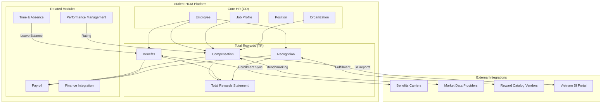
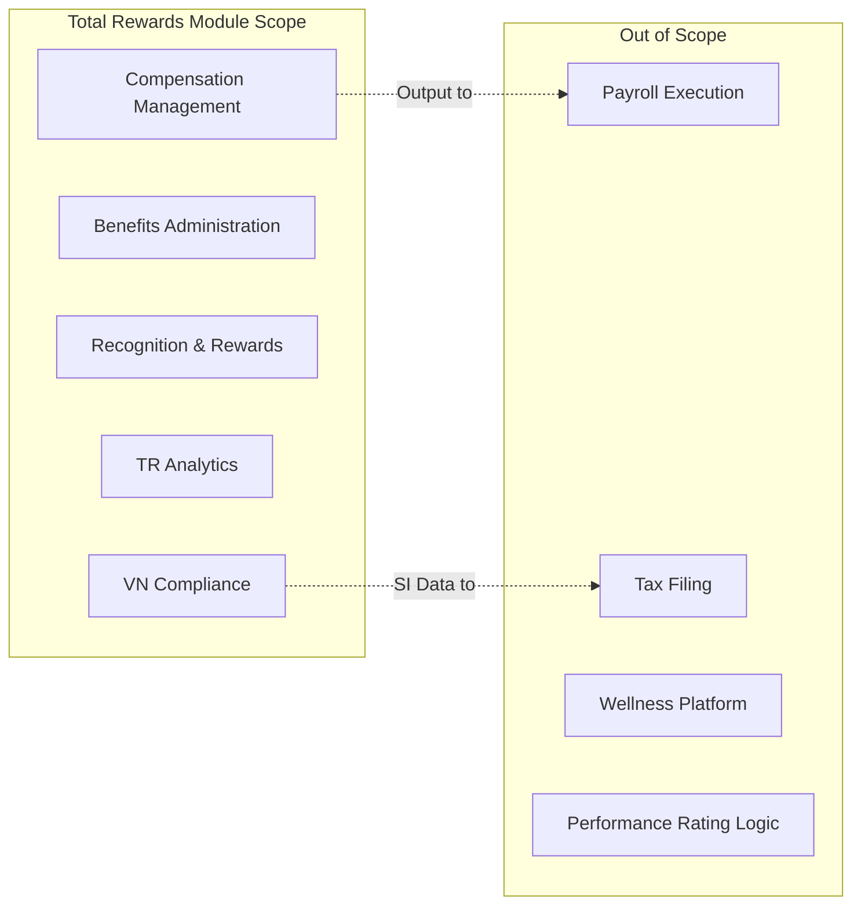
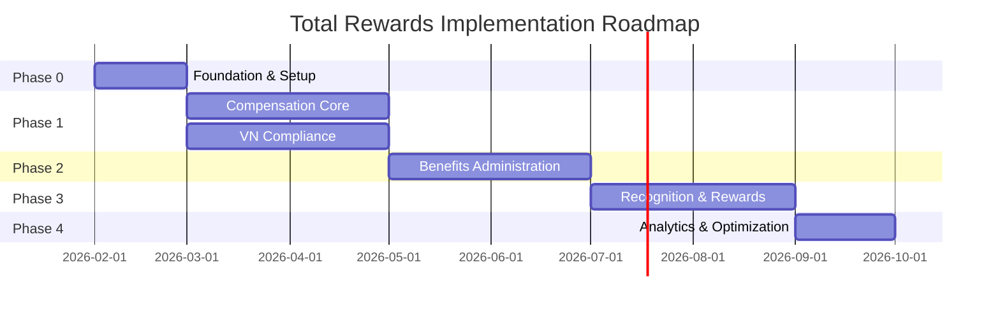
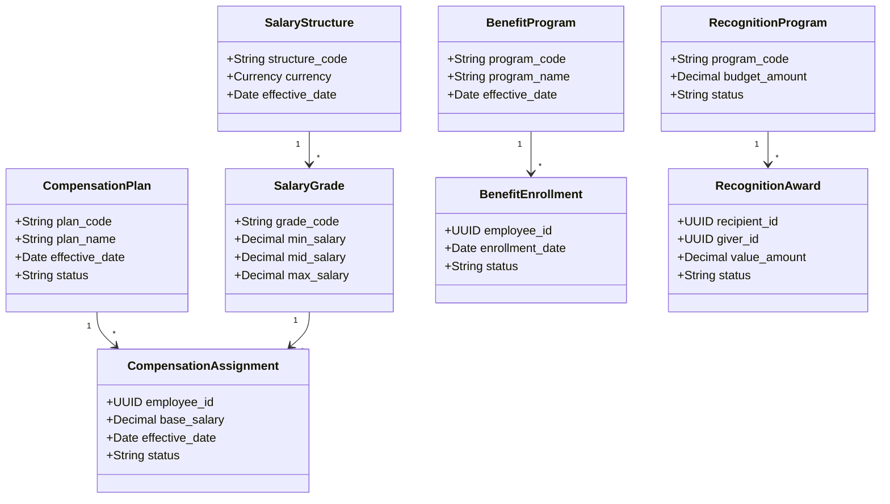

# Solution Blueprint: xTalent Total Rewards Module

---

## 1. Executive Summary

| Field | Value |
|-------|-------|
| **Objective** | Build comprehensive Total Rewards module for xTalent HCM matching Oracle/SAP/Workday capabilities |
| **Primary Constraint** | Must comply with Vietnam Labor Code 2019, Social Insurance Law 2024 |
| **Timeline** | 8 months to full feature release |
| **Budget** | Internal development investment |

### Vision Statement

Build a **world-class Total Rewards module** that enables organizations to:
- Design competitive compensation packages
- Administer comprehensive benefits programs
- Foster a culture of recognition and appreciation
- Deliver transparent employee total rewards visibility

### Critical Alerts

> [!CAUTION]
> **0 Core Gaps identified** - This is a greenfield build with full design control.

> [!WARNING]
> **SI Law 2024 Deadline:** New pension eligibility rules effective July 2025 - must be ready before this date.

> [!NOTE]
> **Recognition Platform:** Build vs Buy decision made - Building native with integrated reward catalog.

### Key Decisions Made

| ADR | Decision | Authority | Status |
|-----|----------|-----------|--------|
| ADR-TR-001 | Recognition: Build native, integrate reward catalog | Solution Architect | PROPOSED |
| ADR-TR-002 | Total Rewards Statement: On-demand with PDF cache | Solution Architect | PROPOSED |
| ADR-TR-003 | Vietnam SI: Internal versioned rule engine | Legal (P0) | PROPOSED |
| ADR-TR-004 | Benchmarking: External data provider integration | Solution Architect | PROPOSED |
| ADR-TR-005 | Benefits Carrier: Standard API + file fallback | Solution Architect | PROPOSED |

---

## 2. Architecture Context Diagram

*How Total Rewards module fits into xTalent HCM ecosystem.*

### Module Boundaries

### Integration Patterns Selected

| Integration | Pattern | Rationale |
|-------------|---------|-----------|
| Core HR | Shared Database | Same platform, real-time access |
| Performance | Event-driven | Loose coupling, rating changes trigger comp review |
| Payroll | Real-time Sync | Earnings must reflect immediately |
| Finance | Event-based Batch | GL posting is periodic |
| Benefits Carriers | API + File | Carrier tech varies widely |
| Reward Vendors | API | Well-documented e-commerce APIs |
| Vietnam SI | Batch Report | Government portal format |

---

## 3. Feature Implementation Strategy

### Feature Classification Summary

| Category | Count | Strategy |
|----------|-------|----------|
| **MUST (Parity)** | 22 | Build to match Oracle/SAP/Workday quality |
| **MUST (Compliance)** | 5 | Non-negotiable, legal requirement |
| **SHOULD (Innovation)** | 9 | Invest for differentiation |
| **COULD (Future)** | 4 | Phase 4+ or partner integration |

### Build vs Buy Analysis

| Area | Decision | Rationale |
|------|----------|-----------|
| **Compensation Engine** | BUILD | Core differentiator, needs localization |
| **Benefits Enrollment** | BUILD | Complex eligibility rules, workflow |
| **Recognition Platform** | BUILD (core) + INTEGRATE (rewards) | UX control + reward variety |
| **SI Calculation** | BUILD | Legal control, audit requirements |
| **Pay Equity Analytics** | BUILD | Emerging differentiator |
| **Compensation Benchmarking** | INTEGRATE | Requires specialized market data |
| **Wellness Programs** | PARTNER | Not core competency |
| **Reward Fulfillment** | PARTNER | Inventory/logistics not our domain |

---

## 4. Implementation Roadmap

### Phase Overview

---

### Phase 0: Foundation & Setup (Month 1)

| Field | Value |
|-------|-------|
| **Goal** | Core entities, reference data, development environment ready |
| **WSJF Score** | N/A (prerequisite) |
| **Cost of Delay** | Foundation blocks all subsequent work |

**Key Deliverables:**

| Entity | Priority | Description |
|--------|----------|-------------|
| `CompensationPlan` | P0 | Master comp plan structure |
| `SalaryStructure` | P0 | Grade hierarchy |
| `BenefitProgram` | P0 | Benefit grouping |
| `RecognitionProgram` | P0 | Recognition setup |
| Reference Data | P0 | PayFrequency, CompType, MinWage, SIRates |

**Exit Criteria:**
- [ ] All master entities with CRUD operations
- [ ] Reference data loaded for Vietnam
- [ ] Database schema deployed
- [ ] API documentation generated
- [ ] Integration with Core HR Employee API verified

---

### Phase 1: Compensation Core (Months 2-3)

| Field | Value |
|-------|-------|
| **Goal** | Complete compensation management with VN compliance |
| **WSJF Score** | 18 (High Value / Medium Effort) |
| **Cost of Delay** | **$40k/month** (manual comp processes, compliance risk) |

**Key Features:**

| ID | Feature | Priority | Complexity |
|----|---------|----------|------------|
| FR-TR-002 | Salary Structure Management | MUST | MEDIUM |
| FR-TR-003 | Base Pay Management | MUST | MEDIUM |
| FR-TR-004 | Variable Pay & Bonus | MUST | HIGH |
| FR-TR-005 | Merit Increase Processing | MUST | HIGH |
| FR-TR-007 | Allowance Management | MUST | MEDIUM |
| FR-TR-009 | Compensation Review Workflow | MUST | HIGH |
| FR-TR-036 | Regional Minimum Wage | MUST | MEDIUM |
| FR-TR-037 | Social Insurance Calculation | MUST | HIGH |
| FR-TR-038 | Overtime Pay Calculation | MUST | MEDIUM |
| FR-TR-039 | 13th Month Salary | MUST | MEDIUM |

**Entity Focus:**
- `CompensationAssignment`
- `SalaryHistory`
- `CompensationReview`
- `CompensationComponent`
- `BonusPlan`

**Exit Criteria:**
- [ ] Salary assignment workflow complete
- [ ] Min wage validation working for 4 Vietnam regions
- [ ] SI calculation accurate per 2024 law
- [ ] Overtime calculation per Labor Code Art. 98
- [ ] Compensation review cycle tested end-to-end
- [ ] Integration with Payroll (mock) verified
- [ ] No Severity-1 bugs open

---

### Phase 2: Benefits Administration (Months 4-5)

| Field | Value |
|-------|-------|
| **Goal** | Complete benefits management from enrollment to carrier sync |
| **WSJF Score** | 14 (High Value / High Effort) |
| **Cost of Delay** | **$25k/month** (manual enrollment, compliance risk) |

**Key Features:**

| ID | Feature | Priority | Complexity |
|----|---------|----------|------------|
| FR-TR-010 | Benefits Program Definition | MUST | MEDIUM |
| FR-TR-011 | Benefits Plan Configuration | MUST | HIGH |
| FR-TR-012 | Eligibility Rules Engine | MUST | HIGH |
| FR-TR-013 | Open Enrollment Management | MUST | HIGH |
| FR-TR-014 | Life Event Processing | MUST | HIGH |
| FR-TR-015 | Self-Service Enrollment | MUST | MEDIUM |
| FR-TR-016 | Dependent Management | MUST | MEDIUM |
| FR-TR-017 | Flex Credit Programs | SHOULD | HIGH |
| FR-TR-018 | Carrier Integration | SHOULD | HIGH |
| FR-TR-040 | Statutory Benefits Compliance | MUST | MEDIUM |

**Entity Focus:**
- `BenefitPlan`, `BenefitOption`
- `EligibilityRule`
- `BenefitEnrollment`, `BenefitElection`
- `LifeEvent`
- `Dependent`

**Exit Criteria:**
- [ ] Open enrollment flow tested end-to-end
- [ ] Life event processing for all qualifying events
- [ ] Eligibility engine with complex rules working
- [ ] Employee self-service UI complete
- [ ] Dependent/beneficiary management functional
- [ ] Integration with Payroll for deductions verified
- [ ] Carrier integration POC for one carrier
- [ ] Statutory benefits tracking (leave, maternity)

---

### Phase 3: Recognition & Rewards (Months 6-7)

| Field | Value |
|-------|-------|
| **Goal** | Complete recognition platform with social features |
| **WSJF Score** | 10 (Medium Value / Medium Effort) |
| **Cost of Delay** | **$15k/month** (employee engagement, culture) |

**Key Features:**

| ID | Feature | Priority | Complexity |
|----|---------|----------|------------|
| FR-TR-019 | Recognition Program Setup | MUST | MEDIUM |
| FR-TR-020 | Peer-to-Peer Recognition | MUST | MEDIUM |
| FR-TR-021 | Manager Recognition Awards | MUST | MEDIUM |
| FR-TR-022 | Milestone Celebrations | SHOULD | MEDIUM |
| FR-TR-023 | Spot Awards | MUST | MEDIUM |
| FR-TR-024 | Points-Based Rewards | SHOULD | HIGH |
| FR-TR-025 | Rewards Catalog Integration | SHOULD | HIGH |
| FR-TR-026 | Social Recognition Feed | SHOULD | MEDIUM |

**Entity Focus:**
- `RecognitionProgram`, `AwardType`
- `RecognitionAward`
- `MilestoneEvent`
- `PointsBalance` (if points system built)

**Exit Criteria:**
- [ ] Peer-to-peer recognition flow working
- [ ] Manager awards with approval workflow
- [ ] Milestone auto-detection (anniversary, birthday)
- [ ] Social feed with likes and comments
- [ ] Points system with balance tracking
- [ ] Reward catalog integration (at least one vendor)
- [ ] Payroll integration for cash awards

---

### Phase 4: Analytics & Optimization (Month 8)

| Field | Value |
|-------|-------|
| **Goal** | Complete analytics suite and optimization |
| **WSJF Score** | 8 (Medium Value / Low Effort) |
| **Cost of Delay** | **$10k/month** (visibility, decision making) |

**Key Features:**

| ID | Feature | Priority | Complexity |
|----|---------|----------|------------|
| FR-TR-031 | Total Compensation Statements | MUST | HIGH |
| FR-TR-032 | Pay Equity Analytics | MUST | HIGH |
| FR-TR-033 | Compensation Benchmarking | SHOULD | HIGH |
| FR-TR-034 | Benefits Cost Analysis | SHOULD | MEDIUM |
| FR-TR-035 | Rewards ROI Dashboard | COULD | HIGH |
| FR-TR-001 | Compensation Planning & Budgeting | MUST | HIGH |
| FR-TR-006 | Equity & Stock Compensation | SHOULD | HIGH |
| FR-TR-008 | Global Compensation Support | SHOULD | HIGH |

**Entity Focus:**
- `TotalRewardsStatement`
- `PayEquityAnalysis`

**Exit Criteria:**
- [ ] Total Rewards Statement generation working
- [ ] PDF export with configurable sections
- [ ] Pay equity dashboard with gap analysis
- [ ] Benchmarking data import working
- [ ] Compensation planning/budgeting complete
- [ ] Benefits cost analysis reports
- [ ] Final UAT sign-off
- [ ] Documentation complete

---

## 5. Technical Architecture

### Entity Layer Architecture

### API Design Principles

| Principle | Implementation |
|-----------|----------------|
| **REST** | Standard CRUD operations |
| **GraphQL** | Complex queries (Total Rewards Statement) |
| **Event-driven** | Compensation changes → Payroll |
| **Versioning** | API versioning for rate/rule changes |

### Security Considerations

| Data Type | Protection Level | Controls |
|-----------|------------------|----------|
| Salary data | HIGH | Encryption at rest, role-based access |
| Benefits elections | HIGH | Consent management, audit logging |
| Recognition | MEDIUM | Standard access controls |
| Reference data | LOW | Admin-only write access |

---

## 6. Risk Register

| ID | Risk | Probability | Impact | Category | Mitigation | Owner |
|----|------|-------------|--------|----------|------------|-------|
| R-001 | SI Law 2024 changes before Go-Live | LOW | HIGH | Regulatory | Versioned rule engine, early July 2025 delivery | Legal |
| R-002 | Benefits carrier integration complexity | MEDIUM | MEDIUM | Technical | Standard connector + file fallback | Tech Lead |
| R-003 | Pay equity calculation accuracy | MEDIUM | HIGH | Business | Statistical validation, external audit | Data Lead |
| R-004 | Recognition gamification abuse | LOW | MEDIUM | Business | Budget limits, approval thresholds | Product |
| R-005 | Performance integration dependency | MEDIUM | MEDIUM | Technical | MVP without performance link, add later | Tech Lead |
| R-006 | Reward vendor API changes | LOW | LOW | Technical | Abstraction layer, multiple vendors | Tech Lead |

---

## 7. Resource Requirements

### Team Structure

| Role | Count | Phase Focus |
|------|-------|-------------|
| Product Owner | 1 | All phases |
| Solution Architect | 1 | All phases |
| Backend Engineer | 3 | P0-P4 |
| Frontend Engineer | 2 | P1-P4 |
| QA Engineer | 1 | P1-P4 |
| BA/Domain Expert | 1 | P0-P2 |
| DevOps | 0.5 | P0, P4 |

### Skill Requirements

| Skill | Why Needed |
|-------|------------|
| Compensation domain knowledge | Complex pay rules, compliance |
| Benefits domain knowledge | Eligibility, life events |
| Vietnam labor law expertise | SI/tax compliance |
| GraphQL | Complex statement generation |
| Event-driven architecture | Integration patterns |

---

## 8. Success Metrics

### KPIs per Phase

| Phase | KPIs |
|-------|------|
| Phase 1 | SI calculation accuracy 100%, Comp assignment time < 2 min |
| Phase 2 | Enrollment completion rate > 95%, Open enrollment processed in 2 weeks |
| Phase 3 | Recognition sent per employee > 2/month, Award redemption rate > 80% |
| Phase 4 | TRS generation < 5 seconds, Pay equity report adoption > 50% |

### Go-Live Criteria (Full Release)

- [ ] All 28 MUST features implemented
- [ ] All 5 COMPLIANCE features certified
- [ ] Vietnam SI calculation audited by legal
- [ ] No Severity-1 or Severity-2 bugs
- [ ] Performance: 95th percentile response time < 500ms
- [ ] Security: Penetration test passed
- [ ] Documentation: API docs, user guides complete
- [ ] Training: 90% key users trained

---

## 9. Governance & Sign-off

### Approval Matrix

| Deliverable | Approver | Target Date |
|-------------|----------|-------------|
| Solution Blueprint | Product Owner | 2026-02-15 |
| ADR Decisions | Architecture Team | 2026-02-28 |
| Phase 1 Go-Live | QA Lead | 2026-04-30 |
| Phase 2 Go-Live | QA Lead | 2026-06-30 |
| Phase 3 Go-Live | QA Lead | 2026-08-31 |
| Final Release | Product Owner | 2026-09-30 |

### Change Control

All scope changes after Blueprint approval require:
1. Impact analysis (Cost, Timeline, Risk)
2. Change Request form
3. Product Owner approval
4. Architecture review if design impacted

---

## 10. Appendices

### A. Referenced Documents

| Document | Location |
|----------|----------|
| Entity Catalog | [./entity-catalog.md](./entity-catalog.md) |
| Feature Catalog | [./feature-catalog.md](./feature-catalog.md) |
| Domain Research | [./_research-report.md](./_research-report.md) |

### B. Competitor Feature Matrix

| Feature Area | Oracle | SAP | Workday | Microsoft | xTalent Target |
|--------------|--------|-----|---------|-----------|----------------|
| Compensation Planning | ✓ | ✓ | ✓ | ✓ | ✓ Phase 1 |
| Salary Structure | ✓ | ✓ | ✓ | ✓ | ✓ Phase 1 |
| Variable Pay | ✓ | ✓ | ✓ | ✓ | ✓ Phase 1 |
| Benefits Enrollment | ✓ | ✓ | ✓ | ✓ | ✓ Phase 2 |
| Life Events | ✓ | Limited | ✓ | Limited | ✓ Phase 2 |
| Eligibility Engine | ✓ | ✓ | ✓ | Limited | ✓ Phase 2 |
| Employee Recognition | ✓ (Celebrate) | ✓ (Spot) | Limited | Limited | ✓ Phase 3 |
| Social Feed | ✓ | Limited | Limited | ✗ | ✓ Phase 3 |
| Total Comp Statement | ✓ | ✓ | ✓ | Limited | ✓ Phase 4 |
| Pay Equity | ✓ | Limited | ✓ | Limited | ✓ Phase 4 |

### C. Glossary

| Term | Definition |
|------|------------|
| **ACL** | Anti-Corruption Layer |
| **ARB** | Architecture Review Board |
| **BHXH** | Bảo hiểm xã hội (Social Insurance) |
| **BHYT** | Bảo hiểm y tế (Health Insurance) |
| **BHTN** | Bảo hiểm thất nghiệp (Unemployment Insurance) |
| **CoD** | Cost of Delay |
| **SI** | Social Insurance |
| **TRS** | Total Rewards Statement |
| **WSJF** | Weighted Shortest Job First |
