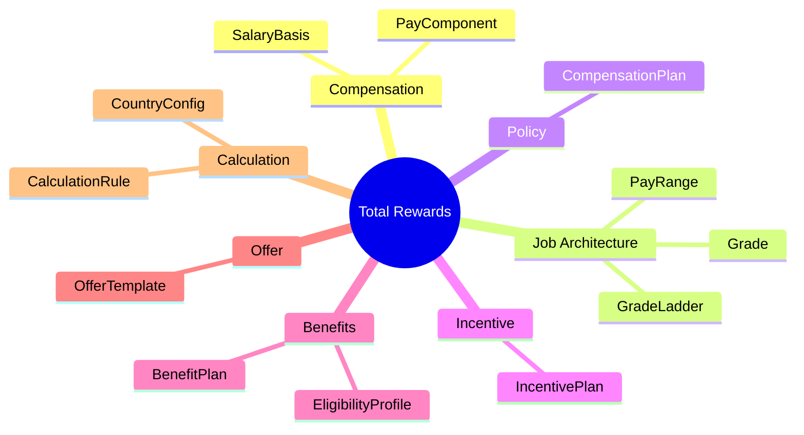
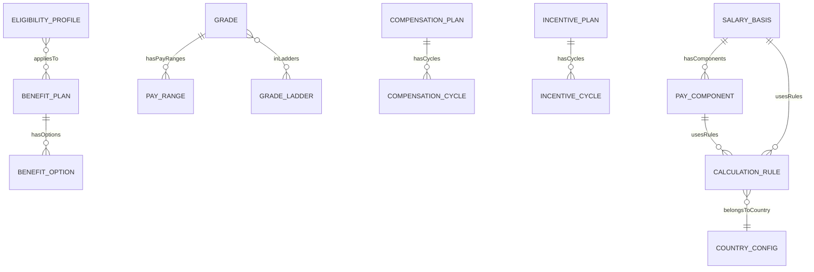

# Total Rewards Ontology

> **Module**: Total Rewards (TR)  
> **Version**: 1.0  
> **Last Updated**: 2026-01-06

---

## Overview



Total Rewards module manages compensation structures, benefits, incentives, and offer packages. This ontology defines the **business domain entities** (configuration/policy), not transaction data.

---

## Entity Map

### By Sub-module

| Sub-module | Entities | Description |
|------------|----------|-------------|
| **compensation** | SalaryBasis, PayComponent | Pay structure definitions |
| **job-architecture** | Grade, GradeLadder, PayRange | Job levels and salary bands |
| **policy** | CompensationPlan | Salary review policies |
| **incentive** | IncentivePlan | Bonus and equity programs |
| **benefits** | BenefitPlan, EligibilityProfile | Benefits packages |
| **offer** | OfferTemplate | Job offer templates |
| **calculation** | CalculationRule, CountryConfig | Calculation logic |

---

## Relationships



---

## Entity List

### Core Entities (AGGREGATE_ROOT)

| Entity | File | Description |
|--------|------|-------------|
| [[SalaryBasis]] | [salary-basis.onto.md](domain/compensation/salary-basis.onto.md) | Salary structure basis |
| [[PayComponent]] | [pay-component.onto.md](domain/compensation/pay-component.onto.md) | Pay element definition |
| [[Grade]] | [grade.onto.md](domain/job-architecture/grade.onto.md) | Job level |
| [[GradeLadder]] | [grade-ladder.onto.md](domain/job-architecture/grade-ladder.onto.md) | Career path |
| [[CompensationPlan]] | [compensation-plan.onto.md](domain/policy/compensation-plan.onto.md) | Review policy |
| [[IncentivePlan]] | [incentive-plan.onto.md](domain/incentive/incentive-plan.onto.md) | Bonus program |
| [[BenefitPlan]] | [benefit-plan.onto.md](domain/benefits/benefit-plan.onto.md) | Benefits package |
| [[OfferTemplate]] | [offer-template.onto.md](domain/offer/offer-template.onto.md) | Offer package |
| [[CalculationRule]] | [calculation-rule.onto.md](domain/calculation/calculation-rule.onto.md) | Calculation logic |

### Supporting Entities

| Entity | File | Description |
|--------|------|-------------|
| [[PayRange]] | [pay-range.onto.md](domain/job-architecture/pay-range.onto.md) | Salary band |
| [[EligibilityProfile]] | [eligibility-profile.onto.md](domain/benefits/eligibility-profile.onto.md) | Eligibility rules |
| [[CountryConfig]] | [country-config.onto.md](domain/calculation/country-config.onto.md) | Country settings |

---

## Folder Structure

```
TR/00-ontology/
├── _index.onto.md              ← This file
├── _research/
│   └── tr-analysis.md
├── glossary/
│   └── glossary-*.md           ← Existing glossary files
├── domain/
│   ├── compensation/
│   ├── job-architecture/
│   ├── policy/
│   ├── incentive/
│   ├── benefits/
│   ├── offer/
│   └── calculation/
└── tr-ontology.yaml            ← Legacy YAML (kept)
```

---

## See Also

- [Domain Research](/_research/tr-analysis.md)
- [Payroll Module](../../../PR/00-ontology/_index.onto.md)
