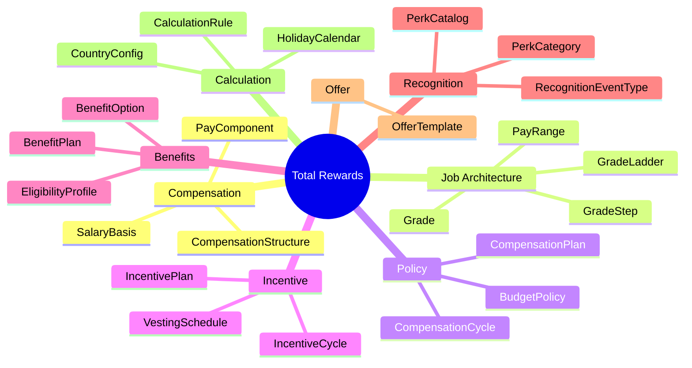
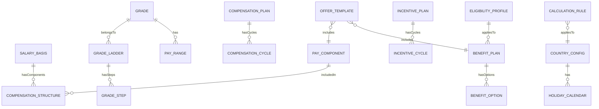

# Domain Research: Total Rewards

> **Domain**: Total Rewards (TR)  
> **Skill**: domain-research  
> **Date**: 2026-01-06

---

## 1. Scope

**Problem**: Define comprehensive Total Rewards management including compensation structures, benefits, incentives, recognition programs, and offer packages.

**Actors**:
- **Primary**: HR Compensation Team - Define structures and policies
- **Secondary**: Managers - Review and approve adjustments
- **Tertiary**: Employees - View statements, enroll in benefits

**In Scope**:
- Compensation structures (salary basis, pay components)
- Job architecture (grades, ladders, pay ranges)
- Benefits plans and options
- Incentive programs (bonus, equity)
- Recognition and perks
- Offer packages
- Calculation rules (tax, social insurance)

**Out of Scope**:
- Payroll execution/processing
- Transaction data (snapshots, adjustments)
- Workflow/approval instances
- Audit logs

---

## 2. Glossary

| Term | Definition | Vietnamese |
|------|------------|------------|
| **Salary Basis** | Base structure for how salary is calculated (monthly, hourly) | Cơ sở lương |
| **Pay Component** | Individual element of compensation (base, allowance, bonus) | Thành phần lương |
| **Grade** | Job level in organizational hierarchy | Ngạch/Bậc |
| **Grade Ladder** | Career progression path through grades | Thang bậc nghề nghiệp |
| **Pay Range** | Min/Mid/Max salary for a grade | Khung lương |
| **Compensation Plan** | Policy for salary reviews (merit, promotion) | Chính sách điều chỉnh lương |
| **Compensation Cycle** | Time period for reviews | Chu kỳ điều chỉnh lương |
| **Incentive Plan** | Variable pay program (bonus, equity) | Chính sách thưởng |
| **Benefit Plan** | Benefits package (health, retirement) | Gói phúc lợi |
| **Eligibility Profile** | Criteria for benefits/programs | Điều kiện đủ điều kiện |
| **Calculation Rule** | Formula/logic for tax, SI, proration | Quy tắc tính toán |
| **Offer Template** | Standard package for job offers | Mẫu đề nghị |

---

## 3. Entity Map

### Core Entities (Business Domain)

### Entity Relationships

---

## 4. Business Rules

### Compensation
- **COMP-001**: Salary Basis must have at least one Pay Component
- **COMP-002**: Pay Components can be shared across multiple Salary Bases
- **COMP-003**: Each Pay Component has a classification (BASE, ALLOWANCE, BONUS, DEDUCTION)

### Job Architecture
- **ARCH-001**: Grade codes must be unique per current version
- **ARCH-002**: Grade Ladder defines progression order
- **ARCH-003**: Pay Range must have min < mid < max

### Benefits
- **BEN-001**: Eligibility Profile determines who can enroll
- **BEN-002**: Benefit Options may have employee/employer cost split

### Calculation
- **CALC-001**: Calculation Rules are country-specific (via country_code)
- **CALC-002**: Rules are versioned with SCD-2 pattern
- **CALC-003**: Execution order determines calculation sequence

---

## 5. Industry Context

### Standards
| Standard | Application |
|----------|-------------|
| **ISO 4217** | Currency codes (VND, USD, SGD) |
| **ISO 3166-1** | Country codes (VN, SG, US) |
| **WorldatWork** | Total Rewards framework |

### Vietnam Regulations
| Regulation | Impact |
|------------|--------|
| **Labor Code 2019** | Working hours, OT rates |
| **Social Insurance Law** | BHXH, BHYT, BHTN rates |
| **Personal Income Tax** | PIT brackets, deductions |

### Market Analysis
| Vendor | Approach |
|--------|----------|
| **Workday** | Compensation Elements, Grade Profiles, Benefits |
| **SAP SuccessFactors** | Pay Components, Pay Range Structures |
| **Oracle HCM** | Salary Basis, Element Classifications |

**Common Patterns**:
1. Separation of definition (ontology) from instance (transaction)
2. Component-based salary structure
3. Grade/Step salary scales
4. Eligibility-based benefits

---

## 6. Recommendations

### Entities to Model
26 business domain entities across 8 sub-modules (see Section 3).

### Key Decisions
1. **PayComponent vs PayElement**: TR.PayComponent for planning, PR.PayElement for execution
2. **Calculation Rules**: Shared between TR and PR modules
3. **Benefits Eligibility**: Uses Core HR EligibilityProfile pattern

### Risks
- **Complexity**: Many interconnected entities
- **Multi-country**: Rules vary by jurisdiction
- **Versioning**: SCD-2 for effective-dated changes
