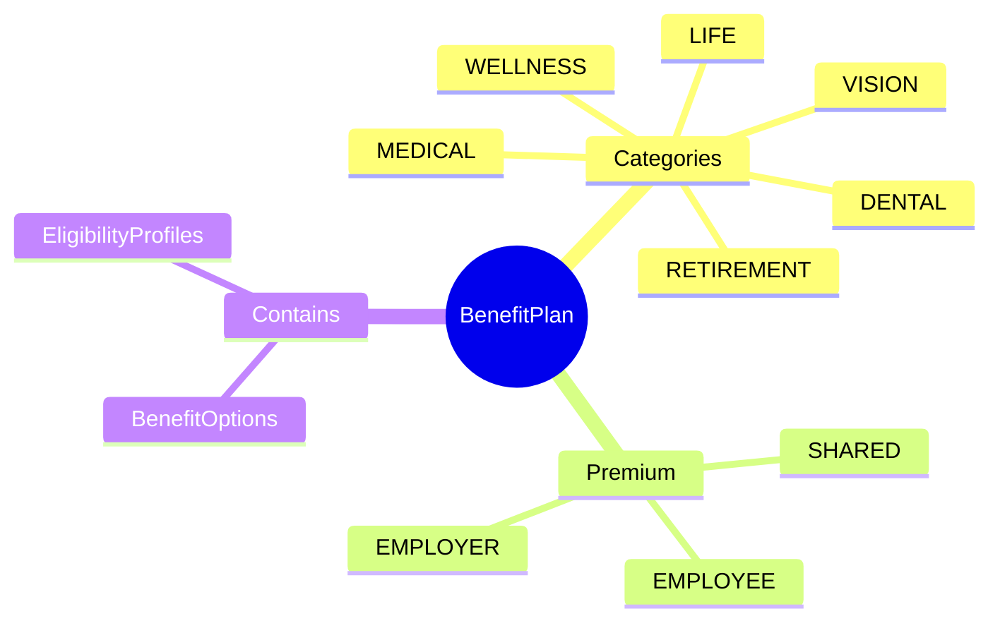
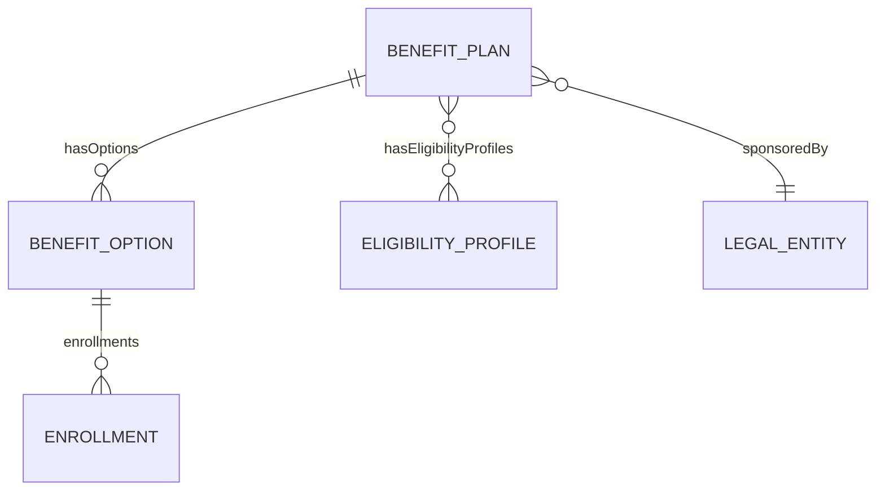
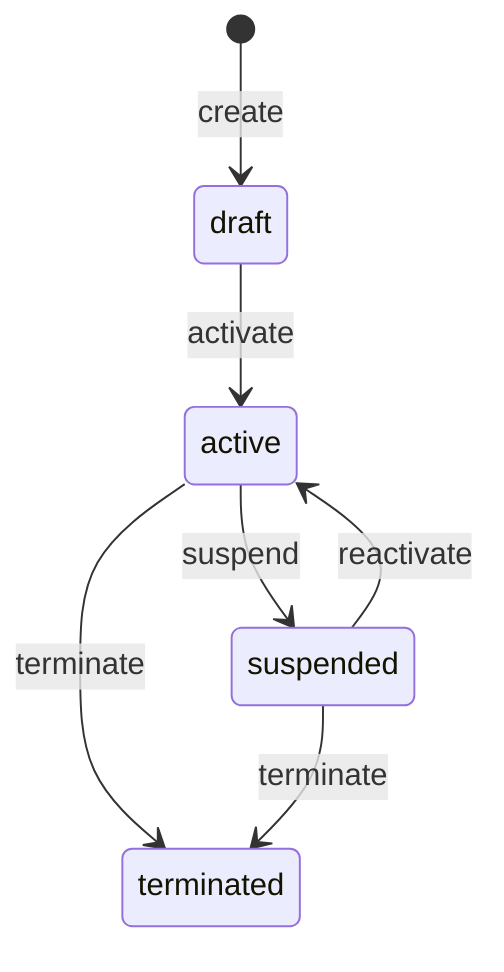
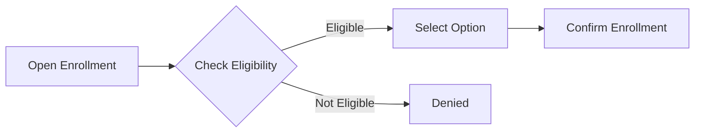

# BenefitPlan

## Overview

**BenefitPlan** định nghĩa gói phúc lợi cho nhân viên - bảo hiểm y tế, nha khoa, hưu trí. Là AGGREGATE_ROOT của benefits domain, mỗi plan có nhiều [[BenefitOption]] và [[EligibilityProfile]].



## Business Context

### Key Stakeholders
- **Benefits Team**: Design and manage plans
- **HR Admin**: Enrollment management, eligibility checks
- **Employees**: Enroll, view benefits, make claims
- **Finance**: Budget, provider payments

### Benefit Categories Explained

| Category | Description | Example VN |
|----------|-------------|------------|
| **MEDICAL** | Health insurance | Bảo hiểm y tế Bảo Việt |
| **DENTAL** | Dental coverage | Gói nha khoa |
| **VISION** | Eye care | Gói mắt kính |
| **LIFE** | Life insurance | Bảo hiểm nhân thọ |
| **DISABILITY** | Income protection | Bảo hiểm tai nạn |
| **RETIREMENT** | Pension plans | Quỹ hưu trí bổ sung |
| **WELLNESS** | Health programs | Phòng gym, sức khỏe |
| **PERK** | Other benefits | Parking, meals |

### Premium Types

| Type | Who Pays | Example |
|------|----------|---------|
| **EMPLOYEE** | Employee 100% | Voluntary life insurance |
| **EMPLOYER** | Company 100% | Basic medical |
| **SHARED** | Both contribute | Premium medical (70/30) |

### Business Value
BenefitPlan cho phép manage multiple benefit offerings, control eligibility, và track enrollment centrally.

## Attributes Guide

### Core Identity
- **code**: Mã duy nhất. Format: MED_PREMIUM, WELLNESS_VNG
- **name**: Tên hiển thị. VD: "Bảo hiểm y tế cao cấp"
- **description**: Mô tả chi tiết benefits

### Plan Configuration
- **planCategory**: Loại benefit (MEDICAL, DENTAL, etc.)
- **providerName**: Nhà cung cấp (Bảo Việt, Prudential, etc.)
- **premiumType**: Ai trả phí (EMPLOYEE, EMPLOYER, SHARED)
- **currency**: Mã tiền tệ (VND, USD)

## Relationships Explained



### BenefitOption
- **hasOptions** → [[BenefitOption]]: Các mức coverage. VD: Basic, Standard, Premium

### EligibilityProfile
- **hasEligibilityProfiles** → [[EligibilityProfile]]: Ai được enroll. VD: Full-time employees only

### LegalEntity
- **sponsoredBy** → [[LegalEntity]]: Pháp nhân sponsor plan

## Lifecycle & Workflows



| State | Meaning |
|-------|---------|
| **draft** | Đang setup, chưa mở enrollment |
| **active** | Đang active, có thể enroll |
| **suspended** | Tạm ngưng (không nhận enrollment mới) |
| **terminated** | Đã đóng plan |

### Enrollment Flow



## Actions & Operations

### create
**Who**: Benefits Team  
**Required**: code, name, planCategory, effectiveStartDate

### addOption
**Who**: Benefits Team  
**Purpose**: Thêm coverage option vào plan

### setEligibility
**Who**: Benefits Team  
**Purpose**: Định nghĩa ai được enroll

## Business Rules

#### Unique Code (uniqueCode)
**Rule**: Plan code phải duy nhất.

#### Options Required (hasOptionsWhenActive)
**Rule**: Active plan phải có ít nhất 1 option.  
**Reason**: Không thể enroll vào plan không có options.

## Examples

### Example 1: Premium Medical Insurance
```yaml
code: MED_PREMIUM
name: "Bảo hiểm y tế cao cấp"
planCategory: MEDICAL
providerName: "Bảo Việt"
premiumType: SHARED
currency: VND
effectiveStartDate: "2026-01-01"
```

### Example 2: Wellness Program
```yaml
code: WELLNESS_VNG
name: "VNG Wellness Program"
planCategory: WELLNESS
providerName: null  # In-house
premiumType: EMPLOYER
effectiveStartDate: "2026-01-01"
```

### Example 3: Voluntary Life Insurance
```yaml
code: LIFE_VOLUNTARY
name: "Bảo hiểm nhân thọ tự nguyện"
planCategory: LIFE
providerName: "Prudential"
premiumType: EMPLOYEE
```

## Related Entities

| Entity | Relationship | Description |
|--------|--------------|-------------|
| [[BenefitOption]] | hasOptions | Coverage choices |
| [[EligibilityProfile]] | hasEligibilityProfiles | Who can enroll |
| [[LegalEntity]] | sponsoredBy | Sponsoring entity |
| [[Enrollment]] | indirect | Employee enrollments |
