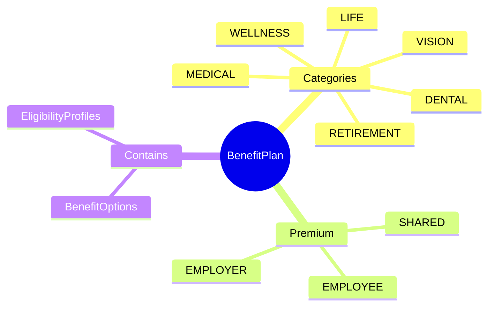
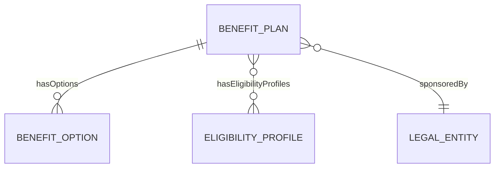

# BenefitPlan

## Overview

**BenefitPlan** định nghĩa gói phúc lợi cho nhân viên - bảo hiểm y tế, nha khoa, hưu trí. Mỗi plan có nhiều options và eligibility rules.

## Business Context

### Key Stakeholders
- **Benefits Team**: Design and manage plans
- **HR Admin**: Enrollment management
- **Employees**: Enroll and use benefits

### Business Processes
- **Open Enrollment**: Annual enrollment period
- **Life Events**: Mid-year changes
- **Claims Processing**: Review và process claims

## Relationships Explained

## Examples

### Example 1: Medical Insurance
- **code**: MED_PREMIUM
- **name**: Premium Medical Plan
- **planCategory**: MEDICAL
- **providerName**: Bảo Việt
- **premiumType**: SHARED

### Example 2: Wellness Program
- **code**: WELLNESS_VNG
- **name**: VNG Wellness Program
- **planCategory**: WELLNESS
- **premiumType**: EMPLOYER

## Related Entities

| Entity | Relationship | Description |
|--------|--------------|-------------|
| [[BenefitOption]] | hasOptions | Coverage choices |
| [[EligibilityProfile]] | hasEligibilityProfiles | Who can enroll |
